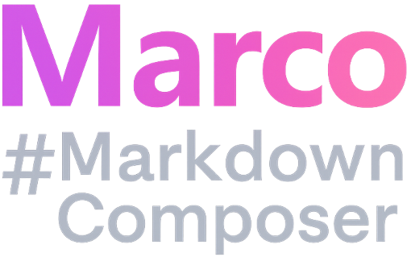

  

A modern editor built with Rust and GTK4. Features live preview, multiple languages, and advanced markdown support.

## Features

- **Live split-pane editing**: Write Markdown on the left, see formatted preview on the right
- **Multi-language UI**: English, Spanish, French, German (instant switching)
- **Advanced Markdown**: GitHub-style admonitions, tables, task lists, code blocks
- **Smart code blocks**: 100+ programming languages, intelligent search, syntax highlighting
- **Context menus & toolbar**: Quick access to formatting and actions
- **Professional dialogs**: Table, code, and task dialogs with validation
- **Real-time preview**: Fast, accurate, and interactive

### CSS Theme + UI Theme
- Choose from 4 built-in CSS themes (Standard, Academic, GitHub, Minimal) or add your own
- Automatic light/dark mode detection or manual override
- UI theme and preview theme can be set independently

### Color Syntax in Edit and View
- Editor: Toggle syntax highlighting for code blocks on/off
- View: Always shows syntax highlighting for code blocks
- Powered by syntect for high-quality code rendering

### Spell Checking in Editor
- Detects misspelled Markdown syntax and formatting issues
- Highlights errors and warnings inline as you type

### Build Your Own Theme & Add Language
- Add your own CSS theme: place a `.css` file in the `src/ui/css_theme/` folder
- Add a new language: copy and translate `language/en/main.yml`, then add to the menu

## What's Coming Next?

- **Export options**: Save your work as HTML or PDF
- **Toolbar modes**: switch between toolbars
- **Customizable appearance**: Standard, Focus, and Zen modes for distraction-free writing
- **Flexible layout**: Drag to resize editor/preview split, open preview in anther window, and sync scroll
- **Editor enhancements**: Highlight the current word in editor and view at the same time
- **Footer improvements**: Status bar info and active formatting display
- **Text encoding support**: better charater encoding UTF-8, UTF-16 and UTF-32, for better languages support
- **Performance**: Multi-core support with Rayon for faster processing
- **Easy theming and language addition**: Drop in a CSS file and easyer languages implemtation.

## Contributing

Everyone is welcome to join and contribute! Whether it's code, translations, themes, or ideas—your help is appreciated. See the `language/` folder for translation format and submit a pull request.
