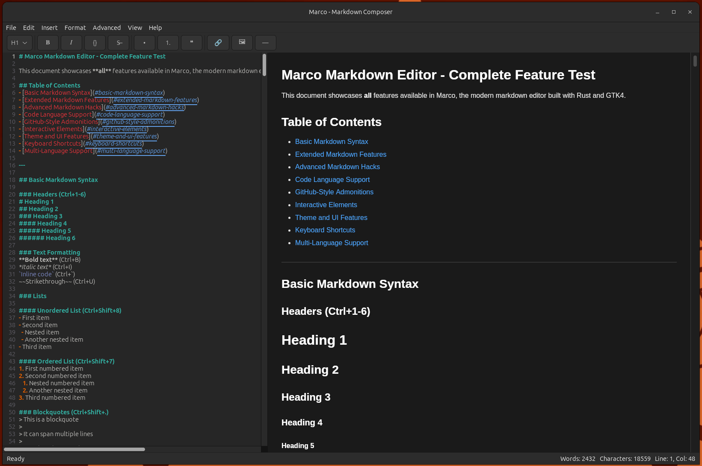

# Marco - Markdown Composer

A modern markdown editor built with Rust and GTK4. Features live preview, multiple languages, and advanced markdown support.

## Key Features

### What Makes Marco Special
- **Live Split-Pane Editing** - Write markdown on the left, see formatted preview on the right
- **4 Languages Built-In** - English, Spanish, French, German with instant switching
- **Advanced Markdown Support** - GitHub-style admonitions, tables, task lists, code blocks
- **Custom CSS Themes** - 4 built-in themes plus support for your own CSS files
- **Smart Persistence** - Remembers your preferences, no setup needed
- **Real-time Preview** with syntax highlighting and interactive dialogs
- **Context Menus & Toolbar** for quick access to all formatting options

## Advanced Features

### GitHub-Style Admonitions
```markdown
> [!NOTE]
> This is a note admonition

> [!WARNING]  
> This is a warning admonition
```

### Tables and Task Lists
- **Interactive Table Dialog** - Create tables with visual row/column selection
- **Task Lists** - Basic checkboxes, custom dialogs, single task insertion
- **Code Blocks** - 10+ programming languages with syntax highlighting

## Dependencies

### Core Dependencies
- `gtk4` - GTK4 bindings for Rust (modern UI toolkit)
- `sourceview5` - GTK SourceView for syntax highlighting
- `pulldown-cmark` - Fast CommonMark-compliant markdown parser
- `glib` - GLib bindings for GTK integration

### Additional Dependencies
- `serde` and `serde_json` - Serialization framework for settings and configuration
- `serde_yaml` - YAML support for translation files
- `lazy_static` - Global state management for settings system
- `regex` - Pattern matching for advanced syntax highlighting and markdown processing

## Translation System

Marco uses YAML-based translations in `locales/[language]/main.yml`. To add a new language:
1. Create `locales/[code]/main.yml` 
2. Copy and translate `en/main.yml`
3. Add language to `src/localization.rs` and `src/main.rs`

## Project Structure

### Key Files
- `src/main.rs` - Application entry point and UI setup
- `src/editor.rs` - Main editor widget with split-pane layout
- `src/menu.rs` - Menu system and actions
- `src/settings.rs` - Persistent settings with JSON storage
- `locales/` - Translation files for all supported languages
- `css/` - Built-in CSS themes

## Screenshots

Marco features a clean, modern interface with split-pane editing and full multi-language support. The UI updates instantly when switching between English, Spanish, French, and German.



## Current Status

### Core Features Complete
- **Split-pane editor** with live preview and syntax highlighting
- **Multi-language support** (4 languages) with instant switching
- **Advanced markdown** including GitHub-style admonitions, tables, task lists
- **CSS themes** with 4 built-in styles plus custom CSS support
- **Settings persistence** with visual menu checkmarks for current selections
- **Comprehensive UI** with toolbar, context menus, and keyboard shortcuts

### Partially Complete
- **Format detection** - functions exist, status bar display pending
- **Extended syntax** - all features implemented, some refinements needed

### Planned Features
- **Export formats** (PDF, HTML)
- **Search and replace** with regex support
- **Auto-save** and workspace persistence
- **Performance optimization** for large files

## Roadmap

### Next Priority
- **Search and replace** with regex support and find/replace dialog
- **Export formats** (PDF, HTML) with formatting preservation
- **Auto-save** with configurable intervals and document recovery
- **Document outline** with navigable heading structure in sidebar
- **Performance optimization** for large files and multiple documents

### Future Enhancements
- **Zen mode** distraction-free editing environment
- **Advanced accessibility** with screen reader support
- **Cross-platform distribution** with installers for Windows, macOS, and Linux

## Contributing

### Translation Contributions
We welcome translations to additional languages! Please follow the translation format in existing files and submit a pull request.