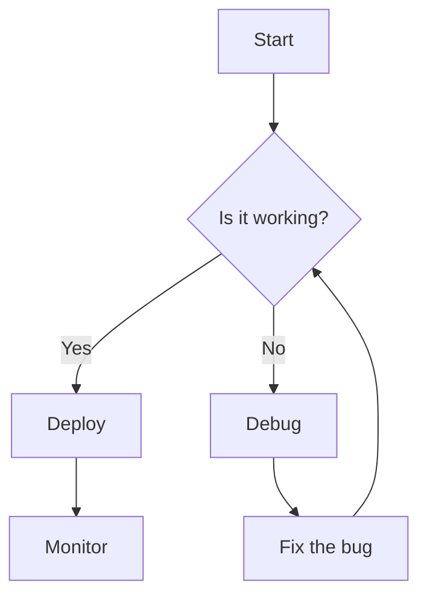
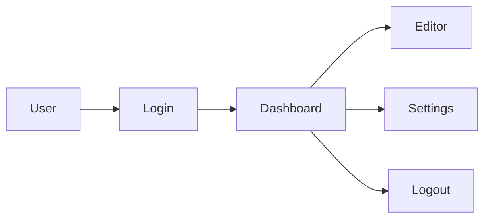
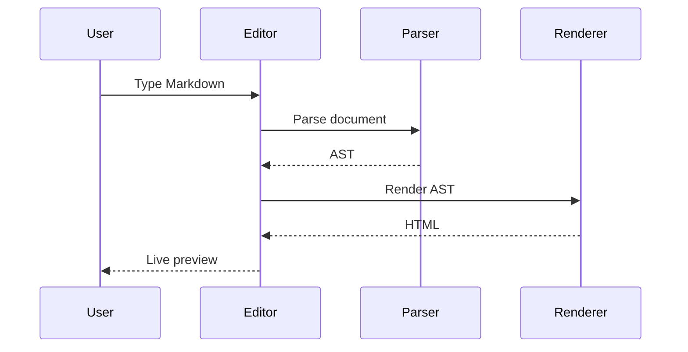
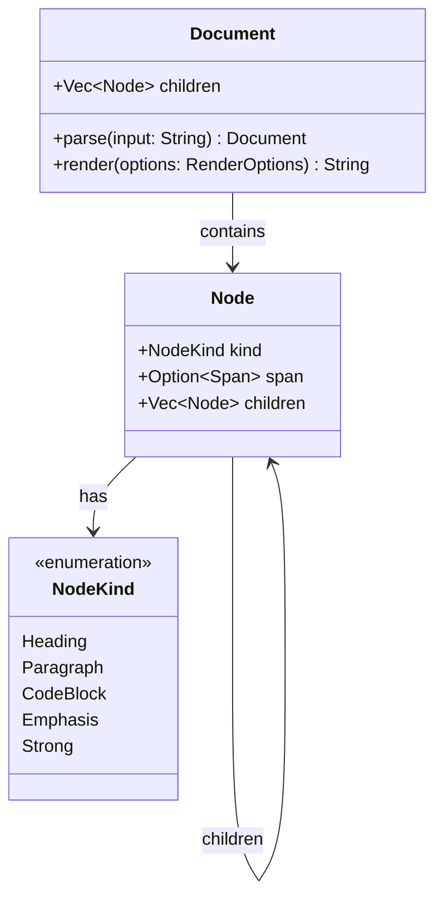
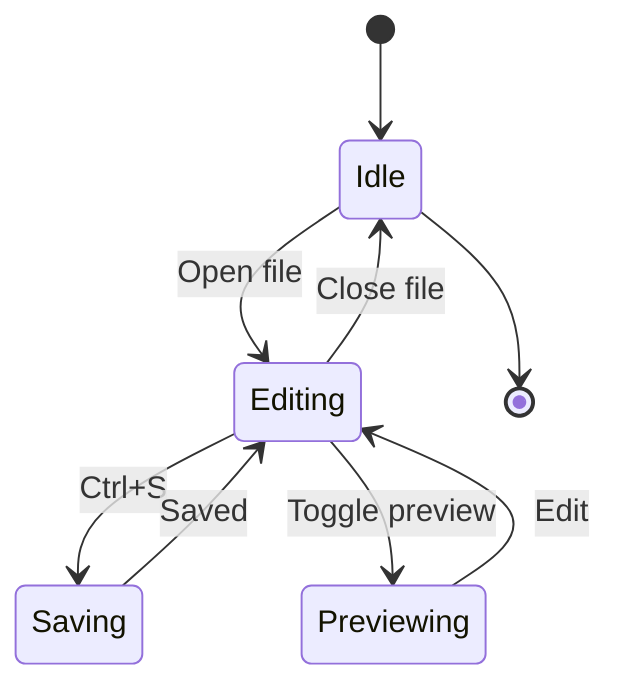
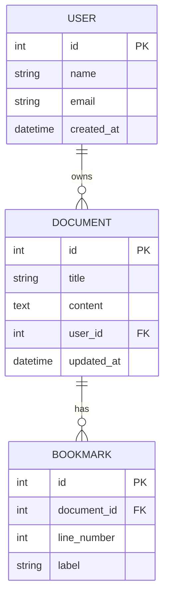
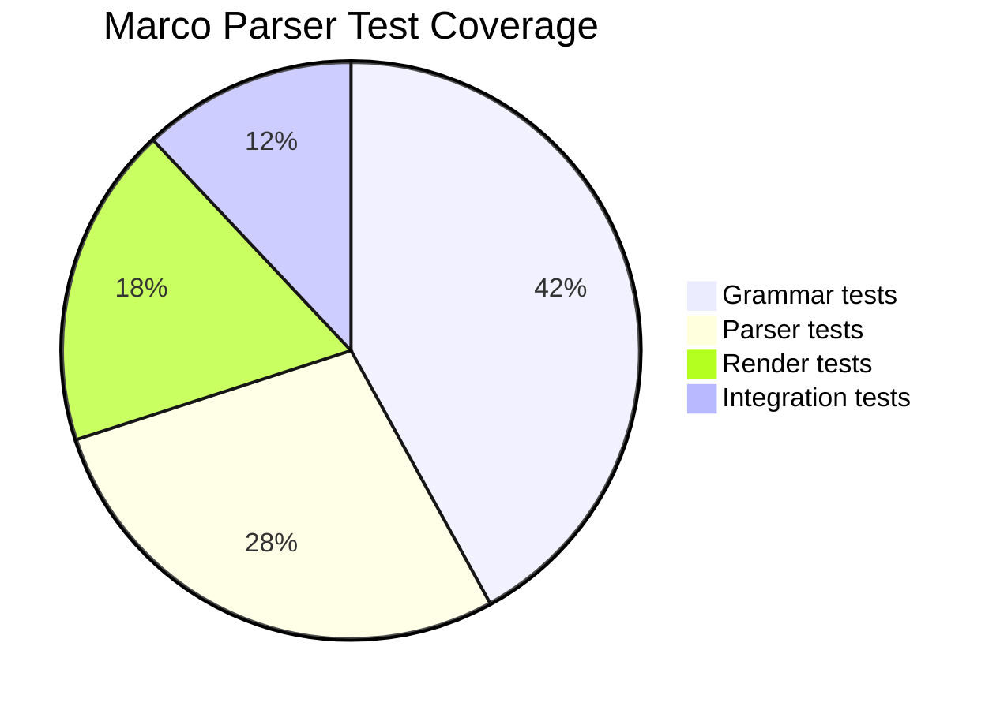
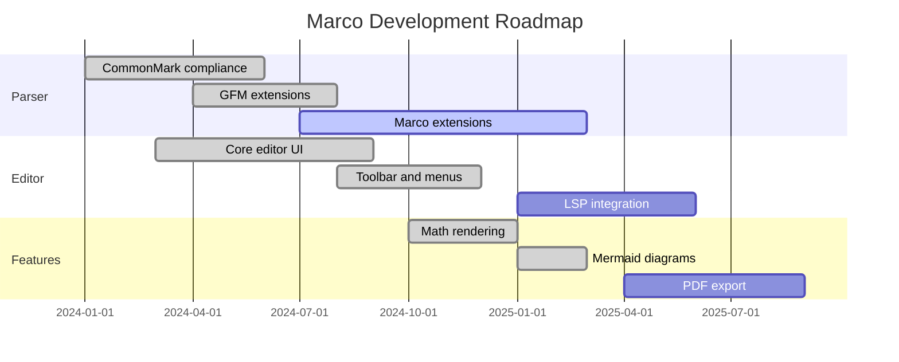
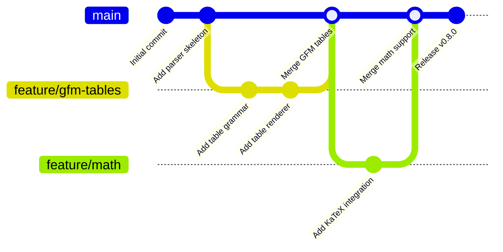

# Mermaid Diagrams

Marco renders Mermaid diagrams natively using `mermaid-rs-renderer` — pure Rust, no browser required.

Use a fenced code block with the `mermaid` info string:

````

````

---

## Flowcharts



Left-to-right flowchart:



---

## Sequence Diagrams



---

## Class Diagrams



---

## State Diagrams



---

## Entity-Relationship Diagrams



---

## Pie Charts



---

## Gantt Charts



---

## Git Graphs



---

## Diagrams in Context

Mermaid diagrams work inside blockquotes:

> The following diagram shows the request flow:
>
> ```mermaid
> graph LR
>     Client --> API --> Database
> ```

And in list items:

- **Frontend flow:**

  ```mermaid
  graph LR
      Input --> Validate --> Submit
  ```

- **Backend flow:**

  ```mermaid
  graph LR
      Request --> Auth --> Handler --> Response
  ```
