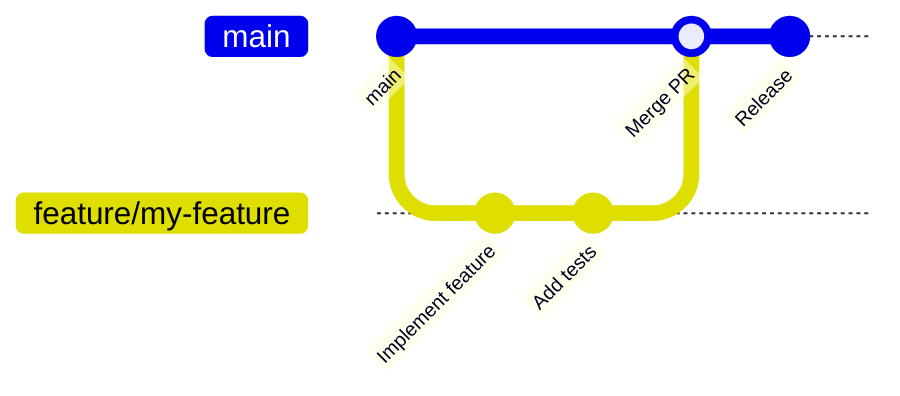

# Software Development Guide

A comprehensive guide to setting up and working with a Rust-based development environment. This document exercises many Marco features together.

> [!NOTE]
> This guide is actively maintained. For questions or corrections, contact @ranrar[github](Kim) or open an issue.

---

## Table of Contents

- [Getting Started](#getting-started)
- [Project Structure](#project-structure)
- [Development Workflow](#development-workflow)
- [Testing](#testing)
- [Deployment](#deployment)
- [Troubleshooting](#troubleshooting)

---

## Getting Started {#getting-started}

Welcome to the team! This guide will help you get up and running with our development environment.

### Prerequisites

Before you begin, ensure you have the following installed:

- [x] Git (version 2.30+)
- [x] Rust (stable, 1.75+) — install via [rustup](https://rustup.rs)
- [ ] Docker Desktop (needed for local database testing)
- [ ] VS Code with the rust-analyzer extension

> [!WARNING]
> **Windows Users:** Some build scripts require the MSVC toolchain and Visual Studio Build Tools. Install them before running `cargo build`.

### Initial Setup

:::tab
@tab Linux
```bash
# Install system dependencies
sudo apt-get update
sudo apt-get install -y pkg-config libgtk-4-dev

# Clone the repository
git clone https://github.com/yourorg/yourproject.git
cd yourproject

# Build and run
cargo build
cargo run
```

@tab Windows (PowerShell)
```powershell
# Clone the repository
git clone https://github.com/yourorg/yourproject.git
cd yourproject

# Build and run
cargo build
cargo run
```

@tab Docker
```bash
# Using Docker for a consistent environment
docker compose up --build

# Run tests inside the container
docker compose exec app cargo test --workspace
```
:::

Verify your setup:

```bash
cargo check --workspace   # fast type check
cargo test --workspace    # full test suite
cargo clippy --workspace  # linting
```

---

## Project Structure {#project-structure}

Our project follows a **Cargo workspace** layout:

```
project/
├── Cargo.toml          # workspace definition
├── core/               # library crate (business logic, no UI)
│   ├── src/
│   │   ├── lib.rs
│   │   ├── parser/     # nom-based parser
│   │   ├── render/     # HTML renderer
│   │   └── logic/      # buffer, settings, cache
│   └── tests/
├── app/                # binary crate (GTK4 UI)
│   └── src/
│       ├── main.rs
│       └── components/
└── tests/              # workspace-level integration tests
```

**Key conventions:**

- **No logic in `main.rs`** — only application setup and startup
- **Core vs UI separation** — pure Rust logic in `core/`, GTK-dependent code in `app/`
- **Asset management** — centralized in `assets/`, resolved via path helpers at runtime

---

## Development Workflow {#development-workflow}

### Daily Commands

| Command | Purpose |
|---------|---------|
| `cargo build` | Compile the project |
| `cargo run` | Build and run |
| `cargo test --workspace` | Run all tests |
| `cargo clippy --workspace` | Lint |
| `cargo fmt` | Format code |
| `cargo doc --open` | View generated docs |

### Branching Strategy



Workflow:

1. Create a feature branch from `main`
2. Make focused, atomic commits
3. Open a pull request — CI runs `cargo test` and `cargo clippy`
4. After review, squash-merge into `main`

> [!IMPORTANT]
> Never push directly to `main`. All changes go through a pull request.

### Code Style

- Follow Rust idioms: use `Result<T, E>`, avoid `unwrap()` in library code
- Run `cargo fmt` before every commit
- Address all `cargo clippy` warnings before opening a PR
- Add doc comments (`///`) to all public functions and types

---

## Testing {#testing}

### Test Structure

We use **smoke tests** as the primary testing strategy — fast, real-integration tests that verify core behavior:

```rust
#[cfg(test)]
mod tests {
    use super::*;

    #[test]
    fn smoke_test_parser_roundtrip() {
        let input = "# Hello\n\nThis is **bold** text.";
        let doc = parse(input).expect("parse failed");
        let html = render(&doc, &Default::default()).expect("render failed");
        assert!(html.contains("<h1>Hello</h1>"));
        assert!(html.contains("<strong>bold</strong>"));
    }
}
```

> [!TIP]
> Run `cargo test --workspace -- --nocapture` to see `println!` output during tests. Useful for debugging failing tests.

### Coverage

We use `cargo-llvm-cov` for coverage reports:

```bash
cargo llvm-cov --html --open
```

> [!NOTE]
> UI coverage is typically low for GTK applications. Focus coverage efforts on `core/`.

### Test Results Summary

| Crate | Tests | Status |
|-------|-------|--------|
| `core` | 550+ | :white_check_mark: All passing |
| Integration | 20+ | :white_check_mark: All passing |

---

## Deployment {#deployment}

### Linux (Debian/Ubuntu)

```bash
# Build release binary
cargo build --release -p app

# Package as .deb
bash build/linux/build_deb.sh
```

The resulting package is in `target/` as `app_<version>_amd64.deb`.

### Windows (Portable)

On Windows, run from a Developer PowerShell:

```powershell
cargo build --release --target x86_64-pc-windows-msvc -p app
.\build\windows\build_portable.ps1
```

### Semantic Versioning

Versions follow [SemVer](https://semver.org):

| Part | When to bump | Example |
|------|-------------|---------|
| Patch | Bug fixes | 0.8.0 → 0.8.1 |
| Minor | New features (backward-compatible) | 0.8.0 → 0.9.0 |
| Major | Breaking changes | 0.8.0 → 1.0.0 |

Use the version script to update all crates at once:

```bash
bash build/linux/build_deb.sh --version-only --bump minor
```

---

## Troubleshooting {#troubleshooting}

### Common Issues

Build fails with `pkg-config not found`
: Install `pkg-config` and the GTK4 development headers:
  ```bash
  sudo apt-get install pkg-config libgtk-4-dev
  ```

`cargo clippy` reports too many warnings
: Most warnings become errors in CI. Fix them before pushing.
  Run `cargo clippy --workspace --all-targets -- -D warnings` locally to match CI behavior.

Application crashes on startup
: Check the log file in `log/YYYYMM/YYMMDD.log`. The panic hook writes a full backtrace there.

Tests fail after pulling main
: Run `cargo clean && cargo test --workspace`. A stale incremental build cache occasionally causes spurious failures.

### Getting Help

1. Check the log first — `log/YYYYMM/YYMMDD.log`
2. Search open issues on GitHub
3. Ask in the team chat: @ranrar[github](Kim) or @alice[github](Alice)
4. Open a new issue with a minimal reproduction

---

## Key Formulas for Reference

Build time complexity grows roughly as:

$$
T_{\text{build}} \approx O(n \log n)
$$

where $n$ is the number of source files. Incremental builds are much faster: $O(\Delta n)$ for $\Delta n$ changed files.

Cache hit rate follows:

$$
\text{hit rate} = 1 - \frac{\text{misses}}{\text{total lookups}}
$$

---

## Glossary

AST
: Abstract Syntax Tree — the intermediate representation produced by the parser. All rendering and LSP features work from the AST.

CI
: Continuous Integration — automated build and test pipeline triggered on every push and pull request.

LSP
: Language Server Protocol — the standard for providing editor features (completion, diagnostics, hover) to editors.

SemVer
: Semantic Versioning — a versioning scheme with the format `MAJOR.MINOR.PATCH`.

---

*Generated with Marco — the fast, cross-platform Markdown editor built in Rust.*
