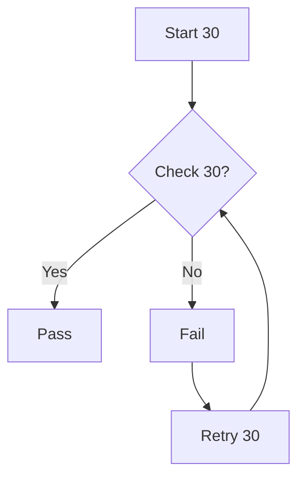
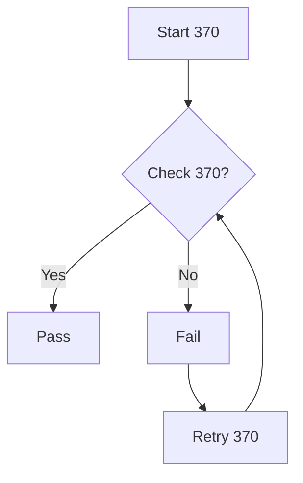

# Marco Stress Test Document

This document contains **1250 sections**, cycling through every Markdown
feature supported by Marco and Polo. It is designed to exercise the parser, renderer,
and preview engine under realistic load.

Feature types covered (cycling in order):

| # | Feature |
|---|---------|
| 1 | Headings (h1–h6, setext) |
| 2 | Emphasis (italic, bold, bold-italic, strikethrough) |
| 3 | Blockquotes (nested) |
| 4 | Lists (ordered, unordered, nested) |
| 5 | Task lists |
| 6 | Code blocks (fenced + indented, 5 languages) |
| 7 | Tables (with alignment) |
| 8 | Admonitions (NOTE/TIP/IMPORTANT/WARNING/CAUTION) |
| 9 | Math — KaTeX (inline + display) |
| 10 | Mermaid diagrams (flowchart + sequence) |
| 11 | Tab blocks |
| 12 | Slider decks |
| 13 | Footnotes (reference + inline) |
| 14 | Definition lists |
| 15 | Links and images |
| 16 | Horizontal rules |
| 17 | Nested structures |
| 18 | HTML entities + escapes |
| 19 | Mixed inline elements |
| 20 | Long paragraphs |

---

# Section 1 — Headings

## H2 heading in section 1

### H3 heading in section 1

#### H4 heading in section 1

##### H5 heading in section 1

###### H6 heading in section 1

Setext H1 in section 1
=========================

Setext H2 in section 1
-------------------------

This paragraph follows the heading block for section 1.

# Section 2 — Emphasis and Inline Formatting

Regular paragraph in section 2 with *italic*, **bold**, ***bold-italic***, and ~~strikethrough~~ text.

You can combine: **bold with *nested italic* inside** and *italic with **nested bold** inside*.

Inline `code span` and a hard line break  
right here in section 2.

A backslash line break:continues on the next line in section 2.

# Section 3 — Blockquotes

> This is a simple blockquote in section 3.
> It continues across multiple source lines.

> Nested blockquotes:
>
> > Level two in section 3.
> >
> > > Level three in section 3.

> A blockquote with **bold**, *italic*, and `code` in section 3.

# Section 4 — Lists

Unordered list:

- Item alpha in section 4
- Item beta in section 4
  - Nested item one
  - Nested item two
    - Deeply nested in section 4
- Item gamma in section 4

Ordered list:

1. First item in section 4
2. Second item in section 4
   1. Sub-item A
   2. Sub-item B
3. Third item in section 4

Mixed nesting:

- Outer A in section 4
  1. Inner ordered one
  2. Inner ordered two
- Outer B in section 4

# Section 5 — Task Lists

- [x] Completed task in section 5
- [ ] Pending task in section 5
- [x] Another completed task
- [ ] Another pending task
- [x] All core features implemented
- [ ] Performance profiling for section 5

# Section 6 — Code Blocks

Fenced code block with `python`:

```python
def task_6(x: int) -> int:
    return x * 6
```

Indented code block (4-space indent):

    // indented code in section 6
    let x = 6;

Inline code: `let result_6 = compute(6);`

# Section 7 — Tables

| Column A | Column B | Column C |
|----------|----------|----------|
| Row 1 A in section 7 | Row 1 B | Row 1 C |
| Row 2 A | Row 2 B in section 7 | Row 2 C |
| Row 3 A | Row 3 B | Row 3 C in section 7 |

Alignment variants:

| Left-aligned | Centered | Right-aligned |
|:-------------|:--------:|--------------:|
| `7` left | `7` center | `7` right |
| alpha | beta | gamma |
| delta | epsilon | zeta |

# Section 8 — Admonitions

> [!WARNING]
> This is a **WARNING** admonition in section 8.
> It contains *italic text*, `inline code`, and a list:
>
> - Item one for section 8
> - Item two for section 8
> - Item three

# Section 9 — Math (KaTeX)

Inline math: The formula for section 9 is $f(x) = x^{9} + \sqrt{9}$.

Euler's identity: $e^{i\pi} + 1 = 0$ (section 9).

Display math:

$$
\int_{0}^{9} x^2 \, dx = \frac{9^3}{3}
$$

$$
\sum_{k=1}^{9} k = \frac{9(9+1)}{2}
$$

# Section 10 — Mermaid Diagrams


# Section 11 — Tab Blocks

:::tab
@tab Overview 11
This is the overview panel for section 11. It contains **bold text** and *italic text*.

- Feature A in section 11
- Feature B in section 11

@tab Code 11
```rust
fn section_11() -> &'static str {
    "hello from section 11"
}
```

@tab Notes 11
> [!TIP]
> Tab blocks in section 11 use pure CSS switching — no JavaScript needed.
:::

# Section 12 — Slider Deck

@slidestart

## Slide 1 of section 12

Welcome to slide deck **12**. Use arrow buttons to navigate.

---

## Slide 2 of section 12

Key points:

- Point A for deck 12
- Point B for deck 12
- Point C for deck 12

---

## Slide 3 of section 12

```rust
fn slide_12() {
    println!("Slide 12");
}
```

@slideend

# Section 13 — Footnotes

This sentence has a reference footnote.[^fn13a]

Another sentence uses a named footnote.[^fn13b]

An inline footnote right here.^[This is an inline footnote for section 13 — no separate definition needed.]

[^fn13a]: This is footnote A for section 13.
[^fn13b]: This is footnote B for section 13. It provides extra context.

# Section 14 — Definition Lists

Term 14 Alpha
: Definition of term 14 alpha — the first and primary meaning.
: A second definition providing additional context for section 14.

Term 14 Beta
: Single definition for term 14 beta.

**Formatted term 14**
: Definition with *italic* and `code` inside for section 14.

# Section 15 — Links and Images

Inline link: [CommonMark spec](https://spec.commonmark.org) in section 15.

Reference-style link: [Marco repo][marco-15]

[marco-15]: https://github.com/Ranrar/Marco

Autolink: <https://example.com/section/15>

Autolink email: <user15@example.com>

Image (alt text only, no external load):


# Section 16 — Horizontal Rules and Separators

Paragraph before the rule in section 16.

***

Paragraph after the first rule in section 16.

---

Paragraph after the second rule.

***

Final paragraph in the HR section 16.

# Section 17 — Nested Structures

Blockquote containing a list:

> Blockquote in section 17:
>
> - Item one
> - Item two
>   - Nested item
> - Item three

List containing a blockquote:

- Outer item in section 17

  > Blockquote inside list item for section 17.

- Second outer item

  ```rust
  fn nested_17() {}
  ```

# Section 18 — Special Characters and Escapes

Escaped Markdown punctuation: \# \* \_ \[ \] \( \) \` \~ in section 18.

HTML entities: &amp; &lt; &gt; &quot; &copy; &reg; &trade; &mdash; &ndash; &hellip;

Unicode directly: — – … → ← ↑ ↓ ↔ ✓ ✗ ★ ☆ in section 18.

# Section 19 — Mixed Inline Elements

A paragraph combining **bold** and *italic* with `code`, a [link](https://example.com), ~~strikethrough~~, and math $x=19$ all in one line of section 19.

> A blockquote also combining **bold**, *italic*, `code`, and $\pi \approx 3.14159$ in section 19.

| Inline | Sample for section 19 |
|--------|------------------------|
| Bold | **bold text** |
| Italic | *italic text* |
| Code | `code span` |
| Math | $e=19$ |
| Strike | ~~crossed out~~ |

# Section 20 — Long Paragraph

This is sentence 1 of the long paragraph in section 20. This is sentence 2 of the long paragraph in section 20. This is sentence 3 of the long paragraph in section 20. This is sentence 4 of the long paragraph in section 20. This is sentence 5 of the long paragraph in section 20. This is sentence 6 of the long paragraph in section 20. This is sentence 7 of the long paragraph in section 20. This is sentence 8 of the long paragraph in section 20. This is sentence 9 of the long paragraph in section 20. This is sentence 10 of the long paragraph in section 20. This is sentence 11 of the long paragraph in section 20. This is sentence 12 of the long paragraph in section 20. This is sentence 13 of the long paragraph in section 20. This is sentence 14 of the long paragraph in section 20. This is sentence 15 of the long paragraph in section 20.

Another paragraph follows with **bold phrases** and *italic phrases* interspersed at regular intervals throughout the text to ensure inline parsing is exercised under load in section 20. The quick brown fox jumps over the lazy dog. Pack my box with five dozen liquor jugs. How vividly the quartz sphinx jumped.

# Section 21 — Headings

## H2 heading in section 21

### H3 heading in section 21

#### H4 heading in section 21

##### H5 heading in section 21

###### H6 heading in section 21

Setext H1 in section 21
=========================

Setext H2 in section 21
-------------------------

This paragraph follows the heading block for section 21.

# Section 22 — Emphasis and Inline Formatting

Regular paragraph in section 22 with *italic*, **bold**, ***bold-italic***, and ~~strikethrough~~ text.

You can combine: **bold with *nested italic* inside** and *italic with **nested bold** inside*.

Inline `code span` and a hard line break  
right here in section 22.

A backslash line break:continues on the next line in section 22.

# Section 23 — Blockquotes

> This is a simple blockquote in section 23.
> It continues across multiple source lines.

> Nested blockquotes:
>
> > Level two in section 23.
> >
> > > Level three in section 23.

> A blockquote with **bold**, *italic*, and `code` in section 23.

# Section 24 — Lists

Unordered list:

- Item alpha in section 24
- Item beta in section 24
  - Nested item one
  - Nested item two
    - Deeply nested in section 24
- Item gamma in section 24

Ordered list:

1. First item in section 24
2. Second item in section 24
   1. Sub-item A
   2. Sub-item B
3. Third item in section 24

Mixed nesting:

- Outer A in section 24
  1. Inner ordered one
  2. Inner ordered two
- Outer B in section 24

# Section 25 — Task Lists

- [x] Completed task in section 25
- [ ] Pending task in section 25
- [x] Another completed task
- [ ] Another pending task
- [x] All core features implemented
- [ ] Performance profiling for section 25

# Section 26 — Code Blocks

Fenced code block with `python`:

```python
def task_26(x: int) -> int:
    return x * 26
```

Indented code block (4-space indent):

    // indented code in section 26
    let x = 26;

Inline code: `let result_26 = compute(26);`

# Section 27 — Tables

| Column A | Column B | Column C |
|----------|----------|----------|
| Row 1 A in section 27 | Row 1 B | Row 1 C |
| Row 2 A | Row 2 B in section 27 | Row 2 C |
| Row 3 A | Row 3 B | Row 3 C in section 27 |

Alignment variants:

| Left-aligned | Centered | Right-aligned |
|:-------------|:--------:|--------------:|
| `27` left | `27` center | `27` right |
| alpha | beta | gamma |
| delta | epsilon | zeta |

# Section 28 — Admonitions

> [!WARNING]
> This is a **WARNING** admonition in section 28.
> It contains *italic text*, `inline code`, and a list:
>
> - Item one for section 28
> - Item two for section 28
> - Item three

# Section 29 — Math (KaTeX)

Inline math: The formula for section 29 is $f(x) = x^{29} + \sqrt{29}$.

Euler's identity: $e^{i\pi} + 1 = 0$ (section 29).

Display math:

$$
\int_{0}^{29} x^2 \, dx = \frac{29^3}{3}
$$

$$
\sum_{k=1}^{29} k = \frac{29(29+1)}{2}
$$

# Section 30 — Mermaid Diagrams



# Section 31 — Tab Blocks

:::tab
@tab Overview 31
This is the overview panel for section 31. It contains **bold text** and *italic text*.

- Feature A in section 31
- Feature B in section 31

@tab Code 31
```rust
fn section_31() -> &'static str {
    "hello from section 31"
}
```

@tab Notes 31
> [!TIP]
> Tab blocks in section 31 use pure CSS switching — no JavaScript needed.
:::

# Section 32 — Slider Deck

@slidestart

## Slide 1 of section 32

Welcome to slide deck **32**. Use arrow buttons to navigate.

---

## Slide 2 of section 32

Key points:

- Point A for deck 32
- Point B for deck 32
- Point C for deck 32

---

## Slide 3 of section 32

```rust
fn slide_32() {
    println!("Slide 32");
}
```

@slideend

# Section 33 — Footnotes

This sentence has a reference footnote.[^fn33a]

Another sentence uses a named footnote.[^fn33b]

An inline footnote right here.^[This is an inline footnote for section 33 — no separate definition needed.]

[^fn33a]: This is footnote A for section 33.
[^fn33b]: This is footnote B for section 33. It provides extra context.

# Section 34 — Definition Lists

Term 34 Alpha
: Definition of term 34 alpha — the first and primary meaning.
: A second definition providing additional context for section 34.

Term 34 Beta
: Single definition for term 34 beta.

**Formatted term 34**
: Definition with *italic* and `code` inside for section 34.

# Section 35 — Links and Images

Inline link: [CommonMark spec](https://spec.commonmark.org) in section 35.

Reference-style link: [Marco repo][marco-35]

[marco-35]: https://github.com/Ranrar/Marco

Autolink: <https://example.com/section/35>

Autolink email: <user35@example.com>

Image (alt text only, no external load):


# Section 36 — Horizontal Rules and Separators

Paragraph before the rule in section 36.

---

Paragraph after the first rule in section 36.

---

Paragraph after the second rule.

***

Final paragraph in the HR section 36.

# Section 37 — Nested Structures

Blockquote containing a list:

> Blockquote in section 37:
>
> - Item one
> - Item two
>   - Nested item
> - Item three

List containing a blockquote:

- Outer item in section 37

  > Blockquote inside list item for section 37.

- Second outer item

  ```rust
  fn nested_37() {}
  ```

# Section 38 — Special Characters and Escapes

Escaped Markdown punctuation: \# \* \_ \[ \] \( \) \` \~ in section 38.

HTML entities: &amp; &lt; &gt; &quot; &copy; &reg; &trade; &mdash; &ndash; &hellip;

Unicode directly: — – … → ← ↑ ↓ ↔ ✓ ✗ ★ ☆ in section 38.

# Section 39 — Mixed Inline Elements

A paragraph combining **bold** and *italic* with `code`, a [link](https://example.com), ~~strikethrough~~, and math $x=39$ all in one line of section 39.

> A blockquote also combining **bold**, *italic*, `code`, and $\pi \approx 3.14159$ in section 39.

| Inline | Sample for section 39 |
|--------|------------------------|
| Bold | **bold text** |
| Italic | *italic text* |
| Code | `code span` |
| Math | $e=39$ |
| Strike | ~~crossed out~~ |

# Section 40 — Long Paragraph

This is sentence 1 of the long paragraph in section 40. This is sentence 2 of the long paragraph in section 40. This is sentence 3 of the long paragraph in section 40. This is sentence 4 of the long paragraph in section 40. This is sentence 5 of the long paragraph in section 40. This is sentence 6 of the long paragraph in section 40. This is sentence 7 of the long paragraph in section 40. This is sentence 8 of the long paragraph in section 40. This is sentence 9 of the long paragraph in section 40. This is sentence 10 of the long paragraph in section 40. This is sentence 11 of the long paragraph in section 40. This is sentence 12 of the long paragraph in section 40. This is sentence 13 of the long paragraph in section 40. This is sentence 14 of the long paragraph in section 40. This is sentence 15 of the long paragraph in section 40.

Another paragraph follows with **bold phrases** and *italic phrases* interspersed at regular intervals throughout the text to ensure inline parsing is exercised under load in section 40. The quick brown fox jumps over the lazy dog. Pack my box with five dozen liquor jugs. How vividly the quartz sphinx jumped.

# Section 41 — Headings

## H2 heading in section 41

### H3 heading in section 41

#### H4 heading in section 41

##### H5 heading in section 41

###### H6 heading in section 41

Setext H1 in section 41
=========================

Setext H2 in section 41
-------------------------

This paragraph follows the heading block for section 41.

# Section 42 — Emphasis and Inline Formatting

Regular paragraph in section 42 with *italic*, **bold**, ***bold-italic***, and ~~strikethrough~~ text.

You can combine: **bold with *nested italic* inside** and *italic with **nested bold** inside*.

Inline `code span` and a hard line break  
right here in section 42.

A backslash line break:continues on the next line in section 42.

# Section 43 — Blockquotes

> This is a simple blockquote in section 43.
> It continues across multiple source lines.

> Nested blockquotes:
>
> > Level two in section 43.
> >
> > > Level three in section 43.

> A blockquote with **bold**, *italic*, and `code` in section 43.

# Section 44 — Lists

Unordered list:

- Item alpha in section 44
- Item beta in section 44
  - Nested item one
  - Nested item two
    - Deeply nested in section 44
- Item gamma in section 44

Ordered list:

1. First item in section 44
2. Second item in section 44
   1. Sub-item A
   2. Sub-item B
3. Third item in section 44

Mixed nesting:

- Outer A in section 44
  1. Inner ordered one
  2. Inner ordered two
- Outer B in section 44

# Section 45 — Task Lists

- [x] Completed task in section 45
- [ ] Pending task in section 45
- [x] Another completed task
- [ ] Another pending task
- [x] All core features implemented
- [ ] Performance profiling for section 45

# Section 46 — Code Blocks

Fenced code block with `python`:

```python
def task_46(x: int) -> int:
    return x * 46
```

Indented code block (4-space indent):

    // indented code in section 46
    let x = 46;

Inline code: `let result_46 = compute(46);`

# Section 47 — Tables

| Column A | Column B | Column C |
|----------|----------|----------|
| Row 1 A in section 47 | Row 1 B | Row 1 C |
| Row 2 A | Row 2 B in section 47 | Row 2 C |
| Row 3 A | Row 3 B | Row 3 C in section 47 |

Alignment variants:

| Left-aligned | Centered | Right-aligned |
|:-------------|:--------:|--------------:|
| `47` left | `47` center | `47` right |
| alpha | beta | gamma |
| delta | epsilon | zeta |

# Section 48 — Admonitions

> [!WARNING]
> This is a **WARNING** admonition in section 48.
> It contains *italic text*, `inline code`, and a list:
>
> - Item one for section 48
> - Item two for section 48
> - Item three

# Section 49 — Math (KaTeX)

Inline math: The formula for section 49 is $f(x) = x^{49} + \sqrt{49}$.

Euler's identity: $e^{i\pi} + 1 = 0$ (section 49).

Display math:

$$
\int_{0}^{49} x^2 \, dx = \frac{49^3}{3}
$$

$$
\sum_{k=1}^{49} k = \frac{49(49+1)}{2}
$$

# Section 50 — Mermaid Diagrams


# Section 51 — Tab Blocks

:::tab
@tab Overview 51
This is the overview panel for section 51. It contains **bold text** and *italic text*.

- Feature A in section 51
- Feature B in section 51

@tab Code 51
```rust
fn section_51() -> &'static str {
    "hello from section 51"
}
```

@tab Notes 51
> [!TIP]
> Tab blocks in section 51 use pure CSS switching — no JavaScript needed.
:::

# Section 52 — Slider Deck

@slidestart

## Slide 1 of section 52

Welcome to slide deck **52**. Use arrow buttons to navigate.

---

## Slide 2 of section 52

Key points:

- Point A for deck 52
- Point B for deck 52
- Point C for deck 52

---

## Slide 3 of section 52

```rust
fn slide_52() {
    println!("Slide 52");
}
```

@slideend

# Section 53 — Footnotes

This sentence has a reference footnote.[^fn53a]

Another sentence uses a named footnote.[^fn53b]

An inline footnote right here.^[This is an inline footnote for section 53 — no separate definition needed.]

[^fn53a]: This is footnote A for section 53.
[^fn53b]: This is footnote B for section 53. It provides extra context.

# Section 54 — Definition Lists

Term 54 Alpha
: Definition of term 54 alpha — the first and primary meaning.
: A second definition providing additional context for section 54.

Term 54 Beta
: Single definition for term 54 beta.

**Formatted term 54**
: Definition with *italic* and `code` inside for section 54.

# Section 55 — Links and Images

Inline link: [CommonMark spec](https://spec.commonmark.org) in section 55.

Reference-style link: [Marco repo][marco-55]

[marco-55]: https://github.com/Ranrar/Marco

Autolink: <https://example.com/section/55>

Autolink email: <user55@example.com>

Image (alt text only, no external load):


# Section 56 — Horizontal Rules and Separators

Paragraph before the rule in section 56.

___

Paragraph after the first rule in section 56.

---

Paragraph after the second rule.

***

Final paragraph in the HR section 56.

# Section 57 — Nested Structures

Blockquote containing a list:

> Blockquote in section 57:
>
> - Item one
> - Item two
>   - Nested item
> - Item three

List containing a blockquote:

- Outer item in section 57

  > Blockquote inside list item for section 57.

- Second outer item

  ```rust
  fn nested_57() {}
  ```

# Section 58 — Special Characters and Escapes

Escaped Markdown punctuation: \# \* \_ \[ \] \( \) \` \~ in section 58.

HTML entities: &amp; &lt; &gt; &quot; &copy; &reg; &trade; &mdash; &ndash; &hellip;

Unicode directly: — – … → ← ↑ ↓ ↔ ✓ ✗ ★ ☆ in section 58.

# Section 59 — Mixed Inline Elements

A paragraph combining **bold** and *italic* with `code`, a [link](https://example.com), ~~strikethrough~~, and math $x=59$ all in one line of section 59.

> A blockquote also combining **bold**, *italic*, `code`, and $\pi \approx 3.14159$ in section 59.

| Inline | Sample for section 59 |
|--------|------------------------|
| Bold | **bold text** |
| Italic | *italic text* |
| Code | `code span` |
| Math | $e=59$ |
| Strike | ~~crossed out~~ |

# Section 60 — Long Paragraph

This is sentence 1 of the long paragraph in section 60. This is sentence 2 of the long paragraph in section 60. This is sentence 3 of the long paragraph in section 60. This is sentence 4 of the long paragraph in section 60. This is sentence 5 of the long paragraph in section 60. This is sentence 6 of the long paragraph in section 60. This is sentence 7 of the long paragraph in section 60. This is sentence 8 of the long paragraph in section 60. This is sentence 9 of the long paragraph in section 60. This is sentence 10 of the long paragraph in section 60. This is sentence 11 of the long paragraph in section 60. This is sentence 12 of the long paragraph in section 60. This is sentence 13 of the long paragraph in section 60. This is sentence 14 of the long paragraph in section 60. This is sentence 15 of the long paragraph in section 60.

Another paragraph follows with **bold phrases** and *italic phrases* interspersed at regular intervals throughout the text to ensure inline parsing is exercised under load in section 60. The quick brown fox jumps over the lazy dog. Pack my box with five dozen liquor jugs. How vividly the quartz sphinx jumped.

# Section 61 — Headings

## H2 heading in section 61

### H3 heading in section 61

#### H4 heading in section 61

##### H5 heading in section 61

###### H6 heading in section 61

Setext H1 in section 61
=========================

Setext H2 in section 61
-------------------------

This paragraph follows the heading block for section 61.

# Section 62 — Emphasis and Inline Formatting

Regular paragraph in section 62 with *italic*, **bold**, ***bold-italic***, and ~~strikethrough~~ text.

You can combine: **bold with *nested italic* inside** and *italic with **nested bold** inside*.

Inline `code span` and a hard line break  
right here in section 62.

A backslash line break:continues on the next line in section 62.

# Section 63 — Blockquotes

> This is a simple blockquote in section 63.
> It continues across multiple source lines.

> Nested blockquotes:
>
> > Level two in section 63.
> >
> > > Level three in section 63.

> A blockquote with **bold**, *italic*, and `code` in section 63.

# Section 64 — Lists

Unordered list:

- Item alpha in section 64
- Item beta in section 64
  - Nested item one
  - Nested item two
    - Deeply nested in section 64
- Item gamma in section 64

Ordered list:

1. First item in section 64
2. Second item in section 64
   1. Sub-item A
   2. Sub-item B
3. Third item in section 64

Mixed nesting:

- Outer A in section 64
  1. Inner ordered one
  2. Inner ordered two
- Outer B in section 64

# Section 65 — Task Lists

- [x] Completed task in section 65
- [ ] Pending task in section 65
- [x] Another completed task
- [ ] Another pending task
- [x] All core features implemented
- [ ] Performance profiling for section 65

# Section 66 — Code Blocks

Fenced code block with `python`:

```python
def task_66(x: int) -> int:
    return x * 66
```

Indented code block (4-space indent):

    // indented code in section 66
    let x = 66;

Inline code: `let result_66 = compute(66);`

# Section 67 — Tables

| Column A | Column B | Column C |
|----------|----------|----------|
| Row 1 A in section 67 | Row 1 B | Row 1 C |
| Row 2 A | Row 2 B in section 67 | Row 2 C |
| Row 3 A | Row 3 B | Row 3 C in section 67 |

Alignment variants:

| Left-aligned | Centered | Right-aligned |
|:-------------|:--------:|--------------:|
| `67` left | `67` center | `67` right |
| alpha | beta | gamma |
| delta | epsilon | zeta |

# Section 68 — Admonitions

> [!WARNING]
> This is a **WARNING** admonition in section 68.
> It contains *italic text*, `inline code`, and a list:
>
> - Item one for section 68
> - Item two for section 68
> - Item three

# Section 69 — Math (KaTeX)

Inline math: The formula for section 69 is $f(x) = x^{69} + \sqrt{69}$.

Euler's identity: $e^{i\pi} + 1 = 0$ (section 69).

Display math:

$$
\int_{0}^{69} x^2 \, dx = \frac{69^3}{3}
$$

$$
\sum_{k=1}^{69} k = \frac{69(69+1)}{2}
$$

# Section 70 — Mermaid Diagrams


# Section 71 — Tab Blocks

:::tab
@tab Overview 71
This is the overview panel for section 71. It contains **bold text** and *italic text*.

- Feature A in section 71
- Feature B in section 71

@tab Code 71
```rust
fn section_71() -> &'static str {
    "hello from section 71"
}
```

@tab Notes 71
> [!TIP]
> Tab blocks in section 71 use pure CSS switching — no JavaScript needed.
:::

# Section 72 — Slider Deck

@slidestart

## Slide 1 of section 72

Welcome to slide deck **72**. Use arrow buttons to navigate.

---

## Slide 2 of section 72

Key points:

- Point A for deck 72
- Point B for deck 72
- Point C for deck 72

---

## Slide 3 of section 72

```rust
fn slide_72() {
    println!("Slide 72");
}
```

@slideend

# Section 73 — Footnotes

This sentence has a reference footnote.[^fn73a]

Another sentence uses a named footnote.[^fn73b]

An inline footnote right here.^[This is an inline footnote for section 73 — no separate definition needed.]

[^fn73a]: This is footnote A for section 73.
[^fn73b]: This is footnote B for section 73. It provides extra context.

# Section 74 — Definition Lists

Term 74 Alpha
: Definition of term 74 alpha — the first and primary meaning.
: A second definition providing additional context for section 74.

Term 74 Beta
: Single definition for term 74 beta.

**Formatted term 74**
: Definition with *italic* and `code` inside for section 74.

# Section 75 — Links and Images

Inline link: [CommonMark spec](https://spec.commonmark.org) in section 75.

Reference-style link: [Marco repo][marco-75]

[marco-75]: https://github.com/Ranrar/Marco

Autolink: <https://example.com/section/75>

Autolink email: <user75@example.com>

Image (alt text only, no external load):


# Section 76 — Horizontal Rules and Separators

Paragraph before the rule in section 76.

***

Paragraph after the first rule in section 76.

---

Paragraph after the second rule.

***

Final paragraph in the HR section 76.

# Section 77 — Nested Structures

Blockquote containing a list:

> Blockquote in section 77:
>
> - Item one
> - Item two
>   - Nested item
> - Item three

List containing a blockquote:

- Outer item in section 77

  > Blockquote inside list item for section 77.

- Second outer item

  ```rust
  fn nested_77() {}
  ```

# Section 78 — Special Characters and Escapes

Escaped Markdown punctuation: \# \* \_ \[ \] \( \) \` \~ in section 78.

HTML entities: &amp; &lt; &gt; &quot; &copy; &reg; &trade; &mdash; &ndash; &hellip;

Unicode directly: — – … → ← ↑ ↓ ↔ ✓ ✗ ★ ☆ in section 78.

# Section 79 — Mixed Inline Elements

A paragraph combining **bold** and *italic* with `code`, a [link](https://example.com), ~~strikethrough~~, and math $x=79$ all in one line of section 79.

> A blockquote also combining **bold**, *italic*, `code`, and $\pi \approx 3.14159$ in section 79.

| Inline | Sample for section 79 |
|--------|------------------------|
| Bold | **bold text** |
| Italic | *italic text* |
| Code | `code span` |
| Math | $e=79$ |
| Strike | ~~crossed out~~ |

# Section 80 — Long Paragraph

This is sentence 1 of the long paragraph in section 80. This is sentence 2 of the long paragraph in section 80. This is sentence 3 of the long paragraph in section 80. This is sentence 4 of the long paragraph in section 80. This is sentence 5 of the long paragraph in section 80. This is sentence 6 of the long paragraph in section 80. This is sentence 7 of the long paragraph in section 80. This is sentence 8 of the long paragraph in section 80. This is sentence 9 of the long paragraph in section 80. This is sentence 10 of the long paragraph in section 80. This is sentence 11 of the long paragraph in section 80. This is sentence 12 of the long paragraph in section 80. This is sentence 13 of the long paragraph in section 80. This is sentence 14 of the long paragraph in section 80. This is sentence 15 of the long paragraph in section 80.

Another paragraph follows with **bold phrases** and *italic phrases* interspersed at regular intervals throughout the text to ensure inline parsing is exercised under load in section 80. The quick brown fox jumps over the lazy dog. Pack my box with five dozen liquor jugs. How vividly the quartz sphinx jumped.

# Section 81 — Headings

## H2 heading in section 81

### H3 heading in section 81

#### H4 heading in section 81

##### H5 heading in section 81

###### H6 heading in section 81

Setext H1 in section 81
=========================

Setext H2 in section 81
-------------------------

This paragraph follows the heading block for section 81.

# Section 82 — Emphasis and Inline Formatting

Regular paragraph in section 82 with *italic*, **bold**, ***bold-italic***, and ~~strikethrough~~ text.

You can combine: **bold with *nested italic* inside** and *italic with **nested bold** inside*.

Inline `code span` and a hard line break  
right here in section 82.

A backslash line break:continues on the next line in section 82.

# Section 83 — Blockquotes

> This is a simple blockquote in section 83.
> It continues across multiple source lines.

> Nested blockquotes:
>
> > Level two in section 83.
> >
> > > Level three in section 83.

> A blockquote with **bold**, *italic*, and `code` in section 83.

# Section 84 — Lists

Unordered list:

- Item alpha in section 84
- Item beta in section 84
  - Nested item one
  - Nested item two
    - Deeply nested in section 84
- Item gamma in section 84

Ordered list:

1. First item in section 84
2. Second item in section 84
   1. Sub-item A
   2. Sub-item B
3. Third item in section 84

Mixed nesting:

- Outer A in section 84
  1. Inner ordered one
  2. Inner ordered two
- Outer B in section 84

# Section 85 — Task Lists

- [x] Completed task in section 85
- [ ] Pending task in section 85
- [x] Another completed task
- [ ] Another pending task
- [x] All core features implemented
- [ ] Performance profiling for section 85

# Section 86 — Code Blocks

Fenced code block with `python`:

```python
def task_86(x: int) -> int:
    return x * 86
```

Indented code block (4-space indent):

    // indented code in section 86
    let x = 86;

Inline code: `let result_86 = compute(86);`

# Section 87 — Tables

| Column A | Column B | Column C |
|----------|----------|----------|
| Row 1 A in section 87 | Row 1 B | Row 1 C |
| Row 2 A | Row 2 B in section 87 | Row 2 C |
| Row 3 A | Row 3 B | Row 3 C in section 87 |

Alignment variants:

| Left-aligned | Centered | Right-aligned |
|:-------------|:--------:|--------------:|
| `87` left | `87` center | `87` right |
| alpha | beta | gamma |
| delta | epsilon | zeta |

# Section 88 — Admonitions

> [!WARNING]
> This is a **WARNING** admonition in section 88.
> It contains *italic text*, `inline code`, and a list:
>
> - Item one for section 88
> - Item two for section 88
> - Item three

# Section 89 — Math (KaTeX)

Inline math: The formula for section 89 is $f(x) = x^{89} + \sqrt{89}$.

Euler's identity: $e^{i\pi} + 1 = 0$ (section 89).

Display math:

$$
\int_{0}^{89} x^2 \, dx = \frac{89^3}{3}
$$

$$
\sum_{k=1}^{89} k = \frac{89(89+1)}{2}
$$

# Section 90 — Mermaid Diagrams


# Section 91 — Tab Blocks

:::tab
@tab Overview 91
This is the overview panel for section 91. It contains **bold text** and *italic text*.

- Feature A in section 91
- Feature B in section 91

@tab Code 91
```rust
fn section_91() -> &'static str {
    "hello from section 91"
}
```

@tab Notes 91
> [!TIP]
> Tab blocks in section 91 use pure CSS switching — no JavaScript needed.
:::

# Section 92 — Slider Deck

@slidestart

## Slide 1 of section 92

Welcome to slide deck **92**. Use arrow buttons to navigate.

---

## Slide 2 of section 92

Key points:

- Point A for deck 92
- Point B for deck 92
- Point C for deck 92

---

## Slide 3 of section 92

```rust
fn slide_92() {
    println!("Slide 92");
}
```

@slideend

# Section 93 — Footnotes

This sentence has a reference footnote.[^fn93a]

Another sentence uses a named footnote.[^fn93b]

An inline footnote right here.^[This is an inline footnote for section 93 — no separate definition needed.]

[^fn93a]: This is footnote A for section 93.
[^fn93b]: This is footnote B for section 93. It provides extra context.

# Section 94 — Definition Lists

Term 94 Alpha
: Definition of term 94 alpha — the first and primary meaning.
: A second definition providing additional context for section 94.

Term 94 Beta
: Single definition for term 94 beta.

**Formatted term 94**
: Definition with *italic* and `code` inside for section 94.

# Section 95 — Links and Images

Inline link: [CommonMark spec](https://spec.commonmark.org) in section 95.

Reference-style link: [Marco repo][marco-95]

[marco-95]: https://github.com/Ranrar/Marco

Autolink: <https://example.com/section/95>

Autolink email: <user95@example.com>

Image (alt text only, no external load):


# Section 96 — Horizontal Rules and Separators

Paragraph before the rule in section 96.

---

Paragraph after the first rule in section 96.

---

Paragraph after the second rule.

***

Final paragraph in the HR section 96.

# Section 97 — Nested Structures

Blockquote containing a list:

> Blockquote in section 97:
>
> - Item one
> - Item two
>   - Nested item
> - Item three

List containing a blockquote:

- Outer item in section 97

  > Blockquote inside list item for section 97.

- Second outer item

  ```rust
  fn nested_97() {}
  ```

# Section 98 — Special Characters and Escapes

Escaped Markdown punctuation: \# \* \_ \[ \] \( \) \` \~ in section 98.

HTML entities: &amp; &lt; &gt; &quot; &copy; &reg; &trade; &mdash; &ndash; &hellip;

Unicode directly: — – … → ← ↑ ↓ ↔ ✓ ✗ ★ ☆ in section 98.

# Section 99 — Mixed Inline Elements

A paragraph combining **bold** and *italic* with `code`, a [link](https://example.com), ~~strikethrough~~, and math $x=99$ all in one line of section 99.

> A blockquote also combining **bold**, *italic*, `code`, and $\pi \approx 3.14159$ in section 99.

| Inline | Sample for section 99 |
|--------|------------------------|
| Bold | **bold text** |
| Italic | *italic text* |
| Code | `code span` |
| Math | $e=99$ |
| Strike | ~~crossed out~~ |

# Section 100 — Long Paragraph

This is sentence 1 of the long paragraph in section 100. This is sentence 2 of the long paragraph in section 100. This is sentence 3 of the long paragraph in section 100. This is sentence 4 of the long paragraph in section 100. This is sentence 5 of the long paragraph in section 100. This is sentence 6 of the long paragraph in section 100. This is sentence 7 of the long paragraph in section 100. This is sentence 8 of the long paragraph in section 100. This is sentence 9 of the long paragraph in section 100. This is sentence 10 of the long paragraph in section 100. This is sentence 11 of the long paragraph in section 100. This is sentence 12 of the long paragraph in section 100. This is sentence 13 of the long paragraph in section 100. This is sentence 14 of the long paragraph in section 100. This is sentence 15 of the long paragraph in section 100.

Another paragraph follows with **bold phrases** and *italic phrases* interspersed at regular intervals throughout the text to ensure inline parsing is exercised under load in section 100. The quick brown fox jumps over the lazy dog. Pack my box with five dozen liquor jugs. How vividly the quartz sphinx jumped.

# Section 101 — Headings

## H2 heading in section 101

### H3 heading in section 101

#### H4 heading in section 101

##### H5 heading in section 101

###### H6 heading in section 101

Setext H1 in section 101
=========================

Setext H2 in section 101
-------------------------

This paragraph follows the heading block for section 101.

# Section 102 — Emphasis and Inline Formatting

Regular paragraph in section 102 with *italic*, **bold**, ***bold-italic***, and ~~strikethrough~~ text.

You can combine: **bold with *nested italic* inside** and *italic with **nested bold** inside*.

Inline `code span` and a hard line break  
right here in section 102.

A backslash line break:continues on the next line in section 102.

# Section 103 — Blockquotes

> This is a simple blockquote in section 103.
> It continues across multiple source lines.

> Nested blockquotes:
>
> > Level two in section 103.
> >
> > > Level three in section 103.

> A blockquote with **bold**, *italic*, and `code` in section 103.

# Section 104 — Lists

Unordered list:

- Item alpha in section 104
- Item beta in section 104
  - Nested item one
  - Nested item two
    - Deeply nested in section 104
- Item gamma in section 104

Ordered list:

1. First item in section 104
2. Second item in section 104
   1. Sub-item A
   2. Sub-item B
3. Third item in section 104

Mixed nesting:

- Outer A in section 104
  1. Inner ordered one
  2. Inner ordered two
- Outer B in section 104

# Section 105 — Task Lists

- [x] Completed task in section 105
- [ ] Pending task in section 105
- [x] Another completed task
- [ ] Another pending task
- [x] All core features implemented
- [ ] Performance profiling for section 105

# Section 106 — Code Blocks

Fenced code block with `python`:

```python
def task_106(x: int) -> int:
    return x * 106
```

Indented code block (4-space indent):

    // indented code in section 106
    let x = 106;

Inline code: `let result_106 = compute(106);`

# Section 107 — Tables

| Column A | Column B | Column C |
|----------|----------|----------|
| Row 1 A in section 107 | Row 1 B | Row 1 C |
| Row 2 A | Row 2 B in section 107 | Row 2 C |
| Row 3 A | Row 3 B | Row 3 C in section 107 |

Alignment variants:

| Left-aligned | Centered | Right-aligned |
|:-------------|:--------:|--------------:|
| `107` left | `107` center | `107` right |
| alpha | beta | gamma |
| delta | epsilon | zeta |

# Section 108 — Admonitions

> [!WARNING]
> This is a **WARNING** admonition in section 108.
> It contains *italic text*, `inline code`, and a list:
>
> - Item one for section 108
> - Item two for section 108
> - Item three

# Section 109 — Math (KaTeX)

Inline math: The formula for section 109 is $f(x) = x^{109} + \sqrt{109}$.

Euler's identity: $e^{i\pi} + 1 = 0$ (section 109).

Display math:

$$
\int_{0}^{109} x^2 \, dx = \frac{109^3}{3}
$$

$$
\sum_{k=1}^{109} k = \frac{109(109+1)}{2}
$$

# Section 110 — Mermaid Diagrams


# Section 111 — Tab Blocks

:::tab
@tab Overview 111
This is the overview panel for section 111. It contains **bold text** and *italic text*.

- Feature A in section 111
- Feature B in section 111

@tab Code 111
```rust
fn section_111() -> &'static str {
    "hello from section 111"
}
```

@tab Notes 111
> [!TIP]
> Tab blocks in section 111 use pure CSS switching — no JavaScript needed.
:::

# Section 112 — Slider Deck

@slidestart

## Slide 1 of section 112

Welcome to slide deck **112**. Use arrow buttons to navigate.

---

## Slide 2 of section 112

Key points:

- Point A for deck 112
- Point B for deck 112
- Point C for deck 112

---

## Slide 3 of section 112

```rust
fn slide_112() {
    println!("Slide 112");
}
```

@slideend

# Section 113 — Footnotes

This sentence has a reference footnote.[^fn113a]

Another sentence uses a named footnote.[^fn113b]

An inline footnote right here.^[This is an inline footnote for section 113 — no separate definition needed.]

[^fn113a]: This is footnote A for section 113.
[^fn113b]: This is footnote B for section 113. It provides extra context.

# Section 114 — Definition Lists

Term 114 Alpha
: Definition of term 114 alpha — the first and primary meaning.
: A second definition providing additional context for section 114.

Term 114 Beta
: Single definition for term 114 beta.

**Formatted term 114**
: Definition with *italic* and `code` inside for section 114.

# Section 115 — Links and Images

Inline link: [CommonMark spec](https://spec.commonmark.org) in section 115.

Reference-style link: [Marco repo][marco-115]

[marco-115]: https://github.com/Ranrar/Marco

Autolink: <https://example.com/section/115>

Autolink email: <user115@example.com>

Image (alt text only, no external load):


# Section 116 — Horizontal Rules and Separators

Paragraph before the rule in section 116.

___

Paragraph after the first rule in section 116.

---

Paragraph after the second rule.

***

Final paragraph in the HR section 116.

# Section 117 — Nested Structures

Blockquote containing a list:

> Blockquote in section 117:
>
> - Item one
> - Item two
>   - Nested item
> - Item three

List containing a blockquote:

- Outer item in section 117

  > Blockquote inside list item for section 117.

- Second outer item

  ```rust
  fn nested_117() {}
  ```

# Section 118 — Special Characters and Escapes

Escaped Markdown punctuation: \# \* \_ \[ \] \( \) \` \~ in section 118.

HTML entities: &amp; &lt; &gt; &quot; &copy; &reg; &trade; &mdash; &ndash; &hellip;

Unicode directly: — – … → ← ↑ ↓ ↔ ✓ ✗ ★ ☆ in section 118.

# Section 119 — Mixed Inline Elements

A paragraph combining **bold** and *italic* with `code`, a [link](https://example.com), ~~strikethrough~~, and math $x=119$ all in one line of section 119.

> A blockquote also combining **bold**, *italic*, `code`, and $\pi \approx 3.14159$ in section 119.

| Inline | Sample for section 119 |
|--------|------------------------|
| Bold | **bold text** |
| Italic | *italic text* |
| Code | `code span` |
| Math | $e=119$ |
| Strike | ~~crossed out~~ |

# Section 120 — Long Paragraph

This is sentence 1 of the long paragraph in section 120. This is sentence 2 of the long paragraph in section 120. This is sentence 3 of the long paragraph in section 120. This is sentence 4 of the long paragraph in section 120. This is sentence 5 of the long paragraph in section 120. This is sentence 6 of the long paragraph in section 120. This is sentence 7 of the long paragraph in section 120. This is sentence 8 of the long paragraph in section 120. This is sentence 9 of the long paragraph in section 120. This is sentence 10 of the long paragraph in section 120. This is sentence 11 of the long paragraph in section 120. This is sentence 12 of the long paragraph in section 120. This is sentence 13 of the long paragraph in section 120. This is sentence 14 of the long paragraph in section 120. This is sentence 15 of the long paragraph in section 120.

Another paragraph follows with **bold phrases** and *italic phrases* interspersed at regular intervals throughout the text to ensure inline parsing is exercised under load in section 120. The quick brown fox jumps over the lazy dog. Pack my box with five dozen liquor jugs. How vividly the quartz sphinx jumped.

# Section 121 — Headings

## H2 heading in section 121

### H3 heading in section 121

#### H4 heading in section 121

##### H5 heading in section 121

###### H6 heading in section 121

Setext H1 in section 121
=========================

Setext H2 in section 121
-------------------------

This paragraph follows the heading block for section 121.

# Section 122 — Emphasis and Inline Formatting

Regular paragraph in section 122 with *italic*, **bold**, ***bold-italic***, and ~~strikethrough~~ text.

You can combine: **bold with *nested italic* inside** and *italic with **nested bold** inside*.

Inline `code span` and a hard line break  
right here in section 122.

A backslash line break:continues on the next line in section 122.

# Section 123 — Blockquotes

> This is a simple blockquote in section 123.
> It continues across multiple source lines.

> Nested blockquotes:
>
> > Level two in section 123.
> >
> > > Level three in section 123.

> A blockquote with **bold**, *italic*, and `code` in section 123.

# Section 124 — Lists

Unordered list:

- Item alpha in section 124
- Item beta in section 124
  - Nested item one
  - Nested item two
    - Deeply nested in section 124
- Item gamma in section 124

Ordered list:

1. First item in section 124
2. Second item in section 124
   1. Sub-item A
   2. Sub-item B
3. Third item in section 124

Mixed nesting:

- Outer A in section 124
  1. Inner ordered one
  2. Inner ordered two
- Outer B in section 124

# Section 125 — Task Lists

- [x] Completed task in section 125
- [ ] Pending task in section 125
- [x] Another completed task
- [ ] Another pending task
- [x] All core features implemented
- [ ] Performance profiling for section 125

# Section 126 — Code Blocks

Fenced code block with `python`:

```python
def task_126(x: int) -> int:
    return x * 126
```

Indented code block (4-space indent):

    // indented code in section 126
    let x = 126;

Inline code: `let result_126 = compute(126);`

# Section 127 — Tables

| Column A | Column B | Column C |
|----------|----------|----------|
| Row 1 A in section 127 | Row 1 B | Row 1 C |
| Row 2 A | Row 2 B in section 127 | Row 2 C |
| Row 3 A | Row 3 B | Row 3 C in section 127 |

Alignment variants:

| Left-aligned | Centered | Right-aligned |
|:-------------|:--------:|--------------:|
| `127` left | `127` center | `127` right |
| alpha | beta | gamma |
| delta | epsilon | zeta |

# Section 128 — Admonitions

> [!WARNING]
> This is a **WARNING** admonition in section 128.
> It contains *italic text*, `inline code`, and a list:
>
> - Item one for section 128
> - Item two for section 128
> - Item three

# Section 129 — Math (KaTeX)

Inline math: The formula for section 129 is $f(x) = x^{129} + \sqrt{129}$.

Euler's identity: $e^{i\pi} + 1 = 0$ (section 129).

Display math:

$$
\int_{0}^{129} x^2 \, dx = \frac{129^3}{3}
$$

$$
\sum_{k=1}^{129} k = \frac{129(129+1)}{2}
$$

# Section 130 — Mermaid Diagrams


# Section 131 — Tab Blocks

:::tab
@tab Overview 131
This is the overview panel for section 131. It contains **bold text** and *italic text*.

- Feature A in section 131
- Feature B in section 131

@tab Code 131
```rust
fn section_131() -> &'static str {
    "hello from section 131"
}
```

@tab Notes 131
> [!TIP]
> Tab blocks in section 131 use pure CSS switching — no JavaScript needed.
:::

# Section 132 — Slider Deck

@slidestart

## Slide 1 of section 132

Welcome to slide deck **132**. Use arrow buttons to navigate.

---

## Slide 2 of section 132

Key points:

- Point A for deck 132
- Point B for deck 132
- Point C for deck 132

---

## Slide 3 of section 132

```rust
fn slide_132() {
    println!("Slide 132");
}
```

@slideend

# Section 133 — Footnotes

This sentence has a reference footnote.[^fn133a]

Another sentence uses a named footnote.[^fn133b]

An inline footnote right here.^[This is an inline footnote for section 133 — no separate definition needed.]

[^fn133a]: This is footnote A for section 133.
[^fn133b]: This is footnote B for section 133. It provides extra context.

# Section 134 — Definition Lists

Term 134 Alpha
: Definition of term 134 alpha — the first and primary meaning.
: A second definition providing additional context for section 134.

Term 134 Beta
: Single definition for term 134 beta.

**Formatted term 134**
: Definition with *italic* and `code` inside for section 134.

# Section 135 — Links and Images

Inline link: [CommonMark spec](https://spec.commonmark.org) in section 135.

Reference-style link: [Marco repo][marco-135]

[marco-135]: https://github.com/Ranrar/Marco

Autolink: <https://example.com/section/135>

Autolink email: <user135@example.com>

Image (alt text only, no external load):


# Section 136 — Horizontal Rules and Separators

Paragraph before the rule in section 136.

***

Paragraph after the first rule in section 136.

---

Paragraph after the second rule.

***

Final paragraph in the HR section 136.

# Section 137 — Nested Structures

Blockquote containing a list:

> Blockquote in section 137:
>
> - Item one
> - Item two
>   - Nested item
> - Item three

List containing a blockquote:

- Outer item in section 137

  > Blockquote inside list item for section 137.

- Second outer item

  ```rust
  fn nested_137() {}
  ```

# Section 138 — Special Characters and Escapes

Escaped Markdown punctuation: \# \* \_ \[ \] \( \) \` \~ in section 138.

HTML entities: &amp; &lt; &gt; &quot; &copy; &reg; &trade; &mdash; &ndash; &hellip;

Unicode directly: — – … → ← ↑ ↓ ↔ ✓ ✗ ★ ☆ in section 138.

# Section 139 — Mixed Inline Elements

A paragraph combining **bold** and *italic* with `code`, a [link](https://example.com), ~~strikethrough~~, and math $x=139$ all in one line of section 139.

> A blockquote also combining **bold**, *italic*, `code`, and $\pi \approx 3.14159$ in section 139.

| Inline | Sample for section 139 |
|--------|------------------------|
| Bold | **bold text** |
| Italic | *italic text* |
| Code | `code span` |
| Math | $e=139$ |
| Strike | ~~crossed out~~ |

# Section 140 — Long Paragraph

This is sentence 1 of the long paragraph in section 140. This is sentence 2 of the long paragraph in section 140. This is sentence 3 of the long paragraph in section 140. This is sentence 4 of the long paragraph in section 140. This is sentence 5 of the long paragraph in section 140. This is sentence 6 of the long paragraph in section 140. This is sentence 7 of the long paragraph in section 140. This is sentence 8 of the long paragraph in section 140. This is sentence 9 of the long paragraph in section 140. This is sentence 10 of the long paragraph in section 140. This is sentence 11 of the long paragraph in section 140. This is sentence 12 of the long paragraph in section 140. This is sentence 13 of the long paragraph in section 140. This is sentence 14 of the long paragraph in section 140. This is sentence 15 of the long paragraph in section 140.

Another paragraph follows with **bold phrases** and *italic phrases* interspersed at regular intervals throughout the text to ensure inline parsing is exercised under load in section 140. The quick brown fox jumps over the lazy dog. Pack my box with five dozen liquor jugs. How vividly the quartz sphinx jumped.

# Section 141 — Headings

## H2 heading in section 141

### H3 heading in section 141

#### H4 heading in section 141

##### H5 heading in section 141

###### H6 heading in section 141

Setext H1 in section 141
=========================

Setext H2 in section 141
-------------------------

This paragraph follows the heading block for section 141.

# Section 142 — Emphasis and Inline Formatting

Regular paragraph in section 142 with *italic*, **bold**, ***bold-italic***, and ~~strikethrough~~ text.

You can combine: **bold with *nested italic* inside** and *italic with **nested bold** inside*.

Inline `code span` and a hard line break  
right here in section 142.

A backslash line break:continues on the next line in section 142.

# Section 143 — Blockquotes

> This is a simple blockquote in section 143.
> It continues across multiple source lines.

> Nested blockquotes:
>
> > Level two in section 143.
> >
> > > Level three in section 143.

> A blockquote with **bold**, *italic*, and `code` in section 143.

# Section 144 — Lists

Unordered list:

- Item alpha in section 144
- Item beta in section 144
  - Nested item one
  - Nested item two
    - Deeply nested in section 144
- Item gamma in section 144

Ordered list:

1. First item in section 144
2. Second item in section 144
   1. Sub-item A
   2. Sub-item B
3. Third item in section 144

Mixed nesting:

- Outer A in section 144
  1. Inner ordered one
  2. Inner ordered two
- Outer B in section 144

# Section 145 — Task Lists

- [x] Completed task in section 145
- [ ] Pending task in section 145
- [x] Another completed task
- [ ] Another pending task
- [x] All core features implemented
- [ ] Performance profiling for section 145

# Section 146 — Code Blocks

Fenced code block with `python`:

```python
def task_146(x: int) -> int:
    return x * 146
```

Indented code block (4-space indent):

    // indented code in section 146
    let x = 146;

Inline code: `let result_146 = compute(146);`

# Section 147 — Tables

| Column A | Column B | Column C |
|----------|----------|----------|
| Row 1 A in section 147 | Row 1 B | Row 1 C |
| Row 2 A | Row 2 B in section 147 | Row 2 C |
| Row 3 A | Row 3 B | Row 3 C in section 147 |

Alignment variants:

| Left-aligned | Centered | Right-aligned |
|:-------------|:--------:|--------------:|
| `147` left | `147` center | `147` right |
| alpha | beta | gamma |
| delta | epsilon | zeta |

# Section 148 — Admonitions

> [!WARNING]
> This is a **WARNING** admonition in section 148.
> It contains *italic text*, `inline code`, and a list:
>
> - Item one for section 148
> - Item two for section 148
> - Item three

# Section 149 — Math (KaTeX)

Inline math: The formula for section 149 is $f(x) = x^{149} + \sqrt{149}$.

Euler's identity: $e^{i\pi} + 1 = 0$ (section 149).

Display math:

$$
\int_{0}^{149} x^2 \, dx = \frac{149^3}{3}
$$

$$
\sum_{k=1}^{149} k = \frac{149(149+1)}{2}
$$

# Section 150 — Mermaid Diagrams


# Section 151 — Tab Blocks

:::tab
@tab Overview 151
This is the overview panel for section 151. It contains **bold text** and *italic text*.

- Feature A in section 151
- Feature B in section 151

@tab Code 151
```rust
fn section_151() -> &'static str {
    "hello from section 151"
}
```

@tab Notes 151
> [!TIP]
> Tab blocks in section 151 use pure CSS switching — no JavaScript needed.
:::

# Section 152 — Slider Deck

@slidestart

## Slide 1 of section 152

Welcome to slide deck **152**. Use arrow buttons to navigate.

---

## Slide 2 of section 152

Key points:

- Point A for deck 152
- Point B for deck 152
- Point C for deck 152

---

## Slide 3 of section 152

```rust
fn slide_152() {
    println!("Slide 152");
}
```

@slideend

# Section 153 — Footnotes

This sentence has a reference footnote.[^fn153a]

Another sentence uses a named footnote.[^fn153b]

An inline footnote right here.^[This is an inline footnote for section 153 — no separate definition needed.]

[^fn153a]: This is footnote A for section 153.
[^fn153b]: This is footnote B for section 153. It provides extra context.

# Section 154 — Definition Lists

Term 154 Alpha
: Definition of term 154 alpha — the first and primary meaning.
: A second definition providing additional context for section 154.

Term 154 Beta
: Single definition for term 154 beta.

**Formatted term 154**
: Definition with *italic* and `code` inside for section 154.

# Section 155 — Links and Images

Inline link: [CommonMark spec](https://spec.commonmark.org) in section 155.

Reference-style link: [Marco repo][marco-155]

[marco-155]: https://github.com/Ranrar/Marco

Autolink: <https://example.com/section/155>

Autolink email: <user155@example.com>

Image (alt text only, no external load):


# Section 156 — Horizontal Rules and Separators

Paragraph before the rule in section 156.

---

Paragraph after the first rule in section 156.

---

Paragraph after the second rule.

***

Final paragraph in the HR section 156.

# Section 157 — Nested Structures

Blockquote containing a list:

> Blockquote in section 157:
>
> - Item one
> - Item two
>   - Nested item
> - Item three

List containing a blockquote:

- Outer item in section 157

  > Blockquote inside list item for section 157.

- Second outer item

  ```rust
  fn nested_157() {}
  ```

# Section 158 — Special Characters and Escapes

Escaped Markdown punctuation: \# \* \_ \[ \] \( \) \` \~ in section 158.

HTML entities: &amp; &lt; &gt; &quot; &copy; &reg; &trade; &mdash; &ndash; &hellip;

Unicode directly: — – … → ← ↑ ↓ ↔ ✓ ✗ ★ ☆ in section 158.

# Section 159 — Mixed Inline Elements

A paragraph combining **bold** and *italic* with `code`, a [link](https://example.com), ~~strikethrough~~, and math $x=159$ all in one line of section 159.

> A blockquote also combining **bold**, *italic*, `code`, and $\pi \approx 3.14159$ in section 159.

| Inline | Sample for section 159 |
|--------|------------------------|
| Bold | **bold text** |
| Italic | *italic text* |
| Code | `code span` |
| Math | $e=159$ |
| Strike | ~~crossed out~~ |

# Section 160 — Long Paragraph

This is sentence 1 of the long paragraph in section 160. This is sentence 2 of the long paragraph in section 160. This is sentence 3 of the long paragraph in section 160. This is sentence 4 of the long paragraph in section 160. This is sentence 5 of the long paragraph in section 160. This is sentence 6 of the long paragraph in section 160. This is sentence 7 of the long paragraph in section 160. This is sentence 8 of the long paragraph in section 160. This is sentence 9 of the long paragraph in section 160. This is sentence 10 of the long paragraph in section 160. This is sentence 11 of the long paragraph in section 160. This is sentence 12 of the long paragraph in section 160. This is sentence 13 of the long paragraph in section 160. This is sentence 14 of the long paragraph in section 160. This is sentence 15 of the long paragraph in section 160.

Another paragraph follows with **bold phrases** and *italic phrases* interspersed at regular intervals throughout the text to ensure inline parsing is exercised under load in section 160. The quick brown fox jumps over the lazy dog. Pack my box with five dozen liquor jugs. How vividly the quartz sphinx jumped.

# Section 161 — Headings

## H2 heading in section 161

### H3 heading in section 161

#### H4 heading in section 161

##### H5 heading in section 161

###### H6 heading in section 161

Setext H1 in section 161
=========================

Setext H2 in section 161
-------------------------

This paragraph follows the heading block for section 161.

# Section 162 — Emphasis and Inline Formatting

Regular paragraph in section 162 with *italic*, **bold**, ***bold-italic***, and ~~strikethrough~~ text.

You can combine: **bold with *nested italic* inside** and *italic with **nested bold** inside*.

Inline `code span` and a hard line break  
right here in section 162.

A backslash line break:continues on the next line in section 162.

# Section 163 — Blockquotes

> This is a simple blockquote in section 163.
> It continues across multiple source lines.

> Nested blockquotes:
>
> > Level two in section 163.
> >
> > > Level three in section 163.

> A blockquote with **bold**, *italic*, and `code` in section 163.

# Section 164 — Lists

Unordered list:

- Item alpha in section 164
- Item beta in section 164
  - Nested item one
  - Nested item two
    - Deeply nested in section 164
- Item gamma in section 164

Ordered list:

1. First item in section 164
2. Second item in section 164
   1. Sub-item A
   2. Sub-item B
3. Third item in section 164

Mixed nesting:

- Outer A in section 164
  1. Inner ordered one
  2. Inner ordered two
- Outer B in section 164

# Section 165 — Task Lists

- [x] Completed task in section 165
- [ ] Pending task in section 165
- [x] Another completed task
- [ ] Another pending task
- [x] All core features implemented
- [ ] Performance profiling for section 165

# Section 166 — Code Blocks

Fenced code block with `python`:

```python
def task_166(x: int) -> int:
    return x * 166
```

Indented code block (4-space indent):

    // indented code in section 166
    let x = 166;

Inline code: `let result_166 = compute(166);`

# Section 167 — Tables

| Column A | Column B | Column C |
|----------|----------|----------|
| Row 1 A in section 167 | Row 1 B | Row 1 C |
| Row 2 A | Row 2 B in section 167 | Row 2 C |
| Row 3 A | Row 3 B | Row 3 C in section 167 |

Alignment variants:

| Left-aligned | Centered | Right-aligned |
|:-------------|:--------:|--------------:|
| `167` left | `167` center | `167` right |
| alpha | beta | gamma |
| delta | epsilon | zeta |

# Section 168 — Admonitions

> [!WARNING]
> This is a **WARNING** admonition in section 168.
> It contains *italic text*, `inline code`, and a list:
>
> - Item one for section 168
> - Item two for section 168
> - Item three

# Section 169 — Math (KaTeX)

Inline math: The formula for section 169 is $f(x) = x^{169} + \sqrt{169}$.

Euler's identity: $e^{i\pi} + 1 = 0$ (section 169).

Display math:

$$
\int_{0}^{169} x^2 \, dx = \frac{169^3}{3}
$$

$$
\sum_{k=1}^{169} k = \frac{169(169+1)}{2}
$$

# Section 170 — Mermaid Diagrams


# Section 171 — Tab Blocks

:::tab
@tab Overview 171
This is the overview panel for section 171. It contains **bold text** and *italic text*.

- Feature A in section 171
- Feature B in section 171

@tab Code 171
```rust
fn section_171() -> &'static str {
    "hello from section 171"
}
```

@tab Notes 171
> [!TIP]
> Tab blocks in section 171 use pure CSS switching — no JavaScript needed.
:::

# Section 172 — Slider Deck

@slidestart

## Slide 1 of section 172

Welcome to slide deck **172**. Use arrow buttons to navigate.

---

## Slide 2 of section 172

Key points:

- Point A for deck 172
- Point B for deck 172
- Point C for deck 172

---

## Slide 3 of section 172

```rust
fn slide_172() {
    println!("Slide 172");
}
```

@slideend

# Section 173 — Footnotes

This sentence has a reference footnote.[^fn173a]

Another sentence uses a named footnote.[^fn173b]

An inline footnote right here.^[This is an inline footnote for section 173 — no separate definition needed.]

[^fn173a]: This is footnote A for section 173.
[^fn173b]: This is footnote B for section 173. It provides extra context.

# Section 174 — Definition Lists

Term 174 Alpha
: Definition of term 174 alpha — the first and primary meaning.
: A second definition providing additional context for section 174.

Term 174 Beta
: Single definition for term 174 beta.

**Formatted term 174**
: Definition with *italic* and `code` inside for section 174.

# Section 175 — Links and Images

Inline link: [CommonMark spec](https://spec.commonmark.org) in section 175.

Reference-style link: [Marco repo][marco-175]

[marco-175]: https://github.com/Ranrar/Marco

Autolink: <https://example.com/section/175>

Autolink email: <user175@example.com>

Image (alt text only, no external load):


# Section 176 — Horizontal Rules and Separators

Paragraph before the rule in section 176.

___

Paragraph after the first rule in section 176.

---

Paragraph after the second rule.

***

Final paragraph in the HR section 176.

# Section 177 — Nested Structures

Blockquote containing a list:

> Blockquote in section 177:
>
> - Item one
> - Item two
>   - Nested item
> - Item three

List containing a blockquote:

- Outer item in section 177

  > Blockquote inside list item for section 177.

- Second outer item

  ```rust
  fn nested_177() {}
  ```

# Section 178 — Special Characters and Escapes

Escaped Markdown punctuation: \# \* \_ \[ \] \( \) \` \~ in section 178.

HTML entities: &amp; &lt; &gt; &quot; &copy; &reg; &trade; &mdash; &ndash; &hellip;

Unicode directly: — – … → ← ↑ ↓ ↔ ✓ ✗ ★ ☆ in section 178.

# Section 179 — Mixed Inline Elements

A paragraph combining **bold** and *italic* with `code`, a [link](https://example.com), ~~strikethrough~~, and math $x=179$ all in one line of section 179.

> A blockquote also combining **bold**, *italic*, `code`, and $\pi \approx 3.14159$ in section 179.

| Inline | Sample for section 179 |
|--------|------------------------|
| Bold | **bold text** |
| Italic | *italic text* |
| Code | `code span` |
| Math | $e=179$ |
| Strike | ~~crossed out~~ |

# Section 180 — Long Paragraph

This is sentence 1 of the long paragraph in section 180. This is sentence 2 of the long paragraph in section 180. This is sentence 3 of the long paragraph in section 180. This is sentence 4 of the long paragraph in section 180. This is sentence 5 of the long paragraph in section 180. This is sentence 6 of the long paragraph in section 180. This is sentence 7 of the long paragraph in section 180. This is sentence 8 of the long paragraph in section 180. This is sentence 9 of the long paragraph in section 180. This is sentence 10 of the long paragraph in section 180. This is sentence 11 of the long paragraph in section 180. This is sentence 12 of the long paragraph in section 180. This is sentence 13 of the long paragraph in section 180. This is sentence 14 of the long paragraph in section 180. This is sentence 15 of the long paragraph in section 180.

Another paragraph follows with **bold phrases** and *italic phrases* interspersed at regular intervals throughout the text to ensure inline parsing is exercised under load in section 180. The quick brown fox jumps over the lazy dog. Pack my box with five dozen liquor jugs. How vividly the quartz sphinx jumped.

# Section 181 — Headings

## H2 heading in section 181

### H3 heading in section 181

#### H4 heading in section 181

##### H5 heading in section 181

###### H6 heading in section 181

Setext H1 in section 181
=========================

Setext H2 in section 181
-------------------------

This paragraph follows the heading block for section 181.

# Section 182 — Emphasis and Inline Formatting

Regular paragraph in section 182 with *italic*, **bold**, ***bold-italic***, and ~~strikethrough~~ text.

You can combine: **bold with *nested italic* inside** and *italic with **nested bold** inside*.

Inline `code span` and a hard line break  
right here in section 182.

A backslash line break:continues on the next line in section 182.

# Section 183 — Blockquotes

> This is a simple blockquote in section 183.
> It continues across multiple source lines.

> Nested blockquotes:
>
> > Level two in section 183.
> >
> > > Level three in section 183.

> A blockquote with **bold**, *italic*, and `code` in section 183.

# Section 184 — Lists

Unordered list:

- Item alpha in section 184
- Item beta in section 184
  - Nested item one
  - Nested item two
    - Deeply nested in section 184
- Item gamma in section 184

Ordered list:

1. First item in section 184
2. Second item in section 184
   1. Sub-item A
   2. Sub-item B
3. Third item in section 184

Mixed nesting:

- Outer A in section 184
  1. Inner ordered one
  2. Inner ordered two
- Outer B in section 184

# Section 185 — Task Lists

- [x] Completed task in section 185
- [ ] Pending task in section 185
- [x] Another completed task
- [ ] Another pending task
- [x] All core features implemented
- [ ] Performance profiling for section 185

# Section 186 — Code Blocks

Fenced code block with `python`:

```python
def task_186(x: int) -> int:
    return x * 186
```

Indented code block (4-space indent):

    // indented code in section 186
    let x = 186;

Inline code: `let result_186 = compute(186);`

# Section 187 — Tables

| Column A | Column B | Column C |
|----------|----------|----------|
| Row 1 A in section 187 | Row 1 B | Row 1 C |
| Row 2 A | Row 2 B in section 187 | Row 2 C |
| Row 3 A | Row 3 B | Row 3 C in section 187 |

Alignment variants:

| Left-aligned | Centered | Right-aligned |
|:-------------|:--------:|--------------:|
| `187` left | `187` center | `187` right |
| alpha | beta | gamma |
| delta | epsilon | zeta |

# Section 188 — Admonitions

> [!WARNING]
> This is a **WARNING** admonition in section 188.
> It contains *italic text*, `inline code`, and a list:
>
> - Item one for section 188
> - Item two for section 188
> - Item three

# Section 189 — Math (KaTeX)

Inline math: The formula for section 189 is $f(x) = x^{189} + \sqrt{189}$.

Euler's identity: $e^{i\pi} + 1 = 0$ (section 189).

Display math:

$$
\int_{0}^{189} x^2 \, dx = \frac{189^3}{3}
$$

$$
\sum_{k=1}^{189} k = \frac{189(189+1)}{2}
$$

# Section 190 — Mermaid Diagrams


# Section 191 — Tab Blocks

:::tab
@tab Overview 191
This is the overview panel for section 191. It contains **bold text** and *italic text*.

- Feature A in section 191
- Feature B in section 191

@tab Code 191
```rust
fn section_191() -> &'static str {
    "hello from section 191"
}
```

@tab Notes 191
> [!TIP]
> Tab blocks in section 191 use pure CSS switching — no JavaScript needed.
:::

# Section 192 — Slider Deck

@slidestart

## Slide 1 of section 192

Welcome to slide deck **192**. Use arrow buttons to navigate.

---

## Slide 2 of section 192

Key points:

- Point A for deck 192
- Point B for deck 192
- Point C for deck 192

---

## Slide 3 of section 192

```rust
fn slide_192() {
    println!("Slide 192");
}
```

@slideend

# Section 193 — Footnotes

This sentence has a reference footnote.[^fn193a]

Another sentence uses a named footnote.[^fn193b]

An inline footnote right here.^[This is an inline footnote for section 193 — no separate definition needed.]

[^fn193a]: This is footnote A for section 193.
[^fn193b]: This is footnote B for section 193. It provides extra context.

# Section 194 — Definition Lists

Term 194 Alpha
: Definition of term 194 alpha — the first and primary meaning.
: A second definition providing additional context for section 194.

Term 194 Beta
: Single definition for term 194 beta.

**Formatted term 194**
: Definition with *italic* and `code` inside for section 194.

# Section 195 — Links and Images

Inline link: [CommonMark spec](https://spec.commonmark.org) in section 195.

Reference-style link: [Marco repo][marco-195]

[marco-195]: https://github.com/Ranrar/Marco

Autolink: <https://example.com/section/195>

Autolink email: <user195@example.com>

Image (alt text only, no external load):


# Section 196 — Horizontal Rules and Separators

Paragraph before the rule in section 196.

***

Paragraph after the first rule in section 196.

---

Paragraph after the second rule.

***

Final paragraph in the HR section 196.

# Section 197 — Nested Structures

Blockquote containing a list:

> Blockquote in section 197:
>
> - Item one
> - Item two
>   - Nested item
> - Item three

List containing a blockquote:

- Outer item in section 197

  > Blockquote inside list item for section 197.

- Second outer item

  ```rust
  fn nested_197() {}
  ```

# Section 198 — Special Characters and Escapes

Escaped Markdown punctuation: \# \* \_ \[ \] \( \) \` \~ in section 198.

HTML entities: &amp; &lt; &gt; &quot; &copy; &reg; &trade; &mdash; &ndash; &hellip;

Unicode directly: — – … → ← ↑ ↓ ↔ ✓ ✗ ★ ☆ in section 198.

# Section 199 — Mixed Inline Elements

A paragraph combining **bold** and *italic* with `code`, a [link](https://example.com), ~~strikethrough~~, and math $x=199$ all in one line of section 199.

> A blockquote also combining **bold**, *italic*, `code`, and $\pi \approx 3.14159$ in section 199.

| Inline | Sample for section 199 |
|--------|------------------------|
| Bold | **bold text** |
| Italic | *italic text* |
| Code | `code span` |
| Math | $e=199$ |
| Strike | ~~crossed out~~ |

# Section 200 — Long Paragraph

This is sentence 1 of the long paragraph in section 200. This is sentence 2 of the long paragraph in section 200. This is sentence 3 of the long paragraph in section 200. This is sentence 4 of the long paragraph in section 200. This is sentence 5 of the long paragraph in section 200. This is sentence 6 of the long paragraph in section 200. This is sentence 7 of the long paragraph in section 200. This is sentence 8 of the long paragraph in section 200. This is sentence 9 of the long paragraph in section 200. This is sentence 10 of the long paragraph in section 200. This is sentence 11 of the long paragraph in section 200. This is sentence 12 of the long paragraph in section 200. This is sentence 13 of the long paragraph in section 200. This is sentence 14 of the long paragraph in section 200. This is sentence 15 of the long paragraph in section 200.

Another paragraph follows with **bold phrases** and *italic phrases* interspersed at regular intervals throughout the text to ensure inline parsing is exercised under load in section 200. The quick brown fox jumps over the lazy dog. Pack my box with five dozen liquor jugs. How vividly the quartz sphinx jumped.

# Section 201 — Headings

## H2 heading in section 201

### H3 heading in section 201

#### H4 heading in section 201

##### H5 heading in section 201

###### H6 heading in section 201

Setext H1 in section 201
=========================

Setext H2 in section 201
-------------------------

This paragraph follows the heading block for section 201.

# Section 202 — Emphasis and Inline Formatting

Regular paragraph in section 202 with *italic*, **bold**, ***bold-italic***, and ~~strikethrough~~ text.

You can combine: **bold with *nested italic* inside** and *italic with **nested bold** inside*.

Inline `code span` and a hard line break  
right here in section 202.

A backslash line break:continues on the next line in section 202.

# Section 203 — Blockquotes

> This is a simple blockquote in section 203.
> It continues across multiple source lines.

> Nested blockquotes:
>
> > Level two in section 203.
> >
> > > Level three in section 203.

> A blockquote with **bold**, *italic*, and `code` in section 203.

# Section 204 — Lists

Unordered list:

- Item alpha in section 204
- Item beta in section 204
  - Nested item one
  - Nested item two
    - Deeply nested in section 204
- Item gamma in section 204

Ordered list:

1. First item in section 204
2. Second item in section 204
   1. Sub-item A
   2. Sub-item B
3. Third item in section 204

Mixed nesting:

- Outer A in section 204
  1. Inner ordered one
  2. Inner ordered two
- Outer B in section 204

# Section 205 — Task Lists

- [x] Completed task in section 205
- [ ] Pending task in section 205
- [x] Another completed task
- [ ] Another pending task
- [x] All core features implemented
- [ ] Performance profiling for section 205

# Section 206 — Code Blocks

Fenced code block with `python`:

```python
def task_206(x: int) -> int:
    return x * 206
```

Indented code block (4-space indent):

    // indented code in section 206
    let x = 206;

Inline code: `let result_206 = compute(206);`

# Section 207 — Tables

| Column A | Column B | Column C |
|----------|----------|----------|
| Row 1 A in section 207 | Row 1 B | Row 1 C |
| Row 2 A | Row 2 B in section 207 | Row 2 C |
| Row 3 A | Row 3 B | Row 3 C in section 207 |

Alignment variants:

| Left-aligned | Centered | Right-aligned |
|:-------------|:--------:|--------------:|
| `207` left | `207` center | `207` right |
| alpha | beta | gamma |
| delta | epsilon | zeta |

# Section 208 — Admonitions

> [!WARNING]
> This is a **WARNING** admonition in section 208.
> It contains *italic text*, `inline code`, and a list:
>
> - Item one for section 208
> - Item two for section 208
> - Item three

# Section 209 — Math (KaTeX)

Inline math: The formula for section 209 is $f(x) = x^{209} + \sqrt{209}$.

Euler's identity: $e^{i\pi} + 1 = 0$ (section 209).

Display math:

$$
\int_{0}^{209} x^2 \, dx = \frac{209^3}{3}
$$

$$
\sum_{k=1}^{209} k = \frac{209(209+1)}{2}
$$

# Section 210 — Mermaid Diagrams


# Section 211 — Tab Blocks

:::tab
@tab Overview 211
This is the overview panel for section 211. It contains **bold text** and *italic text*.

- Feature A in section 211
- Feature B in section 211

@tab Code 211
```rust
fn section_211() -> &'static str {
    "hello from section 211"
}
```

@tab Notes 211
> [!TIP]
> Tab blocks in section 211 use pure CSS switching — no JavaScript needed.
:::

# Section 212 — Slider Deck

@slidestart

## Slide 1 of section 212

Welcome to slide deck **212**. Use arrow buttons to navigate.

---

## Slide 2 of section 212

Key points:

- Point A for deck 212
- Point B for deck 212
- Point C for deck 212

---

## Slide 3 of section 212

```rust
fn slide_212() {
    println!("Slide 212");
}
```

@slideend

# Section 213 — Footnotes

This sentence has a reference footnote.[^fn213a]

Another sentence uses a named footnote.[^fn213b]

An inline footnote right here.^[This is an inline footnote for section 213 — no separate definition needed.]

[^fn213a]: This is footnote A for section 213.
[^fn213b]: This is footnote B for section 213. It provides extra context.

# Section 214 — Definition Lists

Term 214 Alpha
: Definition of term 214 alpha — the first and primary meaning.
: A second definition providing additional context for section 214.

Term 214 Beta
: Single definition for term 214 beta.

**Formatted term 214**
: Definition with *italic* and `code` inside for section 214.

# Section 215 — Links and Images

Inline link: [CommonMark spec](https://spec.commonmark.org) in section 215.

Reference-style link: [Marco repo][marco-215]

[marco-215]: https://github.com/Ranrar/Marco

Autolink: <https://example.com/section/215>

Autolink email: <user215@example.com>

Image (alt text only, no external load):


# Section 216 — Horizontal Rules and Separators

Paragraph before the rule in section 216.

---

Paragraph after the first rule in section 216.

---

Paragraph after the second rule.

***

Final paragraph in the HR section 216.

# Section 217 — Nested Structures

Blockquote containing a list:

> Blockquote in section 217:
>
> - Item one
> - Item two
>   - Nested item
> - Item three

List containing a blockquote:

- Outer item in section 217

  > Blockquote inside list item for section 217.

- Second outer item

  ```rust
  fn nested_217() {}
  ```

# Section 218 — Special Characters and Escapes

Escaped Markdown punctuation: \# \* \_ \[ \] \( \) \` \~ in section 218.

HTML entities: &amp; &lt; &gt; &quot; &copy; &reg; &trade; &mdash; &ndash; &hellip;

Unicode directly: — – … → ← ↑ ↓ ↔ ✓ ✗ ★ ☆ in section 218.

# Section 219 — Mixed Inline Elements

A paragraph combining **bold** and *italic* with `code`, a [link](https://example.com), ~~strikethrough~~, and math $x=219$ all in one line of section 219.

> A blockquote also combining **bold**, *italic*, `code`, and $\pi \approx 3.14159$ in section 219.

| Inline | Sample for section 219 |
|--------|------------------------|
| Bold | **bold text** |
| Italic | *italic text* |
| Code | `code span` |
| Math | $e=219$ |
| Strike | ~~crossed out~~ |

# Section 220 — Long Paragraph

This is sentence 1 of the long paragraph in section 220. This is sentence 2 of the long paragraph in section 220. This is sentence 3 of the long paragraph in section 220. This is sentence 4 of the long paragraph in section 220. This is sentence 5 of the long paragraph in section 220. This is sentence 6 of the long paragraph in section 220. This is sentence 7 of the long paragraph in section 220. This is sentence 8 of the long paragraph in section 220. This is sentence 9 of the long paragraph in section 220. This is sentence 10 of the long paragraph in section 220. This is sentence 11 of the long paragraph in section 220. This is sentence 12 of the long paragraph in section 220. This is sentence 13 of the long paragraph in section 220. This is sentence 14 of the long paragraph in section 220. This is sentence 15 of the long paragraph in section 220.

Another paragraph follows with **bold phrases** and *italic phrases* interspersed at regular intervals throughout the text to ensure inline parsing is exercised under load in section 220. The quick brown fox jumps over the lazy dog. Pack my box with five dozen liquor jugs. How vividly the quartz sphinx jumped.

# Section 221 — Headings

## H2 heading in section 221

### H3 heading in section 221

#### H4 heading in section 221

##### H5 heading in section 221

###### H6 heading in section 221

Setext H1 in section 221
=========================

Setext H2 in section 221
-------------------------

This paragraph follows the heading block for section 221.

# Section 222 — Emphasis and Inline Formatting

Regular paragraph in section 222 with *italic*, **bold**, ***bold-italic***, and ~~strikethrough~~ text.

You can combine: **bold with *nested italic* inside** and *italic with **nested bold** inside*.

Inline `code span` and a hard line break  
right here in section 222.

A backslash line break:continues on the next line in section 222.

# Section 223 — Blockquotes

> This is a simple blockquote in section 223.
> It continues across multiple source lines.

> Nested blockquotes:
>
> > Level two in section 223.
> >
> > > Level three in section 223.

> A blockquote with **bold**, *italic*, and `code` in section 223.

# Section 224 — Lists

Unordered list:

- Item alpha in section 224
- Item beta in section 224
  - Nested item one
  - Nested item two
    - Deeply nested in section 224
- Item gamma in section 224

Ordered list:

1. First item in section 224
2. Second item in section 224
   1. Sub-item A
   2. Sub-item B
3. Third item in section 224

Mixed nesting:

- Outer A in section 224
  1. Inner ordered one
  2. Inner ordered two
- Outer B in section 224

# Section 225 — Task Lists

- [x] Completed task in section 225
- [ ] Pending task in section 225
- [x] Another completed task
- [ ] Another pending task
- [x] All core features implemented
- [ ] Performance profiling for section 225

# Section 226 — Code Blocks

Fenced code block with `python`:

```python
def task_226(x: int) -> int:
    return x * 226
```

Indented code block (4-space indent):

    // indented code in section 226
    let x = 226;

Inline code: `let result_226 = compute(226);`

# Section 227 — Tables

| Column A | Column B | Column C |
|----------|----------|----------|
| Row 1 A in section 227 | Row 1 B | Row 1 C |
| Row 2 A | Row 2 B in section 227 | Row 2 C |
| Row 3 A | Row 3 B | Row 3 C in section 227 |

Alignment variants:

| Left-aligned | Centered | Right-aligned |
|:-------------|:--------:|--------------:|
| `227` left | `227` center | `227` right |
| alpha | beta | gamma |
| delta | epsilon | zeta |

# Section 228 — Admonitions

> [!WARNING]
> This is a **WARNING** admonition in section 228.
> It contains *italic text*, `inline code`, and a list:
>
> - Item one for section 228
> - Item two for section 228
> - Item three

# Section 229 — Math (KaTeX)

Inline math: The formula for section 229 is $f(x) = x^{229} + \sqrt{229}$.

Euler's identity: $e^{i\pi} + 1 = 0$ (section 229).

Display math:

$$
\int_{0}^{229} x^2 \, dx = \frac{229^3}{3}
$$

$$
\sum_{k=1}^{229} k = \frac{229(229+1)}{2}
$$

# Section 230 — Mermaid Diagrams


# Section 231 — Tab Blocks

:::tab
@tab Overview 231
This is the overview panel for section 231. It contains **bold text** and *italic text*.

- Feature A in section 231
- Feature B in section 231

@tab Code 231
```rust
fn section_231() -> &'static str {
    "hello from section 231"
}
```

@tab Notes 231
> [!TIP]
> Tab blocks in section 231 use pure CSS switching — no JavaScript needed.
:::

# Section 232 — Slider Deck

@slidestart

## Slide 1 of section 232

Welcome to slide deck **232**. Use arrow buttons to navigate.

---

## Slide 2 of section 232

Key points:

- Point A for deck 232
- Point B for deck 232
- Point C for deck 232

---

## Slide 3 of section 232

```rust
fn slide_232() {
    println!("Slide 232");
}
```

@slideend

# Section 233 — Footnotes

This sentence has a reference footnote.[^fn233a]

Another sentence uses a named footnote.[^fn233b]

An inline footnote right here.^[This is an inline footnote for section 233 — no separate definition needed.]

[^fn233a]: This is footnote A for section 233.
[^fn233b]: This is footnote B for section 233. It provides extra context.

# Section 234 — Definition Lists

Term 234 Alpha
: Definition of term 234 alpha — the first and primary meaning.
: A second definition providing additional context for section 234.

Term 234 Beta
: Single definition for term 234 beta.

**Formatted term 234**
: Definition with *italic* and `code` inside for section 234.

# Section 235 — Links and Images

Inline link: [CommonMark spec](https://spec.commonmark.org) in section 235.

Reference-style link: [Marco repo][marco-235]

[marco-235]: https://github.com/Ranrar/Marco

Autolink: <https://example.com/section/235>

Autolink email: <user235@example.com>

Image (alt text only, no external load):


# Section 236 — Horizontal Rules and Separators

Paragraph before the rule in section 236.

___

Paragraph after the first rule in section 236.

---

Paragraph after the second rule.

***

Final paragraph in the HR section 236.

# Section 237 — Nested Structures

Blockquote containing a list:

> Blockquote in section 237:
>
> - Item one
> - Item two
>   - Nested item
> - Item three

List containing a blockquote:

- Outer item in section 237

  > Blockquote inside list item for section 237.

- Second outer item

  ```rust
  fn nested_237() {}
  ```

# Section 238 — Special Characters and Escapes

Escaped Markdown punctuation: \# \* \_ \[ \] \( \) \` \~ in section 238.

HTML entities: &amp; &lt; &gt; &quot; &copy; &reg; &trade; &mdash; &ndash; &hellip;

Unicode directly: — – … → ← ↑ ↓ ↔ ✓ ✗ ★ ☆ in section 238.

# Section 239 — Mixed Inline Elements

A paragraph combining **bold** and *italic* with `code`, a [link](https://example.com), ~~strikethrough~~, and math $x=239$ all in one line of section 239.

> A blockquote also combining **bold**, *italic*, `code`, and $\pi \approx 3.14159$ in section 239.

| Inline | Sample for section 239 |
|--------|------------------------|
| Bold | **bold text** |
| Italic | *italic text* |
| Code | `code span` |
| Math | $e=239$ |
| Strike | ~~crossed out~~ |

# Section 240 — Long Paragraph

This is sentence 1 of the long paragraph in section 240. This is sentence 2 of the long paragraph in section 240. This is sentence 3 of the long paragraph in section 240. This is sentence 4 of the long paragraph in section 240. This is sentence 5 of the long paragraph in section 240. This is sentence 6 of the long paragraph in section 240. This is sentence 7 of the long paragraph in section 240. This is sentence 8 of the long paragraph in section 240. This is sentence 9 of the long paragraph in section 240. This is sentence 10 of the long paragraph in section 240. This is sentence 11 of the long paragraph in section 240. This is sentence 12 of the long paragraph in section 240. This is sentence 13 of the long paragraph in section 240. This is sentence 14 of the long paragraph in section 240. This is sentence 15 of the long paragraph in section 240.

Another paragraph follows with **bold phrases** and *italic phrases* interspersed at regular intervals throughout the text to ensure inline parsing is exercised under load in section 240. The quick brown fox jumps over the lazy dog. Pack my box with five dozen liquor jugs. How vividly the quartz sphinx jumped.

# Section 241 — Headings

## H2 heading in section 241

### H3 heading in section 241

#### H4 heading in section 241

##### H5 heading in section 241

###### H6 heading in section 241

Setext H1 in section 241
=========================

Setext H2 in section 241
-------------------------

This paragraph follows the heading block for section 241.

# Section 242 — Emphasis and Inline Formatting

Regular paragraph in section 242 with *italic*, **bold**, ***bold-italic***, and ~~strikethrough~~ text.

You can combine: **bold with *nested italic* inside** and *italic with **nested bold** inside*.

Inline `code span` and a hard line break  
right here in section 242.

A backslash line break:continues on the next line in section 242.

# Section 243 — Blockquotes

> This is a simple blockquote in section 243.
> It continues across multiple source lines.

> Nested blockquotes:
>
> > Level two in section 243.
> >
> > > Level three in section 243.

> A blockquote with **bold**, *italic*, and `code` in section 243.

# Section 244 — Lists

Unordered list:

- Item alpha in section 244
- Item beta in section 244
  - Nested item one
  - Nested item two
    - Deeply nested in section 244
- Item gamma in section 244

Ordered list:

1. First item in section 244
2. Second item in section 244
   1. Sub-item A
   2. Sub-item B
3. Third item in section 244

Mixed nesting:

- Outer A in section 244
  1. Inner ordered one
  2. Inner ordered two
- Outer B in section 244

# Section 245 — Task Lists

- [x] Completed task in section 245
- [ ] Pending task in section 245
- [x] Another completed task
- [ ] Another pending task
- [x] All core features implemented
- [ ] Performance profiling for section 245

# Section 246 — Code Blocks

Fenced code block with `python`:

```python
def task_246(x: int) -> int:
    return x * 246
```

Indented code block (4-space indent):

    // indented code in section 246
    let x = 246;

Inline code: `let result_246 = compute(246);`

# Section 247 — Tables

| Column A | Column B | Column C |
|----------|----------|----------|
| Row 1 A in section 247 | Row 1 B | Row 1 C |
| Row 2 A | Row 2 B in section 247 | Row 2 C |
| Row 3 A | Row 3 B | Row 3 C in section 247 |

Alignment variants:

| Left-aligned | Centered | Right-aligned |
|:-------------|:--------:|--------------:|
| `247` left | `247` center | `247` right |
| alpha | beta | gamma |
| delta | epsilon | zeta |

# Section 248 — Admonitions

> [!WARNING]
> This is a **WARNING** admonition in section 248.
> It contains *italic text*, `inline code`, and a list:
>
> - Item one for section 248
> - Item two for section 248
> - Item three

# Section 249 — Math (KaTeX)

Inline math: The formula for section 249 is $f(x) = x^{249} + \sqrt{249}$.

Euler's identity: $e^{i\pi} + 1 = 0$ (section 249).

Display math:

$$
\int_{0}^{249} x^2 \, dx = \frac{249^3}{3}
$$

$$
\sum_{k=1}^{249} k = \frac{249(249+1)}{2}
$$

# Section 250 — Mermaid Diagrams


# Section 251 — Tab Blocks

:::tab
@tab Overview 251
This is the overview panel for section 251. It contains **bold text** and *italic text*.

- Feature A in section 251
- Feature B in section 251

@tab Code 251
```rust
fn section_251() -> &'static str {
    "hello from section 251"
}
```

@tab Notes 251
> [!TIP]
> Tab blocks in section 251 use pure CSS switching — no JavaScript needed.
:::

# Section 252 — Slider Deck

@slidestart

## Slide 1 of section 252

Welcome to slide deck **252**. Use arrow buttons to navigate.

---

## Slide 2 of section 252

Key points:

- Point A for deck 252
- Point B for deck 252
- Point C for deck 252

---

## Slide 3 of section 252

```rust
fn slide_252() {
    println!("Slide 252");
}
```

@slideend

# Section 253 — Footnotes

This sentence has a reference footnote.[^fn253a]

Another sentence uses a named footnote.[^fn253b]

An inline footnote right here.^[This is an inline footnote for section 253 — no separate definition needed.]

[^fn253a]: This is footnote A for section 253.
[^fn253b]: This is footnote B for section 253. It provides extra context.

# Section 254 — Definition Lists

Term 254 Alpha
: Definition of term 254 alpha — the first and primary meaning.
: A second definition providing additional context for section 254.

Term 254 Beta
: Single definition for term 254 beta.

**Formatted term 254**
: Definition with *italic* and `code` inside for section 254.

# Section 255 — Links and Images

Inline link: [CommonMark spec](https://spec.commonmark.org) in section 255.

Reference-style link: [Marco repo][marco-255]

[marco-255]: https://github.com/Ranrar/Marco

Autolink: <https://example.com/section/255>

Autolink email: <user255@example.com>

Image (alt text only, no external load):


# Section 256 — Horizontal Rules and Separators

Paragraph before the rule in section 256.

***

Paragraph after the first rule in section 256.

---

Paragraph after the second rule.

***

Final paragraph in the HR section 256.

# Section 257 — Nested Structures

Blockquote containing a list:

> Blockquote in section 257:
>
> - Item one
> - Item two
>   - Nested item
> - Item three

List containing a blockquote:

- Outer item in section 257

  > Blockquote inside list item for section 257.

- Second outer item

  ```rust
  fn nested_257() {}
  ```

# Section 258 — Special Characters and Escapes

Escaped Markdown punctuation: \# \* \_ \[ \] \( \) \` \~ in section 258.

HTML entities: &amp; &lt; &gt; &quot; &copy; &reg; &trade; &mdash; &ndash; &hellip;

Unicode directly: — – … → ← ↑ ↓ ↔ ✓ ✗ ★ ☆ in section 258.

# Section 259 — Mixed Inline Elements

A paragraph combining **bold** and *italic* with `code`, a [link](https://example.com), ~~strikethrough~~, and math $x=259$ all in one line of section 259.

> A blockquote also combining **bold**, *italic*, `code`, and $\pi \approx 3.14159$ in section 259.

| Inline | Sample for section 259 |
|--------|------------------------|
| Bold | **bold text** |
| Italic | *italic text* |
| Code | `code span` |
| Math | $e=259$ |
| Strike | ~~crossed out~~ |

# Section 260 — Long Paragraph

This is sentence 1 of the long paragraph in section 260. This is sentence 2 of the long paragraph in section 260. This is sentence 3 of the long paragraph in section 260. This is sentence 4 of the long paragraph in section 260. This is sentence 5 of the long paragraph in section 260. This is sentence 6 of the long paragraph in section 260. This is sentence 7 of the long paragraph in section 260. This is sentence 8 of the long paragraph in section 260. This is sentence 9 of the long paragraph in section 260. This is sentence 10 of the long paragraph in section 260. This is sentence 11 of the long paragraph in section 260. This is sentence 12 of the long paragraph in section 260. This is sentence 13 of the long paragraph in section 260. This is sentence 14 of the long paragraph in section 260. This is sentence 15 of the long paragraph in section 260.

Another paragraph follows with **bold phrases** and *italic phrases* interspersed at regular intervals throughout the text to ensure inline parsing is exercised under load in section 260. The quick brown fox jumps over the lazy dog. Pack my box with five dozen liquor jugs. How vividly the quartz sphinx jumped.

# Section 261 — Headings

## H2 heading in section 261

### H3 heading in section 261

#### H4 heading in section 261

##### H5 heading in section 261

###### H6 heading in section 261

Setext H1 in section 261
=========================

Setext H2 in section 261
-------------------------

This paragraph follows the heading block for section 261.

# Section 262 — Emphasis and Inline Formatting

Regular paragraph in section 262 with *italic*, **bold**, ***bold-italic***, and ~~strikethrough~~ text.

You can combine: **bold with *nested italic* inside** and *italic with **nested bold** inside*.

Inline `code span` and a hard line break  
right here in section 262.

A backslash line break:continues on the next line in section 262.

# Section 263 — Blockquotes

> This is a simple blockquote in section 263.
> It continues across multiple source lines.

> Nested blockquotes:
>
> > Level two in section 263.
> >
> > > Level three in section 263.

> A blockquote with **bold**, *italic*, and `code` in section 263.

# Section 264 — Lists

Unordered list:

- Item alpha in section 264
- Item beta in section 264
  - Nested item one
  - Nested item two
    - Deeply nested in section 264
- Item gamma in section 264

Ordered list:

1. First item in section 264
2. Second item in section 264
   1. Sub-item A
   2. Sub-item B
3. Third item in section 264

Mixed nesting:

- Outer A in section 264
  1. Inner ordered one
  2. Inner ordered two
- Outer B in section 264

# Section 265 — Task Lists

- [x] Completed task in section 265
- [ ] Pending task in section 265
- [x] Another completed task
- [ ] Another pending task
- [x] All core features implemented
- [ ] Performance profiling for section 265

# Section 266 — Code Blocks

Fenced code block with `python`:

```python
def task_266(x: int) -> int:
    return x * 266
```

Indented code block (4-space indent):

    // indented code in section 266
    let x = 266;

Inline code: `let result_266 = compute(266);`

# Section 267 — Tables

| Column A | Column B | Column C |
|----------|----------|----------|
| Row 1 A in section 267 | Row 1 B | Row 1 C |
| Row 2 A | Row 2 B in section 267 | Row 2 C |
| Row 3 A | Row 3 B | Row 3 C in section 267 |

Alignment variants:

| Left-aligned | Centered | Right-aligned |
|:-------------|:--------:|--------------:|
| `267` left | `267` center | `267` right |
| alpha | beta | gamma |
| delta | epsilon | zeta |

# Section 268 — Admonitions

> [!WARNING]
> This is a **WARNING** admonition in section 268.
> It contains *italic text*, `inline code`, and a list:
>
> - Item one for section 268
> - Item two for section 268
> - Item three

# Section 269 — Math (KaTeX)

Inline math: The formula for section 269 is $f(x) = x^{269} + \sqrt{269}$.

Euler's identity: $e^{i\pi} + 1 = 0$ (section 269).

Display math:

$$
\int_{0}^{269} x^2 \, dx = \frac{269^3}{3}
$$

$$
\sum_{k=1}^{269} k = \frac{269(269+1)}{2}
$$

# Section 270 — Mermaid Diagrams


# Section 271 — Tab Blocks

:::tab
@tab Overview 271
This is the overview panel for section 271. It contains **bold text** and *italic text*.

- Feature A in section 271
- Feature B in section 271

@tab Code 271
```rust
fn section_271() -> &'static str {
    "hello from section 271"
}
```

@tab Notes 271
> [!TIP]
> Tab blocks in section 271 use pure CSS switching — no JavaScript needed.
:::

# Section 272 — Slider Deck

@slidestart

## Slide 1 of section 272

Welcome to slide deck **272**. Use arrow buttons to navigate.

---

## Slide 2 of section 272

Key points:

- Point A for deck 272
- Point B for deck 272
- Point C for deck 272

---

## Slide 3 of section 272

```rust
fn slide_272() {
    println!("Slide 272");
}
```

@slideend

# Section 273 — Footnotes

This sentence has a reference footnote.[^fn273a]

Another sentence uses a named footnote.[^fn273b]

An inline footnote right here.^[This is an inline footnote for section 273 — no separate definition needed.]

[^fn273a]: This is footnote A for section 273.
[^fn273b]: This is footnote B for section 273. It provides extra context.

# Section 274 — Definition Lists

Term 274 Alpha
: Definition of term 274 alpha — the first and primary meaning.
: A second definition providing additional context for section 274.

Term 274 Beta
: Single definition for term 274 beta.

**Formatted term 274**
: Definition with *italic* and `code` inside for section 274.

# Section 275 — Links and Images

Inline link: [CommonMark spec](https://spec.commonmark.org) in section 275.

Reference-style link: [Marco repo][marco-275]

[marco-275]: https://github.com/Ranrar/Marco

Autolink: <https://example.com/section/275>

Autolink email: <user275@example.com>

Image (alt text only, no external load):


# Section 276 — Horizontal Rules and Separators

Paragraph before the rule in section 276.

---

Paragraph after the first rule in section 276.

---

Paragraph after the second rule.

***

Final paragraph in the HR section 276.

# Section 277 — Nested Structures

Blockquote containing a list:

> Blockquote in section 277:
>
> - Item one
> - Item two
>   - Nested item
> - Item three

List containing a blockquote:

- Outer item in section 277

  > Blockquote inside list item for section 277.

- Second outer item

  ```rust
  fn nested_277() {}
  ```

# Section 278 — Special Characters and Escapes

Escaped Markdown punctuation: \# \* \_ \[ \] \( \) \` \~ in section 278.

HTML entities: &amp; &lt; &gt; &quot; &copy; &reg; &trade; &mdash; &ndash; &hellip;

Unicode directly: — – … → ← ↑ ↓ ↔ ✓ ✗ ★ ☆ in section 278.

# Section 279 — Mixed Inline Elements

A paragraph combining **bold** and *italic* with `code`, a [link](https://example.com), ~~strikethrough~~, and math $x=279$ all in one line of section 279.

> A blockquote also combining **bold**, *italic*, `code`, and $\pi \approx 3.14159$ in section 279.

| Inline | Sample for section 279 |
|--------|------------------------|
| Bold | **bold text** |
| Italic | *italic text* |
| Code | `code span` |
| Math | $e=279$ |
| Strike | ~~crossed out~~ |

# Section 280 — Long Paragraph

This is sentence 1 of the long paragraph in section 280. This is sentence 2 of the long paragraph in section 280. This is sentence 3 of the long paragraph in section 280. This is sentence 4 of the long paragraph in section 280. This is sentence 5 of the long paragraph in section 280. This is sentence 6 of the long paragraph in section 280. This is sentence 7 of the long paragraph in section 280. This is sentence 8 of the long paragraph in section 280. This is sentence 9 of the long paragraph in section 280. This is sentence 10 of the long paragraph in section 280. This is sentence 11 of the long paragraph in section 280. This is sentence 12 of the long paragraph in section 280. This is sentence 13 of the long paragraph in section 280. This is sentence 14 of the long paragraph in section 280. This is sentence 15 of the long paragraph in section 280.

Another paragraph follows with **bold phrases** and *italic phrases* interspersed at regular intervals throughout the text to ensure inline parsing is exercised under load in section 280. The quick brown fox jumps over the lazy dog. Pack my box with five dozen liquor jugs. How vividly the quartz sphinx jumped.

# Section 281 — Headings

## H2 heading in section 281

### H3 heading in section 281

#### H4 heading in section 281

##### H5 heading in section 281

###### H6 heading in section 281

Setext H1 in section 281
=========================

Setext H2 in section 281
-------------------------

This paragraph follows the heading block for section 281.

# Section 282 — Emphasis and Inline Formatting

Regular paragraph in section 282 with *italic*, **bold**, ***bold-italic***, and ~~strikethrough~~ text.

You can combine: **bold with *nested italic* inside** and *italic with **nested bold** inside*.

Inline `code span` and a hard line break  
right here in section 282.

A backslash line break:continues on the next line in section 282.

# Section 283 — Blockquotes

> This is a simple blockquote in section 283.
> It continues across multiple source lines.

> Nested blockquotes:
>
> > Level two in section 283.
> >
> > > Level three in section 283.

> A blockquote with **bold**, *italic*, and `code` in section 283.

# Section 284 — Lists

Unordered list:

- Item alpha in section 284
- Item beta in section 284
  - Nested item one
  - Nested item two
    - Deeply nested in section 284
- Item gamma in section 284

Ordered list:

1. First item in section 284
2. Second item in section 284
   1. Sub-item A
   2. Sub-item B
3. Third item in section 284

Mixed nesting:

- Outer A in section 284
  1. Inner ordered one
  2. Inner ordered two
- Outer B in section 284

# Section 285 — Task Lists

- [x] Completed task in section 285
- [ ] Pending task in section 285
- [x] Another completed task
- [ ] Another pending task
- [x] All core features implemented
- [ ] Performance profiling for section 285

# Section 286 — Code Blocks

Fenced code block with `python`:

```python
def task_286(x: int) -> int:
    return x * 286
```

Indented code block (4-space indent):

    // indented code in section 286
    let x = 286;

Inline code: `let result_286 = compute(286);`

# Section 287 — Tables

| Column A | Column B | Column C |
|----------|----------|----------|
| Row 1 A in section 287 | Row 1 B | Row 1 C |
| Row 2 A | Row 2 B in section 287 | Row 2 C |
| Row 3 A | Row 3 B | Row 3 C in section 287 |

Alignment variants:

| Left-aligned | Centered | Right-aligned |
|:-------------|:--------:|--------------:|
| `287` left | `287` center | `287` right |
| alpha | beta | gamma |
| delta | epsilon | zeta |

# Section 288 — Admonitions

> [!WARNING]
> This is a **WARNING** admonition in section 288.
> It contains *italic text*, `inline code`, and a list:
>
> - Item one for section 288
> - Item two for section 288
> - Item three

# Section 289 — Math (KaTeX)

Inline math: The formula for section 289 is $f(x) = x^{289} + \sqrt{289}$.

Euler's identity: $e^{i\pi} + 1 = 0$ (section 289).

Display math:

$$
\int_{0}^{289} x^2 \, dx = \frac{289^3}{3}
$$

$$
\sum_{k=1}^{289} k = \frac{289(289+1)}{2}
$$

# Section 290 — Mermaid Diagrams


# Section 291 — Tab Blocks

:::tab
@tab Overview 291
This is the overview panel for section 291. It contains **bold text** and *italic text*.

- Feature A in section 291
- Feature B in section 291

@tab Code 291
```rust
fn section_291() -> &'static str {
    "hello from section 291"
}
```

@tab Notes 291
> [!TIP]
> Tab blocks in section 291 use pure CSS switching — no JavaScript needed.
:::

# Section 292 — Slider Deck

@slidestart

## Slide 1 of section 292

Welcome to slide deck **292**. Use arrow buttons to navigate.

---

## Slide 2 of section 292

Key points:

- Point A for deck 292
- Point B for deck 292
- Point C for deck 292

---

## Slide 3 of section 292

```rust
fn slide_292() {
    println!("Slide 292");
}
```

@slideend

# Section 293 — Footnotes

This sentence has a reference footnote.[^fn293a]

Another sentence uses a named footnote.[^fn293b]

An inline footnote right here.^[This is an inline footnote for section 293 — no separate definition needed.]

[^fn293a]: This is footnote A for section 293.
[^fn293b]: This is footnote B for section 293. It provides extra context.

# Section 294 — Definition Lists

Term 294 Alpha
: Definition of term 294 alpha — the first and primary meaning.
: A second definition providing additional context for section 294.

Term 294 Beta
: Single definition for term 294 beta.

**Formatted term 294**
: Definition with *italic* and `code` inside for section 294.

# Section 295 — Links and Images

Inline link: [CommonMark spec](https://spec.commonmark.org) in section 295.

Reference-style link: [Marco repo][marco-295]

[marco-295]: https://github.com/Ranrar/Marco

Autolink: <https://example.com/section/295>

Autolink email: <user295@example.com>

Image (alt text only, no external load):


# Section 296 — Horizontal Rules and Separators

Paragraph before the rule in section 296.

___

Paragraph after the first rule in section 296.

---

Paragraph after the second rule.

***

Final paragraph in the HR section 296.

# Section 297 — Nested Structures

Blockquote containing a list:

> Blockquote in section 297:
>
> - Item one
> - Item two
>   - Nested item
> - Item three

List containing a blockquote:

- Outer item in section 297

  > Blockquote inside list item for section 297.

- Second outer item

  ```rust
  fn nested_297() {}
  ```

# Section 298 — Special Characters and Escapes

Escaped Markdown punctuation: \# \* \_ \[ \] \( \) \` \~ in section 298.

HTML entities: &amp; &lt; &gt; &quot; &copy; &reg; &trade; &mdash; &ndash; &hellip;

Unicode directly: — – … → ← ↑ ↓ ↔ ✓ ✗ ★ ☆ in section 298.

# Section 299 — Mixed Inline Elements

A paragraph combining **bold** and *italic* with `code`, a [link](https://example.com), ~~strikethrough~~, and math $x=299$ all in one line of section 299.

> A blockquote also combining **bold**, *italic*, `code`, and $\pi \approx 3.14159$ in section 299.

| Inline | Sample for section 299 |
|--------|------------------------|
| Bold | **bold text** |
| Italic | *italic text* |
| Code | `code span` |
| Math | $e=299$ |
| Strike | ~~crossed out~~ |

# Section 300 — Long Paragraph

This is sentence 1 of the long paragraph in section 300. This is sentence 2 of the long paragraph in section 300. This is sentence 3 of the long paragraph in section 300. This is sentence 4 of the long paragraph in section 300. This is sentence 5 of the long paragraph in section 300. This is sentence 6 of the long paragraph in section 300. This is sentence 7 of the long paragraph in section 300. This is sentence 8 of the long paragraph in section 300. This is sentence 9 of the long paragraph in section 300. This is sentence 10 of the long paragraph in section 300. This is sentence 11 of the long paragraph in section 300. This is sentence 12 of the long paragraph in section 300. This is sentence 13 of the long paragraph in section 300. This is sentence 14 of the long paragraph in section 300. This is sentence 15 of the long paragraph in section 300.

Another paragraph follows with **bold phrases** and *italic phrases* interspersed at regular intervals throughout the text to ensure inline parsing is exercised under load in section 300. The quick brown fox jumps over the lazy dog. Pack my box with five dozen liquor jugs. How vividly the quartz sphinx jumped.

# Section 301 — Headings

## H2 heading in section 301

### H3 heading in section 301

#### H4 heading in section 301

##### H5 heading in section 301

###### H6 heading in section 301

Setext H1 in section 301
=========================

Setext H2 in section 301
-------------------------

This paragraph follows the heading block for section 301.

# Section 302 — Emphasis and Inline Formatting

Regular paragraph in section 302 with *italic*, **bold**, ***bold-italic***, and ~~strikethrough~~ text.

You can combine: **bold with *nested italic* inside** and *italic with **nested bold** inside*.

Inline `code span` and a hard line break  
right here in section 302.

A backslash line break:continues on the next line in section 302.

# Section 303 — Blockquotes

> This is a simple blockquote in section 303.
> It continues across multiple source lines.

> Nested blockquotes:
>
> > Level two in section 303.
> >
> > > Level three in section 303.

> A blockquote with **bold**, *italic*, and `code` in section 303.

# Section 304 — Lists

Unordered list:

- Item alpha in section 304
- Item beta in section 304
  - Nested item one
  - Nested item two
    - Deeply nested in section 304
- Item gamma in section 304

Ordered list:

1. First item in section 304
2. Second item in section 304
   1. Sub-item A
   2. Sub-item B
3. Third item in section 304

Mixed nesting:

- Outer A in section 304
  1. Inner ordered one
  2. Inner ordered two
- Outer B in section 304

# Section 305 — Task Lists

- [x] Completed task in section 305
- [ ] Pending task in section 305
- [x] Another completed task
- [ ] Another pending task
- [x] All core features implemented
- [ ] Performance profiling for section 305

# Section 306 — Code Blocks

Fenced code block with `python`:

```python
def task_306(x: int) -> int:
    return x * 306
```

Indented code block (4-space indent):

    // indented code in section 306
    let x = 306;

Inline code: `let result_306 = compute(306);`

# Section 307 — Tables

| Column A | Column B | Column C |
|----------|----------|----------|
| Row 1 A in section 307 | Row 1 B | Row 1 C |
| Row 2 A | Row 2 B in section 307 | Row 2 C |
| Row 3 A | Row 3 B | Row 3 C in section 307 |

Alignment variants:

| Left-aligned | Centered | Right-aligned |
|:-------------|:--------:|--------------:|
| `307` left | `307` center | `307` right |
| alpha | beta | gamma |
| delta | epsilon | zeta |

# Section 308 — Admonitions

> [!WARNING]
> This is a **WARNING** admonition in section 308.
> It contains *italic text*, `inline code`, and a list:
>
> - Item one for section 308
> - Item two for section 308
> - Item three

# Section 309 — Math (KaTeX)

Inline math: The formula for section 309 is $f(x) = x^{309} + \sqrt{309}$.

Euler's identity: $e^{i\pi} + 1 = 0$ (section 309).

Display math:

$$
\int_{0}^{309} x^2 \, dx = \frac{309^3}{3}
$$

$$
\sum_{k=1}^{309} k = \frac{309(309+1)}{2}
$$

# Section 310 — Mermaid Diagrams


# Section 311 — Tab Blocks

:::tab
@tab Overview 311
This is the overview panel for section 311. It contains **bold text** and *italic text*.

- Feature A in section 311
- Feature B in section 311

@tab Code 311
```rust
fn section_311() -> &'static str {
    "hello from section 311"
}
```

@tab Notes 311
> [!TIP]
> Tab blocks in section 311 use pure CSS switching — no JavaScript needed.
:::

# Section 312 — Slider Deck

@slidestart

## Slide 1 of section 312

Welcome to slide deck **312**. Use arrow buttons to navigate.

---

## Slide 2 of section 312

Key points:

- Point A for deck 312
- Point B for deck 312
- Point C for deck 312

---

## Slide 3 of section 312

```rust
fn slide_312() {
    println!("Slide 312");
}
```

@slideend

# Section 313 — Footnotes

This sentence has a reference footnote.[^fn313a]

Another sentence uses a named footnote.[^fn313b]

An inline footnote right here.^[This is an inline footnote for section 313 — no separate definition needed.]

[^fn313a]: This is footnote A for section 313.
[^fn313b]: This is footnote B for section 313. It provides extra context.

# Section 314 — Definition Lists

Term 314 Alpha
: Definition of term 314 alpha — the first and primary meaning.
: A second definition providing additional context for section 314.

Term 314 Beta
: Single definition for term 314 beta.

**Formatted term 314**
: Definition with *italic* and `code` inside for section 314.

# Section 315 — Links and Images

Inline link: [CommonMark spec](https://spec.commonmark.org) in section 315.

Reference-style link: [Marco repo][marco-315]

[marco-315]: https://github.com/Ranrar/Marco

Autolink: <https://example.com/section/315>

Autolink email: <user315@example.com>

Image (alt text only, no external load):


# Section 316 — Horizontal Rules and Separators

Paragraph before the rule in section 316.

***

Paragraph after the first rule in section 316.

---

Paragraph after the second rule.

***

Final paragraph in the HR section 316.

# Section 317 — Nested Structures

Blockquote containing a list:

> Blockquote in section 317:
>
> - Item one
> - Item two
>   - Nested item
> - Item three

List containing a blockquote:

- Outer item in section 317

  > Blockquote inside list item for section 317.

- Second outer item

  ```rust
  fn nested_317() {}
  ```

# Section 318 — Special Characters and Escapes

Escaped Markdown punctuation: \# \* \_ \[ \] \( \) \` \~ in section 318.

HTML entities: &amp; &lt; &gt; &quot; &copy; &reg; &trade; &mdash; &ndash; &hellip;

Unicode directly: — – … → ← ↑ ↓ ↔ ✓ ✗ ★ ☆ in section 318.

# Section 319 — Mixed Inline Elements

A paragraph combining **bold** and *italic* with `code`, a [link](https://example.com), ~~strikethrough~~, and math $x=319$ all in one line of section 319.

> A blockquote also combining **bold**, *italic*, `code`, and $\pi \approx 3.14159$ in section 319.

| Inline | Sample for section 319 |
|--------|------------------------|
| Bold | **bold text** |
| Italic | *italic text* |
| Code | `code span` |
| Math | $e=319$ |
| Strike | ~~crossed out~~ |

# Section 320 — Long Paragraph

This is sentence 1 of the long paragraph in section 320. This is sentence 2 of the long paragraph in section 320. This is sentence 3 of the long paragraph in section 320. This is sentence 4 of the long paragraph in section 320. This is sentence 5 of the long paragraph in section 320. This is sentence 6 of the long paragraph in section 320. This is sentence 7 of the long paragraph in section 320. This is sentence 8 of the long paragraph in section 320. This is sentence 9 of the long paragraph in section 320. This is sentence 10 of the long paragraph in section 320. This is sentence 11 of the long paragraph in section 320. This is sentence 12 of the long paragraph in section 320. This is sentence 13 of the long paragraph in section 320. This is sentence 14 of the long paragraph in section 320. This is sentence 15 of the long paragraph in section 320.

Another paragraph follows with **bold phrases** and *italic phrases* interspersed at regular intervals throughout the text to ensure inline parsing is exercised under load in section 320. The quick brown fox jumps over the lazy dog. Pack my box with five dozen liquor jugs. How vividly the quartz sphinx jumped.

# Section 321 — Headings

## H2 heading in section 321

### H3 heading in section 321

#### H4 heading in section 321

##### H5 heading in section 321

###### H6 heading in section 321

Setext H1 in section 321
=========================

Setext H2 in section 321
-------------------------

This paragraph follows the heading block for section 321.

# Section 322 — Emphasis and Inline Formatting

Regular paragraph in section 322 with *italic*, **bold**, ***bold-italic***, and ~~strikethrough~~ text.

You can combine: **bold with *nested italic* inside** and *italic with **nested bold** inside*.

Inline `code span` and a hard line break  
right here in section 322.

A backslash line break:continues on the next line in section 322.

# Section 323 — Blockquotes

> This is a simple blockquote in section 323.
> It continues across multiple source lines.

> Nested blockquotes:
>
> > Level two in section 323.
> >
> > > Level three in section 323.

> A blockquote with **bold**, *italic*, and `code` in section 323.

# Section 324 — Lists

Unordered list:

- Item alpha in section 324
- Item beta in section 324
  - Nested item one
  - Nested item two
    - Deeply nested in section 324
- Item gamma in section 324

Ordered list:

1. First item in section 324
2. Second item in section 324
   1. Sub-item A
   2. Sub-item B
3. Third item in section 324

Mixed nesting:

- Outer A in section 324
  1. Inner ordered one
  2. Inner ordered two
- Outer B in section 324

# Section 325 — Task Lists

- [x] Completed task in section 325
- [ ] Pending task in section 325
- [x] Another completed task
- [ ] Another pending task
- [x] All core features implemented
- [ ] Performance profiling for section 325

# Section 326 — Code Blocks

Fenced code block with `python`:

```python
def task_326(x: int) -> int:
    return x * 326
```

Indented code block (4-space indent):

    // indented code in section 326
    let x = 326;

Inline code: `let result_326 = compute(326);`

# Section 327 — Tables

| Column A | Column B | Column C |
|----------|----------|----------|
| Row 1 A in section 327 | Row 1 B | Row 1 C |
| Row 2 A | Row 2 B in section 327 | Row 2 C |
| Row 3 A | Row 3 B | Row 3 C in section 327 |

Alignment variants:

| Left-aligned | Centered | Right-aligned |
|:-------------|:--------:|--------------:|
| `327` left | `327` center | `327` right |
| alpha | beta | gamma |
| delta | epsilon | zeta |

# Section 328 — Admonitions

> [!WARNING]
> This is a **WARNING** admonition in section 328.
> It contains *italic text*, `inline code`, and a list:
>
> - Item one for section 328
> - Item two for section 328
> - Item three

# Section 329 — Math (KaTeX)

Inline math: The formula for section 329 is $f(x) = x^{329} + \sqrt{329}$.

Euler's identity: $e^{i\pi} + 1 = 0$ (section 329).

Display math:

$$
\int_{0}^{329} x^2 \, dx = \frac{329^3}{3}
$$

$$
\sum_{k=1}^{329} k = \frac{329(329+1)}{2}
$$

# Section 330 — Mermaid Diagrams


# Section 331 — Tab Blocks

:::tab
@tab Overview 331
This is the overview panel for section 331. It contains **bold text** and *italic text*.

- Feature A in section 331
- Feature B in section 331

@tab Code 331
```rust
fn section_331() -> &'static str {
    "hello from section 331"
}
```

@tab Notes 331
> [!TIP]
> Tab blocks in section 331 use pure CSS switching — no JavaScript needed.
:::

# Section 332 — Slider Deck

@slidestart

## Slide 1 of section 332

Welcome to slide deck **332**. Use arrow buttons to navigate.

---

## Slide 2 of section 332

Key points:

- Point A for deck 332
- Point B for deck 332
- Point C for deck 332

---

## Slide 3 of section 332

```rust
fn slide_332() {
    println!("Slide 332");
}
```

@slideend

# Section 333 — Footnotes

This sentence has a reference footnote.[^fn333a]

Another sentence uses a named footnote.[^fn333b]

An inline footnote right here.^[This is an inline footnote for section 333 — no separate definition needed.]

[^fn333a]: This is footnote A for section 333.
[^fn333b]: This is footnote B for section 333. It provides extra context.

# Section 334 — Definition Lists

Term 334 Alpha
: Definition of term 334 alpha — the first and primary meaning.
: A second definition providing additional context for section 334.

Term 334 Beta
: Single definition for term 334 beta.

**Formatted term 334**
: Definition with *italic* and `code` inside for section 334.

# Section 335 — Links and Images

Inline link: [CommonMark spec](https://spec.commonmark.org) in section 335.

Reference-style link: [Marco repo][marco-335]

[marco-335]: https://github.com/Ranrar/Marco

Autolink: <https://example.com/section/335>

Autolink email: <user335@example.com>

Image (alt text only, no external load):


# Section 336 — Horizontal Rules and Separators

Paragraph before the rule in section 336.

---

Paragraph after the first rule in section 336.

---

Paragraph after the second rule.

***

Final paragraph in the HR section 336.

# Section 337 — Nested Structures

Blockquote containing a list:

> Blockquote in section 337:
>
> - Item one
> - Item two
>   - Nested item
> - Item three

List containing a blockquote:

- Outer item in section 337

  > Blockquote inside list item for section 337.

- Second outer item

  ```rust
  fn nested_337() {}
  ```

# Section 338 — Special Characters and Escapes

Escaped Markdown punctuation: \# \* \_ \[ \] \( \) \` \~ in section 338.

HTML entities: &amp; &lt; &gt; &quot; &copy; &reg; &trade; &mdash; &ndash; &hellip;

Unicode directly: — – … → ← ↑ ↓ ↔ ✓ ✗ ★ ☆ in section 338.

# Section 339 — Mixed Inline Elements

A paragraph combining **bold** and *italic* with `code`, a [link](https://example.com), ~~strikethrough~~, and math $x=339$ all in one line of section 339.

> A blockquote also combining **bold**, *italic*, `code`, and $\pi \approx 3.14159$ in section 339.

| Inline | Sample for section 339 |
|--------|------------------------|
| Bold | **bold text** |
| Italic | *italic text* |
| Code | `code span` |
| Math | $e=339$ |
| Strike | ~~crossed out~~ |

# Section 340 — Long Paragraph

This is sentence 1 of the long paragraph in section 340. This is sentence 2 of the long paragraph in section 340. This is sentence 3 of the long paragraph in section 340. This is sentence 4 of the long paragraph in section 340. This is sentence 5 of the long paragraph in section 340. This is sentence 6 of the long paragraph in section 340. This is sentence 7 of the long paragraph in section 340. This is sentence 8 of the long paragraph in section 340. This is sentence 9 of the long paragraph in section 340. This is sentence 10 of the long paragraph in section 340. This is sentence 11 of the long paragraph in section 340. This is sentence 12 of the long paragraph in section 340. This is sentence 13 of the long paragraph in section 340. This is sentence 14 of the long paragraph in section 340. This is sentence 15 of the long paragraph in section 340.

Another paragraph follows with **bold phrases** and *italic phrases* interspersed at regular intervals throughout the text to ensure inline parsing is exercised under load in section 340. The quick brown fox jumps over the lazy dog. Pack my box with five dozen liquor jugs. How vividly the quartz sphinx jumped.

# Section 341 — Headings

## H2 heading in section 341

### H3 heading in section 341

#### H4 heading in section 341

##### H5 heading in section 341

###### H6 heading in section 341

Setext H1 in section 341
=========================

Setext H2 in section 341
-------------------------

This paragraph follows the heading block for section 341.

# Section 342 — Emphasis and Inline Formatting

Regular paragraph in section 342 with *italic*, **bold**, ***bold-italic***, and ~~strikethrough~~ text.

You can combine: **bold with *nested italic* inside** and *italic with **nested bold** inside*.

Inline `code span` and a hard line break  
right here in section 342.

A backslash line break:continues on the next line in section 342.

# Section 343 — Blockquotes

> This is a simple blockquote in section 343.
> It continues across multiple source lines.

> Nested blockquotes:
>
> > Level two in section 343.
> >
> > > Level three in section 343.

> A blockquote with **bold**, *italic*, and `code` in section 343.

# Section 344 — Lists

Unordered list:

- Item alpha in section 344
- Item beta in section 344
  - Nested item one
  - Nested item two
    - Deeply nested in section 344
- Item gamma in section 344

Ordered list:

1. First item in section 344
2. Second item in section 344
   1. Sub-item A
   2. Sub-item B
3. Third item in section 344

Mixed nesting:

- Outer A in section 344
  1. Inner ordered one
  2. Inner ordered two
- Outer B in section 344

# Section 345 — Task Lists

- [x] Completed task in section 345
- [ ] Pending task in section 345
- [x] Another completed task
- [ ] Another pending task
- [x] All core features implemented
- [ ] Performance profiling for section 345

# Section 346 — Code Blocks

Fenced code block with `python`:

```python
def task_346(x: int) -> int:
    return x * 346
```

Indented code block (4-space indent):

    // indented code in section 346
    let x = 346;

Inline code: `let result_346 = compute(346);`

# Section 347 — Tables

| Column A | Column B | Column C |
|----------|----------|----------|
| Row 1 A in section 347 | Row 1 B | Row 1 C |
| Row 2 A | Row 2 B in section 347 | Row 2 C |
| Row 3 A | Row 3 B | Row 3 C in section 347 |

Alignment variants:

| Left-aligned | Centered | Right-aligned |
|:-------------|:--------:|--------------:|
| `347` left | `347` center | `347` right |
| alpha | beta | gamma |
| delta | epsilon | zeta |

# Section 348 — Admonitions

> [!WARNING]
> This is a **WARNING** admonition in section 348.
> It contains *italic text*, `inline code`, and a list:
>
> - Item one for section 348
> - Item two for section 348
> - Item three

# Section 349 — Math (KaTeX)

Inline math: The formula for section 349 is $f(x) = x^{349} + \sqrt{349}$.

Euler's identity: $e^{i\pi} + 1 = 0$ (section 349).

Display math:

$$
\int_{0}^{349} x^2 \, dx = \frac{349^3}{3}
$$

$$
\sum_{k=1}^{349} k = \frac{349(349+1)}{2}
$$

# Section 350 — Mermaid Diagrams


# Section 351 — Tab Blocks

:::tab
@tab Overview 351
This is the overview panel for section 351. It contains **bold text** and *italic text*.

- Feature A in section 351
- Feature B in section 351

@tab Code 351
```rust
fn section_351() -> &'static str {
    "hello from section 351"
}
```

@tab Notes 351
> [!TIP]
> Tab blocks in section 351 use pure CSS switching — no JavaScript needed.
:::

# Section 352 — Slider Deck

@slidestart

## Slide 1 of section 352

Welcome to slide deck **352**. Use arrow buttons to navigate.

---

## Slide 2 of section 352

Key points:

- Point A for deck 352
- Point B for deck 352
- Point C for deck 352

---

## Slide 3 of section 352

```rust
fn slide_352() {
    println!("Slide 352");
}
```

@slideend

# Section 353 — Footnotes

This sentence has a reference footnote.[^fn353a]

Another sentence uses a named footnote.[^fn353b]

An inline footnote right here.^[This is an inline footnote for section 353 — no separate definition needed.]

[^fn353a]: This is footnote A for section 353.
[^fn353b]: This is footnote B for section 353. It provides extra context.

# Section 354 — Definition Lists

Term 354 Alpha
: Definition of term 354 alpha — the first and primary meaning.
: A second definition providing additional context for section 354.

Term 354 Beta
: Single definition for term 354 beta.

**Formatted term 354**
: Definition with *italic* and `code` inside for section 354.

# Section 355 — Links and Images

Inline link: [CommonMark spec](https://spec.commonmark.org) in section 355.

Reference-style link: [Marco repo][marco-355]

[marco-355]: https://github.com/Ranrar/Marco

Autolink: <https://example.com/section/355>

Autolink email: <user355@example.com>

Image (alt text only, no external load):


# Section 356 — Horizontal Rules and Separators

Paragraph before the rule in section 356.

___

Paragraph after the first rule in section 356.

---

Paragraph after the second rule.

***

Final paragraph in the HR section 356.

# Section 357 — Nested Structures

Blockquote containing a list:

> Blockquote in section 357:
>
> - Item one
> - Item two
>   - Nested item
> - Item three

List containing a blockquote:

- Outer item in section 357

  > Blockquote inside list item for section 357.

- Second outer item

  ```rust
  fn nested_357() {}
  ```

# Section 358 — Special Characters and Escapes

Escaped Markdown punctuation: \# \* \_ \[ \] \( \) \` \~ in section 358.

HTML entities: &amp; &lt; &gt; &quot; &copy; &reg; &trade; &mdash; &ndash; &hellip;

Unicode directly: — – … → ← ↑ ↓ ↔ ✓ ✗ ★ ☆ in section 358.

# Section 359 — Mixed Inline Elements

A paragraph combining **bold** and *italic* with `code`, a [link](https://example.com), ~~strikethrough~~, and math $x=359$ all in one line of section 359.

> A blockquote also combining **bold**, *italic*, `code`, and $\pi \approx 3.14159$ in section 359.

| Inline | Sample for section 359 |
|--------|------------------------|
| Bold | **bold text** |
| Italic | *italic text* |
| Code | `code span` |
| Math | $e=359$ |
| Strike | ~~crossed out~~ |

# Section 360 — Long Paragraph

This is sentence 1 of the long paragraph in section 360. This is sentence 2 of the long paragraph in section 360. This is sentence 3 of the long paragraph in section 360. This is sentence 4 of the long paragraph in section 360. This is sentence 5 of the long paragraph in section 360. This is sentence 6 of the long paragraph in section 360. This is sentence 7 of the long paragraph in section 360. This is sentence 8 of the long paragraph in section 360. This is sentence 9 of the long paragraph in section 360. This is sentence 10 of the long paragraph in section 360. This is sentence 11 of the long paragraph in section 360. This is sentence 12 of the long paragraph in section 360. This is sentence 13 of the long paragraph in section 360. This is sentence 14 of the long paragraph in section 360. This is sentence 15 of the long paragraph in section 360.

Another paragraph follows with **bold phrases** and *italic phrases* interspersed at regular intervals throughout the text to ensure inline parsing is exercised under load in section 360. The quick brown fox jumps over the lazy dog. Pack my box with five dozen liquor jugs. How vividly the quartz sphinx jumped.

# Section 361 — Headings

## H2 heading in section 361

### H3 heading in section 361

#### H4 heading in section 361

##### H5 heading in section 361

###### H6 heading in section 361

Setext H1 in section 361
=========================

Setext H2 in section 361
-------------------------

This paragraph follows the heading block for section 361.

# Section 362 — Emphasis and Inline Formatting

Regular paragraph in section 362 with *italic*, **bold**, ***bold-italic***, and ~~strikethrough~~ text.

You can combine: **bold with *nested italic* inside** and *italic with **nested bold** inside*.

Inline `code span` and a hard line break  
right here in section 362.

A backslash line break:continues on the next line in section 362.

# Section 363 — Blockquotes

> This is a simple blockquote in section 363.
> It continues across multiple source lines.

> Nested blockquotes:
>
> > Level two in section 363.
> >
> > > Level three in section 363.

> A blockquote with **bold**, *italic*, and `code` in section 363.

# Section 364 — Lists

Unordered list:

- Item alpha in section 364
- Item beta in section 364
  - Nested item one
  - Nested item two
    - Deeply nested in section 364
- Item gamma in section 364

Ordered list:

1. First item in section 364
2. Second item in section 364
   1. Sub-item A
   2. Sub-item B
3. Third item in section 364

Mixed nesting:

- Outer A in section 364
  1. Inner ordered one
  2. Inner ordered two
- Outer B in section 364

# Section 365 — Task Lists

- [x] Completed task in section 365
- [ ] Pending task in section 365
- [x] Another completed task
- [ ] Another pending task
- [x] All core features implemented
- [ ] Performance profiling for section 365

# Section 366 — Code Blocks

Fenced code block with `python`:

```python
def task_366(x: int) -> int:
    return x * 366
```

Indented code block (4-space indent):

    // indented code in section 366
    let x = 366;

Inline code: `let result_366 = compute(366);`

# Section 367 — Tables

| Column A | Column B | Column C |
|----------|----------|----------|
| Row 1 A in section 367 | Row 1 B | Row 1 C |
| Row 2 A | Row 2 B in section 367 | Row 2 C |
| Row 3 A | Row 3 B | Row 3 C in section 367 |

Alignment variants:

| Left-aligned | Centered | Right-aligned |
|:-------------|:--------:|--------------:|
| `367` left | `367` center | `367` right |
| alpha | beta | gamma |
| delta | epsilon | zeta |

# Section 368 — Admonitions

> [!WARNING]
> This is a **WARNING** admonition in section 368.
> It contains *italic text*, `inline code`, and a list:
>
> - Item one for section 368
> - Item two for section 368
> - Item three

# Section 369 — Math (KaTeX)

Inline math: The formula for section 369 is $f(x) = x^{369} + \sqrt{369}$.

Euler's identity: $e^{i\pi} + 1 = 0$ (section 369).

Display math:

$$
\int_{0}^{369} x^2 \, dx = \frac{369^3}{3}
$$

$$
\sum_{k=1}^{369} k = \frac{369(369+1)}{2}
$$

# Section 370 — Mermaid Diagrams



# Section 371 — Tab Blocks

:::tab
@tab Overview 371
This is the overview panel for section 371. It contains **bold text** and *italic text*.

- Feature A in section 371
- Feature B in section 371

@tab Code 371
```rust
fn section_371() -> &'static str {
    "hello from section 371"
}
```

@tab Notes 371
> [!TIP]
> Tab blocks in section 371 use pure CSS switching — no JavaScript needed.
:::

# Section 372 — Slider Deck

@slidestart

## Slide 1 of section 372

Welcome to slide deck **372**. Use arrow buttons to navigate.

---

## Slide 2 of section 372

Key points:

- Point A for deck 372
- Point B for deck 372
- Point C for deck 372

---

## Slide 3 of section 372

```rust
fn slide_372() {
    println!("Slide 372");
}
```

@slideend

# Section 373 — Footnotes

This sentence has a reference footnote.[^fn373a]

Another sentence uses a named footnote.[^fn373b]

An inline footnote right here.^[This is an inline footnote for section 373 — no separate definition needed.]

[^fn373a]: This is footnote A for section 373.
[^fn373b]: This is footnote B for section 373. It provides extra context.

# Section 374 — Definition Lists

Term 374 Alpha
: Definition of term 374 alpha — the first and primary meaning.
: A second definition providing additional context for section 374.

Term 374 Beta
: Single definition for term 374 beta.

**Formatted term 374**
: Definition with *italic* and `code` inside for section 374.

# Section 375 — Links and Images

Inline link: [CommonMark spec](https://spec.commonmark.org) in section 375.

Reference-style link: [Marco repo][marco-375]

[marco-375]: https://github.com/Ranrar/Marco

Autolink: <https://example.com/section/375>

Autolink email: <user375@example.com>

Image (alt text only, no external load):


# Section 376 — Horizontal Rules and Separators

Paragraph before the rule in section 376.

***

Paragraph after the first rule in section 376.

---

Paragraph after the second rule.

***

Final paragraph in the HR section 376.

# Section 377 — Nested Structures

Blockquote containing a list:

> Blockquote in section 377:
>
> - Item one
> - Item two
>   - Nested item
> - Item three

List containing a blockquote:

- Outer item in section 377

  > Blockquote inside list item for section 377.

- Second outer item

  ```rust
  fn nested_377() {}
  ```

# Section 378 — Special Characters and Escapes

Escaped Markdown punctuation: \# \* \_ \[ \] \( \) \` \~ in section 378.

HTML entities: &amp; &lt; &gt; &quot; &copy; &reg; &trade; &mdash; &ndash; &hellip;

Unicode directly: — – … → ← ↑ ↓ ↔ ✓ ✗ ★ ☆ in section 378.

# Section 379 — Mixed Inline Elements

A paragraph combining **bold** and *italic* with `code`, a [link](https://example.com), ~~strikethrough~~, and math $x=379$ all in one line of section 379.

> A blockquote also combining **bold**, *italic*, `code`, and $\pi \approx 3.14159$ in section 379.

| Inline | Sample for section 379 |
|--------|------------------------|
| Bold | **bold text** |
| Italic | *italic text* |
| Code | `code span` |
| Math | $e=379$ |
| Strike | ~~crossed out~~ |

# Section 380 — Long Paragraph

This is sentence 1 of the long paragraph in section 380. This is sentence 2 of the long paragraph in section 380. This is sentence 3 of the long paragraph in section 380. This is sentence 4 of the long paragraph in section 380. This is sentence 5 of the long paragraph in section 380. This is sentence 6 of the long paragraph in section 380. This is sentence 7 of the long paragraph in section 380. This is sentence 8 of the long paragraph in section 380. This is sentence 9 of the long paragraph in section 380. This is sentence 10 of the long paragraph in section 380. This is sentence 11 of the long paragraph in section 380. This is sentence 12 of the long paragraph in section 380. This is sentence 13 of the long paragraph in section 380. This is sentence 14 of the long paragraph in section 380. This is sentence 15 of the long paragraph in section 380.

Another paragraph follows with **bold phrases** and *italic phrases* interspersed at regular intervals throughout the text to ensure inline parsing is exercised under load in section 380. The quick brown fox jumps over the lazy dog. Pack my box with five dozen liquor jugs. How vividly the quartz sphinx jumped.

# Section 381 — Headings

## H2 heading in section 381

### H3 heading in section 381

#### H4 heading in section 381

##### H5 heading in section 381

###### H6 heading in section 381

Setext H1 in section 381
=========================

Setext H2 in section 381
-------------------------

This paragraph follows the heading block for section 381.

# Section 382 — Emphasis and Inline Formatting

Regular paragraph in section 382 with *italic*, **bold**, ***bold-italic***, and ~~strikethrough~~ text.

You can combine: **bold with *nested italic* inside** and *italic with **nested bold** inside*.

Inline `code span` and a hard line break  
right here in section 382.

A backslash line break:continues on the next line in section 382.

# Section 383 — Blockquotes

> This is a simple blockquote in section 383.
> It continues across multiple source lines.

> Nested blockquotes:
>
> > Level two in section 383.
> >
> > > Level three in section 383.

> A blockquote with **bold**, *italic*, and `code` in section 383.

# Section 384 — Lists

Unordered list:

- Item alpha in section 384
- Item beta in section 384
  - Nested item one
  - Nested item two
    - Deeply nested in section 384
- Item gamma in section 384

Ordered list:

1. First item in section 384
2. Second item in section 384
   1. Sub-item A
   2. Sub-item B
3. Third item in section 384

Mixed nesting:

- Outer A in section 384
  1. Inner ordered one
  2. Inner ordered two
- Outer B in section 384

# Section 385 — Task Lists

- [x] Completed task in section 385
- [ ] Pending task in section 385
- [x] Another completed task
- [ ] Another pending task
- [x] All core features implemented
- [ ] Performance profiling for section 385

# Section 386 — Code Blocks

Fenced code block with `python`:

```python
def task_386(x: int) -> int:
    return x * 386
```

Indented code block (4-space indent):

    // indented code in section 386
    let x = 386;

Inline code: `let result_386 = compute(386);`

# Section 387 — Tables

| Column A | Column B | Column C |
|----------|----------|----------|
| Row 1 A in section 387 | Row 1 B | Row 1 C |
| Row 2 A | Row 2 B in section 387 | Row 2 C |
| Row 3 A | Row 3 B | Row 3 C in section 387 |

Alignment variants:

| Left-aligned | Centered | Right-aligned |
|:-------------|:--------:|--------------:|
| `387` left | `387` center | `387` right |
| alpha | beta | gamma |
| delta | epsilon | zeta |

# Section 388 — Admonitions

> [!WARNING]
> This is a **WARNING** admonition in section 388.
> It contains *italic text*, `inline code`, and a list:
>
> - Item one for section 388
> - Item two for section 388
> - Item three

# Section 389 — Math (KaTeX)

Inline math: The formula for section 389 is $f(x) = x^{389} + \sqrt{389}$.

Euler's identity: $e^{i\pi} + 1 = 0$ (section 389).

Display math:

$$
\int_{0}^{389} x^2 \, dx = \frac{389^3}{3}
$$

$$
\sum_{k=1}^{389} k = \frac{389(389+1)}{2}
$$

# Section 390 — Mermaid Diagrams


# Section 391 — Tab Blocks

:::tab
@tab Overview 391
This is the overview panel for section 391. It contains **bold text** and *italic text*.

- Feature A in section 391
- Feature B in section 391

@tab Code 391
```rust
fn section_391() -> &'static str {
    "hello from section 391"
}
```

@tab Notes 391
> [!TIP]
> Tab blocks in section 391 use pure CSS switching — no JavaScript needed.
:::

# Section 392 — Slider Deck

@slidestart

## Slide 1 of section 392

Welcome to slide deck **392**. Use arrow buttons to navigate.

---

## Slide 2 of section 392

Key points:

- Point A for deck 392
- Point B for deck 392
- Point C for deck 392

---

## Slide 3 of section 392

```rust
fn slide_392() {
    println!("Slide 392");
}
```

@slideend

# Section 393 — Footnotes

This sentence has a reference footnote.[^fn393a]

Another sentence uses a named footnote.[^fn393b]

An inline footnote right here.^[This is an inline footnote for section 393 — no separate definition needed.]

[^fn393a]: This is footnote A for section 393.
[^fn393b]: This is footnote B for section 393. It provides extra context.

# Section 394 — Definition Lists

Term 394 Alpha
: Definition of term 394 alpha — the first and primary meaning.
: A second definition providing additional context for section 394.

Term 394 Beta
: Single definition for term 394 beta.

**Formatted term 394**
: Definition with *italic* and `code` inside for section 394.

# Section 395 — Links and Images

Inline link: [CommonMark spec](https://spec.commonmark.org) in section 395.

Reference-style link: [Marco repo][marco-395]

[marco-395]: https://github.com/Ranrar/Marco

Autolink: <https://example.com/section/395>

Autolink email: <user395@example.com>

Image (alt text only, no external load):


# Section 396 — Horizontal Rules and Separators

Paragraph before the rule in section 396.

---

Paragraph after the first rule in section 396.

---

Paragraph after the second rule.

***

Final paragraph in the HR section 396.

# Section 397 — Nested Structures

Blockquote containing a list:

> Blockquote in section 397:
>
> - Item one
> - Item two
>   - Nested item
> - Item three

List containing a blockquote:

- Outer item in section 397

  > Blockquote inside list item for section 397.

- Second outer item

  ```rust
  fn nested_397() {}
  ```

# Section 398 — Special Characters and Escapes

Escaped Markdown punctuation: \# \* \_ \[ \] \( \) \` \~ in section 398.

HTML entities: &amp; &lt; &gt; &quot; &copy; &reg; &trade; &mdash; &ndash; &hellip;

Unicode directly: — – … → ← ↑ ↓ ↔ ✓ ✗ ★ ☆ in section 398.

# Section 399 — Mixed Inline Elements

A paragraph combining **bold** and *italic* with `code`, a [link](https://example.com), ~~strikethrough~~, and math $x=399$ all in one line of section 399.

> A blockquote also combining **bold**, *italic*, `code`, and $\pi \approx 3.14159$ in section 399.

| Inline | Sample for section 399 |
|--------|------------------------|
| Bold | **bold text** |
| Italic | *italic text* |
| Code | `code span` |
| Math | $e=399$ |
| Strike | ~~crossed out~~ |

# Section 400 — Long Paragraph

This is sentence 1 of the long paragraph in section 400. This is sentence 2 of the long paragraph in section 400. This is sentence 3 of the long paragraph in section 400. This is sentence 4 of the long paragraph in section 400. This is sentence 5 of the long paragraph in section 400. This is sentence 6 of the long paragraph in section 400. This is sentence 7 of the long paragraph in section 400. This is sentence 8 of the long paragraph in section 400. This is sentence 9 of the long paragraph in section 400. This is sentence 10 of the long paragraph in section 400. This is sentence 11 of the long paragraph in section 400. This is sentence 12 of the long paragraph in section 400. This is sentence 13 of the long paragraph in section 400. This is sentence 14 of the long paragraph in section 400. This is sentence 15 of the long paragraph in section 400.

Another paragraph follows with **bold phrases** and *italic phrases* interspersed at regular intervals throughout the text to ensure inline parsing is exercised under load in section 400. The quick brown fox jumps over the lazy dog. Pack my box with five dozen liquor jugs. How vividly the quartz sphinx jumped.

# Section 401 — Headings

## H2 heading in section 401

### H3 heading in section 401

#### H4 heading in section 401

##### H5 heading in section 401

###### H6 heading in section 401

Setext H1 in section 401
=========================

Setext H2 in section 401
-------------------------

This paragraph follows the heading block for section 401.

# Section 402 — Emphasis and Inline Formatting

Regular paragraph in section 402 with *italic*, **bold**, ***bold-italic***, and ~~strikethrough~~ text.

You can combine: **bold with *nested italic* inside** and *italic with **nested bold** inside*.

Inline `code span` and a hard line break  
right here in section 402.

A backslash line break:continues on the next line in section 402.

# Section 403 — Blockquotes

> This is a simple blockquote in section 403.
> It continues across multiple source lines.

> Nested blockquotes:
>
> > Level two in section 403.
> >
> > > Level three in section 403.

> A blockquote with **bold**, *italic*, and `code` in section 403.

# Section 404 — Lists

Unordered list:

- Item alpha in section 404
- Item beta in section 404
  - Nested item one
  - Nested item two
    - Deeply nested in section 404
- Item gamma in section 404

Ordered list:

1. First item in section 404
2. Second item in section 404
   1. Sub-item A
   2. Sub-item B
3. Third item in section 404

Mixed nesting:

- Outer A in section 404
  1. Inner ordered one
  2. Inner ordered two
- Outer B in section 404

# Section 405 — Task Lists

- [x] Completed task in section 405
- [ ] Pending task in section 405
- [x] Another completed task
- [ ] Another pending task
- [x] All core features implemented
- [ ] Performance profiling for section 405

# Section 406 — Code Blocks

Fenced code block with `python`:

```python
def task_406(x: int) -> int:
    return x * 406
```

Indented code block (4-space indent):

    // indented code in section 406
    let x = 406;

Inline code: `let result_406 = compute(406);`

# Section 407 — Tables

| Column A | Column B | Column C |
|----------|----------|----------|
| Row 1 A in section 407 | Row 1 B | Row 1 C |
| Row 2 A | Row 2 B in section 407 | Row 2 C |
| Row 3 A | Row 3 B | Row 3 C in section 407 |

Alignment variants:

| Left-aligned | Centered | Right-aligned |
|:-------------|:--------:|--------------:|
| `407` left | `407` center | `407` right |
| alpha | beta | gamma |
| delta | epsilon | zeta |

# Section 408 — Admonitions

> [!WARNING]
> This is a **WARNING** admonition in section 408.
> It contains *italic text*, `inline code`, and a list:
>
> - Item one for section 408
> - Item two for section 408
> - Item three

# Section 409 — Math (KaTeX)

Inline math: The formula for section 409 is $f(x) = x^{409} + \sqrt{409}$.

Euler's identity: $e^{i\pi} + 1 = 0$ (section 409).

Display math:

$$
\int_{0}^{409} x^2 \, dx = \frac{409^3}{3}
$$

$$
\sum_{k=1}^{409} k = \frac{409(409+1)}{2}
$$

# Section 410 — Mermaid Diagrams

```mermaid
graph TD
    A410[Start 410] --> B410{Check 410?}
    B410 -- Yes --> C410[Pass]
    B410 -- No --> D410[Fail]
    D410 --> E410[Retry 410]
    E410 --> B410
```

# Section 411 — Tab Blocks

:::tab
@tab Overview 411
This is the overview panel for section 411. It contains **bold text** and *italic text*.

- Feature A in section 411
- Feature B in section 411

@tab Code 411
```rust
fn section_411() -> &'static str {
    "hello from section 411"
}
```

@tab Notes 411
> [!TIP]
> Tab blocks in section 411 use pure CSS switching — no JavaScript needed.
:::

# Section 412 — Slider Deck

@slidestart

## Slide 1 of section 412

Welcome to slide deck **412**. Use arrow buttons to navigate.

---

## Slide 2 of section 412

Key points:

- Point A for deck 412
- Point B for deck 412
- Point C for deck 412

---

## Slide 3 of section 412

```rust
fn slide_412() {
    println!("Slide 412");
}
```

@slideend

# Section 413 — Footnotes

This sentence has a reference footnote.[^fn413a]

Another sentence uses a named footnote.[^fn413b]

An inline footnote right here.^[This is an inline footnote for section 413 — no separate definition needed.]

[^fn413a]: This is footnote A for section 413.
[^fn413b]: This is footnote B for section 413. It provides extra context.

# Section 414 — Definition Lists

Term 414 Alpha
: Definition of term 414 alpha — the first and primary meaning.
: A second definition providing additional context for section 414.

Term 414 Beta
: Single definition for term 414 beta.

**Formatted term 414**
: Definition with *italic* and `code` inside for section 414.

# Section 415 — Links and Images

Inline link: [CommonMark spec](https://spec.commonmark.org) in section 415.

Reference-style link: [Marco repo][marco-415]

[marco-415]: https://github.com/Ranrar/Marco

Autolink: <https://example.com/section/415>

Autolink email: <user415@example.com>

Image (alt text only, no external load):


# Section 416 — Horizontal Rules and Separators

Paragraph before the rule in section 416.

___

Paragraph after the first rule in section 416.

---

Paragraph after the second rule.

***

Final paragraph in the HR section 416.

# Section 417 — Nested Structures

Blockquote containing a list:

> Blockquote in section 417:
>
> - Item one
> - Item two
>   - Nested item
> - Item three

List containing a blockquote:

- Outer item in section 417

  > Blockquote inside list item for section 417.

- Second outer item

  ```rust
  fn nested_417() {}
  ```

# Section 418 — Special Characters and Escapes

Escaped Markdown punctuation: \# \* \_ \[ \] \( \) \` \~ in section 418.

HTML entities: &amp; &lt; &gt; &quot; &copy; &reg; &trade; &mdash; &ndash; &hellip;

Unicode directly: — – … → ← ↑ ↓ ↔ ✓ ✗ ★ ☆ in section 418.

# Section 419 — Mixed Inline Elements

A paragraph combining **bold** and *italic* with `code`, a [link](https://example.com), ~~strikethrough~~, and math $x=419$ all in one line of section 419.

> A blockquote also combining **bold**, *italic*, `code`, and $\pi \approx 3.14159$ in section 419.

| Inline | Sample for section 419 |
|--------|------------------------|
| Bold | **bold text** |
| Italic | *italic text* |
| Code | `code span` |
| Math | $e=419$ |
| Strike | ~~crossed out~~ |

# Section 420 — Long Paragraph

This is sentence 1 of the long paragraph in section 420. This is sentence 2 of the long paragraph in section 420. This is sentence 3 of the long paragraph in section 420. This is sentence 4 of the long paragraph in section 420. This is sentence 5 of the long paragraph in section 420. This is sentence 6 of the long paragraph in section 420. This is sentence 7 of the long paragraph in section 420. This is sentence 8 of the long paragraph in section 420. This is sentence 9 of the long paragraph in section 420. This is sentence 10 of the long paragraph in section 420. This is sentence 11 of the long paragraph in section 420. This is sentence 12 of the long paragraph in section 420. This is sentence 13 of the long paragraph in section 420. This is sentence 14 of the long paragraph in section 420. This is sentence 15 of the long paragraph in section 420.

Another paragraph follows with **bold phrases** and *italic phrases* interspersed at regular intervals throughout the text to ensure inline parsing is exercised under load in section 420. The quick brown fox jumps over the lazy dog. Pack my box with five dozen liquor jugs. How vividly the quartz sphinx jumped.

# Section 421 — Headings

## H2 heading in section 421

### H3 heading in section 421

#### H4 heading in section 421

##### H5 heading in section 421

###### H6 heading in section 421

Setext H1 in section 421
=========================

Setext H2 in section 421
-------------------------

This paragraph follows the heading block for section 421.

# Section 422 — Emphasis and Inline Formatting

Regular paragraph in section 422 with *italic*, **bold**, ***bold-italic***, and ~~strikethrough~~ text.

You can combine: **bold with *nested italic* inside** and *italic with **nested bold** inside*.

Inline `code span` and a hard line break  
right here in section 422.

A backslash line break:continues on the next line in section 422.

# Section 423 — Blockquotes

> This is a simple blockquote in section 423.
> It continues across multiple source lines.

> Nested blockquotes:
>
> > Level two in section 423.
> >
> > > Level three in section 423.

> A blockquote with **bold**, *italic*, and `code` in section 423.

# Section 424 — Lists

Unordered list:

- Item alpha in section 424
- Item beta in section 424
  - Nested item one
  - Nested item two
    - Deeply nested in section 424
- Item gamma in section 424

Ordered list:

1. First item in section 424
2. Second item in section 424
   1. Sub-item A
   2. Sub-item B
3. Third item in section 424

Mixed nesting:

- Outer A in section 424
  1. Inner ordered one
  2. Inner ordered two
- Outer B in section 424

# Section 425 — Task Lists

- [x] Completed task in section 425
- [ ] Pending task in section 425
- [x] Another completed task
- [ ] Another pending task
- [x] All core features implemented
- [ ] Performance profiling for section 425

# Section 426 — Code Blocks

Fenced code block with `python`:

```python
def task_426(x: int) -> int:
    return x * 426
```

Indented code block (4-space indent):

    // indented code in section 426
    let x = 426;

Inline code: `let result_426 = compute(426);`

# Section 427 — Tables

| Column A | Column B | Column C |
|----------|----------|----------|
| Row 1 A in section 427 | Row 1 B | Row 1 C |
| Row 2 A | Row 2 B in section 427 | Row 2 C |
| Row 3 A | Row 3 B | Row 3 C in section 427 |

Alignment variants:

| Left-aligned | Centered | Right-aligned |
|:-------------|:--------:|--------------:|
| `427` left | `427` center | `427` right |
| alpha | beta | gamma |
| delta | epsilon | zeta |

# Section 428 — Admonitions

> [!WARNING]
> This is a **WARNING** admonition in section 428.
> It contains *italic text*, `inline code`, and a list:
>
> - Item one for section 428
> - Item two for section 428
> - Item three

# Section 429 — Math (KaTeX)

Inline math: The formula for section 429 is $f(x) = x^{429} + \sqrt{429}$.

Euler's identity: $e^{i\pi} + 1 = 0$ (section 429).

Display math:

$$
\int_{0}^{429} x^2 \, dx = \frac{429^3}{3}
$$

$$
\sum_{k=1}^{429} k = \frac{429(429+1)}{2}
$$

# Section 430 — Mermaid Diagrams

```mermaid
graph TD
    A430[Start 430] --> B430{Check 430?}
    B430 -- Yes --> C430[Pass]
    B430 -- No --> D430[Fail]
    D430 --> E430[Retry 430]
    E430 --> B430
```

# Section 431 — Tab Blocks

:::tab
@tab Overview 431
This is the overview panel for section 431. It contains **bold text** and *italic text*.

- Feature A in section 431
- Feature B in section 431

@tab Code 431
```rust
fn section_431() -> &'static str {
    "hello from section 431"
}
```

@tab Notes 431
> [!TIP]
> Tab blocks in section 431 use pure CSS switching — no JavaScript needed.
:::

# Section 432 — Slider Deck

@slidestart

## Slide 1 of section 432

Welcome to slide deck **432**. Use arrow buttons to navigate.

---

## Slide 2 of section 432

Key points:

- Point A for deck 432
- Point B for deck 432
- Point C for deck 432

---

## Slide 3 of section 432

```rust
fn slide_432() {
    println!("Slide 432");
}
```

@slideend

# Section 433 — Footnotes

This sentence has a reference footnote.[^fn433a]

Another sentence uses a named footnote.[^fn433b]

An inline footnote right here.^[This is an inline footnote for section 433 — no separate definition needed.]

[^fn433a]: This is footnote A for section 433.
[^fn433b]: This is footnote B for section 433. It provides extra context.

# Section 434 — Definition Lists

Term 434 Alpha
: Definition of term 434 alpha — the first and primary meaning.
: A second definition providing additional context for section 434.

Term 434 Beta
: Single definition for term 434 beta.

**Formatted term 434**
: Definition with *italic* and `code` inside for section 434.

# Section 435 — Links and Images

Inline link: [CommonMark spec](https://spec.commonmark.org) in section 435.

Reference-style link: [Marco repo][marco-435]

[marco-435]: https://github.com/Ranrar/Marco

Autolink: <https://example.com/section/435>

Autolink email: <user435@example.com>

Image (alt text only, no external load):


# Section 436 — Horizontal Rules and Separators

Paragraph before the rule in section 436.

***

Paragraph after the first rule in section 436.

---

Paragraph after the second rule.

***

Final paragraph in the HR section 436.

# Section 437 — Nested Structures

Blockquote containing a list:

> Blockquote in section 437:
>
> - Item one
> - Item two
>   - Nested item
> - Item three

List containing a blockquote:

- Outer item in section 437

  > Blockquote inside list item for section 437.

- Second outer item

  ```rust
  fn nested_437() {}
  ```

# Section 438 — Special Characters and Escapes

Escaped Markdown punctuation: \# \* \_ \[ \] \( \) \` \~ in section 438.

HTML entities: &amp; &lt; &gt; &quot; &copy; &reg; &trade; &mdash; &ndash; &hellip;

Unicode directly: — – … → ← ↑ ↓ ↔ ✓ ✗ ★ ☆ in section 438.

# Section 439 — Mixed Inline Elements

A paragraph combining **bold** and *italic* with `code`, a [link](https://example.com), ~~strikethrough~~, and math $x=439$ all in one line of section 439.

> A blockquote also combining **bold**, *italic*, `code`, and $\pi \approx 3.14159$ in section 439.

| Inline | Sample for section 439 |
|--------|------------------------|
| Bold | **bold text** |
| Italic | *italic text* |
| Code | `code span` |
| Math | $e=439$ |
| Strike | ~~crossed out~~ |

# Section 440 — Long Paragraph

This is sentence 1 of the long paragraph in section 440. This is sentence 2 of the long paragraph in section 440. This is sentence 3 of the long paragraph in section 440. This is sentence 4 of the long paragraph in section 440. This is sentence 5 of the long paragraph in section 440. This is sentence 6 of the long paragraph in section 440. This is sentence 7 of the long paragraph in section 440. This is sentence 8 of the long paragraph in section 440. This is sentence 9 of the long paragraph in section 440. This is sentence 10 of the long paragraph in section 440. This is sentence 11 of the long paragraph in section 440. This is sentence 12 of the long paragraph in section 440. This is sentence 13 of the long paragraph in section 440. This is sentence 14 of the long paragraph in section 440. This is sentence 15 of the long paragraph in section 440.

Another paragraph follows with **bold phrases** and *italic phrases* interspersed at regular intervals throughout the text to ensure inline parsing is exercised under load in section 440. The quick brown fox jumps over the lazy dog. Pack my box with five dozen liquor jugs. How vividly the quartz sphinx jumped.

# Section 441 — Headings

## H2 heading in section 441

### H3 heading in section 441

#### H4 heading in section 441

##### H5 heading in section 441

###### H6 heading in section 441

Setext H1 in section 441
=========================

Setext H2 in section 441
-------------------------

This paragraph follows the heading block for section 441.

# Section 442 — Emphasis and Inline Formatting

Regular paragraph in section 442 with *italic*, **bold**, ***bold-italic***, and ~~strikethrough~~ text.

You can combine: **bold with *nested italic* inside** and *italic with **nested bold** inside*.

Inline `code span` and a hard line break  
right here in section 442.

A backslash line break:continues on the next line in section 442.

# Section 443 — Blockquotes

> This is a simple blockquote in section 443.
> It continues across multiple source lines.

> Nested blockquotes:
>
> > Level two in section 443.
> >
> > > Level three in section 443.

> A blockquote with **bold**, *italic*, and `code` in section 443.

# Section 444 — Lists

Unordered list:

- Item alpha in section 444
- Item beta in section 444
  - Nested item one
  - Nested item two
    - Deeply nested in section 444
- Item gamma in section 444

Ordered list:

1. First item in section 444
2. Second item in section 444
   1. Sub-item A
   2. Sub-item B
3. Third item in section 444

Mixed nesting:

- Outer A in section 444
  1. Inner ordered one
  2. Inner ordered two
- Outer B in section 444

# Section 445 — Task Lists

- [x] Completed task in section 445
- [ ] Pending task in section 445
- [x] Another completed task
- [ ] Another pending task
- [x] All core features implemented
- [ ] Performance profiling for section 445

# Section 446 — Code Blocks

Fenced code block with `python`:

```python
def task_446(x: int) -> int:
    return x * 446
```

Indented code block (4-space indent):

    // indented code in section 446
    let x = 446;

Inline code: `let result_446 = compute(446);`

# Section 447 — Tables

| Column A | Column B | Column C |
|----------|----------|----------|
| Row 1 A in section 447 | Row 1 B | Row 1 C |
| Row 2 A | Row 2 B in section 447 | Row 2 C |
| Row 3 A | Row 3 B | Row 3 C in section 447 |

Alignment variants:

| Left-aligned | Centered | Right-aligned |
|:-------------|:--------:|--------------:|
| `447` left | `447` center | `447` right |
| alpha | beta | gamma |
| delta | epsilon | zeta |

# Section 448 — Admonitions

> [!WARNING]
> This is a **WARNING** admonition in section 448.
> It contains *italic text*, `inline code`, and a list:
>
> - Item one for section 448
> - Item two for section 448
> - Item three

# Section 449 — Math (KaTeX)

Inline math: The formula for section 449 is $f(x) = x^{449} + \sqrt{449}$.

Euler's identity: $e^{i\pi} + 1 = 0$ (section 449).

Display math:

$$
\int_{0}^{449} x^2 \, dx = \frac{449^3}{3}
$$

$$
\sum_{k=1}^{449} k = \frac{449(449+1)}{2}
$$

# Section 450 — Mermaid Diagrams

```mermaid
graph TD
    A450[Start 450] --> B450{Check 450?}
    B450 -- Yes --> C450[Pass]
    B450 -- No --> D450[Fail]
    D450 --> E450[Retry 450]
    E450 --> B450
```

# Section 451 — Tab Blocks

:::tab
@tab Overview 451
This is the overview panel for section 451. It contains **bold text** and *italic text*.

- Feature A in section 451
- Feature B in section 451

@tab Code 451
```rust
fn section_451() -> &'static str {
    "hello from section 451"
}
```

@tab Notes 451
> [!TIP]
> Tab blocks in section 451 use pure CSS switching — no JavaScript needed.
:::

# Section 452 — Slider Deck

@slidestart

## Slide 1 of section 452

Welcome to slide deck **452**. Use arrow buttons to navigate.

---

## Slide 2 of section 452

Key points:

- Point A for deck 452
- Point B for deck 452
- Point C for deck 452

---

## Slide 3 of section 452

```rust
fn slide_452() {
    println!("Slide 452");
}
```

@slideend

# Section 453 — Footnotes

This sentence has a reference footnote.[^fn453a]

Another sentence uses a named footnote.[^fn453b]

An inline footnote right here.^[This is an inline footnote for section 453 — no separate definition needed.]

[^fn453a]: This is footnote A for section 453.
[^fn453b]: This is footnote B for section 453. It provides extra context.

# Section 454 — Definition Lists

Term 454 Alpha
: Definition of term 454 alpha — the first and primary meaning.
: A second definition providing additional context for section 454.

Term 454 Beta
: Single definition for term 454 beta.

**Formatted term 454**
: Definition with *italic* and `code` inside for section 454.

# Section 455 — Links and Images

Inline link: [CommonMark spec](https://spec.commonmark.org) in section 455.

Reference-style link: [Marco repo][marco-455]

[marco-455]: https://github.com/Ranrar/Marco

Autolink: <https://example.com/section/455>

Autolink email: <user455@example.com>

Image (alt text only, no external load):


# Section 456 — Horizontal Rules and Separators

Paragraph before the rule in section 456.

---

Paragraph after the first rule in section 456.

---

Paragraph after the second rule.

***

Final paragraph in the HR section 456.

# Section 457 — Nested Structures

Blockquote containing a list:

> Blockquote in section 457:
>
> - Item one
> - Item two
>   - Nested item
> - Item three

List containing a blockquote:

- Outer item in section 457

  > Blockquote inside list item for section 457.

- Second outer item

  ```rust
  fn nested_457() {}
  ```

# Section 458 — Special Characters and Escapes

Escaped Markdown punctuation: \# \* \_ \[ \] \( \) \` \~ in section 458.

HTML entities: &amp; &lt; &gt; &quot; &copy; &reg; &trade; &mdash; &ndash; &hellip;

Unicode directly: — – … → ← ↑ ↓ ↔ ✓ ✗ ★ ☆ in section 458.

# Section 459 — Mixed Inline Elements

A paragraph combining **bold** and *italic* with `code`, a [link](https://example.com), ~~strikethrough~~, and math $x=459$ all in one line of section 459.

> A blockquote also combining **bold**, *italic*, `code`, and $\pi \approx 3.14159$ in section 459.

| Inline | Sample for section 459 |
|--------|------------------------|
| Bold | **bold text** |
| Italic | *italic text* |
| Code | `code span` |
| Math | $e=459$ |
| Strike | ~~crossed out~~ |

# Section 460 — Long Paragraph

This is sentence 1 of the long paragraph in section 460. This is sentence 2 of the long paragraph in section 460. This is sentence 3 of the long paragraph in section 460. This is sentence 4 of the long paragraph in section 460. This is sentence 5 of the long paragraph in section 460. This is sentence 6 of the long paragraph in section 460. This is sentence 7 of the long paragraph in section 460. This is sentence 8 of the long paragraph in section 460. This is sentence 9 of the long paragraph in section 460. This is sentence 10 of the long paragraph in section 460. This is sentence 11 of the long paragraph in section 460. This is sentence 12 of the long paragraph in section 460. This is sentence 13 of the long paragraph in section 460. This is sentence 14 of the long paragraph in section 460. This is sentence 15 of the long paragraph in section 460.

Another paragraph follows with **bold phrases** and *italic phrases* interspersed at regular intervals throughout the text to ensure inline parsing is exercised under load in section 460. The quick brown fox jumps over the lazy dog. Pack my box with five dozen liquor jugs. How vividly the quartz sphinx jumped.

# Section 461 — Headings

## H2 heading in section 461

### H3 heading in section 461

#### H4 heading in section 461

##### H5 heading in section 461

###### H6 heading in section 461

Setext H1 in section 461
=========================

Setext H2 in section 461
-------------------------

This paragraph follows the heading block for section 461.

# Section 462 — Emphasis and Inline Formatting

Regular paragraph in section 462 with *italic*, **bold**, ***bold-italic***, and ~~strikethrough~~ text.

You can combine: **bold with *nested italic* inside** and *italic with **nested bold** inside*.

Inline `code span` and a hard line break  
right here in section 462.

A backslash line break:continues on the next line in section 462.

# Section 463 — Blockquotes

> This is a simple blockquote in section 463.
> It continues across multiple source lines.

> Nested blockquotes:
>
> > Level two in section 463.
> >
> > > Level three in section 463.

> A blockquote with **bold**, *italic*, and `code` in section 463.

# Section 464 — Lists

Unordered list:

- Item alpha in section 464
- Item beta in section 464
  - Nested item one
  - Nested item two
    - Deeply nested in section 464
- Item gamma in section 464

Ordered list:

1. First item in section 464
2. Second item in section 464
   1. Sub-item A
   2. Sub-item B
3. Third item in section 464

Mixed nesting:

- Outer A in section 464
  1. Inner ordered one
  2. Inner ordered two
- Outer B in section 464

# Section 465 — Task Lists

- [x] Completed task in section 465
- [ ] Pending task in section 465
- [x] Another completed task
- [ ] Another pending task
- [x] All core features implemented
- [ ] Performance profiling for section 465

# Section 466 — Code Blocks

Fenced code block with `python`:

```python
def task_466(x: int) -> int:
    return x * 466
```

Indented code block (4-space indent):

    // indented code in section 466
    let x = 466;

Inline code: `let result_466 = compute(466);`

# Section 467 — Tables

| Column A | Column B | Column C |
|----------|----------|----------|
| Row 1 A in section 467 | Row 1 B | Row 1 C |
| Row 2 A | Row 2 B in section 467 | Row 2 C |
| Row 3 A | Row 3 B | Row 3 C in section 467 |

Alignment variants:

| Left-aligned | Centered | Right-aligned |
|:-------------|:--------:|--------------:|
| `467` left | `467` center | `467` right |
| alpha | beta | gamma |
| delta | epsilon | zeta |

# Section 468 — Admonitions

> [!WARNING]
> This is a **WARNING** admonition in section 468.
> It contains *italic text*, `inline code`, and a list:
>
> - Item one for section 468
> - Item two for section 468
> - Item three

# Section 469 — Math (KaTeX)

Inline math: The formula for section 469 is $f(x) = x^{469} + \sqrt{469}$.

Euler's identity: $e^{i\pi} + 1 = 0$ (section 469).

Display math:

$$
\int_{0}^{469} x^2 \, dx = \frac{469^3}{3}
$$

$$
\sum_{k=1}^{469} k = \frac{469(469+1)}{2}
$$

# Section 470 — Mermaid Diagrams

```mermaid
graph TD
    A470[Start 470] --> B470{Check 470?}
    B470 -- Yes --> C470[Pass]
    B470 -- No --> D470[Fail]
    D470 --> E470[Retry 470]
    E470 --> B470
```

# Section 471 — Tab Blocks

:::tab
@tab Overview 471
This is the overview panel for section 471. It contains **bold text** and *italic text*.

- Feature A in section 471
- Feature B in section 471

@tab Code 471
```rust
fn section_471() -> &'static str {
    "hello from section 471"
}
```

@tab Notes 471
> [!TIP]
> Tab blocks in section 471 use pure CSS switching — no JavaScript needed.
:::

# Section 472 — Slider Deck

@slidestart

## Slide 1 of section 472

Welcome to slide deck **472**. Use arrow buttons to navigate.

---

## Slide 2 of section 472

Key points:

- Point A for deck 472
- Point B for deck 472
- Point C for deck 472

---

## Slide 3 of section 472

```rust
fn slide_472() {
    println!("Slide 472");
}
```

@slideend

# Section 473 — Footnotes

This sentence has a reference footnote.[^fn473a]

Another sentence uses a named footnote.[^fn473b]

An inline footnote right here.^[This is an inline footnote for section 473 — no separate definition needed.]

[^fn473a]: This is footnote A for section 473.
[^fn473b]: This is footnote B for section 473. It provides extra context.

# Section 474 — Definition Lists

Term 474 Alpha
: Definition of term 474 alpha — the first and primary meaning.
: A second definition providing additional context for section 474.

Term 474 Beta
: Single definition for term 474 beta.

**Formatted term 474**
: Definition with *italic* and `code` inside for section 474.

# Section 475 — Links and Images

Inline link: [CommonMark spec](https://spec.commonmark.org) in section 475.

Reference-style link: [Marco repo][marco-475]

[marco-475]: https://github.com/Ranrar/Marco

Autolink: <https://example.com/section/475>

Autolink email: <user475@example.com>

Image (alt text only, no external load):


# Section 476 — Horizontal Rules and Separators

Paragraph before the rule in section 476.

___

Paragraph after the first rule in section 476.

---

Paragraph after the second rule.

***

Final paragraph in the HR section 476.

# Section 477 — Nested Structures

Blockquote containing a list:

> Blockquote in section 477:
>
> - Item one
> - Item two
>   - Nested item
> - Item three

List containing a blockquote:

- Outer item in section 477

  > Blockquote inside list item for section 477.

- Second outer item

  ```rust
  fn nested_477() {}
  ```

# Section 478 — Special Characters and Escapes

Escaped Markdown punctuation: \# \* \_ \[ \] \( \) \` \~ in section 478.

HTML entities: &amp; &lt; &gt; &quot; &copy; &reg; &trade; &mdash; &ndash; &hellip;

Unicode directly: — – … → ← ↑ ↓ ↔ ✓ ✗ ★ ☆ in section 478.

# Section 479 — Mixed Inline Elements

A paragraph combining **bold** and *italic* with `code`, a [link](https://example.com), ~~strikethrough~~, and math $x=479$ all in one line of section 479.

> A blockquote also combining **bold**, *italic*, `code`, and $\pi \approx 3.14159$ in section 479.

| Inline | Sample for section 479 |
|--------|------------------------|
| Bold | **bold text** |
| Italic | *italic text* |
| Code | `code span` |
| Math | $e=479$ |
| Strike | ~~crossed out~~ |

# Section 480 — Long Paragraph

This is sentence 1 of the long paragraph in section 480. This is sentence 2 of the long paragraph in section 480. This is sentence 3 of the long paragraph in section 480. This is sentence 4 of the long paragraph in section 480. This is sentence 5 of the long paragraph in section 480. This is sentence 6 of the long paragraph in section 480. This is sentence 7 of the long paragraph in section 480. This is sentence 8 of the long paragraph in section 480. This is sentence 9 of the long paragraph in section 480. This is sentence 10 of the long paragraph in section 480. This is sentence 11 of the long paragraph in section 480. This is sentence 12 of the long paragraph in section 480. This is sentence 13 of the long paragraph in section 480. This is sentence 14 of the long paragraph in section 480. This is sentence 15 of the long paragraph in section 480.

Another paragraph follows with **bold phrases** and *italic phrases* interspersed at regular intervals throughout the text to ensure inline parsing is exercised under load in section 480. The quick brown fox jumps over the lazy dog. Pack my box with five dozen liquor jugs. How vividly the quartz sphinx jumped.

# Section 481 — Headings

## H2 heading in section 481

### H3 heading in section 481

#### H4 heading in section 481

##### H5 heading in section 481

###### H6 heading in section 481

Setext H1 in section 481
=========================

Setext H2 in section 481
-------------------------

This paragraph follows the heading block for section 481.

# Section 482 — Emphasis and Inline Formatting

Regular paragraph in section 482 with *italic*, **bold**, ***bold-italic***, and ~~strikethrough~~ text.

You can combine: **bold with *nested italic* inside** and *italic with **nested bold** inside*.

Inline `code span` and a hard line break  
right here in section 482.

A backslash line break:continues on the next line in section 482.

# Section 483 — Blockquotes

> This is a simple blockquote in section 483.
> It continues across multiple source lines.

> Nested blockquotes:
>
> > Level two in section 483.
> >
> > > Level three in section 483.

> A blockquote with **bold**, *italic*, and `code` in section 483.

# Section 484 — Lists

Unordered list:

- Item alpha in section 484
- Item beta in section 484
  - Nested item one
  - Nested item two
    - Deeply nested in section 484
- Item gamma in section 484

Ordered list:

1. First item in section 484
2. Second item in section 484
   1. Sub-item A
   2. Sub-item B
3. Third item in section 484

Mixed nesting:

- Outer A in section 484
  1. Inner ordered one
  2. Inner ordered two
- Outer B in section 484

# Section 485 — Task Lists

- [x] Completed task in section 485
- [ ] Pending task in section 485
- [x] Another completed task
- [ ] Another pending task
- [x] All core features implemented
- [ ] Performance profiling for section 485

# Section 486 — Code Blocks

Fenced code block with `python`:

```python
def task_486(x: int) -> int:
    return x * 486
```

Indented code block (4-space indent):

    // indented code in section 486
    let x = 486;

Inline code: `let result_486 = compute(486);`

# Section 487 — Tables

| Column A | Column B | Column C |
|----------|----------|----------|
| Row 1 A in section 487 | Row 1 B | Row 1 C |
| Row 2 A | Row 2 B in section 487 | Row 2 C |
| Row 3 A | Row 3 B | Row 3 C in section 487 |

Alignment variants:

| Left-aligned | Centered | Right-aligned |
|:-------------|:--------:|--------------:|
| `487` left | `487` center | `487` right |
| alpha | beta | gamma |
| delta | epsilon | zeta |

# Section 488 — Admonitions

> [!WARNING]
> This is a **WARNING** admonition in section 488.
> It contains *italic text*, `inline code`, and a list:
>
> - Item one for section 488
> - Item two for section 488
> - Item three

# Section 489 — Math (KaTeX)

Inline math: The formula for section 489 is $f(x) = x^{489} + \sqrt{489}$.

Euler's identity: $e^{i\pi} + 1 = 0$ (section 489).

Display math:

$$
\int_{0}^{489} x^2 \, dx = \frac{489^3}{3}
$$

$$
\sum_{k=1}^{489} k = \frac{489(489+1)}{2}
$$

# Section 490 — Mermaid Diagrams

```mermaid
graph TD
    A490[Start 490] --> B490{Check 490?}
    B490 -- Yes --> C490[Pass]
    B490 -- No --> D490[Fail]
    D490 --> E490[Retry 490]
    E490 --> B490
```

# Section 491 — Tab Blocks

:::tab
@tab Overview 491
This is the overview panel for section 491. It contains **bold text** and *italic text*.

- Feature A in section 491
- Feature B in section 491

@tab Code 491
```rust
fn section_491() -> &'static str {
    "hello from section 491"
}
```

@tab Notes 491
> [!TIP]
> Tab blocks in section 491 use pure CSS switching — no JavaScript needed.
:::

# Section 492 — Slider Deck

@slidestart

## Slide 1 of section 492

Welcome to slide deck **492**. Use arrow buttons to navigate.

---

## Slide 2 of section 492

Key points:

- Point A for deck 492
- Point B for deck 492
- Point C for deck 492

---

## Slide 3 of section 492

```rust
fn slide_492() {
    println!("Slide 492");
}
```

@slideend

# Section 493 — Footnotes

This sentence has a reference footnote.[^fn493a]

Another sentence uses a named footnote.[^fn493b]

An inline footnote right here.^[This is an inline footnote for section 493 — no separate definition needed.]

[^fn493a]: This is footnote A for section 493.
[^fn493b]: This is footnote B for section 493. It provides extra context.

# Section 494 — Definition Lists

Term 494 Alpha
: Definition of term 494 alpha — the first and primary meaning.
: A second definition providing additional context for section 494.

Term 494 Beta
: Single definition for term 494 beta.

**Formatted term 494**
: Definition with *italic* and `code` inside for section 494.

# Section 495 — Links and Images

Inline link: [CommonMark spec](https://spec.commonmark.org) in section 495.

Reference-style link: [Marco repo][marco-495]

[marco-495]: https://github.com/Ranrar/Marco

Autolink: <https://example.com/section/495>

Autolink email: <user495@example.com>

Image (alt text only, no external load):


# Section 496 — Horizontal Rules and Separators

Paragraph before the rule in section 496.

***

Paragraph after the first rule in section 496.

---

Paragraph after the second rule.

***

Final paragraph in the HR section 496.

# Section 497 — Nested Structures

Blockquote containing a list:

> Blockquote in section 497:
>
> - Item one
> - Item two
>   - Nested item
> - Item three

List containing a blockquote:

- Outer item in section 497

  > Blockquote inside list item for section 497.

- Second outer item

  ```rust
  fn nested_497() {}
  ```

# Section 498 — Special Characters and Escapes

Escaped Markdown punctuation: \# \* \_ \[ \] \( \) \` \~ in section 498.

HTML entities: &amp; &lt; &gt; &quot; &copy; &reg; &trade; &mdash; &ndash; &hellip;

Unicode directly: — – … → ← ↑ ↓ ↔ ✓ ✗ ★ ☆ in section 498.

# Section 499 — Mixed Inline Elements

A paragraph combining **bold** and *italic* with `code`, a [link](https://example.com), ~~strikethrough~~, and math $x=499$ all in one line of section 499.

> A blockquote also combining **bold**, *italic*, `code`, and $\pi \approx 3.14159$ in section 499.

| Inline | Sample for section 499 |
|--------|------------------------|
| Bold | **bold text** |
| Italic | *italic text* |
| Code | `code span` |
| Math | $e=499$ |
| Strike | ~~crossed out~~ |

# Section 500 — Long Paragraph

This is sentence 1 of the long paragraph in section 500. This is sentence 2 of the long paragraph in section 500. This is sentence 3 of the long paragraph in section 500. This is sentence 4 of the long paragraph in section 500. This is sentence 5 of the long paragraph in section 500. This is sentence 6 of the long paragraph in section 500. This is sentence 7 of the long paragraph in section 500. This is sentence 8 of the long paragraph in section 500. This is sentence 9 of the long paragraph in section 500. This is sentence 10 of the long paragraph in section 500. This is sentence 11 of the long paragraph in section 500. This is sentence 12 of the long paragraph in section 500. This is sentence 13 of the long paragraph in section 500. This is sentence 14 of the long paragraph in section 500. This is sentence 15 of the long paragraph in section 500.

Another paragraph follows with **bold phrases** and *italic phrases* interspersed at regular intervals throughout the text to ensure inline parsing is exercised under load in section 500. The quick brown fox jumps over the lazy dog. Pack my box with five dozen liquor jugs. How vividly the quartz sphinx jumped.

# Section 501 — Headings

## H2 heading in section 501

### H3 heading in section 501

#### H4 heading in section 501

##### H5 heading in section 501

###### H6 heading in section 501

Setext H1 in section 501
=========================

Setext H2 in section 501
-------------------------

This paragraph follows the heading block for section 501.

# Section 502 — Emphasis and Inline Formatting

Regular paragraph in section 502 with *italic*, **bold**, ***bold-italic***, and ~~strikethrough~~ text.

You can combine: **bold with *nested italic* inside** and *italic with **nested bold** inside*.

Inline `code span` and a hard line break  
right here in section 502.

A backslash line break:continues on the next line in section 502.

# Section 503 — Blockquotes

> This is a simple blockquote in section 503.
> It continues across multiple source lines.

> Nested blockquotes:
>
> > Level two in section 503.
> >
> > > Level three in section 503.

> A blockquote with **bold**, *italic*, and `code` in section 503.

# Section 504 — Lists

Unordered list:

- Item alpha in section 504
- Item beta in section 504
  - Nested item one
  - Nested item two
    - Deeply nested in section 504
- Item gamma in section 504

Ordered list:

1. First item in section 504
2. Second item in section 504
   1. Sub-item A
   2. Sub-item B
3. Third item in section 504

Mixed nesting:

- Outer A in section 504
  1. Inner ordered one
  2. Inner ordered two
- Outer B in section 504

# Section 505 — Task Lists

- [x] Completed task in section 505
- [ ] Pending task in section 505
- [x] Another completed task
- [ ] Another pending task
- [x] All core features implemented
- [ ] Performance profiling for section 505

# Section 506 — Code Blocks

Fenced code block with `python`:

```python
def task_506(x: int) -> int:
    return x * 506
```

Indented code block (4-space indent):

    // indented code in section 506
    let x = 506;

Inline code: `let result_506 = compute(506);`

# Section 507 — Tables

| Column A | Column B | Column C |
|----------|----------|----------|
| Row 1 A in section 507 | Row 1 B | Row 1 C |
| Row 2 A | Row 2 B in section 507 | Row 2 C |
| Row 3 A | Row 3 B | Row 3 C in section 507 |

Alignment variants:

| Left-aligned | Centered | Right-aligned |
|:-------------|:--------:|--------------:|
| `507` left | `507` center | `507` right |
| alpha | beta | gamma |
| delta | epsilon | zeta |

# Section 508 — Admonitions

> [!WARNING]
> This is a **WARNING** admonition in section 508.
> It contains *italic text*, `inline code`, and a list:
>
> - Item one for section 508
> - Item two for section 508
> - Item three

# Section 509 — Math (KaTeX)

Inline math: The formula for section 509 is $f(x) = x^{509} + \sqrt{509}$.

Euler's identity: $e^{i\pi} + 1 = 0$ (section 509).

Display math:

$$
\int_{0}^{509} x^2 \, dx = \frac{509^3}{3}
$$

$$
\sum_{k=1}^{509} k = \frac{509(509+1)}{2}
$$

# Section 510 — Mermaid Diagrams

```mermaid
graph TD
    A510[Start 510] --> B510{Check 510?}
    B510 -- Yes --> C510[Pass]
    B510 -- No --> D510[Fail]
    D510 --> E510[Retry 510]
    E510 --> B510
```

# Section 511 — Tab Blocks

:::tab
@tab Overview 511
This is the overview panel for section 511. It contains **bold text** and *italic text*.

- Feature A in section 511
- Feature B in section 511

@tab Code 511
```rust
fn section_511() -> &'static str {
    "hello from section 511"
}
```

@tab Notes 511
> [!TIP]
> Tab blocks in section 511 use pure CSS switching — no JavaScript needed.
:::

# Section 512 — Slider Deck

@slidestart

## Slide 1 of section 512

Welcome to slide deck **512**. Use arrow buttons to navigate.

---

## Slide 2 of section 512

Key points:

- Point A for deck 512
- Point B for deck 512
- Point C for deck 512

---

## Slide 3 of section 512

```rust
fn slide_512() {
    println!("Slide 512");
}
```

@slideend

# Section 513 — Footnotes

This sentence has a reference footnote.[^fn513a]

Another sentence uses a named footnote.[^fn513b]

An inline footnote right here.^[This is an inline footnote for section 513 — no separate definition needed.]

[^fn513a]: This is footnote A for section 513.
[^fn513b]: This is footnote B for section 513. It provides extra context.

# Section 514 — Definition Lists

Term 514 Alpha
: Definition of term 514 alpha — the first and primary meaning.
: A second definition providing additional context for section 514.

Term 514 Beta
: Single definition for term 514 beta.

**Formatted term 514**
: Definition with *italic* and `code` inside for section 514.

# Section 515 — Links and Images

Inline link: [CommonMark spec](https://spec.commonmark.org) in section 515.

Reference-style link: [Marco repo][marco-515]

[marco-515]: https://github.com/Ranrar/Marco

Autolink: <https://example.com/section/515>

Autolink email: <user515@example.com>

Image (alt text only, no external load):


# Section 516 — Horizontal Rules and Separators

Paragraph before the rule in section 516.

---

Paragraph after the first rule in section 516.

---

Paragraph after the second rule.

***

Final paragraph in the HR section 516.

# Section 517 — Nested Structures

Blockquote containing a list:

> Blockquote in section 517:
>
> - Item one
> - Item two
>   - Nested item
> - Item three

List containing a blockquote:

- Outer item in section 517

  > Blockquote inside list item for section 517.

- Second outer item

  ```rust
  fn nested_517() {}
  ```

# Section 518 — Special Characters and Escapes

Escaped Markdown punctuation: \# \* \_ \[ \] \( \) \` \~ in section 518.

HTML entities: &amp; &lt; &gt; &quot; &copy; &reg; &trade; &mdash; &ndash; &hellip;

Unicode directly: — – … → ← ↑ ↓ ↔ ✓ ✗ ★ ☆ in section 518.

# Section 519 — Mixed Inline Elements

A paragraph combining **bold** and *italic* with `code`, a [link](https://example.com), ~~strikethrough~~, and math $x=519$ all in one line of section 519.

> A blockquote also combining **bold**, *italic*, `code`, and $\pi \approx 3.14159$ in section 519.

| Inline | Sample for section 519 |
|--------|------------------------|
| Bold | **bold text** |
| Italic | *italic text* |
| Code | `code span` |
| Math | $e=519$ |
| Strike | ~~crossed out~~ |

# Section 520 — Long Paragraph

This is sentence 1 of the long paragraph in section 520. This is sentence 2 of the long paragraph in section 520. This is sentence 3 of the long paragraph in section 520. This is sentence 4 of the long paragraph in section 520. This is sentence 5 of the long paragraph in section 520. This is sentence 6 of the long paragraph in section 520. This is sentence 7 of the long paragraph in section 520. This is sentence 8 of the long paragraph in section 520. This is sentence 9 of the long paragraph in section 520. This is sentence 10 of the long paragraph in section 520. This is sentence 11 of the long paragraph in section 520. This is sentence 12 of the long paragraph in section 520. This is sentence 13 of the long paragraph in section 520. This is sentence 14 of the long paragraph in section 520. This is sentence 15 of the long paragraph in section 520.

Another paragraph follows with **bold phrases** and *italic phrases* interspersed at regular intervals throughout the text to ensure inline parsing is exercised under load in section 520. The quick brown fox jumps over the lazy dog. Pack my box with five dozen liquor jugs. How vividly the quartz sphinx jumped.

# Section 521 — Headings

## H2 heading in section 521

### H3 heading in section 521

#### H4 heading in section 521

##### H5 heading in section 521

###### H6 heading in section 521

Setext H1 in section 521
=========================

Setext H2 in section 521
-------------------------

This paragraph follows the heading block for section 521.

# Section 522 — Emphasis and Inline Formatting

Regular paragraph in section 522 with *italic*, **bold**, ***bold-italic***, and ~~strikethrough~~ text.

You can combine: **bold with *nested italic* inside** and *italic with **nested bold** inside*.

Inline `code span` and a hard line break  
right here in section 522.

A backslash line break:continues on the next line in section 522.

# Section 523 — Blockquotes

> This is a simple blockquote in section 523.
> It continues across multiple source lines.

> Nested blockquotes:
>
> > Level two in section 523.
> >
> > > Level three in section 523.

> A blockquote with **bold**, *italic*, and `code` in section 523.

# Section 524 — Lists

Unordered list:

- Item alpha in section 524
- Item beta in section 524
  - Nested item one
  - Nested item two
    - Deeply nested in section 524
- Item gamma in section 524

Ordered list:

1. First item in section 524
2. Second item in section 524
   1. Sub-item A
   2. Sub-item B
3. Third item in section 524

Mixed nesting:

- Outer A in section 524
  1. Inner ordered one
  2. Inner ordered two
- Outer B in section 524

# Section 525 — Task Lists

- [x] Completed task in section 525
- [ ] Pending task in section 525
- [x] Another completed task
- [ ] Another pending task
- [x] All core features implemented
- [ ] Performance profiling for section 525

# Section 526 — Code Blocks

Fenced code block with `python`:

```python
def task_526(x: int) -> int:
    return x * 526
```

Indented code block (4-space indent):

    // indented code in section 526
    let x = 526;

Inline code: `let result_526 = compute(526);`

# Section 527 — Tables

| Column A | Column B | Column C |
|----------|----------|----------|
| Row 1 A in section 527 | Row 1 B | Row 1 C |
| Row 2 A | Row 2 B in section 527 | Row 2 C |
| Row 3 A | Row 3 B | Row 3 C in section 527 |

Alignment variants:

| Left-aligned | Centered | Right-aligned |
|:-------------|:--------:|--------------:|
| `527` left | `527` center | `527` right |
| alpha | beta | gamma |
| delta | epsilon | zeta |

# Section 528 — Admonitions

> [!WARNING]
> This is a **WARNING** admonition in section 528.
> It contains *italic text*, `inline code`, and a list:
>
> - Item one for section 528
> - Item two for section 528
> - Item three

# Section 529 — Math (KaTeX)

Inline math: The formula for section 529 is $f(x) = x^{529} + \sqrt{529}$.

Euler's identity: $e^{i\pi} + 1 = 0$ (section 529).

Display math:

$$
\int_{0}^{529} x^2 \, dx = \frac{529^3}{3}
$$

$$
\sum_{k=1}^{529} k = \frac{529(529+1)}{2}
$$

# Section 530 — Mermaid Diagrams

```mermaid
graph TD
    A530[Start 530] --> B530{Check 530?}
    B530 -- Yes --> C530[Pass]
    B530 -- No --> D530[Fail]
    D530 --> E530[Retry 530]
    E530 --> B530
```

# Section 531 — Tab Blocks

:::tab
@tab Overview 531
This is the overview panel for section 531. It contains **bold text** and *italic text*.

- Feature A in section 531
- Feature B in section 531

@tab Code 531
```rust
fn section_531() -> &'static str {
    "hello from section 531"
}
```

@tab Notes 531
> [!TIP]
> Tab blocks in section 531 use pure CSS switching — no JavaScript needed.
:::

# Section 532 — Slider Deck

@slidestart

## Slide 1 of section 532

Welcome to slide deck **532**. Use arrow buttons to navigate.

---

## Slide 2 of section 532

Key points:

- Point A for deck 532
- Point B for deck 532
- Point C for deck 532

---

## Slide 3 of section 532

```rust
fn slide_532() {
    println!("Slide 532");
}
```

@slideend

# Section 533 — Footnotes

This sentence has a reference footnote.[^fn533a]

Another sentence uses a named footnote.[^fn533b]

An inline footnote right here.^[This is an inline footnote for section 533 — no separate definition needed.]

[^fn533a]: This is footnote A for section 533.
[^fn533b]: This is footnote B for section 533. It provides extra context.

# Section 534 — Definition Lists

Term 534 Alpha
: Definition of term 534 alpha — the first and primary meaning.
: A second definition providing additional context for section 534.

Term 534 Beta
: Single definition for term 534 beta.

**Formatted term 534**
: Definition with *italic* and `code` inside for section 534.

# Section 535 — Links and Images

Inline link: [CommonMark spec](https://spec.commonmark.org) in section 535.

Reference-style link: [Marco repo][marco-535]

[marco-535]: https://github.com/Ranrar/Marco

Autolink: <https://example.com/section/535>

Autolink email: <user535@example.com>

Image (alt text only, no external load):


# Section 536 — Horizontal Rules and Separators

Paragraph before the rule in section 536.

___

Paragraph after the first rule in section 536.

---

Paragraph after the second rule.

***

Final paragraph in the HR section 536.

# Section 537 — Nested Structures

Blockquote containing a list:

> Blockquote in section 537:
>
> - Item one
> - Item two
>   - Nested item
> - Item three

List containing a blockquote:

- Outer item in section 537

  > Blockquote inside list item for section 537.

- Second outer item

  ```rust
  fn nested_537() {}
  ```

# Section 538 — Special Characters and Escapes

Escaped Markdown punctuation: \# \* \_ \[ \] \( \) \` \~ in section 538.

HTML entities: &amp; &lt; &gt; &quot; &copy; &reg; &trade; &mdash; &ndash; &hellip;

Unicode directly: — – … → ← ↑ ↓ ↔ ✓ ✗ ★ ☆ in section 538.

# Section 539 — Mixed Inline Elements

A paragraph combining **bold** and *italic* with `code`, a [link](https://example.com), ~~strikethrough~~, and math $x=539$ all in one line of section 539.

> A blockquote also combining **bold**, *italic*, `code`, and $\pi \approx 3.14159$ in section 539.

| Inline | Sample for section 539 |
|--------|------------------------|
| Bold | **bold text** |
| Italic | *italic text* |
| Code | `code span` |
| Math | $e=539$ |
| Strike | ~~crossed out~~ |

# Section 540 — Long Paragraph

This is sentence 1 of the long paragraph in section 540. This is sentence 2 of the long paragraph in section 540. This is sentence 3 of the long paragraph in section 540. This is sentence 4 of the long paragraph in section 540. This is sentence 5 of the long paragraph in section 540. This is sentence 6 of the long paragraph in section 540. This is sentence 7 of the long paragraph in section 540. This is sentence 8 of the long paragraph in section 540. This is sentence 9 of the long paragraph in section 540. This is sentence 10 of the long paragraph in section 540. This is sentence 11 of the long paragraph in section 540. This is sentence 12 of the long paragraph in section 540. This is sentence 13 of the long paragraph in section 540. This is sentence 14 of the long paragraph in section 540. This is sentence 15 of the long paragraph in section 540.

Another paragraph follows with **bold phrases** and *italic phrases* interspersed at regular intervals throughout the text to ensure inline parsing is exercised under load in section 540. The quick brown fox jumps over the lazy dog. Pack my box with five dozen liquor jugs. How vividly the quartz sphinx jumped.

# Section 541 — Headings

## H2 heading in section 541

### H3 heading in section 541

#### H4 heading in section 541

##### H5 heading in section 541

###### H6 heading in section 541

Setext H1 in section 541
=========================

Setext H2 in section 541
-------------------------

This paragraph follows the heading block for section 541.

# Section 542 — Emphasis and Inline Formatting

Regular paragraph in section 542 with *italic*, **bold**, ***bold-italic***, and ~~strikethrough~~ text.

You can combine: **bold with *nested italic* inside** and *italic with **nested bold** inside*.

Inline `code span` and a hard line break  
right here in section 542.

A backslash line break:continues on the next line in section 542.

# Section 543 — Blockquotes

> This is a simple blockquote in section 543.
> It continues across multiple source lines.

> Nested blockquotes:
>
> > Level two in section 543.
> >
> > > Level three in section 543.

> A blockquote with **bold**, *italic*, and `code` in section 543.

# Section 544 — Lists

Unordered list:

- Item alpha in section 544
- Item beta in section 544
  - Nested item one
  - Nested item two
    - Deeply nested in section 544
- Item gamma in section 544

Ordered list:

1. First item in section 544
2. Second item in section 544
   1. Sub-item A
   2. Sub-item B
3. Third item in section 544

Mixed nesting:

- Outer A in section 544
  1. Inner ordered one
  2. Inner ordered two
- Outer B in section 544

# Section 545 — Task Lists

- [x] Completed task in section 545
- [ ] Pending task in section 545
- [x] Another completed task
- [ ] Another pending task
- [x] All core features implemented
- [ ] Performance profiling for section 545

# Section 546 — Code Blocks

Fenced code block with `python`:

```python
def task_546(x: int) -> int:
    return x * 546
```

Indented code block (4-space indent):

    // indented code in section 546
    let x = 546;

Inline code: `let result_546 = compute(546);`

# Section 547 — Tables

| Column A | Column B | Column C |
|----------|----------|----------|
| Row 1 A in section 547 | Row 1 B | Row 1 C |
| Row 2 A | Row 2 B in section 547 | Row 2 C |
| Row 3 A | Row 3 B | Row 3 C in section 547 |

Alignment variants:

| Left-aligned | Centered | Right-aligned |
|:-------------|:--------:|--------------:|
| `547` left | `547` center | `547` right |
| alpha | beta | gamma |
| delta | epsilon | zeta |

# Section 548 — Admonitions

> [!WARNING]
> This is a **WARNING** admonition in section 548.
> It contains *italic text*, `inline code`, and a list:
>
> - Item one for section 548
> - Item two for section 548
> - Item three

# Section 549 — Math (KaTeX)

Inline math: The formula for section 549 is $f(x) = x^{549} + \sqrt{549}$.

Euler's identity: $e^{i\pi} + 1 = 0$ (section 549).

Display math:

$$
\int_{0}^{549} x^2 \, dx = \frac{549^3}{3}
$$

$$
\sum_{k=1}^{549} k = \frac{549(549+1)}{2}
$$

# Section 550 — Mermaid Diagrams

```mermaid
graph TD
    A550[Start 550] --> B550{Check 550?}
    B550 -- Yes --> C550[Pass]
    B550 -- No --> D550[Fail]
    D550 --> E550[Retry 550]
    E550 --> B550
```

# Section 551 — Tab Blocks

:::tab
@tab Overview 551
This is the overview panel for section 551. It contains **bold text** and *italic text*.

- Feature A in section 551
- Feature B in section 551

@tab Code 551
```rust
fn section_551() -> &'static str {
    "hello from section 551"
}
```

@tab Notes 551
> [!TIP]
> Tab blocks in section 551 use pure CSS switching — no JavaScript needed.
:::

# Section 552 — Slider Deck

@slidestart

## Slide 1 of section 552

Welcome to slide deck **552**. Use arrow buttons to navigate.

---

## Slide 2 of section 552

Key points:

- Point A for deck 552
- Point B for deck 552
- Point C for deck 552

---

## Slide 3 of section 552

```rust
fn slide_552() {
    println!("Slide 552");
}
```

@slideend

# Section 553 — Footnotes

This sentence has a reference footnote.[^fn553a]

Another sentence uses a named footnote.[^fn553b]

An inline footnote right here.^[This is an inline footnote for section 553 — no separate definition needed.]

[^fn553a]: This is footnote A for section 553.
[^fn553b]: This is footnote B for section 553. It provides extra context.

# Section 554 — Definition Lists

Term 554 Alpha
: Definition of term 554 alpha — the first and primary meaning.
: A second definition providing additional context for section 554.

Term 554 Beta
: Single definition for term 554 beta.

**Formatted term 554**
: Definition with *italic* and `code` inside for section 554.

# Section 555 — Links and Images

Inline link: [CommonMark spec](https://spec.commonmark.org) in section 555.

Reference-style link: [Marco repo][marco-555]

[marco-555]: https://github.com/Ranrar/Marco

Autolink: <https://example.com/section/555>

Autolink email: <user555@example.com>

Image (alt text only, no external load):


# Section 556 — Horizontal Rules and Separators

Paragraph before the rule in section 556.

***

Paragraph after the first rule in section 556.

---

Paragraph after the second rule.

***

Final paragraph in the HR section 556.

# Section 557 — Nested Structures

Blockquote containing a list:

> Blockquote in section 557:
>
> - Item one
> - Item two
>   - Nested item
> - Item three

List containing a blockquote:

- Outer item in section 557

  > Blockquote inside list item for section 557.

- Second outer item

  ```rust
  fn nested_557() {}
  ```

# Section 558 — Special Characters and Escapes

Escaped Markdown punctuation: \# \* \_ \[ \] \( \) \` \~ in section 558.

HTML entities: &amp; &lt; &gt; &quot; &copy; &reg; &trade; &mdash; &ndash; &hellip;

Unicode directly: — – … → ← ↑ ↓ ↔ ✓ ✗ ★ ☆ in section 558.

# Section 559 — Mixed Inline Elements

A paragraph combining **bold** and *italic* with `code`, a [link](https://example.com), ~~strikethrough~~, and math $x=559$ all in one line of section 559.

> A blockquote also combining **bold**, *italic*, `code`, and $\pi \approx 3.14159$ in section 559.

| Inline | Sample for section 559 |
|--------|------------------------|
| Bold | **bold text** |
| Italic | *italic text* |
| Code | `code span` |
| Math | $e=559$ |
| Strike | ~~crossed out~~ |

# Section 560 — Long Paragraph

This is sentence 1 of the long paragraph in section 560. This is sentence 2 of the long paragraph in section 560. This is sentence 3 of the long paragraph in section 560. This is sentence 4 of the long paragraph in section 560. This is sentence 5 of the long paragraph in section 560. This is sentence 6 of the long paragraph in section 560. This is sentence 7 of the long paragraph in section 560. This is sentence 8 of the long paragraph in section 560. This is sentence 9 of the long paragraph in section 560. This is sentence 10 of the long paragraph in section 560. This is sentence 11 of the long paragraph in section 560. This is sentence 12 of the long paragraph in section 560. This is sentence 13 of the long paragraph in section 560. This is sentence 14 of the long paragraph in section 560. This is sentence 15 of the long paragraph in section 560.

Another paragraph follows with **bold phrases** and *italic phrases* interspersed at regular intervals throughout the text to ensure inline parsing is exercised under load in section 560. The quick brown fox jumps over the lazy dog. Pack my box with five dozen liquor jugs. How vividly the quartz sphinx jumped.

# Section 561 — Headings

## H2 heading in section 561

### H3 heading in section 561

#### H4 heading in section 561

##### H5 heading in section 561

###### H6 heading in section 561

Setext H1 in section 561
=========================

Setext H2 in section 561
-------------------------

This paragraph follows the heading block for section 561.

# Section 562 — Emphasis and Inline Formatting

Regular paragraph in section 562 with *italic*, **bold**, ***bold-italic***, and ~~strikethrough~~ text.

You can combine: **bold with *nested italic* inside** and *italic with **nested bold** inside*.

Inline `code span` and a hard line break  
right here in section 562.

A backslash line break:continues on the next line in section 562.

# Section 563 — Blockquotes

> This is a simple blockquote in section 563.
> It continues across multiple source lines.

> Nested blockquotes:
>
> > Level two in section 563.
> >
> > > Level three in section 563.

> A blockquote with **bold**, *italic*, and `code` in section 563.

# Section 564 — Lists

Unordered list:

- Item alpha in section 564
- Item beta in section 564
  - Nested item one
  - Nested item two
    - Deeply nested in section 564
- Item gamma in section 564

Ordered list:

1. First item in section 564
2. Second item in section 564
   1. Sub-item A
   2. Sub-item B
3. Third item in section 564

Mixed nesting:

- Outer A in section 564
  1. Inner ordered one
  2. Inner ordered two
- Outer B in section 564

# Section 565 — Task Lists

- [x] Completed task in section 565
- [ ] Pending task in section 565
- [x] Another completed task
- [ ] Another pending task
- [x] All core features implemented
- [ ] Performance profiling for section 565

# Section 566 — Code Blocks

Fenced code block with `python`:

```python
def task_566(x: int) -> int:
    return x * 566
```

Indented code block (4-space indent):

    // indented code in section 566
    let x = 566;

Inline code: `let result_566 = compute(566);`

# Section 567 — Tables

| Column A | Column B | Column C |
|----------|----------|----------|
| Row 1 A in section 567 | Row 1 B | Row 1 C |
| Row 2 A | Row 2 B in section 567 | Row 2 C |
| Row 3 A | Row 3 B | Row 3 C in section 567 |

Alignment variants:

| Left-aligned | Centered | Right-aligned |
|:-------------|:--------:|--------------:|
| `567` left | `567` center | `567` right |
| alpha | beta | gamma |
| delta | epsilon | zeta |

# Section 568 — Admonitions

> [!WARNING]
> This is a **WARNING** admonition in section 568.
> It contains *italic text*, `inline code`, and a list:
>
> - Item one for section 568
> - Item two for section 568
> - Item three

# Section 569 — Math (KaTeX)

Inline math: The formula for section 569 is $f(x) = x^{569} + \sqrt{569}$.

Euler's identity: $e^{i\pi} + 1 = 0$ (section 569).

Display math:

$$
\int_{0}^{569} x^2 \, dx = \frac{569^3}{3}
$$

$$
\sum_{k=1}^{569} k = \frac{569(569+1)}{2}
$$

# Section 570 — Mermaid Diagrams

```mermaid
graph TD
    A570[Start 570] --> B570{Check 570?}
    B570 -- Yes --> C570[Pass]
    B570 -- No --> D570[Fail]
    D570 --> E570[Retry 570]
    E570 --> B570
```

# Section 571 — Tab Blocks

:::tab
@tab Overview 571
This is the overview panel for section 571. It contains **bold text** and *italic text*.

- Feature A in section 571
- Feature B in section 571

@tab Code 571
```rust
fn section_571() -> &'static str {
    "hello from section 571"
}
```

@tab Notes 571
> [!TIP]
> Tab blocks in section 571 use pure CSS switching — no JavaScript needed.
:::

# Section 572 — Slider Deck

@slidestart

## Slide 1 of section 572

Welcome to slide deck **572**. Use arrow buttons to navigate.

---

## Slide 2 of section 572

Key points:

- Point A for deck 572
- Point B for deck 572
- Point C for deck 572

---

## Slide 3 of section 572

```rust
fn slide_572() {
    println!("Slide 572");
}
```

@slideend

# Section 573 — Footnotes

This sentence has a reference footnote.[^fn573a]

Another sentence uses a named footnote.[^fn573b]

An inline footnote right here.^[This is an inline footnote for section 573 — no separate definition needed.]

[^fn573a]: This is footnote A for section 573.
[^fn573b]: This is footnote B for section 573. It provides extra context.

# Section 574 — Definition Lists

Term 574 Alpha
: Definition of term 574 alpha — the first and primary meaning.
: A second definition providing additional context for section 574.

Term 574 Beta
: Single definition for term 574 beta.

**Formatted term 574**
: Definition with *italic* and `code` inside for section 574.

# Section 575 — Links and Images

Inline link: [CommonMark spec](https://spec.commonmark.org) in section 575.

Reference-style link: [Marco repo][marco-575]

[marco-575]: https://github.com/Ranrar/Marco

Autolink: <https://example.com/section/575>

Autolink email: <user575@example.com>

Image (alt text only, no external load):


# Section 576 — Horizontal Rules and Separators

Paragraph before the rule in section 576.

---

Paragraph after the first rule in section 576.

---

Paragraph after the second rule.

***

Final paragraph in the HR section 576.

# Section 577 — Nested Structures

Blockquote containing a list:

> Blockquote in section 577:
>
> - Item one
> - Item two
>   - Nested item
> - Item three

List containing a blockquote:

- Outer item in section 577

  > Blockquote inside list item for section 577.

- Second outer item

  ```rust
  fn nested_577() {}
  ```

# Section 578 — Special Characters and Escapes

Escaped Markdown punctuation: \# \* \_ \[ \] \( \) \` \~ in section 578.

HTML entities: &amp; &lt; &gt; &quot; &copy; &reg; &trade; &mdash; &ndash; &hellip;

Unicode directly: — – … → ← ↑ ↓ ↔ ✓ ✗ ★ ☆ in section 578.

# Section 579 — Mixed Inline Elements

A paragraph combining **bold** and *italic* with `code`, a [link](https://example.com), ~~strikethrough~~, and math $x=579$ all in one line of section 579.

> A blockquote also combining **bold**, *italic*, `code`, and $\pi \approx 3.14159$ in section 579.

| Inline | Sample for section 579 |
|--------|------------------------|
| Bold | **bold text** |
| Italic | *italic text* |
| Code | `code span` |
| Math | $e=579$ |
| Strike | ~~crossed out~~ |

# Section 580 — Long Paragraph

This is sentence 1 of the long paragraph in section 580. This is sentence 2 of the long paragraph in section 580. This is sentence 3 of the long paragraph in section 580. This is sentence 4 of the long paragraph in section 580. This is sentence 5 of the long paragraph in section 580. This is sentence 6 of the long paragraph in section 580. This is sentence 7 of the long paragraph in section 580. This is sentence 8 of the long paragraph in section 580. This is sentence 9 of the long paragraph in section 580. This is sentence 10 of the long paragraph in section 580. This is sentence 11 of the long paragraph in section 580. This is sentence 12 of the long paragraph in section 580. This is sentence 13 of the long paragraph in section 580. This is sentence 14 of the long paragraph in section 580. This is sentence 15 of the long paragraph in section 580.

Another paragraph follows with **bold phrases** and *italic phrases* interspersed at regular intervals throughout the text to ensure inline parsing is exercised under load in section 580. The quick brown fox jumps over the lazy dog. Pack my box with five dozen liquor jugs. How vividly the quartz sphinx jumped.

# Section 581 — Headings

## H2 heading in section 581

### H3 heading in section 581

#### H4 heading in section 581

##### H5 heading in section 581

###### H6 heading in section 581

Setext H1 in section 581
=========================

Setext H2 in section 581
-------------------------

This paragraph follows the heading block for section 581.

# Section 582 — Emphasis and Inline Formatting

Regular paragraph in section 582 with *italic*, **bold**, ***bold-italic***, and ~~strikethrough~~ text.

You can combine: **bold with *nested italic* inside** and *italic with **nested bold** inside*.

Inline `code span` and a hard line break  
right here in section 582.

A backslash line break:continues on the next line in section 582.

# Section 583 — Blockquotes

> This is a simple blockquote in section 583.
> It continues across multiple source lines.

> Nested blockquotes:
>
> > Level two in section 583.
> >
> > > Level three in section 583.

> A blockquote with **bold**, *italic*, and `code` in section 583.

# Section 584 — Lists

Unordered list:

- Item alpha in section 584
- Item beta in section 584
  - Nested item one
  - Nested item two
    - Deeply nested in section 584
- Item gamma in section 584

Ordered list:

1. First item in section 584
2. Second item in section 584
   1. Sub-item A
   2. Sub-item B
3. Third item in section 584

Mixed nesting:

- Outer A in section 584
  1. Inner ordered one
  2. Inner ordered two
- Outer B in section 584

# Section 585 — Task Lists

- [x] Completed task in section 585
- [ ] Pending task in section 585
- [x] Another completed task
- [ ] Another pending task
- [x] All core features implemented
- [ ] Performance profiling for section 585

# Section 586 — Code Blocks

Fenced code block with `python`:

```python
def task_586(x: int) -> int:
    return x * 586
```

Indented code block (4-space indent):

    // indented code in section 586
    let x = 586;

Inline code: `let result_586 = compute(586);`

# Section 587 — Tables

| Column A | Column B | Column C |
|----------|----------|----------|
| Row 1 A in section 587 | Row 1 B | Row 1 C |
| Row 2 A | Row 2 B in section 587 | Row 2 C |
| Row 3 A | Row 3 B | Row 3 C in section 587 |

Alignment variants:

| Left-aligned | Centered | Right-aligned |
|:-------------|:--------:|--------------:|
| `587` left | `587` center | `587` right |
| alpha | beta | gamma |
| delta | epsilon | zeta |

# Section 588 — Admonitions

> [!WARNING]
> This is a **WARNING** admonition in section 588.
> It contains *italic text*, `inline code`, and a list:
>
> - Item one for section 588
> - Item two for section 588
> - Item three

# Section 589 — Math (KaTeX)

Inline math: The formula for section 589 is $f(x) = x^{589} + \sqrt{589}$.

Euler's identity: $e^{i\pi} + 1 = 0$ (section 589).

Display math:

$$
\int_{0}^{589} x^2 \, dx = \frac{589^3}{3}
$$

$$
\sum_{k=1}^{589} k = \frac{589(589+1)}{2}
$$

# Section 590 — Mermaid Diagrams

```mermaid
graph TD
    A590[Start 590] --> B590{Check 590?}
    B590 -- Yes --> C590[Pass]
    B590 -- No --> D590[Fail]
    D590 --> E590[Retry 590]
    E590 --> B590
```

# Section 591 — Tab Blocks

:::tab
@tab Overview 591
This is the overview panel for section 591. It contains **bold text** and *italic text*.

- Feature A in section 591
- Feature B in section 591

@tab Code 591
```rust
fn section_591() -> &'static str {
    "hello from section 591"
}
```

@tab Notes 591
> [!TIP]
> Tab blocks in section 591 use pure CSS switching — no JavaScript needed.
:::

# Section 592 — Slider Deck

@slidestart

## Slide 1 of section 592

Welcome to slide deck **592**. Use arrow buttons to navigate.

---

## Slide 2 of section 592

Key points:

- Point A for deck 592
- Point B for deck 592
- Point C for deck 592

---

## Slide 3 of section 592

```rust
fn slide_592() {
    println!("Slide 592");
}
```

@slideend

# Section 593 — Footnotes

This sentence has a reference footnote.[^fn593a]

Another sentence uses a named footnote.[^fn593b]

An inline footnote right here.^[This is an inline footnote for section 593 — no separate definition needed.]

[^fn593a]: This is footnote A for section 593.
[^fn593b]: This is footnote B for section 593. It provides extra context.

# Section 594 — Definition Lists

Term 594 Alpha
: Definition of term 594 alpha — the first and primary meaning.
: A second definition providing additional context for section 594.

Term 594 Beta
: Single definition for term 594 beta.

**Formatted term 594**
: Definition with *italic* and `code` inside for section 594.

# Section 595 — Links and Images

Inline link: [CommonMark spec](https://spec.commonmark.org) in section 595.

Reference-style link: [Marco repo][marco-595]

[marco-595]: https://github.com/Ranrar/Marco

Autolink: <https://example.com/section/595>

Autolink email: <user595@example.com>

Image (alt text only, no external load):


# Section 596 — Horizontal Rules and Separators

Paragraph before the rule in section 596.

___

Paragraph after the first rule in section 596.

---

Paragraph after the second rule.

***

Final paragraph in the HR section 596.

# Section 597 — Nested Structures

Blockquote containing a list:

> Blockquote in section 597:
>
> - Item one
> - Item two
>   - Nested item
> - Item three

List containing a blockquote:

- Outer item in section 597

  > Blockquote inside list item for section 597.

- Second outer item

  ```rust
  fn nested_597() {}
  ```

# Section 598 — Special Characters and Escapes

Escaped Markdown punctuation: \# \* \_ \[ \] \( \) \` \~ in section 598.

HTML entities: &amp; &lt; &gt; &quot; &copy; &reg; &trade; &mdash; &ndash; &hellip;

Unicode directly: — – … → ← ↑ ↓ ↔ ✓ ✗ ★ ☆ in section 598.

# Section 599 — Mixed Inline Elements

A paragraph combining **bold** and *italic* with `code`, a [link](https://example.com), ~~strikethrough~~, and math $x=599$ all in one line of section 599.

> A blockquote also combining **bold**, *italic*, `code`, and $\pi \approx 3.14159$ in section 599.

| Inline | Sample for section 599 |
|--------|------------------------|
| Bold | **bold text** |
| Italic | *italic text* |
| Code | `code span` |
| Math | $e=599$ |
| Strike | ~~crossed out~~ |

# Section 600 — Long Paragraph

This is sentence 1 of the long paragraph in section 600. This is sentence 2 of the long paragraph in section 600. This is sentence 3 of the long paragraph in section 600. This is sentence 4 of the long paragraph in section 600. This is sentence 5 of the long paragraph in section 600. This is sentence 6 of the long paragraph in section 600. This is sentence 7 of the long paragraph in section 600. This is sentence 8 of the long paragraph in section 600. This is sentence 9 of the long paragraph in section 600. This is sentence 10 of the long paragraph in section 600. This is sentence 11 of the long paragraph in section 600. This is sentence 12 of the long paragraph in section 600. This is sentence 13 of the long paragraph in section 600. This is sentence 14 of the long paragraph in section 600. This is sentence 15 of the long paragraph in section 600.

Another paragraph follows with **bold phrases** and *italic phrases* interspersed at regular intervals throughout the text to ensure inline parsing is exercised under load in section 600. The quick brown fox jumps over the lazy dog. Pack my box with five dozen liquor jugs. How vividly the quartz sphinx jumped.

# Section 601 — Headings

## H2 heading in section 601

### H3 heading in section 601

#### H4 heading in section 601

##### H5 heading in section 601

###### H6 heading in section 601

Setext H1 in section 601
=========================

Setext H2 in section 601
-------------------------

This paragraph follows the heading block for section 601.

# Section 602 — Emphasis and Inline Formatting

Regular paragraph in section 602 with *italic*, **bold**, ***bold-italic***, and ~~strikethrough~~ text.

You can combine: **bold with *nested italic* inside** and *italic with **nested bold** inside*.

Inline `code span` and a hard line break  
right here in section 602.

A backslash line break:continues on the next line in section 602.

# Section 603 — Blockquotes

> This is a simple blockquote in section 603.
> It continues across multiple source lines.

> Nested blockquotes:
>
> > Level two in section 603.
> >
> > > Level three in section 603.

> A blockquote with **bold**, *italic*, and `code` in section 603.

# Section 604 — Lists

Unordered list:

- Item alpha in section 604
- Item beta in section 604
  - Nested item one
  - Nested item two
    - Deeply nested in section 604
- Item gamma in section 604

Ordered list:

1. First item in section 604
2. Second item in section 604
   1. Sub-item A
   2. Sub-item B
3. Third item in section 604

Mixed nesting:

- Outer A in section 604
  1. Inner ordered one
  2. Inner ordered two
- Outer B in section 604

# Section 605 — Task Lists

- [x] Completed task in section 605
- [ ] Pending task in section 605
- [x] Another completed task
- [ ] Another pending task
- [x] All core features implemented
- [ ] Performance profiling for section 605

# Section 606 — Code Blocks

Fenced code block with `python`:

```python
def task_606(x: int) -> int:
    return x * 606
```

Indented code block (4-space indent):

    // indented code in section 606
    let x = 606;

Inline code: `let result_606 = compute(606);`

# Section 607 — Tables

| Column A | Column B | Column C |
|----------|----------|----------|
| Row 1 A in section 607 | Row 1 B | Row 1 C |
| Row 2 A | Row 2 B in section 607 | Row 2 C |
| Row 3 A | Row 3 B | Row 3 C in section 607 |

Alignment variants:

| Left-aligned | Centered | Right-aligned |
|:-------------|:--------:|--------------:|
| `607` left | `607` center | `607` right |
| alpha | beta | gamma |
| delta | epsilon | zeta |

# Section 608 — Admonitions

> [!WARNING]
> This is a **WARNING** admonition in section 608.
> It contains *italic text*, `inline code`, and a list:
>
> - Item one for section 608
> - Item two for section 608
> - Item three

# Section 609 — Math (KaTeX)

Inline math: The formula for section 609 is $f(x) = x^{609} + \sqrt{609}$.

Euler's identity: $e^{i\pi} + 1 = 0$ (section 609).

Display math:

$$
\int_{0}^{609} x^2 \, dx = \frac{609^3}{3}
$$

$$
\sum_{k=1}^{609} k = \frac{609(609+1)}{2}
$$

# Section 610 — Mermaid Diagrams

```mermaid
graph TD
    A610[Start 610] --> B610{Check 610?}
    B610 -- Yes --> C610[Pass]
    B610 -- No --> D610[Fail]
    D610 --> E610[Retry 610]
    E610 --> B610
```

# Section 611 — Tab Blocks

:::tab
@tab Overview 611
This is the overview panel for section 611. It contains **bold text** and *italic text*.

- Feature A in section 611
- Feature B in section 611

@tab Code 611
```rust
fn section_611() -> &'static str {
    "hello from section 611"
}
```

@tab Notes 611
> [!TIP]
> Tab blocks in section 611 use pure CSS switching — no JavaScript needed.
:::

# Section 612 — Slider Deck

@slidestart

## Slide 1 of section 612

Welcome to slide deck **612**. Use arrow buttons to navigate.

---

## Slide 2 of section 612

Key points:

- Point A for deck 612
- Point B for deck 612
- Point C for deck 612

---

## Slide 3 of section 612

```rust
fn slide_612() {
    println!("Slide 612");
}
```

@slideend

# Section 613 — Footnotes

This sentence has a reference footnote.[^fn613a]

Another sentence uses a named footnote.[^fn613b]

An inline footnote right here.^[This is an inline footnote for section 613 — no separate definition needed.]

[^fn613a]: This is footnote A for section 613.
[^fn613b]: This is footnote B for section 613. It provides extra context.

# Section 614 — Definition Lists

Term 614 Alpha
: Definition of term 614 alpha — the first and primary meaning.
: A second definition providing additional context for section 614.

Term 614 Beta
: Single definition for term 614 beta.

**Formatted term 614**
: Definition with *italic* and `code` inside for section 614.

# Section 615 — Links and Images

Inline link: [CommonMark spec](https://spec.commonmark.org) in section 615.

Reference-style link: [Marco repo][marco-615]

[marco-615]: https://github.com/Ranrar/Marco

Autolink: <https://example.com/section/615>

Autolink email: <user615@example.com>

Image (alt text only, no external load):


# Section 616 — Horizontal Rules and Separators

Paragraph before the rule in section 616.

***

Paragraph after the first rule in section 616.

---

Paragraph after the second rule.

***

Final paragraph in the HR section 616.

# Section 617 — Nested Structures

Blockquote containing a list:

> Blockquote in section 617:
>
> - Item one
> - Item two
>   - Nested item
> - Item three

List containing a blockquote:

- Outer item in section 617

  > Blockquote inside list item for section 617.

- Second outer item

  ```rust
  fn nested_617() {}
  ```

# Section 618 — Special Characters and Escapes

Escaped Markdown punctuation: \# \* \_ \[ \] \( \) \` \~ in section 618.

HTML entities: &amp; &lt; &gt; &quot; &copy; &reg; &trade; &mdash; &ndash; &hellip;

Unicode directly: — – … → ← ↑ ↓ ↔ ✓ ✗ ★ ☆ in section 618.

# Section 619 — Mixed Inline Elements

A paragraph combining **bold** and *italic* with `code`, a [link](https://example.com), ~~strikethrough~~, and math $x=619$ all in one line of section 619.

> A blockquote also combining **bold**, *italic*, `code`, and $\pi \approx 3.14159$ in section 619.

| Inline | Sample for section 619 |
|--------|------------------------|
| Bold | **bold text** |
| Italic | *italic text* |
| Code | `code span` |
| Math | $e=619$ |
| Strike | ~~crossed out~~ |

# Section 620 — Long Paragraph

This is sentence 1 of the long paragraph in section 620. This is sentence 2 of the long paragraph in section 620. This is sentence 3 of the long paragraph in section 620. This is sentence 4 of the long paragraph in section 620. This is sentence 5 of the long paragraph in section 620. This is sentence 6 of the long paragraph in section 620. This is sentence 7 of the long paragraph in section 620. This is sentence 8 of the long paragraph in section 620. This is sentence 9 of the long paragraph in section 620. This is sentence 10 of the long paragraph in section 620. This is sentence 11 of the long paragraph in section 620. This is sentence 12 of the long paragraph in section 620. This is sentence 13 of the long paragraph in section 620. This is sentence 14 of the long paragraph in section 620. This is sentence 15 of the long paragraph in section 620.

Another paragraph follows with **bold phrases** and *italic phrases* interspersed at regular intervals throughout the text to ensure inline parsing is exercised under load in section 620. The quick brown fox jumps over the lazy dog. Pack my box with five dozen liquor jugs. How vividly the quartz sphinx jumped.

# Section 621 — Headings

## H2 heading in section 621

### H3 heading in section 621

#### H4 heading in section 621

##### H5 heading in section 621

###### H6 heading in section 621

Setext H1 in section 621
=========================

Setext H2 in section 621
-------------------------

This paragraph follows the heading block for section 621.

# Section 622 — Emphasis and Inline Formatting

Regular paragraph in section 622 with *italic*, **bold**, ***bold-italic***, and ~~strikethrough~~ text.

You can combine: **bold with *nested italic* inside** and *italic with **nested bold** inside*.

Inline `code span` and a hard line break  
right here in section 622.

A backslash line break:continues on the next line in section 622.

# Section 623 — Blockquotes

> This is a simple blockquote in section 623.
> It continues across multiple source lines.

> Nested blockquotes:
>
> > Level two in section 623.
> >
> > > Level three in section 623.

> A blockquote with **bold**, *italic*, and `code` in section 623.

# Section 624 — Lists

Unordered list:

- Item alpha in section 624
- Item beta in section 624
  - Nested item one
  - Nested item two
    - Deeply nested in section 624
- Item gamma in section 624

Ordered list:

1. First item in section 624
2. Second item in section 624
   1. Sub-item A
   2. Sub-item B
3. Third item in section 624

Mixed nesting:

- Outer A in section 624
  1. Inner ordered one
  2. Inner ordered two
- Outer B in section 624

# Section 625 — Task Lists

- [x] Completed task in section 625
- [ ] Pending task in section 625
- [x] Another completed task
- [ ] Another pending task
- [x] All core features implemented
- [ ] Performance profiling for section 625

# Section 626 — Code Blocks

Fenced code block with `python`:

```python
def task_626(x: int) -> int:
    return x * 626
```

Indented code block (4-space indent):

    // indented code in section 626
    let x = 626;

Inline code: `let result_626 = compute(626);`

# Section 627 — Tables

| Column A | Column B | Column C |
|----------|----------|----------|
| Row 1 A in section 627 | Row 1 B | Row 1 C |
| Row 2 A | Row 2 B in section 627 | Row 2 C |
| Row 3 A | Row 3 B | Row 3 C in section 627 |

Alignment variants:

| Left-aligned | Centered | Right-aligned |
|:-------------|:--------:|--------------:|
| `627` left | `627` center | `627` right |
| alpha | beta | gamma |
| delta | epsilon | zeta |

# Section 628 — Admonitions

> [!WARNING]
> This is a **WARNING** admonition in section 628.
> It contains *italic text*, `inline code`, and a list:
>
> - Item one for section 628
> - Item two for section 628
> - Item three

# Section 629 — Math (KaTeX)

Inline math: The formula for section 629 is $f(x) = x^{629} + \sqrt{629}$.

Euler's identity: $e^{i\pi} + 1 = 0$ (section 629).

Display math:

$$
\int_{0}^{629} x^2 \, dx = \frac{629^3}{3}
$$

$$
\sum_{k=1}^{629} k = \frac{629(629+1)}{2}
$$

# Section 630 — Mermaid Diagrams

```mermaid
graph TD
    A630[Start 630] --> B630{Check 630?}
    B630 -- Yes --> C630[Pass]
    B630 -- No --> D630[Fail]
    D630 --> E630[Retry 630]
    E630 --> B630
```

# Section 631 — Tab Blocks

:::tab
@tab Overview 631
This is the overview panel for section 631. It contains **bold text** and *italic text*.

- Feature A in section 631
- Feature B in section 631

@tab Code 631
```rust
fn section_631() -> &'static str {
    "hello from section 631"
}
```

@tab Notes 631
> [!TIP]
> Tab blocks in section 631 use pure CSS switching — no JavaScript needed.
:::

# Section 632 — Slider Deck

@slidestart

## Slide 1 of section 632

Welcome to slide deck **632**. Use arrow buttons to navigate.

---

## Slide 2 of section 632

Key points:

- Point A for deck 632
- Point B for deck 632
- Point C for deck 632

---

## Slide 3 of section 632

```rust
fn slide_632() {
    println!("Slide 632");
}
```

@slideend

# Section 633 — Footnotes

This sentence has a reference footnote.[^fn633a]

Another sentence uses a named footnote.[^fn633b]

An inline footnote right here.^[This is an inline footnote for section 633 — no separate definition needed.]

[^fn633a]: This is footnote A for section 633.
[^fn633b]: This is footnote B for section 633. It provides extra context.

# Section 634 — Definition Lists

Term 634 Alpha
: Definition of term 634 alpha — the first and primary meaning.
: A second definition providing additional context for section 634.

Term 634 Beta
: Single definition for term 634 beta.

**Formatted term 634**
: Definition with *italic* and `code` inside for section 634.

# Section 635 — Links and Images

Inline link: [CommonMark spec](https://spec.commonmark.org) in section 635.

Reference-style link: [Marco repo][marco-635]

[marco-635]: https://github.com/Ranrar/Marco

Autolink: <https://example.com/section/635>

Autolink email: <user635@example.com>

Image (alt text only, no external load):


# Section 636 — Horizontal Rules and Separators

Paragraph before the rule in section 636.

---

Paragraph after the first rule in section 636.

---

Paragraph after the second rule.

***

Final paragraph in the HR section 636.

# Section 637 — Nested Structures

Blockquote containing a list:

> Blockquote in section 637:
>
> - Item one
> - Item two
>   - Nested item
> - Item three

List containing a blockquote:

- Outer item in section 637

  > Blockquote inside list item for section 637.

- Second outer item

  ```rust
  fn nested_637() {}
  ```

# Section 638 — Special Characters and Escapes

Escaped Markdown punctuation: \# \* \_ \[ \] \( \) \` \~ in section 638.

HTML entities: &amp; &lt; &gt; &quot; &copy; &reg; &trade; &mdash; &ndash; &hellip;

Unicode directly: — – … → ← ↑ ↓ ↔ ✓ ✗ ★ ☆ in section 638.

# Section 639 — Mixed Inline Elements

A paragraph combining **bold** and *italic* with `code`, a [link](https://example.com), ~~strikethrough~~, and math $x=639$ all in one line of section 639.

> A blockquote also combining **bold**, *italic*, `code`, and $\pi \approx 3.14159$ in section 639.

| Inline | Sample for section 639 |
|--------|------------------------|
| Bold | **bold text** |
| Italic | *italic text* |
| Code | `code span` |
| Math | $e=639$ |
| Strike | ~~crossed out~~ |

# Section 640 — Long Paragraph

This is sentence 1 of the long paragraph in section 640. This is sentence 2 of the long paragraph in section 640. This is sentence 3 of the long paragraph in section 640. This is sentence 4 of the long paragraph in section 640. This is sentence 5 of the long paragraph in section 640. This is sentence 6 of the long paragraph in section 640. This is sentence 7 of the long paragraph in section 640. This is sentence 8 of the long paragraph in section 640. This is sentence 9 of the long paragraph in section 640. This is sentence 10 of the long paragraph in section 640. This is sentence 11 of the long paragraph in section 640. This is sentence 12 of the long paragraph in section 640. This is sentence 13 of the long paragraph in section 640. This is sentence 14 of the long paragraph in section 640. This is sentence 15 of the long paragraph in section 640.

Another paragraph follows with **bold phrases** and *italic phrases* interspersed at regular intervals throughout the text to ensure inline parsing is exercised under load in section 640. The quick brown fox jumps over the lazy dog. Pack my box with five dozen liquor jugs. How vividly the quartz sphinx jumped.

# Section 641 — Headings

## H2 heading in section 641

### H3 heading in section 641

#### H4 heading in section 641

##### H5 heading in section 641

###### H6 heading in section 641

Setext H1 in section 641
=========================

Setext H2 in section 641
-------------------------

This paragraph follows the heading block for section 641.

# Section 642 — Emphasis and Inline Formatting

Regular paragraph in section 642 with *italic*, **bold**, ***bold-italic***, and ~~strikethrough~~ text.

You can combine: **bold with *nested italic* inside** and *italic with **nested bold** inside*.

Inline `code span` and a hard line break  
right here in section 642.

A backslash line break:continues on the next line in section 642.

# Section 643 — Blockquotes

> This is a simple blockquote in section 643.
> It continues across multiple source lines.

> Nested blockquotes:
>
> > Level two in section 643.
> >
> > > Level three in section 643.

> A blockquote with **bold**, *italic*, and `code` in section 643.

# Section 644 — Lists

Unordered list:

- Item alpha in section 644
- Item beta in section 644
  - Nested item one
  - Nested item two
    - Deeply nested in section 644
- Item gamma in section 644

Ordered list:

1. First item in section 644
2. Second item in section 644
   1. Sub-item A
   2. Sub-item B
3. Third item in section 644

Mixed nesting:

- Outer A in section 644
  1. Inner ordered one
  2. Inner ordered two
- Outer B in section 644

# Section 645 — Task Lists

- [x] Completed task in section 645
- [ ] Pending task in section 645
- [x] Another completed task
- [ ] Another pending task
- [x] All core features implemented
- [ ] Performance profiling for section 645

# Section 646 — Code Blocks

Fenced code block with `python`:

```python
def task_646(x: int) -> int:
    return x * 646
```

Indented code block (4-space indent):

    // indented code in section 646
    let x = 646;

Inline code: `let result_646 = compute(646);`

# Section 647 — Tables

| Column A | Column B | Column C |
|----------|----------|----------|
| Row 1 A in section 647 | Row 1 B | Row 1 C |
| Row 2 A | Row 2 B in section 647 | Row 2 C |
| Row 3 A | Row 3 B | Row 3 C in section 647 |

Alignment variants:

| Left-aligned | Centered | Right-aligned |
|:-------------|:--------:|--------------:|
| `647` left | `647` center | `647` right |
| alpha | beta | gamma |
| delta | epsilon | zeta |

# Section 648 — Admonitions

> [!WARNING]
> This is a **WARNING** admonition in section 648.
> It contains *italic text*, `inline code`, and a list:
>
> - Item one for section 648
> - Item two for section 648
> - Item three

# Section 649 — Math (KaTeX)

Inline math: The formula for section 649 is $f(x) = x^{649} + \sqrt{649}$.

Euler's identity: $e^{i\pi} + 1 = 0$ (section 649).

Display math:

$$
\int_{0}^{649} x^2 \, dx = \frac{649^3}{3}
$$

$$
\sum_{k=1}^{649} k = \frac{649(649+1)}{2}
$$

# Section 650 — Mermaid Diagrams

```mermaid
graph TD
    A650[Start 650] --> B650{Check 650?}
    B650 -- Yes --> C650[Pass]
    B650 -- No --> D650[Fail]
    D650 --> E650[Retry 650]
    E650 --> B650
```

# Section 651 — Tab Blocks

:::tab
@tab Overview 651
This is the overview panel for section 651. It contains **bold text** and *italic text*.

- Feature A in section 651
- Feature B in section 651

@tab Code 651
```rust
fn section_651() -> &'static str {
    "hello from section 651"
}
```

@tab Notes 651
> [!TIP]
> Tab blocks in section 651 use pure CSS switching — no JavaScript needed.
:::

# Section 652 — Slider Deck

@slidestart

## Slide 1 of section 652

Welcome to slide deck **652**. Use arrow buttons to navigate.

---

## Slide 2 of section 652

Key points:

- Point A for deck 652
- Point B for deck 652
- Point C for deck 652

---

## Slide 3 of section 652

```rust
fn slide_652() {
    println!("Slide 652");
}
```

@slideend

# Section 653 — Footnotes

This sentence has a reference footnote.[^fn653a]

Another sentence uses a named footnote.[^fn653b]

An inline footnote right here.^[This is an inline footnote for section 653 — no separate definition needed.]

[^fn653a]: This is footnote A for section 653.
[^fn653b]: This is footnote B for section 653. It provides extra context.

# Section 654 — Definition Lists

Term 654 Alpha
: Definition of term 654 alpha — the first and primary meaning.
: A second definition providing additional context for section 654.

Term 654 Beta
: Single definition for term 654 beta.

**Formatted term 654**
: Definition with *italic* and `code` inside for section 654.

# Section 655 — Links and Images

Inline link: [CommonMark spec](https://spec.commonmark.org) in section 655.

Reference-style link: [Marco repo][marco-655]

[marco-655]: https://github.com/Ranrar/Marco

Autolink: <https://example.com/section/655>

Autolink email: <user655@example.com>

Image (alt text only, no external load):


# Section 656 — Horizontal Rules and Separators

Paragraph before the rule in section 656.

___

Paragraph after the first rule in section 656.

---

Paragraph after the second rule.

***

Final paragraph in the HR section 656.

# Section 657 — Nested Structures

Blockquote containing a list:

> Blockquote in section 657:
>
> - Item one
> - Item two
>   - Nested item
> - Item three

List containing a blockquote:

- Outer item in section 657

  > Blockquote inside list item for section 657.

- Second outer item

  ```rust
  fn nested_657() {}
  ```

# Section 658 — Special Characters and Escapes

Escaped Markdown punctuation: \# \* \_ \[ \] \( \) \` \~ in section 658.

HTML entities: &amp; &lt; &gt; &quot; &copy; &reg; &trade; &mdash; &ndash; &hellip;

Unicode directly: — – … → ← ↑ ↓ ↔ ✓ ✗ ★ ☆ in section 658.

# Section 659 — Mixed Inline Elements

A paragraph combining **bold** and *italic* with `code`, a [link](https://example.com), ~~strikethrough~~, and math $x=659$ all in one line of section 659.

> A blockquote also combining **bold**, *italic*, `code`, and $\pi \approx 3.14159$ in section 659.

| Inline | Sample for section 659 |
|--------|------------------------|
| Bold | **bold text** |
| Italic | *italic text* |
| Code | `code span` |
| Math | $e=659$ |
| Strike | ~~crossed out~~ |

# Section 660 — Long Paragraph

This is sentence 1 of the long paragraph in section 660. This is sentence 2 of the long paragraph in section 660. This is sentence 3 of the long paragraph in section 660. This is sentence 4 of the long paragraph in section 660. This is sentence 5 of the long paragraph in section 660. This is sentence 6 of the long paragraph in section 660. This is sentence 7 of the long paragraph in section 660. This is sentence 8 of the long paragraph in section 660. This is sentence 9 of the long paragraph in section 660. This is sentence 10 of the long paragraph in section 660. This is sentence 11 of the long paragraph in section 660. This is sentence 12 of the long paragraph in section 660. This is sentence 13 of the long paragraph in section 660. This is sentence 14 of the long paragraph in section 660. This is sentence 15 of the long paragraph in section 660.

Another paragraph follows with **bold phrases** and *italic phrases* interspersed at regular intervals throughout the text to ensure inline parsing is exercised under load in section 660. The quick brown fox jumps over the lazy dog. Pack my box with five dozen liquor jugs. How vividly the quartz sphinx jumped.

# Section 661 — Headings

## H2 heading in section 661

### H3 heading in section 661

#### H4 heading in section 661

##### H5 heading in section 661

###### H6 heading in section 661

Setext H1 in section 661
=========================

Setext H2 in section 661
-------------------------

This paragraph follows the heading block for section 661.

# Section 662 — Emphasis and Inline Formatting

Regular paragraph in section 662 with *italic*, **bold**, ***bold-italic***, and ~~strikethrough~~ text.

You can combine: **bold with *nested italic* inside** and *italic with **nested bold** inside*.

Inline `code span` and a hard line break  
right here in section 662.

A backslash line break:continues on the next line in section 662.

# Section 663 — Blockquotes

> This is a simple blockquote in section 663.
> It continues across multiple source lines.

> Nested blockquotes:
>
> > Level two in section 663.
> >
> > > Level three in section 663.

> A blockquote with **bold**, *italic*, and `code` in section 663.

# Section 664 — Lists

Unordered list:

- Item alpha in section 664
- Item beta in section 664
  - Nested item one
  - Nested item two
    - Deeply nested in section 664
- Item gamma in section 664

Ordered list:

1. First item in section 664
2. Second item in section 664
   1. Sub-item A
   2. Sub-item B
3. Third item in section 664

Mixed nesting:

- Outer A in section 664
  1. Inner ordered one
  2. Inner ordered two
- Outer B in section 664

# Section 665 — Task Lists

- [x] Completed task in section 665
- [ ] Pending task in section 665
- [x] Another completed task
- [ ] Another pending task
- [x] All core features implemented
- [ ] Performance profiling for section 665

# Section 666 — Code Blocks

Fenced code block with `python`:

```python
def task_666(x: int) -> int:
    return x * 666
```

Indented code block (4-space indent):

    // indented code in section 666
    let x = 666;

Inline code: `let result_666 = compute(666);`

# Section 667 — Tables

| Column A | Column B | Column C |
|----------|----------|----------|
| Row 1 A in section 667 | Row 1 B | Row 1 C |
| Row 2 A | Row 2 B in section 667 | Row 2 C |
| Row 3 A | Row 3 B | Row 3 C in section 667 |

Alignment variants:

| Left-aligned | Centered | Right-aligned |
|:-------------|:--------:|--------------:|
| `667` left | `667` center | `667` right |
| alpha | beta | gamma |
| delta | epsilon | zeta |

# Section 668 — Admonitions

> [!WARNING]
> This is a **WARNING** admonition in section 668.
> It contains *italic text*, `inline code`, and a list:
>
> - Item one for section 668
> - Item two for section 668
> - Item three

# Section 669 — Math (KaTeX)

Inline math: The formula for section 669 is $f(x) = x^{669} + \sqrt{669}$.

Euler's identity: $e^{i\pi} + 1 = 0$ (section 669).

Display math:

$$
\int_{0}^{669} x^2 \, dx = \frac{669^3}{3}
$$

$$
\sum_{k=1}^{669} k = \frac{669(669+1)}{2}
$$

# Section 670 — Mermaid Diagrams

```mermaid
graph TD
    A670[Start 670] --> B670{Check 670?}
    B670 -- Yes --> C670[Pass]
    B670 -- No --> D670[Fail]
    D670 --> E670[Retry 670]
    E670 --> B670
```

# Section 671 — Tab Blocks

:::tab
@tab Overview 671
This is the overview panel for section 671. It contains **bold text** and *italic text*.

- Feature A in section 671
- Feature B in section 671

@tab Code 671
```rust
fn section_671() -> &'static str {
    "hello from section 671"
}
```

@tab Notes 671
> [!TIP]
> Tab blocks in section 671 use pure CSS switching — no JavaScript needed.
:::

# Section 672 — Slider Deck

@slidestart

## Slide 1 of section 672

Welcome to slide deck **672**. Use arrow buttons to navigate.

---

## Slide 2 of section 672

Key points:

- Point A for deck 672
- Point B for deck 672
- Point C for deck 672

---

## Slide 3 of section 672

```rust
fn slide_672() {
    println!("Slide 672");
}
```

@slideend

# Section 673 — Footnotes

This sentence has a reference footnote.[^fn673a]

Another sentence uses a named footnote.[^fn673b]

An inline footnote right here.^[This is an inline footnote for section 673 — no separate definition needed.]

[^fn673a]: This is footnote A for section 673.
[^fn673b]: This is footnote B for section 673. It provides extra context.

# Section 674 — Definition Lists

Term 674 Alpha
: Definition of term 674 alpha — the first and primary meaning.
: A second definition providing additional context for section 674.

Term 674 Beta
: Single definition for term 674 beta.

**Formatted term 674**
: Definition with *italic* and `code` inside for section 674.

# Section 675 — Links and Images

Inline link: [CommonMark spec](https://spec.commonmark.org) in section 675.

Reference-style link: [Marco repo][marco-675]

[marco-675]: https://github.com/Ranrar/Marco

Autolink: <https://example.com/section/675>

Autolink email: <user675@example.com>

Image (alt text only, no external load):


# Section 676 — Horizontal Rules and Separators

Paragraph before the rule in section 676.

***

Paragraph after the first rule in section 676.

---

Paragraph after the second rule.

***

Final paragraph in the HR section 676.

# Section 677 — Nested Structures

Blockquote containing a list:

> Blockquote in section 677:
>
> - Item one
> - Item two
>   - Nested item
> - Item three

List containing a blockquote:

- Outer item in section 677

  > Blockquote inside list item for section 677.

- Second outer item

  ```rust
  fn nested_677() {}
  ```

# Section 678 — Special Characters and Escapes

Escaped Markdown punctuation: \# \* \_ \[ \] \( \) \` \~ in section 678.

HTML entities: &amp; &lt; &gt; &quot; &copy; &reg; &trade; &mdash; &ndash; &hellip;

Unicode directly: — – … → ← ↑ ↓ ↔ ✓ ✗ ★ ☆ in section 678.

# Section 679 — Mixed Inline Elements

A paragraph combining **bold** and *italic* with `code`, a [link](https://example.com), ~~strikethrough~~, and math $x=679$ all in one line of section 679.

> A blockquote also combining **bold**, *italic*, `code`, and $\pi \approx 3.14159$ in section 679.

| Inline | Sample for section 679 |
|--------|------------------------|
| Bold | **bold text** |
| Italic | *italic text* |
| Code | `code span` |
| Math | $e=679$ |
| Strike | ~~crossed out~~ |

# Section 680 — Long Paragraph

This is sentence 1 of the long paragraph in section 680. This is sentence 2 of the long paragraph in section 680. This is sentence 3 of the long paragraph in section 680. This is sentence 4 of the long paragraph in section 680. This is sentence 5 of the long paragraph in section 680. This is sentence 6 of the long paragraph in section 680. This is sentence 7 of the long paragraph in section 680. This is sentence 8 of the long paragraph in section 680. This is sentence 9 of the long paragraph in section 680. This is sentence 10 of the long paragraph in section 680. This is sentence 11 of the long paragraph in section 680. This is sentence 12 of the long paragraph in section 680. This is sentence 13 of the long paragraph in section 680. This is sentence 14 of the long paragraph in section 680. This is sentence 15 of the long paragraph in section 680.

Another paragraph follows with **bold phrases** and *italic phrases* interspersed at regular intervals throughout the text to ensure inline parsing is exercised under load in section 680. The quick brown fox jumps over the lazy dog. Pack my box with five dozen liquor jugs. How vividly the quartz sphinx jumped.

# Section 681 — Headings

## H2 heading in section 681

### H3 heading in section 681

#### H4 heading in section 681

##### H5 heading in section 681

###### H6 heading in section 681

Setext H1 in section 681
=========================

Setext H2 in section 681
-------------------------

This paragraph follows the heading block for section 681.

# Section 682 — Emphasis and Inline Formatting

Regular paragraph in section 682 with *italic*, **bold**, ***bold-italic***, and ~~strikethrough~~ text.

You can combine: **bold with *nested italic* inside** and *italic with **nested bold** inside*.

Inline `code span` and a hard line break  
right here in section 682.

A backslash line break:continues on the next line in section 682.

# Section 683 — Blockquotes

> This is a simple blockquote in section 683.
> It continues across multiple source lines.

> Nested blockquotes:
>
> > Level two in section 683.
> >
> > > Level three in section 683.

> A blockquote with **bold**, *italic*, and `code` in section 683.

# Section 684 — Lists

Unordered list:

- Item alpha in section 684
- Item beta in section 684
  - Nested item one
  - Nested item two
    - Deeply nested in section 684
- Item gamma in section 684

Ordered list:

1. First item in section 684
2. Second item in section 684
   1. Sub-item A
   2. Sub-item B
3. Third item in section 684

Mixed nesting:

- Outer A in section 684
  1. Inner ordered one
  2. Inner ordered two
- Outer B in section 684

# Section 685 — Task Lists

- [x] Completed task in section 685
- [ ] Pending task in section 685
- [x] Another completed task
- [ ] Another pending task
- [x] All core features implemented
- [ ] Performance profiling for section 685

# Section 686 — Code Blocks

Fenced code block with `python`:

```python
def task_686(x: int) -> int:
    return x * 686
```

Indented code block (4-space indent):

    // indented code in section 686
    let x = 686;

Inline code: `let result_686 = compute(686);`

# Section 687 — Tables

| Column A | Column B | Column C |
|----------|----------|----------|
| Row 1 A in section 687 | Row 1 B | Row 1 C |
| Row 2 A | Row 2 B in section 687 | Row 2 C |
| Row 3 A | Row 3 B | Row 3 C in section 687 |

Alignment variants:

| Left-aligned | Centered | Right-aligned |
|:-------------|:--------:|--------------:|
| `687` left | `687` center | `687` right |
| alpha | beta | gamma |
| delta | epsilon | zeta |

# Section 688 — Admonitions

> [!WARNING]
> This is a **WARNING** admonition in section 688.
> It contains *italic text*, `inline code`, and a list:
>
> - Item one for section 688
> - Item two for section 688
> - Item three

# Section 689 — Math (KaTeX)

Inline math: The formula for section 689 is $f(x) = x^{689} + \sqrt{689}$.

Euler's identity: $e^{i\pi} + 1 = 0$ (section 689).

Display math:

$$
\int_{0}^{689} x^2 \, dx = \frac{689^3}{3}
$$

$$
\sum_{k=1}^{689} k = \frac{689(689+1)}{2}
$$

# Section 690 — Mermaid Diagrams

```mermaid
graph TD
    A690[Start 690] --> B690{Check 690?}
    B690 -- Yes --> C690[Pass]
    B690 -- No --> D690[Fail]
    D690 --> E690[Retry 690]
    E690 --> B690
```

# Section 691 — Tab Blocks

:::tab
@tab Overview 691
This is the overview panel for section 691. It contains **bold text** and *italic text*.

- Feature A in section 691
- Feature B in section 691

@tab Code 691
```rust
fn section_691() -> &'static str {
    "hello from section 691"
}
```

@tab Notes 691
> [!TIP]
> Tab blocks in section 691 use pure CSS switching — no JavaScript needed.
:::

# Section 692 — Slider Deck

@slidestart

## Slide 1 of section 692

Welcome to slide deck **692**. Use arrow buttons to navigate.

---

## Slide 2 of section 692

Key points:

- Point A for deck 692
- Point B for deck 692
- Point C for deck 692

---

## Slide 3 of section 692

```rust
fn slide_692() {
    println!("Slide 692");
}
```

@slideend

# Section 693 — Footnotes

This sentence has a reference footnote.[^fn693a]

Another sentence uses a named footnote.[^fn693b]

An inline footnote right here.^[This is an inline footnote for section 693 — no separate definition needed.]

[^fn693a]: This is footnote A for section 693.
[^fn693b]: This is footnote B for section 693. It provides extra context.

# Section 694 — Definition Lists

Term 694 Alpha
: Definition of term 694 alpha — the first and primary meaning.
: A second definition providing additional context for section 694.

Term 694 Beta
: Single definition for term 694 beta.

**Formatted term 694**
: Definition with *italic* and `code` inside for section 694.

# Section 695 — Links and Images

Inline link: [CommonMark spec](https://spec.commonmark.org) in section 695.

Reference-style link: [Marco repo][marco-695]

[marco-695]: https://github.com/Ranrar/Marco

Autolink: <https://example.com/section/695>

Autolink email: <user695@example.com>

Image (alt text only, no external load):


# Section 696 — Horizontal Rules and Separators

Paragraph before the rule in section 696.

---

Paragraph after the first rule in section 696.

---

Paragraph after the second rule.

***

Final paragraph in the HR section 696.

# Section 697 — Nested Structures

Blockquote containing a list:

> Blockquote in section 697:
>
> - Item one
> - Item two
>   - Nested item
> - Item three

List containing a blockquote:

- Outer item in section 697

  > Blockquote inside list item for section 697.

- Second outer item

  ```rust
  fn nested_697() {}
  ```

# Section 698 — Special Characters and Escapes

Escaped Markdown punctuation: \# \* \_ \[ \] \( \) \` \~ in section 698.

HTML entities: &amp; &lt; &gt; &quot; &copy; &reg; &trade; &mdash; &ndash; &hellip;

Unicode directly: — – … → ← ↑ ↓ ↔ ✓ ✗ ★ ☆ in section 698.

# Section 699 — Mixed Inline Elements

A paragraph combining **bold** and *italic* with `code`, a [link](https://example.com), ~~strikethrough~~, and math $x=699$ all in one line of section 699.

> A blockquote also combining **bold**, *italic*, `code`, and $\pi \approx 3.14159$ in section 699.

| Inline | Sample for section 699 |
|--------|------------------------|
| Bold | **bold text** |
| Italic | *italic text* |
| Code | `code span` |
| Math | $e=699$ |
| Strike | ~~crossed out~~ |

# Section 700 — Long Paragraph

This is sentence 1 of the long paragraph in section 700. This is sentence 2 of the long paragraph in section 700. This is sentence 3 of the long paragraph in section 700. This is sentence 4 of the long paragraph in section 700. This is sentence 5 of the long paragraph in section 700. This is sentence 6 of the long paragraph in section 700. This is sentence 7 of the long paragraph in section 700. This is sentence 8 of the long paragraph in section 700. This is sentence 9 of the long paragraph in section 700. This is sentence 10 of the long paragraph in section 700. This is sentence 11 of the long paragraph in section 700. This is sentence 12 of the long paragraph in section 700. This is sentence 13 of the long paragraph in section 700. This is sentence 14 of the long paragraph in section 700. This is sentence 15 of the long paragraph in section 700.

Another paragraph follows with **bold phrases** and *italic phrases* interspersed at regular intervals throughout the text to ensure inline parsing is exercised under load in section 700. The quick brown fox jumps over the lazy dog. Pack my box with five dozen liquor jugs. How vividly the quartz sphinx jumped.

# Section 701 — Headings

## H2 heading in section 701

### H3 heading in section 701

#### H4 heading in section 701

##### H5 heading in section 701

###### H6 heading in section 701

Setext H1 in section 701
=========================

Setext H2 in section 701
-------------------------

This paragraph follows the heading block for section 701.

# Section 702 — Emphasis and Inline Formatting

Regular paragraph in section 702 with *italic*, **bold**, ***bold-italic***, and ~~strikethrough~~ text.

You can combine: **bold with *nested italic* inside** and *italic with **nested bold** inside*.

Inline `code span` and a hard line break  
right here in section 702.

A backslash line break:continues on the next line in section 702.

# Section 703 — Blockquotes

> This is a simple blockquote in section 703.
> It continues across multiple source lines.

> Nested blockquotes:
>
> > Level two in section 703.
> >
> > > Level three in section 703.

> A blockquote with **bold**, *italic*, and `code` in section 703.

# Section 704 — Lists

Unordered list:

- Item alpha in section 704
- Item beta in section 704
  - Nested item one
  - Nested item two
    - Deeply nested in section 704
- Item gamma in section 704

Ordered list:

1. First item in section 704
2. Second item in section 704
   1. Sub-item A
   2. Sub-item B
3. Third item in section 704

Mixed nesting:

- Outer A in section 704
  1. Inner ordered one
  2. Inner ordered two
- Outer B in section 704

# Section 705 — Task Lists

- [x] Completed task in section 705
- [ ] Pending task in section 705
- [x] Another completed task
- [ ] Another pending task
- [x] All core features implemented
- [ ] Performance profiling for section 705

# Section 706 — Code Blocks

Fenced code block with `python`:

```python
def task_706(x: int) -> int:
    return x * 706
```

Indented code block (4-space indent):

    // indented code in section 706
    let x = 706;

Inline code: `let result_706 = compute(706);`

# Section 707 — Tables

| Column A | Column B | Column C |
|----------|----------|----------|
| Row 1 A in section 707 | Row 1 B | Row 1 C |
| Row 2 A | Row 2 B in section 707 | Row 2 C |
| Row 3 A | Row 3 B | Row 3 C in section 707 |

Alignment variants:

| Left-aligned | Centered | Right-aligned |
|:-------------|:--------:|--------------:|
| `707` left | `707` center | `707` right |
| alpha | beta | gamma |
| delta | epsilon | zeta |

# Section 708 — Admonitions

> [!WARNING]
> This is a **WARNING** admonition in section 708.
> It contains *italic text*, `inline code`, and a list:
>
> - Item one for section 708
> - Item two for section 708
> - Item three

# Section 709 — Math (KaTeX)

Inline math: The formula for section 709 is $f(x) = x^{709} + \sqrt{709}$.

Euler's identity: $e^{i\pi} + 1 = 0$ (section 709).

Display math:

$$
\int_{0}^{709} x^2 \, dx = \frac{709^3}{3}
$$

$$
\sum_{k=1}^{709} k = \frac{709(709+1)}{2}
$$

# Section 710 — Mermaid Diagrams

```mermaid
graph TD
    A710[Start 710] --> B710{Check 710?}
    B710 -- Yes --> C710[Pass]
    B710 -- No --> D710[Fail]
    D710 --> E710[Retry 710]
    E710 --> B710
```

# Section 711 — Tab Blocks

:::tab
@tab Overview 711
This is the overview panel for section 711. It contains **bold text** and *italic text*.

- Feature A in section 711
- Feature B in section 711

@tab Code 711
```rust
fn section_711() -> &'static str {
    "hello from section 711"
}
```

@tab Notes 711
> [!TIP]
> Tab blocks in section 711 use pure CSS switching — no JavaScript needed.
:::

# Section 712 — Slider Deck

@slidestart

## Slide 1 of section 712

Welcome to slide deck **712**. Use arrow buttons to navigate.

---

## Slide 2 of section 712

Key points:

- Point A for deck 712
- Point B for deck 712
- Point C for deck 712

---

## Slide 3 of section 712

```rust
fn slide_712() {
    println!("Slide 712");
}
```

@slideend

# Section 713 — Footnotes

This sentence has a reference footnote.[^fn713a]

Another sentence uses a named footnote.[^fn713b]

An inline footnote right here.^[This is an inline footnote for section 713 — no separate definition needed.]

[^fn713a]: This is footnote A for section 713.
[^fn713b]: This is footnote B for section 713. It provides extra context.

# Section 714 — Definition Lists

Term 714 Alpha
: Definition of term 714 alpha — the first and primary meaning.
: A second definition providing additional context for section 714.

Term 714 Beta
: Single definition for term 714 beta.

**Formatted term 714**
: Definition with *italic* and `code` inside for section 714.

# Section 715 — Links and Images

Inline link: [CommonMark spec](https://spec.commonmark.org) in section 715.

Reference-style link: [Marco repo][marco-715]

[marco-715]: https://github.com/Ranrar/Marco

Autolink: <https://example.com/section/715>

Autolink email: <user715@example.com>

Image (alt text only, no external load):


# Section 716 — Horizontal Rules and Separators

Paragraph before the rule in section 716.

___

Paragraph after the first rule in section 716.

---

Paragraph after the second rule.

***

Final paragraph in the HR section 716.

# Section 717 — Nested Structures

Blockquote containing a list:

> Blockquote in section 717:
>
> - Item one
> - Item two
>   - Nested item
> - Item three

List containing a blockquote:

- Outer item in section 717

  > Blockquote inside list item for section 717.

- Second outer item

  ```rust
  fn nested_717() {}
  ```

# Section 718 — Special Characters and Escapes

Escaped Markdown punctuation: \# \* \_ \[ \] \( \) \` \~ in section 718.

HTML entities: &amp; &lt; &gt; &quot; &copy; &reg; &trade; &mdash; &ndash; &hellip;

Unicode directly: — – … → ← ↑ ↓ ↔ ✓ ✗ ★ ☆ in section 718.

# Section 719 — Mixed Inline Elements

A paragraph combining **bold** and *italic* with `code`, a [link](https://example.com), ~~strikethrough~~, and math $x=719$ all in one line of section 719.

> A blockquote also combining **bold**, *italic*, `code`, and $\pi \approx 3.14159$ in section 719.

| Inline | Sample for section 719 |
|--------|------------------------|
| Bold | **bold text** |
| Italic | *italic text* |
| Code | `code span` |
| Math | $e=719$ |
| Strike | ~~crossed out~~ |

# Section 720 — Long Paragraph

This is sentence 1 of the long paragraph in section 720. This is sentence 2 of the long paragraph in section 720. This is sentence 3 of the long paragraph in section 720. This is sentence 4 of the long paragraph in section 720. This is sentence 5 of the long paragraph in section 720. This is sentence 6 of the long paragraph in section 720. This is sentence 7 of the long paragraph in section 720. This is sentence 8 of the long paragraph in section 720. This is sentence 9 of the long paragraph in section 720. This is sentence 10 of the long paragraph in section 720. This is sentence 11 of the long paragraph in section 720. This is sentence 12 of the long paragraph in section 720. This is sentence 13 of the long paragraph in section 720. This is sentence 14 of the long paragraph in section 720. This is sentence 15 of the long paragraph in section 720.

Another paragraph follows with **bold phrases** and *italic phrases* interspersed at regular intervals throughout the text to ensure inline parsing is exercised under load in section 720. The quick brown fox jumps over the lazy dog. Pack my box with five dozen liquor jugs. How vividly the quartz sphinx jumped.

# Section 721 — Headings

## H2 heading in section 721

### H3 heading in section 721

#### H4 heading in section 721

##### H5 heading in section 721

###### H6 heading in section 721

Setext H1 in section 721
=========================

Setext H2 in section 721
-------------------------

This paragraph follows the heading block for section 721.

# Section 722 — Emphasis and Inline Formatting

Regular paragraph in section 722 with *italic*, **bold**, ***bold-italic***, and ~~strikethrough~~ text.

You can combine: **bold with *nested italic* inside** and *italic with **nested bold** inside*.

Inline `code span` and a hard line break  
right here in section 722.

A backslash line break:continues on the next line in section 722.

# Section 723 — Blockquotes

> This is a simple blockquote in section 723.
> It continues across multiple source lines.

> Nested blockquotes:
>
> > Level two in section 723.
> >
> > > Level three in section 723.

> A blockquote with **bold**, *italic*, and `code` in section 723.

# Section 724 — Lists

Unordered list:

- Item alpha in section 724
- Item beta in section 724
  - Nested item one
  - Nested item two
    - Deeply nested in section 724
- Item gamma in section 724

Ordered list:

1. First item in section 724
2. Second item in section 724
   1. Sub-item A
   2. Sub-item B
3. Third item in section 724

Mixed nesting:

- Outer A in section 724
  1. Inner ordered one
  2. Inner ordered two
- Outer B in section 724

# Section 725 — Task Lists

- [x] Completed task in section 725
- [ ] Pending task in section 725
- [x] Another completed task
- [ ] Another pending task
- [x] All core features implemented
- [ ] Performance profiling for section 725

# Section 726 — Code Blocks

Fenced code block with `python`:

```python
def task_726(x: int) -> int:
    return x * 726
```

Indented code block (4-space indent):

    // indented code in section 726
    let x = 726;

Inline code: `let result_726 = compute(726);`

# Section 727 — Tables

| Column A | Column B | Column C |
|----------|----------|----------|
| Row 1 A in section 727 | Row 1 B | Row 1 C |
| Row 2 A | Row 2 B in section 727 | Row 2 C |
| Row 3 A | Row 3 B | Row 3 C in section 727 |

Alignment variants:

| Left-aligned | Centered | Right-aligned |
|:-------------|:--------:|--------------:|
| `727` left | `727` center | `727` right |
| alpha | beta | gamma |
| delta | epsilon | zeta |

# Section 728 — Admonitions

> [!WARNING]
> This is a **WARNING** admonition in section 728.
> It contains *italic text*, `inline code`, and a list:
>
> - Item one for section 728
> - Item two for section 728
> - Item three

# Section 729 — Math (KaTeX)

Inline math: The formula for section 729 is $f(x) = x^{729} + \sqrt{729}$.

Euler's identity: $e^{i\pi} + 1 = 0$ (section 729).

Display math:

$$
\int_{0}^{729} x^2 \, dx = \frac{729^3}{3}
$$

$$
\sum_{k=1}^{729} k = \frac{729(729+1)}{2}
$$

# Section 730 — Mermaid Diagrams

```mermaid
graph TD
    A730[Start 730] --> B730{Check 730?}
    B730 -- Yes --> C730[Pass]
    B730 -- No --> D730[Fail]
    D730 --> E730[Retry 730]
    E730 --> B730
```

# Section 731 — Tab Blocks

:::tab
@tab Overview 731
This is the overview panel for section 731. It contains **bold text** and *italic text*.

- Feature A in section 731
- Feature B in section 731

@tab Code 731
```rust
fn section_731() -> &'static str {
    "hello from section 731"
}
```

@tab Notes 731
> [!TIP]
> Tab blocks in section 731 use pure CSS switching — no JavaScript needed.
:::

# Section 732 — Slider Deck

@slidestart

## Slide 1 of section 732

Welcome to slide deck **732**. Use arrow buttons to navigate.

---

## Slide 2 of section 732

Key points:

- Point A for deck 732
- Point B for deck 732
- Point C for deck 732

---

## Slide 3 of section 732

```rust
fn slide_732() {
    println!("Slide 732");
}
```

@slideend

# Section 733 — Footnotes

This sentence has a reference footnote.[^fn733a]

Another sentence uses a named footnote.[^fn733b]

An inline footnote right here.^[This is an inline footnote for section 733 — no separate definition needed.]

[^fn733a]: This is footnote A for section 733.
[^fn733b]: This is footnote B for section 733. It provides extra context.

# Section 734 — Definition Lists

Term 734 Alpha
: Definition of term 734 alpha — the first and primary meaning.
: A second definition providing additional context for section 734.

Term 734 Beta
: Single definition for term 734 beta.

**Formatted term 734**
: Definition with *italic* and `code` inside for section 734.

# Section 735 — Links and Images

Inline link: [CommonMark spec](https://spec.commonmark.org) in section 735.

Reference-style link: [Marco repo][marco-735]

[marco-735]: https://github.com/Ranrar/Marco

Autolink: <https://example.com/section/735>

Autolink email: <user735@example.com>

Image (alt text only, no external load):


# Section 736 — Horizontal Rules and Separators

Paragraph before the rule in section 736.

***

Paragraph after the first rule in section 736.

---

Paragraph after the second rule.

***

Final paragraph in the HR section 736.

# Section 737 — Nested Structures

Blockquote containing a list:

> Blockquote in section 737:
>
> - Item one
> - Item two
>   - Nested item
> - Item three

List containing a blockquote:

- Outer item in section 737

  > Blockquote inside list item for section 737.

- Second outer item

  ```rust
  fn nested_737() {}
  ```

# Section 738 — Special Characters and Escapes

Escaped Markdown punctuation: \# \* \_ \[ \] \( \) \` \~ in section 738.

HTML entities: &amp; &lt; &gt; &quot; &copy; &reg; &trade; &mdash; &ndash; &hellip;

Unicode directly: — – … → ← ↑ ↓ ↔ ✓ ✗ ★ ☆ in section 738.

# Section 739 — Mixed Inline Elements

A paragraph combining **bold** and *italic* with `code`, a [link](https://example.com), ~~strikethrough~~, and math $x=739$ all in one line of section 739.

> A blockquote also combining **bold**, *italic*, `code`, and $\pi \approx 3.14159$ in section 739.

| Inline | Sample for section 739 |
|--------|------------------------|
| Bold | **bold text** |
| Italic | *italic text* |
| Code | `code span` |
| Math | $e=739$ |
| Strike | ~~crossed out~~ |

# Section 740 — Long Paragraph

This is sentence 1 of the long paragraph in section 740. This is sentence 2 of the long paragraph in section 740. This is sentence 3 of the long paragraph in section 740. This is sentence 4 of the long paragraph in section 740. This is sentence 5 of the long paragraph in section 740. This is sentence 6 of the long paragraph in section 740. This is sentence 7 of the long paragraph in section 740. This is sentence 8 of the long paragraph in section 740. This is sentence 9 of the long paragraph in section 740. This is sentence 10 of the long paragraph in section 740. This is sentence 11 of the long paragraph in section 740. This is sentence 12 of the long paragraph in section 740. This is sentence 13 of the long paragraph in section 740. This is sentence 14 of the long paragraph in section 740. This is sentence 15 of the long paragraph in section 740.

Another paragraph follows with **bold phrases** and *italic phrases* interspersed at regular intervals throughout the text to ensure inline parsing is exercised under load in section 740. The quick brown fox jumps over the lazy dog. Pack my box with five dozen liquor jugs. How vividly the quartz sphinx jumped.

# Section 741 — Headings

## H2 heading in section 741

### H3 heading in section 741

#### H4 heading in section 741

##### H5 heading in section 741

###### H6 heading in section 741

Setext H1 in section 741
=========================

Setext H2 in section 741
-------------------------

This paragraph follows the heading block for section 741.

# Section 742 — Emphasis and Inline Formatting

Regular paragraph in section 742 with *italic*, **bold**, ***bold-italic***, and ~~strikethrough~~ text.

You can combine: **bold with *nested italic* inside** and *italic with **nested bold** inside*.

Inline `code span` and a hard line break  
right here in section 742.

A backslash line break:continues on the next line in section 742.

# Section 743 — Blockquotes

> This is a simple blockquote in section 743.
> It continues across multiple source lines.

> Nested blockquotes:
>
> > Level two in section 743.
> >
> > > Level three in section 743.

> A blockquote with **bold**, *italic*, and `code` in section 743.

# Section 744 — Lists

Unordered list:

- Item alpha in section 744
- Item beta in section 744
  - Nested item one
  - Nested item two
    - Deeply nested in section 744
- Item gamma in section 744

Ordered list:

1. First item in section 744
2. Second item in section 744
   1. Sub-item A
   2. Sub-item B
3. Third item in section 744

Mixed nesting:

- Outer A in section 744
  1. Inner ordered one
  2. Inner ordered two
- Outer B in section 744

# Section 745 — Task Lists

- [x] Completed task in section 745
- [ ] Pending task in section 745
- [x] Another completed task
- [ ] Another pending task
- [x] All core features implemented
- [ ] Performance profiling for section 745

# Section 746 — Code Blocks

Fenced code block with `python`:

```python
def task_746(x: int) -> int:
    return x * 746
```

Indented code block (4-space indent):

    // indented code in section 746
    let x = 746;

Inline code: `let result_746 = compute(746);`

# Section 747 — Tables

| Column A | Column B | Column C |
|----------|----------|----------|
| Row 1 A in section 747 | Row 1 B | Row 1 C |
| Row 2 A | Row 2 B in section 747 | Row 2 C |
| Row 3 A | Row 3 B | Row 3 C in section 747 |

Alignment variants:

| Left-aligned | Centered | Right-aligned |
|:-------------|:--------:|--------------:|
| `747` left | `747` center | `747` right |
| alpha | beta | gamma |
| delta | epsilon | zeta |

# Section 748 — Admonitions

> [!WARNING]
> This is a **WARNING** admonition in section 748.
> It contains *italic text*, `inline code`, and a list:
>
> - Item one for section 748
> - Item two for section 748
> - Item three

# Section 749 — Math (KaTeX)

Inline math: The formula for section 749 is $f(x) = x^{749} + \sqrt{749}$.

Euler's identity: $e^{i\pi} + 1 = 0$ (section 749).

Display math:

$$
\int_{0}^{749} x^2 \, dx = \frac{749^3}{3}
$$

$$
\sum_{k=1}^{749} k = \frac{749(749+1)}{2}
$$

# Section 750 — Mermaid Diagrams

```mermaid
graph TD
    A750[Start 750] --> B750{Check 750?}
    B750 -- Yes --> C750[Pass]
    B750 -- No --> D750[Fail]
    D750 --> E750[Retry 750]
    E750 --> B750
```

# Section 751 — Tab Blocks

:::tab
@tab Overview 751
This is the overview panel for section 751. It contains **bold text** and *italic text*.

- Feature A in section 751
- Feature B in section 751

@tab Code 751
```rust
fn section_751() -> &'static str {
    "hello from section 751"
}
```

@tab Notes 751
> [!TIP]
> Tab blocks in section 751 use pure CSS switching — no JavaScript needed.
:::

# Section 752 — Slider Deck

@slidestart

## Slide 1 of section 752

Welcome to slide deck **752**. Use arrow buttons to navigate.

---

## Slide 2 of section 752

Key points:

- Point A for deck 752
- Point B for deck 752
- Point C for deck 752

---

## Slide 3 of section 752

```rust
fn slide_752() {
    println!("Slide 752");
}
```

@slideend

# Section 753 — Footnotes

This sentence has a reference footnote.[^fn753a]

Another sentence uses a named footnote.[^fn753b]

An inline footnote right here.^[This is an inline footnote for section 753 — no separate definition needed.]

[^fn753a]: This is footnote A for section 753.
[^fn753b]: This is footnote B for section 753. It provides extra context.

# Section 754 — Definition Lists

Term 754 Alpha
: Definition of term 754 alpha — the first and primary meaning.
: A second definition providing additional context for section 754.

Term 754 Beta
: Single definition for term 754 beta.

**Formatted term 754**
: Definition with *italic* and `code` inside for section 754.

# Section 755 — Links and Images

Inline link: [CommonMark spec](https://spec.commonmark.org) in section 755.

Reference-style link: [Marco repo][marco-755]

[marco-755]: https://github.com/Ranrar/Marco

Autolink: <https://example.com/section/755>

Autolink email: <user755@example.com>

Image (alt text only, no external load):


# Section 756 — Horizontal Rules and Separators

Paragraph before the rule in section 756.

---

Paragraph after the first rule in section 756.

---

Paragraph after the second rule.

***

Final paragraph in the HR section 756.

# Section 757 — Nested Structures

Blockquote containing a list:

> Blockquote in section 757:
>
> - Item one
> - Item two
>   - Nested item
> - Item three

List containing a blockquote:

- Outer item in section 757

  > Blockquote inside list item for section 757.

- Second outer item

  ```rust
  fn nested_757() {}
  ```

# Section 758 — Special Characters and Escapes

Escaped Markdown punctuation: \# \* \_ \[ \] \( \) \` \~ in section 758.

HTML entities: &amp; &lt; &gt; &quot; &copy; &reg; &trade; &mdash; &ndash; &hellip;

Unicode directly: — – … → ← ↑ ↓ ↔ ✓ ✗ ★ ☆ in section 758.

# Section 759 — Mixed Inline Elements

A paragraph combining **bold** and *italic* with `code`, a [link](https://example.com), ~~strikethrough~~, and math $x=759$ all in one line of section 759.

> A blockquote also combining **bold**, *italic*, `code`, and $\pi \approx 3.14159$ in section 759.

| Inline | Sample for section 759 |
|--------|------------------------|
| Bold | **bold text** |
| Italic | *italic text* |
| Code | `code span` |
| Math | $e=759$ |
| Strike | ~~crossed out~~ |

# Section 760 — Long Paragraph

This is sentence 1 of the long paragraph in section 760. This is sentence 2 of the long paragraph in section 760. This is sentence 3 of the long paragraph in section 760. This is sentence 4 of the long paragraph in section 760. This is sentence 5 of the long paragraph in section 760. This is sentence 6 of the long paragraph in section 760. This is sentence 7 of the long paragraph in section 760. This is sentence 8 of the long paragraph in section 760. This is sentence 9 of the long paragraph in section 760. This is sentence 10 of the long paragraph in section 760. This is sentence 11 of the long paragraph in section 760. This is sentence 12 of the long paragraph in section 760. This is sentence 13 of the long paragraph in section 760. This is sentence 14 of the long paragraph in section 760. This is sentence 15 of the long paragraph in section 760.

Another paragraph follows with **bold phrases** and *italic phrases* interspersed at regular intervals throughout the text to ensure inline parsing is exercised under load in section 760. The quick brown fox jumps over the lazy dog. Pack my box with five dozen liquor jugs. How vividly the quartz sphinx jumped.

# Section 761 — Headings

## H2 heading in section 761

### H3 heading in section 761

#### H4 heading in section 761

##### H5 heading in section 761

###### H6 heading in section 761

Setext H1 in section 761
=========================

Setext H2 in section 761
-------------------------

This paragraph follows the heading block for section 761.

# Section 762 — Emphasis and Inline Formatting

Regular paragraph in section 762 with *italic*, **bold**, ***bold-italic***, and ~~strikethrough~~ text.

You can combine: **bold with *nested italic* inside** and *italic with **nested bold** inside*.

Inline `code span` and a hard line break  
right here in section 762.

A backslash line break:continues on the next line in section 762.

# Section 763 — Blockquotes

> This is a simple blockquote in section 763.
> It continues across multiple source lines.

> Nested blockquotes:
>
> > Level two in section 763.
> >
> > > Level three in section 763.

> A blockquote with **bold**, *italic*, and `code` in section 763.

# Section 764 — Lists

Unordered list:

- Item alpha in section 764
- Item beta in section 764
  - Nested item one
  - Nested item two
    - Deeply nested in section 764
- Item gamma in section 764

Ordered list:

1. First item in section 764
2. Second item in section 764
   1. Sub-item A
   2. Sub-item B
3. Third item in section 764

Mixed nesting:

- Outer A in section 764
  1. Inner ordered one
  2. Inner ordered two
- Outer B in section 764

# Section 765 — Task Lists

- [x] Completed task in section 765
- [ ] Pending task in section 765
- [x] Another completed task
- [ ] Another pending task
- [x] All core features implemented
- [ ] Performance profiling for section 765

# Section 766 — Code Blocks

Fenced code block with `python`:

```python
def task_766(x: int) -> int:
    return x * 766
```

Indented code block (4-space indent):

    // indented code in section 766
    let x = 766;

Inline code: `let result_766 = compute(766);`

# Section 767 — Tables

| Column A | Column B | Column C |
|----------|----------|----------|
| Row 1 A in section 767 | Row 1 B | Row 1 C |
| Row 2 A | Row 2 B in section 767 | Row 2 C |
| Row 3 A | Row 3 B | Row 3 C in section 767 |

Alignment variants:

| Left-aligned | Centered | Right-aligned |
|:-------------|:--------:|--------------:|
| `767` left | `767` center | `767` right |
| alpha | beta | gamma |
| delta | epsilon | zeta |

# Section 768 — Admonitions

> [!WARNING]
> This is a **WARNING** admonition in section 768.
> It contains *italic text*, `inline code`, and a list:
>
> - Item one for section 768
> - Item two for section 768
> - Item three

# Section 769 — Math (KaTeX)

Inline math: The formula for section 769 is $f(x) = x^{769} + \sqrt{769}$.

Euler's identity: $e^{i\pi} + 1 = 0$ (section 769).

Display math:

$$
\int_{0}^{769} x^2 \, dx = \frac{769^3}{3}
$$

$$
\sum_{k=1}^{769} k = \frac{769(769+1)}{2}
$$

# Section 770 — Mermaid Diagrams

```mermaid
graph TD
    A770[Start 770] --> B770{Check 770?}
    B770 -- Yes --> C770[Pass]
    B770 -- No --> D770[Fail]
    D770 --> E770[Retry 770]
    E770 --> B770
```

# Section 771 — Tab Blocks

:::tab
@tab Overview 771
This is the overview panel for section 771. It contains **bold text** and *italic text*.

- Feature A in section 771
- Feature B in section 771

@tab Code 771
```rust
fn section_771() -> &'static str {
    "hello from section 771"
}
```

@tab Notes 771
> [!TIP]
> Tab blocks in section 771 use pure CSS switching — no JavaScript needed.
:::

# Section 772 — Slider Deck

@slidestart

## Slide 1 of section 772

Welcome to slide deck **772**. Use arrow buttons to navigate.

---

## Slide 2 of section 772

Key points:

- Point A for deck 772
- Point B for deck 772
- Point C for deck 772

---

## Slide 3 of section 772

```rust
fn slide_772() {
    println!("Slide 772");
}
```

@slideend

# Section 773 — Footnotes

This sentence has a reference footnote.[^fn773a]

Another sentence uses a named footnote.[^fn773b]

An inline footnote right here.^[This is an inline footnote for section 773 — no separate definition needed.]

[^fn773a]: This is footnote A for section 773.
[^fn773b]: This is footnote B for section 773. It provides extra context.

# Section 774 — Definition Lists

Term 774 Alpha
: Definition of term 774 alpha — the first and primary meaning.
: A second definition providing additional context for section 774.

Term 774 Beta
: Single definition for term 774 beta.

**Formatted term 774**
: Definition with *italic* and `code` inside for section 774.

# Section 775 — Links and Images

Inline link: [CommonMark spec](https://spec.commonmark.org) in section 775.

Reference-style link: [Marco repo][marco-775]

[marco-775]: https://github.com/Ranrar/Marco

Autolink: <https://example.com/section/775>

Autolink email: <user775@example.com>

Image (alt text only, no external load):


# Section 776 — Horizontal Rules and Separators

Paragraph before the rule in section 776.

___

Paragraph after the first rule in section 776.

---

Paragraph after the second rule.

***

Final paragraph in the HR section 776.

# Section 777 — Nested Structures

Blockquote containing a list:

> Blockquote in section 777:
>
> - Item one
> - Item two
>   - Nested item
> - Item three

List containing a blockquote:

- Outer item in section 777

  > Blockquote inside list item for section 777.

- Second outer item

  ```rust
  fn nested_777() {}
  ```

# Section 778 — Special Characters and Escapes

Escaped Markdown punctuation: \# \* \_ \[ \] \( \) \` \~ in section 778.

HTML entities: &amp; &lt; &gt; &quot; &copy; &reg; &trade; &mdash; &ndash; &hellip;

Unicode directly: — – … → ← ↑ ↓ ↔ ✓ ✗ ★ ☆ in section 778.

# Section 779 — Mixed Inline Elements

A paragraph combining **bold** and *italic* with `code`, a [link](https://example.com), ~~strikethrough~~, and math $x=779$ all in one line of section 779.

> A blockquote also combining **bold**, *italic*, `code`, and $\pi \approx 3.14159$ in section 779.

| Inline | Sample for section 779 |
|--------|------------------------|
| Bold | **bold text** |
| Italic | *italic text* |
| Code | `code span` |
| Math | $e=779$ |
| Strike | ~~crossed out~~ |

# Section 780 — Long Paragraph

This is sentence 1 of the long paragraph in section 780. This is sentence 2 of the long paragraph in section 780. This is sentence 3 of the long paragraph in section 780. This is sentence 4 of the long paragraph in section 780. This is sentence 5 of the long paragraph in section 780. This is sentence 6 of the long paragraph in section 780. This is sentence 7 of the long paragraph in section 780. This is sentence 8 of the long paragraph in section 780. This is sentence 9 of the long paragraph in section 780. This is sentence 10 of the long paragraph in section 780. This is sentence 11 of the long paragraph in section 780. This is sentence 12 of the long paragraph in section 780. This is sentence 13 of the long paragraph in section 780. This is sentence 14 of the long paragraph in section 780. This is sentence 15 of the long paragraph in section 780.

Another paragraph follows with **bold phrases** and *italic phrases* interspersed at regular intervals throughout the text to ensure inline parsing is exercised under load in section 780. The quick brown fox jumps over the lazy dog. Pack my box with five dozen liquor jugs. How vividly the quartz sphinx jumped.

# Section 781 — Headings

## H2 heading in section 781

### H3 heading in section 781

#### H4 heading in section 781

##### H5 heading in section 781

###### H6 heading in section 781

Setext H1 in section 781
=========================

Setext H2 in section 781
-------------------------

This paragraph follows the heading block for section 781.

# Section 782 — Emphasis and Inline Formatting

Regular paragraph in section 782 with *italic*, **bold**, ***bold-italic***, and ~~strikethrough~~ text.

You can combine: **bold with *nested italic* inside** and *italic with **nested bold** inside*.

Inline `code span` and a hard line break  
right here in section 782.

A backslash line break:continues on the next line in section 782.

# Section 783 — Blockquotes

> This is a simple blockquote in section 783.
> It continues across multiple source lines.

> Nested blockquotes:
>
> > Level two in section 783.
> >
> > > Level three in section 783.

> A blockquote with **bold**, *italic*, and `code` in section 783.

# Section 784 — Lists

Unordered list:

- Item alpha in section 784
- Item beta in section 784
  - Nested item one
  - Nested item two
    - Deeply nested in section 784
- Item gamma in section 784

Ordered list:

1. First item in section 784
2. Second item in section 784
   1. Sub-item A
   2. Sub-item B
3. Third item in section 784

Mixed nesting:

- Outer A in section 784
  1. Inner ordered one
  2. Inner ordered two
- Outer B in section 784

# Section 785 — Task Lists

- [x] Completed task in section 785
- [ ] Pending task in section 785
- [x] Another completed task
- [ ] Another pending task
- [x] All core features implemented
- [ ] Performance profiling for section 785

# Section 786 — Code Blocks

Fenced code block with `python`:

```python
def task_786(x: int) -> int:
    return x * 786
```

Indented code block (4-space indent):

    // indented code in section 786
    let x = 786;

Inline code: `let result_786 = compute(786);`

# Section 787 — Tables

| Column A | Column B | Column C |
|----------|----------|----------|
| Row 1 A in section 787 | Row 1 B | Row 1 C |
| Row 2 A | Row 2 B in section 787 | Row 2 C |
| Row 3 A | Row 3 B | Row 3 C in section 787 |

Alignment variants:

| Left-aligned | Centered | Right-aligned |
|:-------------|:--------:|--------------:|
| `787` left | `787` center | `787` right |
| alpha | beta | gamma |
| delta | epsilon | zeta |

# Section 788 — Admonitions

> [!WARNING]
> This is a **WARNING** admonition in section 788.
> It contains *italic text*, `inline code`, and a list:
>
> - Item one for section 788
> - Item two for section 788
> - Item three

# Section 789 — Math (KaTeX)

Inline math: The formula for section 789 is $f(x) = x^{789} + \sqrt{789}$.

Euler's identity: $e^{i\pi} + 1 = 0$ (section 789).

Display math:

$$
\int_{0}^{789} x^2 \, dx = \frac{789^3}{3}
$$

$$
\sum_{k=1}^{789} k = \frac{789(789+1)}{2}
$$

# Section 790 — Mermaid Diagrams

```mermaid
graph TD
    A790[Start 790] --> B790{Check 790?}
    B790 -- Yes --> C790[Pass]
    B790 -- No --> D790[Fail]
    D790 --> E790[Retry 790]
    E790 --> B790
```

# Section 791 — Tab Blocks

:::tab
@tab Overview 791
This is the overview panel for section 791. It contains **bold text** and *italic text*.

- Feature A in section 791
- Feature B in section 791

@tab Code 791
```rust
fn section_791() -> &'static str {
    "hello from section 791"
}
```

@tab Notes 791
> [!TIP]
> Tab blocks in section 791 use pure CSS switching — no JavaScript needed.
:::

# Section 792 — Slider Deck

@slidestart

## Slide 1 of section 792

Welcome to slide deck **792**. Use arrow buttons to navigate.

---

## Slide 2 of section 792

Key points:

- Point A for deck 792
- Point B for deck 792
- Point C for deck 792

---

## Slide 3 of section 792

```rust
fn slide_792() {
    println!("Slide 792");
}
```

@slideend

# Section 793 — Footnotes

This sentence has a reference footnote.[^fn793a]

Another sentence uses a named footnote.[^fn793b]

An inline footnote right here.^[This is an inline footnote for section 793 — no separate definition needed.]

[^fn793a]: This is footnote A for section 793.
[^fn793b]: This is footnote B for section 793. It provides extra context.

# Section 794 — Definition Lists

Term 794 Alpha
: Definition of term 794 alpha — the first and primary meaning.
: A second definition providing additional context for section 794.

Term 794 Beta
: Single definition for term 794 beta.

**Formatted term 794**
: Definition with *italic* and `code` inside for section 794.

# Section 795 — Links and Images

Inline link: [CommonMark spec](https://spec.commonmark.org) in section 795.

Reference-style link: [Marco repo][marco-795]

[marco-795]: https://github.com/Ranrar/Marco

Autolink: <https://example.com/section/795>

Autolink email: <user795@example.com>

Image (alt text only, no external load):


# Section 796 — Horizontal Rules and Separators

Paragraph before the rule in section 796.

***

Paragraph after the first rule in section 796.

---

Paragraph after the second rule.

***

Final paragraph in the HR section 796.

# Section 797 — Nested Structures

Blockquote containing a list:

> Blockquote in section 797:
>
> - Item one
> - Item two
>   - Nested item
> - Item three

List containing a blockquote:

- Outer item in section 797

  > Blockquote inside list item for section 797.

- Second outer item

  ```rust
  fn nested_797() {}
  ```

# Section 798 — Special Characters and Escapes

Escaped Markdown punctuation: \# \* \_ \[ \] \( \) \` \~ in section 798.

HTML entities: &amp; &lt; &gt; &quot; &copy; &reg; &trade; &mdash; &ndash; &hellip;

Unicode directly: — – … → ← ↑ ↓ ↔ ✓ ✗ ★ ☆ in section 798.

# Section 799 — Mixed Inline Elements

A paragraph combining **bold** and *italic* with `code`, a [link](https://example.com), ~~strikethrough~~, and math $x=799$ all in one line of section 799.

> A blockquote also combining **bold**, *italic*, `code`, and $\pi \approx 3.14159$ in section 799.

| Inline | Sample for section 799 |
|--------|------------------------|
| Bold | **bold text** |
| Italic | *italic text* |
| Code | `code span` |
| Math | $e=799$ |
| Strike | ~~crossed out~~ |

# Section 800 — Long Paragraph

This is sentence 1 of the long paragraph in section 800. This is sentence 2 of the long paragraph in section 800. This is sentence 3 of the long paragraph in section 800. This is sentence 4 of the long paragraph in section 800. This is sentence 5 of the long paragraph in section 800. This is sentence 6 of the long paragraph in section 800. This is sentence 7 of the long paragraph in section 800. This is sentence 8 of the long paragraph in section 800. This is sentence 9 of the long paragraph in section 800. This is sentence 10 of the long paragraph in section 800. This is sentence 11 of the long paragraph in section 800. This is sentence 12 of the long paragraph in section 800. This is sentence 13 of the long paragraph in section 800. This is sentence 14 of the long paragraph in section 800. This is sentence 15 of the long paragraph in section 800.

Another paragraph follows with **bold phrases** and *italic phrases* interspersed at regular intervals throughout the text to ensure inline parsing is exercised under load in section 800. The quick brown fox jumps over the lazy dog. Pack my box with five dozen liquor jugs. How vividly the quartz sphinx jumped.

# Section 801 — Headings

## H2 heading in section 801

### H3 heading in section 801

#### H4 heading in section 801

##### H5 heading in section 801

###### H6 heading in section 801

Setext H1 in section 801
=========================

Setext H2 in section 801
-------------------------

This paragraph follows the heading block for section 801.

# Section 802 — Emphasis and Inline Formatting

Regular paragraph in section 802 with *italic*, **bold**, ***bold-italic***, and ~~strikethrough~~ text.

You can combine: **bold with *nested italic* inside** and *italic with **nested bold** inside*.

Inline `code span` and a hard line break  
right here in section 802.

A backslash line break:continues on the next line in section 802.

# Section 803 — Blockquotes

> This is a simple blockquote in section 803.
> It continues across multiple source lines.

> Nested blockquotes:
>
> > Level two in section 803.
> >
> > > Level three in section 803.

> A blockquote with **bold**, *italic*, and `code` in section 803.

# Section 804 — Lists

Unordered list:

- Item alpha in section 804
- Item beta in section 804
  - Nested item one
  - Nested item two
    - Deeply nested in section 804
- Item gamma in section 804

Ordered list:

1. First item in section 804
2. Second item in section 804
   1. Sub-item A
   2. Sub-item B
3. Third item in section 804

Mixed nesting:

- Outer A in section 804
  1. Inner ordered one
  2. Inner ordered two
- Outer B in section 804

# Section 805 — Task Lists

- [x] Completed task in section 805
- [ ] Pending task in section 805
- [x] Another completed task
- [ ] Another pending task
- [x] All core features implemented
- [ ] Performance profiling for section 805

# Section 806 — Code Blocks

Fenced code block with `python`:

```python
def task_806(x: int) -> int:
    return x * 806
```

Indented code block (4-space indent):

    // indented code in section 806
    let x = 806;

Inline code: `let result_806 = compute(806);`

# Section 807 — Tables

| Column A | Column B | Column C |
|----------|----------|----------|
| Row 1 A in section 807 | Row 1 B | Row 1 C |
| Row 2 A | Row 2 B in section 807 | Row 2 C |
| Row 3 A | Row 3 B | Row 3 C in section 807 |

Alignment variants:

| Left-aligned | Centered | Right-aligned |
|:-------------|:--------:|--------------:|
| `807` left | `807` center | `807` right |
| alpha | beta | gamma |
| delta | epsilon | zeta |

# Section 808 — Admonitions

> [!WARNING]
> This is a **WARNING** admonition in section 808.
> It contains *italic text*, `inline code`, and a list:
>
> - Item one for section 808
> - Item two for section 808
> - Item three

# Section 809 — Math (KaTeX)

Inline math: The formula for section 809 is $f(x) = x^{809} + \sqrt{809}$.

Euler's identity: $e^{i\pi} + 1 = 0$ (section 809).

Display math:

$$
\int_{0}^{809} x^2 \, dx = \frac{809^3}{3}
$$

$$
\sum_{k=1}^{809} k = \frac{809(809+1)}{2}
$$

# Section 810 — Mermaid Diagrams

```mermaid
graph TD
    A810[Start 810] --> B810{Check 810?}
    B810 -- Yes --> C810[Pass]
    B810 -- No --> D810[Fail]
    D810 --> E810[Retry 810]
    E810 --> B810
```

# Section 811 — Tab Blocks

:::tab
@tab Overview 811
This is the overview panel for section 811. It contains **bold text** and *italic text*.

- Feature A in section 811
- Feature B in section 811

@tab Code 811
```rust
fn section_811() -> &'static str {
    "hello from section 811"
}
```

@tab Notes 811
> [!TIP]
> Tab blocks in section 811 use pure CSS switching — no JavaScript needed.
:::

# Section 812 — Slider Deck

@slidestart

## Slide 1 of section 812

Welcome to slide deck **812**. Use arrow buttons to navigate.

---

## Slide 2 of section 812

Key points:

- Point A for deck 812
- Point B for deck 812
- Point C for deck 812

---

## Slide 3 of section 812

```rust
fn slide_812() {
    println!("Slide 812");
}
```

@slideend

# Section 813 — Footnotes

This sentence has a reference footnote.[^fn813a]

Another sentence uses a named footnote.[^fn813b]

An inline footnote right here.^[This is an inline footnote for section 813 — no separate definition needed.]

[^fn813a]: This is footnote A for section 813.
[^fn813b]: This is footnote B for section 813. It provides extra context.

# Section 814 — Definition Lists

Term 814 Alpha
: Definition of term 814 alpha — the first and primary meaning.
: A second definition providing additional context for section 814.

Term 814 Beta
: Single definition for term 814 beta.

**Formatted term 814**
: Definition with *italic* and `code` inside for section 814.

# Section 815 — Links and Images

Inline link: [CommonMark spec](https://spec.commonmark.org) in section 815.

Reference-style link: [Marco repo][marco-815]

[marco-815]: https://github.com/Ranrar/Marco

Autolink: <https://example.com/section/815>

Autolink email: <user815@example.com>

Image (alt text only, no external load):


# Section 816 — Horizontal Rules and Separators

Paragraph before the rule in section 816.

---

Paragraph after the first rule in section 816.

---

Paragraph after the second rule.

***

Final paragraph in the HR section 816.

# Section 817 — Nested Structures

Blockquote containing a list:

> Blockquote in section 817:
>
> - Item one
> - Item two
>   - Nested item
> - Item three

List containing a blockquote:

- Outer item in section 817

  > Blockquote inside list item for section 817.

- Second outer item

  ```rust
  fn nested_817() {}
  ```

# Section 818 — Special Characters and Escapes

Escaped Markdown punctuation: \# \* \_ \[ \] \( \) \` \~ in section 818.

HTML entities: &amp; &lt; &gt; &quot; &copy; &reg; &trade; &mdash; &ndash; &hellip;

Unicode directly: — – … → ← ↑ ↓ ↔ ✓ ✗ ★ ☆ in section 818.

# Section 819 — Mixed Inline Elements

A paragraph combining **bold** and *italic* with `code`, a [link](https://example.com), ~~strikethrough~~, and math $x=819$ all in one line of section 819.

> A blockquote also combining **bold**, *italic*, `code`, and $\pi \approx 3.14159$ in section 819.

| Inline | Sample for section 819 |
|--------|------------------------|
| Bold | **bold text** |
| Italic | *italic text* |
| Code | `code span` |
| Math | $e=819$ |
| Strike | ~~crossed out~~ |

# Section 820 — Long Paragraph

This is sentence 1 of the long paragraph in section 820. This is sentence 2 of the long paragraph in section 820. This is sentence 3 of the long paragraph in section 820. This is sentence 4 of the long paragraph in section 820. This is sentence 5 of the long paragraph in section 820. This is sentence 6 of the long paragraph in section 820. This is sentence 7 of the long paragraph in section 820. This is sentence 8 of the long paragraph in section 820. This is sentence 9 of the long paragraph in section 820. This is sentence 10 of the long paragraph in section 820. This is sentence 11 of the long paragraph in section 820. This is sentence 12 of the long paragraph in section 820. This is sentence 13 of the long paragraph in section 820. This is sentence 14 of the long paragraph in section 820. This is sentence 15 of the long paragraph in section 820.

Another paragraph follows with **bold phrases** and *italic phrases* interspersed at regular intervals throughout the text to ensure inline parsing is exercised under load in section 820. The quick brown fox jumps over the lazy dog. Pack my box with five dozen liquor jugs. How vividly the quartz sphinx jumped.

# Section 821 — Headings

## H2 heading in section 821

### H3 heading in section 821

#### H4 heading in section 821

##### H5 heading in section 821

###### H6 heading in section 821

Setext H1 in section 821
=========================

Setext H2 in section 821
-------------------------

This paragraph follows the heading block for section 821.

# Section 822 — Emphasis and Inline Formatting

Regular paragraph in section 822 with *italic*, **bold**, ***bold-italic***, and ~~strikethrough~~ text.

You can combine: **bold with *nested italic* inside** and *italic with **nested bold** inside*.

Inline `code span` and a hard line break  
right here in section 822.

A backslash line break:continues on the next line in section 822.

# Section 823 — Blockquotes

> This is a simple blockquote in section 823.
> It continues across multiple source lines.

> Nested blockquotes:
>
> > Level two in section 823.
> >
> > > Level three in section 823.

> A blockquote with **bold**, *italic*, and `code` in section 823.

# Section 824 — Lists

Unordered list:

- Item alpha in section 824
- Item beta in section 824
  - Nested item one
  - Nested item two
    - Deeply nested in section 824
- Item gamma in section 824

Ordered list:

1. First item in section 824
2. Second item in section 824
   1. Sub-item A
   2. Sub-item B
3. Third item in section 824

Mixed nesting:

- Outer A in section 824
  1. Inner ordered one
  2. Inner ordered two
- Outer B in section 824

# Section 825 — Task Lists

- [x] Completed task in section 825
- [ ] Pending task in section 825
- [x] Another completed task
- [ ] Another pending task
- [x] All core features implemented
- [ ] Performance profiling for section 825

# Section 826 — Code Blocks

Fenced code block with `python`:

```python
def task_826(x: int) -> int:
    return x * 826
```

Indented code block (4-space indent):

    // indented code in section 826
    let x = 826;

Inline code: `let result_826 = compute(826);`

# Section 827 — Tables

| Column A | Column B | Column C |
|----------|----------|----------|
| Row 1 A in section 827 | Row 1 B | Row 1 C |
| Row 2 A | Row 2 B in section 827 | Row 2 C |
| Row 3 A | Row 3 B | Row 3 C in section 827 |

Alignment variants:

| Left-aligned | Centered | Right-aligned |
|:-------------|:--------:|--------------:|
| `827` left | `827` center | `827` right |
| alpha | beta | gamma |
| delta | epsilon | zeta |

# Section 828 — Admonitions

> [!WARNING]
> This is a **WARNING** admonition in section 828.
> It contains *italic text*, `inline code`, and a list:
>
> - Item one for section 828
> - Item two for section 828
> - Item three

# Section 829 — Math (KaTeX)

Inline math: The formula for section 829 is $f(x) = x^{829} + \sqrt{829}$.

Euler's identity: $e^{i\pi} + 1 = 0$ (section 829).

Display math:

$$
\int_{0}^{829} x^2 \, dx = \frac{829^3}{3}
$$

$$
\sum_{k=1}^{829} k = \frac{829(829+1)}{2}
$$

# Section 830 — Mermaid Diagrams

```mermaid
graph TD
    A830[Start 830] --> B830{Check 830?}
    B830 -- Yes --> C830[Pass]
    B830 -- No --> D830[Fail]
    D830 --> E830[Retry 830]
    E830 --> B830
```

# Section 831 — Tab Blocks

:::tab
@tab Overview 831
This is the overview panel for section 831. It contains **bold text** and *italic text*.

- Feature A in section 831
- Feature B in section 831

@tab Code 831
```rust
fn section_831() -> &'static str {
    "hello from section 831"
}
```

@tab Notes 831
> [!TIP]
> Tab blocks in section 831 use pure CSS switching — no JavaScript needed.
:::

# Section 832 — Slider Deck

@slidestart

## Slide 1 of section 832

Welcome to slide deck **832**. Use arrow buttons to navigate.

---

## Slide 2 of section 832

Key points:

- Point A for deck 832
- Point B for deck 832
- Point C for deck 832

---

## Slide 3 of section 832

```rust
fn slide_832() {
    println!("Slide 832");
}
```

@slideend

# Section 833 — Footnotes

This sentence has a reference footnote.[^fn833a]

Another sentence uses a named footnote.[^fn833b]

An inline footnote right here.^[This is an inline footnote for section 833 — no separate definition needed.]

[^fn833a]: This is footnote A for section 833.
[^fn833b]: This is footnote B for section 833. It provides extra context.

# Section 834 — Definition Lists

Term 834 Alpha
: Definition of term 834 alpha — the first and primary meaning.
: A second definition providing additional context for section 834.

Term 834 Beta
: Single definition for term 834 beta.

**Formatted term 834**
: Definition with *italic* and `code` inside for section 834.

# Section 835 — Links and Images

Inline link: [CommonMark spec](https://spec.commonmark.org) in section 835.

Reference-style link: [Marco repo][marco-835]

[marco-835]: https://github.com/Ranrar/Marco

Autolink: <https://example.com/section/835>

Autolink email: <user835@example.com>

Image (alt text only, no external load):


# Section 836 — Horizontal Rules and Separators

Paragraph before the rule in section 836.

___

Paragraph after the first rule in section 836.

---

Paragraph after the second rule.

***

Final paragraph in the HR section 836.

# Section 837 — Nested Structures

Blockquote containing a list:

> Blockquote in section 837:
>
> - Item one
> - Item two
>   - Nested item
> - Item three

List containing a blockquote:

- Outer item in section 837

  > Blockquote inside list item for section 837.

- Second outer item

  ```rust
  fn nested_837() {}
  ```

# Section 838 — Special Characters and Escapes

Escaped Markdown punctuation: \# \* \_ \[ \] \( \) \` \~ in section 838.

HTML entities: &amp; &lt; &gt; &quot; &copy; &reg; &trade; &mdash; &ndash; &hellip;

Unicode directly: — – … → ← ↑ ↓ ↔ ✓ ✗ ★ ☆ in section 838.

# Section 839 — Mixed Inline Elements

A paragraph combining **bold** and *italic* with `code`, a [link](https://example.com), ~~strikethrough~~, and math $x=839$ all in one line of section 839.

> A blockquote also combining **bold**, *italic*, `code`, and $\pi \approx 3.14159$ in section 839.

| Inline | Sample for section 839 |
|--------|------------------------|
| Bold | **bold text** |
| Italic | *italic text* |
| Code | `code span` |
| Math | $e=839$ |
| Strike | ~~crossed out~~ |

# Section 840 — Long Paragraph

This is sentence 1 of the long paragraph in section 840. This is sentence 2 of the long paragraph in section 840. This is sentence 3 of the long paragraph in section 840. This is sentence 4 of the long paragraph in section 840. This is sentence 5 of the long paragraph in section 840. This is sentence 6 of the long paragraph in section 840. This is sentence 7 of the long paragraph in section 840. This is sentence 8 of the long paragraph in section 840. This is sentence 9 of the long paragraph in section 840. This is sentence 10 of the long paragraph in section 840. This is sentence 11 of the long paragraph in section 840. This is sentence 12 of the long paragraph in section 840. This is sentence 13 of the long paragraph in section 840. This is sentence 14 of the long paragraph in section 840. This is sentence 15 of the long paragraph in section 840.

Another paragraph follows with **bold phrases** and *italic phrases* interspersed at regular intervals throughout the text to ensure inline parsing is exercised under load in section 840. The quick brown fox jumps over the lazy dog. Pack my box with five dozen liquor jugs. How vividly the quartz sphinx jumped.

# Section 841 — Headings

## H2 heading in section 841

### H3 heading in section 841

#### H4 heading in section 841

##### H5 heading in section 841

###### H6 heading in section 841

Setext H1 in section 841
=========================

Setext H2 in section 841
-------------------------

This paragraph follows the heading block for section 841.

# Section 842 — Emphasis and Inline Formatting

Regular paragraph in section 842 with *italic*, **bold**, ***bold-italic***, and ~~strikethrough~~ text.

You can combine: **bold with *nested italic* inside** and *italic with **nested bold** inside*.

Inline `code span` and a hard line break  
right here in section 842.

A backslash line break:continues on the next line in section 842.

# Section 843 — Blockquotes

> This is a simple blockquote in section 843.
> It continues across multiple source lines.

> Nested blockquotes:
>
> > Level two in section 843.
> >
> > > Level three in section 843.

> A blockquote with **bold**, *italic*, and `code` in section 843.

# Section 844 — Lists

Unordered list:

- Item alpha in section 844
- Item beta in section 844
  - Nested item one
  - Nested item two
    - Deeply nested in section 844
- Item gamma in section 844

Ordered list:

1. First item in section 844
2. Second item in section 844
   1. Sub-item A
   2. Sub-item B
3. Third item in section 844

Mixed nesting:

- Outer A in section 844
  1. Inner ordered one
  2. Inner ordered two
- Outer B in section 844

# Section 845 — Task Lists

- [x] Completed task in section 845
- [ ] Pending task in section 845
- [x] Another completed task
- [ ] Another pending task
- [x] All core features implemented
- [ ] Performance profiling for section 845

# Section 846 — Code Blocks

Fenced code block with `python`:

```python
def task_846(x: int) -> int:
    return x * 846
```

Indented code block (4-space indent):

    // indented code in section 846
    let x = 846;

Inline code: `let result_846 = compute(846);`

# Section 847 — Tables

| Column A | Column B | Column C |
|----------|----------|----------|
| Row 1 A in section 847 | Row 1 B | Row 1 C |
| Row 2 A | Row 2 B in section 847 | Row 2 C |
| Row 3 A | Row 3 B | Row 3 C in section 847 |

Alignment variants:

| Left-aligned | Centered | Right-aligned |
|:-------------|:--------:|--------------:|
| `847` left | `847` center | `847` right |
| alpha | beta | gamma |
| delta | epsilon | zeta |

# Section 848 — Admonitions

> [!WARNING]
> This is a **WARNING** admonition in section 848.
> It contains *italic text*, `inline code`, and a list:
>
> - Item one for section 848
> - Item two for section 848
> - Item three

# Section 849 — Math (KaTeX)

Inline math: The formula for section 849 is $f(x) = x^{849} + \sqrt{849}$.

Euler's identity: $e^{i\pi} + 1 = 0$ (section 849).

Display math:

$$
\int_{0}^{849} x^2 \, dx = \frac{849^3}{3}
$$

$$
\sum_{k=1}^{849} k = \frac{849(849+1)}{2}
$$

# Section 850 — Mermaid Diagrams

```mermaid
graph TD
    A850[Start 850] --> B850{Check 850?}
    B850 -- Yes --> C850[Pass]
    B850 -- No --> D850[Fail]
    D850 --> E850[Retry 850]
    E850 --> B850
```

# Section 851 — Tab Blocks

:::tab
@tab Overview 851
This is the overview panel for section 851. It contains **bold text** and *italic text*.

- Feature A in section 851
- Feature B in section 851

@tab Code 851
```rust
fn section_851() -> &'static str {
    "hello from section 851"
}
```

@tab Notes 851
> [!TIP]
> Tab blocks in section 851 use pure CSS switching — no JavaScript needed.
:::

# Section 852 — Slider Deck

@slidestart

## Slide 1 of section 852

Welcome to slide deck **852**. Use arrow buttons to navigate.

---

## Slide 2 of section 852

Key points:

- Point A for deck 852
- Point B for deck 852
- Point C for deck 852

---

## Slide 3 of section 852

```rust
fn slide_852() {
    println!("Slide 852");
}
```

@slideend

# Section 853 — Footnotes

This sentence has a reference footnote.[^fn853a]

Another sentence uses a named footnote.[^fn853b]

An inline footnote right here.^[This is an inline footnote for section 853 — no separate definition needed.]

[^fn853a]: This is footnote A for section 853.
[^fn853b]: This is footnote B for section 853. It provides extra context.

# Section 854 — Definition Lists

Term 854 Alpha
: Definition of term 854 alpha — the first and primary meaning.
: A second definition providing additional context for section 854.

Term 854 Beta
: Single definition for term 854 beta.

**Formatted term 854**
: Definition with *italic* and `code` inside for section 854.

# Section 855 — Links and Images

Inline link: [CommonMark spec](https://spec.commonmark.org) in section 855.

Reference-style link: [Marco repo][marco-855]

[marco-855]: https://github.com/Ranrar/Marco

Autolink: <https://example.com/section/855>

Autolink email: <user855@example.com>

Image (alt text only, no external load):


# Section 856 — Horizontal Rules and Separators

Paragraph before the rule in section 856.

***

Paragraph after the first rule in section 856.

---

Paragraph after the second rule.

***

Final paragraph in the HR section 856.

# Section 857 — Nested Structures

Blockquote containing a list:

> Blockquote in section 857:
>
> - Item one
> - Item two
>   - Nested item
> - Item three

List containing a blockquote:

- Outer item in section 857

  > Blockquote inside list item for section 857.

- Second outer item

  ```rust
  fn nested_857() {}
  ```

# Section 858 — Special Characters and Escapes

Escaped Markdown punctuation: \# \* \_ \[ \] \( \) \` \~ in section 858.

HTML entities: &amp; &lt; &gt; &quot; &copy; &reg; &trade; &mdash; &ndash; &hellip;

Unicode directly: — – … → ← ↑ ↓ ↔ ✓ ✗ ★ ☆ in section 858.

# Section 859 — Mixed Inline Elements

A paragraph combining **bold** and *italic* with `code`, a [link](https://example.com), ~~strikethrough~~, and math $x=859$ all in one line of section 859.

> A blockquote also combining **bold**, *italic*, `code`, and $\pi \approx 3.14159$ in section 859.

| Inline | Sample for section 859 |
|--------|------------------------|
| Bold | **bold text** |
| Italic | *italic text* |
| Code | `code span` |
| Math | $e=859$ |
| Strike | ~~crossed out~~ |

# Section 860 — Long Paragraph

This is sentence 1 of the long paragraph in section 860. This is sentence 2 of the long paragraph in section 860. This is sentence 3 of the long paragraph in section 860. This is sentence 4 of the long paragraph in section 860. This is sentence 5 of the long paragraph in section 860. This is sentence 6 of the long paragraph in section 860. This is sentence 7 of the long paragraph in section 860. This is sentence 8 of the long paragraph in section 860. This is sentence 9 of the long paragraph in section 860. This is sentence 10 of the long paragraph in section 860. This is sentence 11 of the long paragraph in section 860. This is sentence 12 of the long paragraph in section 860. This is sentence 13 of the long paragraph in section 860. This is sentence 14 of the long paragraph in section 860. This is sentence 15 of the long paragraph in section 860.

Another paragraph follows with **bold phrases** and *italic phrases* interspersed at regular intervals throughout the text to ensure inline parsing is exercised under load in section 860. The quick brown fox jumps over the lazy dog. Pack my box with five dozen liquor jugs. How vividly the quartz sphinx jumped.

# Section 861 — Headings

## H2 heading in section 861

### H3 heading in section 861

#### H4 heading in section 861

##### H5 heading in section 861

###### H6 heading in section 861

Setext H1 in section 861
=========================

Setext H2 in section 861
-------------------------

This paragraph follows the heading block for section 861.

# Section 862 — Emphasis and Inline Formatting

Regular paragraph in section 862 with *italic*, **bold**, ***bold-italic***, and ~~strikethrough~~ text.

You can combine: **bold with *nested italic* inside** and *italic with **nested bold** inside*.

Inline `code span` and a hard line break  
right here in section 862.

A backslash line break:continues on the next line in section 862.

# Section 863 — Blockquotes

> This is a simple blockquote in section 863.
> It continues across multiple source lines.

> Nested blockquotes:
>
> > Level two in section 863.
> >
> > > Level three in section 863.

> A blockquote with **bold**, *italic*, and `code` in section 863.

# Section 864 — Lists

Unordered list:

- Item alpha in section 864
- Item beta in section 864
  - Nested item one
  - Nested item two
    - Deeply nested in section 864
- Item gamma in section 864

Ordered list:

1. First item in section 864
2. Second item in section 864
   1. Sub-item A
   2. Sub-item B
3. Third item in section 864

Mixed nesting:

- Outer A in section 864
  1. Inner ordered one
  2. Inner ordered two
- Outer B in section 864

# Section 865 — Task Lists

- [x] Completed task in section 865
- [ ] Pending task in section 865
- [x] Another completed task
- [ ] Another pending task
- [x] All core features implemented
- [ ] Performance profiling for section 865

# Section 866 — Code Blocks

Fenced code block with `python`:

```python
def task_866(x: int) -> int:
    return x * 866
```

Indented code block (4-space indent):

    // indented code in section 866
    let x = 866;

Inline code: `let result_866 = compute(866);`

# Section 867 — Tables

| Column A | Column B | Column C |
|----------|----------|----------|
| Row 1 A in section 867 | Row 1 B | Row 1 C |
| Row 2 A | Row 2 B in section 867 | Row 2 C |
| Row 3 A | Row 3 B | Row 3 C in section 867 |

Alignment variants:

| Left-aligned | Centered | Right-aligned |
|:-------------|:--------:|--------------:|
| `867` left | `867` center | `867` right |
| alpha | beta | gamma |
| delta | epsilon | zeta |

# Section 868 — Admonitions

> [!WARNING]
> This is a **WARNING** admonition in section 868.
> It contains *italic text*, `inline code`, and a list:
>
> - Item one for section 868
> - Item two for section 868
> - Item three

# Section 869 — Math (KaTeX)

Inline math: The formula for section 869 is $f(x) = x^{869} + \sqrt{869}$.

Euler's identity: $e^{i\pi} + 1 = 0$ (section 869).

Display math:

$$
\int_{0}^{869} x^2 \, dx = \frac{869^3}{3}
$$

$$
\sum_{k=1}^{869} k = \frac{869(869+1)}{2}
$$

# Section 870 — Mermaid Diagrams

```mermaid
graph TD
    A870[Start 870] --> B870{Check 870?}
    B870 -- Yes --> C870[Pass]
    B870 -- No --> D870[Fail]
    D870 --> E870[Retry 870]
    E870 --> B870
```

# Section 871 — Tab Blocks

:::tab
@tab Overview 871
This is the overview panel for section 871. It contains **bold text** and *italic text*.

- Feature A in section 871
- Feature B in section 871

@tab Code 871
```rust
fn section_871() -> &'static str {
    "hello from section 871"
}
```

@tab Notes 871
> [!TIP]
> Tab blocks in section 871 use pure CSS switching — no JavaScript needed.
:::

# Section 872 — Slider Deck

@slidestart

## Slide 1 of section 872

Welcome to slide deck **872**. Use arrow buttons to navigate.

---

## Slide 2 of section 872

Key points:

- Point A for deck 872
- Point B for deck 872
- Point C for deck 872

---

## Slide 3 of section 872

```rust
fn slide_872() {
    println!("Slide 872");
}
```

@slideend

# Section 873 — Footnotes

This sentence has a reference footnote.[^fn873a]

Another sentence uses a named footnote.[^fn873b]

An inline footnote right here.^[This is an inline footnote for section 873 — no separate definition needed.]

[^fn873a]: This is footnote A for section 873.
[^fn873b]: This is footnote B for section 873. It provides extra context.

# Section 874 — Definition Lists

Term 874 Alpha
: Definition of term 874 alpha — the first and primary meaning.
: A second definition providing additional context for section 874.

Term 874 Beta
: Single definition for term 874 beta.

**Formatted term 874**
: Definition with *italic* and `code` inside for section 874.

# Section 875 — Links and Images

Inline link: [CommonMark spec](https://spec.commonmark.org) in section 875.

Reference-style link: [Marco repo][marco-875]

[marco-875]: https://github.com/Ranrar/Marco

Autolink: <https://example.com/section/875>

Autolink email: <user875@example.com>

Image (alt text only, no external load):


# Section 876 — Horizontal Rules and Separators

Paragraph before the rule in section 876.

---

Paragraph after the first rule in section 876.

---

Paragraph after the second rule.

***

Final paragraph in the HR section 876.

# Section 877 — Nested Structures

Blockquote containing a list:

> Blockquote in section 877:
>
> - Item one
> - Item two
>   - Nested item
> - Item three

List containing a blockquote:

- Outer item in section 877

  > Blockquote inside list item for section 877.

- Second outer item

  ```rust
  fn nested_877() {}
  ```

# Section 878 — Special Characters and Escapes

Escaped Markdown punctuation: \# \* \_ \[ \] \( \) \` \~ in section 878.

HTML entities: &amp; &lt; &gt; &quot; &copy; &reg; &trade; &mdash; &ndash; &hellip;

Unicode directly: — – … → ← ↑ ↓ ↔ ✓ ✗ ★ ☆ in section 878.

# Section 879 — Mixed Inline Elements

A paragraph combining **bold** and *italic* with `code`, a [link](https://example.com), ~~strikethrough~~, and math $x=879$ all in one line of section 879.

> A blockquote also combining **bold**, *italic*, `code`, and $\pi \approx 3.14159$ in section 879.

| Inline | Sample for section 879 |
|--------|------------------------|
| Bold | **bold text** |
| Italic | *italic text* |
| Code | `code span` |
| Math | $e=879$ |
| Strike | ~~crossed out~~ |

# Section 880 — Long Paragraph

This is sentence 1 of the long paragraph in section 880. This is sentence 2 of the long paragraph in section 880. This is sentence 3 of the long paragraph in section 880. This is sentence 4 of the long paragraph in section 880. This is sentence 5 of the long paragraph in section 880. This is sentence 6 of the long paragraph in section 880. This is sentence 7 of the long paragraph in section 880. This is sentence 8 of the long paragraph in section 880. This is sentence 9 of the long paragraph in section 880. This is sentence 10 of the long paragraph in section 880. This is sentence 11 of the long paragraph in section 880. This is sentence 12 of the long paragraph in section 880. This is sentence 13 of the long paragraph in section 880. This is sentence 14 of the long paragraph in section 880. This is sentence 15 of the long paragraph in section 880.

Another paragraph follows with **bold phrases** and *italic phrases* interspersed at regular intervals throughout the text to ensure inline parsing is exercised under load in section 880. The quick brown fox jumps over the lazy dog. Pack my box with five dozen liquor jugs. How vividly the quartz sphinx jumped.

# Section 881 — Headings

## H2 heading in section 881

### H3 heading in section 881

#### H4 heading in section 881

##### H5 heading in section 881

###### H6 heading in section 881

Setext H1 in section 881
=========================

Setext H2 in section 881
-------------------------

This paragraph follows the heading block for section 881.

# Section 882 — Emphasis and Inline Formatting

Regular paragraph in section 882 with *italic*, **bold**, ***bold-italic***, and ~~strikethrough~~ text.

You can combine: **bold with *nested italic* inside** and *italic with **nested bold** inside*.

Inline `code span` and a hard line break  
right here in section 882.

A backslash line break:continues on the next line in section 882.

# Section 883 — Blockquotes

> This is a simple blockquote in section 883.
> It continues across multiple source lines.

> Nested blockquotes:
>
> > Level two in section 883.
> >
> > > Level three in section 883.

> A blockquote with **bold**, *italic*, and `code` in section 883.

# Section 884 — Lists

Unordered list:

- Item alpha in section 884
- Item beta in section 884
  - Nested item one
  - Nested item two
    - Deeply nested in section 884
- Item gamma in section 884

Ordered list:

1. First item in section 884
2. Second item in section 884
   1. Sub-item A
   2. Sub-item B
3. Third item in section 884

Mixed nesting:

- Outer A in section 884
  1. Inner ordered one
  2. Inner ordered two
- Outer B in section 884

# Section 885 — Task Lists

- [x] Completed task in section 885
- [ ] Pending task in section 885
- [x] Another completed task
- [ ] Another pending task
- [x] All core features implemented
- [ ] Performance profiling for section 885

# Section 886 — Code Blocks

Fenced code block with `python`:

```python
def task_886(x: int) -> int:
    return x * 886
```

Indented code block (4-space indent):

    // indented code in section 886
    let x = 886;

Inline code: `let result_886 = compute(886);`

# Section 887 — Tables

| Column A | Column B | Column C |
|----------|----------|----------|
| Row 1 A in section 887 | Row 1 B | Row 1 C |
| Row 2 A | Row 2 B in section 887 | Row 2 C |
| Row 3 A | Row 3 B | Row 3 C in section 887 |

Alignment variants:

| Left-aligned | Centered | Right-aligned |
|:-------------|:--------:|--------------:|
| `887` left | `887` center | `887` right |
| alpha | beta | gamma |
| delta | epsilon | zeta |

# Section 888 — Admonitions

> [!WARNING]
> This is a **WARNING** admonition in section 888.
> It contains *italic text*, `inline code`, and a list:
>
> - Item one for section 888
> - Item two for section 888
> - Item three

# Section 889 — Math (KaTeX)

Inline math: The formula for section 889 is $f(x) = x^{889} + \sqrt{889}$.

Euler's identity: $e^{i\pi} + 1 = 0$ (section 889).

Display math:

$$
\int_{0}^{889} x^2 \, dx = \frac{889^3}{3}
$$

$$
\sum_{k=1}^{889} k = \frac{889(889+1)}{2}
$$

# Section 890 — Mermaid Diagrams

```mermaid
graph TD
    A890[Start 890] --> B890{Check 890?}
    B890 -- Yes --> C890[Pass]
    B890 -- No --> D890[Fail]
    D890 --> E890[Retry 890]
    E890 --> B890
```

# Section 891 — Tab Blocks

:::tab
@tab Overview 891
This is the overview panel for section 891. It contains **bold text** and *italic text*.

- Feature A in section 891
- Feature B in section 891

@tab Code 891
```rust
fn section_891() -> &'static str {
    "hello from section 891"
}
```

@tab Notes 891
> [!TIP]
> Tab blocks in section 891 use pure CSS switching — no JavaScript needed.
:::

# Section 892 — Slider Deck

@slidestart

## Slide 1 of section 892

Welcome to slide deck **892**. Use arrow buttons to navigate.

---

## Slide 2 of section 892

Key points:

- Point A for deck 892
- Point B for deck 892
- Point C for deck 892

---

## Slide 3 of section 892

```rust
fn slide_892() {
    println!("Slide 892");
}
```

@slideend

# Section 893 — Footnotes

This sentence has a reference footnote.[^fn893a]

Another sentence uses a named footnote.[^fn893b]

An inline footnote right here.^[This is an inline footnote for section 893 — no separate definition needed.]

[^fn893a]: This is footnote A for section 893.
[^fn893b]: This is footnote B for section 893. It provides extra context.

# Section 894 — Definition Lists

Term 894 Alpha
: Definition of term 894 alpha — the first and primary meaning.
: A second definition providing additional context for section 894.

Term 894 Beta
: Single definition for term 894 beta.

**Formatted term 894**
: Definition with *italic* and `code` inside for section 894.

# Section 895 — Links and Images

Inline link: [CommonMark spec](https://spec.commonmark.org) in section 895.

Reference-style link: [Marco repo][marco-895]

[marco-895]: https://github.com/Ranrar/Marco

Autolink: <https://example.com/section/895>

Autolink email: <user895@example.com>

Image (alt text only, no external load):


# Section 896 — Horizontal Rules and Separators

Paragraph before the rule in section 896.

___

Paragraph after the first rule in section 896.

---

Paragraph after the second rule.

***

Final paragraph in the HR section 896.

# Section 897 — Nested Structures

Blockquote containing a list:

> Blockquote in section 897:
>
> - Item one
> - Item two
>   - Nested item
> - Item three

List containing a blockquote:

- Outer item in section 897

  > Blockquote inside list item for section 897.

- Second outer item

  ```rust
  fn nested_897() {}
  ```

# Section 898 — Special Characters and Escapes

Escaped Markdown punctuation: \# \* \_ \[ \] \( \) \` \~ in section 898.

HTML entities: &amp; &lt; &gt; &quot; &copy; &reg; &trade; &mdash; &ndash; &hellip;

Unicode directly: — – … → ← ↑ ↓ ↔ ✓ ✗ ★ ☆ in section 898.

# Section 899 — Mixed Inline Elements

A paragraph combining **bold** and *italic* with `code`, a [link](https://example.com), ~~strikethrough~~, and math $x=899$ all in one line of section 899.

> A blockquote also combining **bold**, *italic*, `code`, and $\pi \approx 3.14159$ in section 899.

| Inline | Sample for section 899 |
|--------|------------------------|
| Bold | **bold text** |
| Italic | *italic text* |
| Code | `code span` |
| Math | $e=899$ |
| Strike | ~~crossed out~~ |

# Section 900 — Long Paragraph

This is sentence 1 of the long paragraph in section 900. This is sentence 2 of the long paragraph in section 900. This is sentence 3 of the long paragraph in section 900. This is sentence 4 of the long paragraph in section 900. This is sentence 5 of the long paragraph in section 900. This is sentence 6 of the long paragraph in section 900. This is sentence 7 of the long paragraph in section 900. This is sentence 8 of the long paragraph in section 900. This is sentence 9 of the long paragraph in section 900. This is sentence 10 of the long paragraph in section 900. This is sentence 11 of the long paragraph in section 900. This is sentence 12 of the long paragraph in section 900. This is sentence 13 of the long paragraph in section 900. This is sentence 14 of the long paragraph in section 900. This is sentence 15 of the long paragraph in section 900.

Another paragraph follows with **bold phrases** and *italic phrases* interspersed at regular intervals throughout the text to ensure inline parsing is exercised under load in section 900. The quick brown fox jumps over the lazy dog. Pack my box with five dozen liquor jugs. How vividly the quartz sphinx jumped.

# Section 901 — Headings

## H2 heading in section 901

### H3 heading in section 901

#### H4 heading in section 901

##### H5 heading in section 901

###### H6 heading in section 901

Setext H1 in section 901
=========================

Setext H2 in section 901
-------------------------

This paragraph follows the heading block for section 901.

# Section 902 — Emphasis and Inline Formatting

Regular paragraph in section 902 with *italic*, **bold**, ***bold-italic***, and ~~strikethrough~~ text.

You can combine: **bold with *nested italic* inside** and *italic with **nested bold** inside*.

Inline `code span` and a hard line break  
right here in section 902.

A backslash line break:continues on the next line in section 902.

# Section 903 — Blockquotes

> This is a simple blockquote in section 903.
> It continues across multiple source lines.

> Nested blockquotes:
>
> > Level two in section 903.
> >
> > > Level three in section 903.

> A blockquote with **bold**, *italic*, and `code` in section 903.

# Section 904 — Lists

Unordered list:

- Item alpha in section 904
- Item beta in section 904
  - Nested item one
  - Nested item two
    - Deeply nested in section 904
- Item gamma in section 904

Ordered list:

1. First item in section 904
2. Second item in section 904
   1. Sub-item A
   2. Sub-item B
3. Third item in section 904

Mixed nesting:

- Outer A in section 904
  1. Inner ordered one
  2. Inner ordered two
- Outer B in section 904

# Section 905 — Task Lists

- [x] Completed task in section 905
- [ ] Pending task in section 905
- [x] Another completed task
- [ ] Another pending task
- [x] All core features implemented
- [ ] Performance profiling for section 905

# Section 906 — Code Blocks

Fenced code block with `python`:

```python
def task_906(x: int) -> int:
    return x * 906
```

Indented code block (4-space indent):

    // indented code in section 906
    let x = 906;

Inline code: `let result_906 = compute(906);`

# Section 907 — Tables

| Column A | Column B | Column C |
|----------|----------|----------|
| Row 1 A in section 907 | Row 1 B | Row 1 C |
| Row 2 A | Row 2 B in section 907 | Row 2 C |
| Row 3 A | Row 3 B | Row 3 C in section 907 |

Alignment variants:

| Left-aligned | Centered | Right-aligned |
|:-------------|:--------:|--------------:|
| `907` left | `907` center | `907` right |
| alpha | beta | gamma |
| delta | epsilon | zeta |

# Section 908 — Admonitions

> [!WARNING]
> This is a **WARNING** admonition in section 908.
> It contains *italic text*, `inline code`, and a list:
>
> - Item one for section 908
> - Item two for section 908
> - Item three

# Section 909 — Math (KaTeX)

Inline math: The formula for section 909 is $f(x) = x^{909} + \sqrt{909}$.

Euler's identity: $e^{i\pi} + 1 = 0$ (section 909).

Display math:

$$
\int_{0}^{909} x^2 \, dx = \frac{909^3}{3}
$$

$$
\sum_{k=1}^{909} k = \frac{909(909+1)}{2}
$$

# Section 910 — Mermaid Diagrams

```mermaid
graph TD
    A910[Start 910] --> B910{Check 910?}
    B910 -- Yes --> C910[Pass]
    B910 -- No --> D910[Fail]
    D910 --> E910[Retry 910]
    E910 --> B910
```

# Section 911 — Tab Blocks

:::tab
@tab Overview 911
This is the overview panel for section 911. It contains **bold text** and *italic text*.

- Feature A in section 911
- Feature B in section 911

@tab Code 911
```rust
fn section_911() -> &'static str {
    "hello from section 911"
}
```

@tab Notes 911
> [!TIP]
> Tab blocks in section 911 use pure CSS switching — no JavaScript needed.
:::

# Section 912 — Slider Deck

@slidestart

## Slide 1 of section 912

Welcome to slide deck **912**. Use arrow buttons to navigate.

---

## Slide 2 of section 912

Key points:

- Point A for deck 912
- Point B for deck 912
- Point C for deck 912

---

## Slide 3 of section 912

```rust
fn slide_912() {
    println!("Slide 912");
}
```

@slideend

# Section 913 — Footnotes

This sentence has a reference footnote.[^fn913a]

Another sentence uses a named footnote.[^fn913b]

An inline footnote right here.^[This is an inline footnote for section 913 — no separate definition needed.]

[^fn913a]: This is footnote A for section 913.
[^fn913b]: This is footnote B for section 913. It provides extra context.

# Section 914 — Definition Lists

Term 914 Alpha
: Definition of term 914 alpha — the first and primary meaning.
: A second definition providing additional context for section 914.

Term 914 Beta
: Single definition for term 914 beta.

**Formatted term 914**
: Definition with *italic* and `code` inside for section 914.

# Section 915 — Links and Images

Inline link: [CommonMark spec](https://spec.commonmark.org) in section 915.

Reference-style link: [Marco repo][marco-915]

[marco-915]: https://github.com/Ranrar/Marco

Autolink: <https://example.com/section/915>

Autolink email: <user915@example.com>

Image (alt text only, no external load):


# Section 916 — Horizontal Rules and Separators

Paragraph before the rule in section 916.

***

Paragraph after the first rule in section 916.

---

Paragraph after the second rule.

***

Final paragraph in the HR section 916.

# Section 917 — Nested Structures

Blockquote containing a list:

> Blockquote in section 917:
>
> - Item one
> - Item two
>   - Nested item
> - Item three

List containing a blockquote:

- Outer item in section 917

  > Blockquote inside list item for section 917.

- Second outer item

  ```rust
  fn nested_917() {}
  ```

# Section 918 — Special Characters and Escapes

Escaped Markdown punctuation: \# \* \_ \[ \] \( \) \` \~ in section 918.

HTML entities: &amp; &lt; &gt; &quot; &copy; &reg; &trade; &mdash; &ndash; &hellip;

Unicode directly: — – … → ← ↑ ↓ ↔ ✓ ✗ ★ ☆ in section 918.

# Section 919 — Mixed Inline Elements

A paragraph combining **bold** and *italic* with `code`, a [link](https://example.com), ~~strikethrough~~, and math $x=919$ all in one line of section 919.

> A blockquote also combining **bold**, *italic*, `code`, and $\pi \approx 3.14159$ in section 919.

| Inline | Sample for section 919 |
|--------|------------------------|
| Bold | **bold text** |
| Italic | *italic text* |
| Code | `code span` |
| Math | $e=919$ |
| Strike | ~~crossed out~~ |

# Section 920 — Long Paragraph

This is sentence 1 of the long paragraph in section 920. This is sentence 2 of the long paragraph in section 920. This is sentence 3 of the long paragraph in section 920. This is sentence 4 of the long paragraph in section 920. This is sentence 5 of the long paragraph in section 920. This is sentence 6 of the long paragraph in section 920. This is sentence 7 of the long paragraph in section 920. This is sentence 8 of the long paragraph in section 920. This is sentence 9 of the long paragraph in section 920. This is sentence 10 of the long paragraph in section 920. This is sentence 11 of the long paragraph in section 920. This is sentence 12 of the long paragraph in section 920. This is sentence 13 of the long paragraph in section 920. This is sentence 14 of the long paragraph in section 920. This is sentence 15 of the long paragraph in section 920.

Another paragraph follows with **bold phrases** and *italic phrases* interspersed at regular intervals throughout the text to ensure inline parsing is exercised under load in section 920. The quick brown fox jumps over the lazy dog. Pack my box with five dozen liquor jugs. How vividly the quartz sphinx jumped.

# Section 921 — Headings

## H2 heading in section 921

### H3 heading in section 921

#### H4 heading in section 921

##### H5 heading in section 921

###### H6 heading in section 921

Setext H1 in section 921
=========================

Setext H2 in section 921
-------------------------

This paragraph follows the heading block for section 921.

# Section 922 — Emphasis and Inline Formatting

Regular paragraph in section 922 with *italic*, **bold**, ***bold-italic***, and ~~strikethrough~~ text.

You can combine: **bold with *nested italic* inside** and *italic with **nested bold** inside*.

Inline `code span` and a hard line break  
right here in section 922.

A backslash line break:continues on the next line in section 922.

# Section 923 — Blockquotes

> This is a simple blockquote in section 923.
> It continues across multiple source lines.

> Nested blockquotes:
>
> > Level two in section 923.
> >
> > > Level three in section 923.

> A blockquote with **bold**, *italic*, and `code` in section 923.

# Section 924 — Lists

Unordered list:

- Item alpha in section 924
- Item beta in section 924
  - Nested item one
  - Nested item two
    - Deeply nested in section 924
- Item gamma in section 924

Ordered list:

1. First item in section 924
2. Second item in section 924
   1. Sub-item A
   2. Sub-item B
3. Third item in section 924

Mixed nesting:

- Outer A in section 924
  1. Inner ordered one
  2. Inner ordered two
- Outer B in section 924

# Section 925 — Task Lists

- [x] Completed task in section 925
- [ ] Pending task in section 925
- [x] Another completed task
- [ ] Another pending task
- [x] All core features implemented
- [ ] Performance profiling for section 925

# Section 926 — Code Blocks

Fenced code block with `python`:

```python
def task_926(x: int) -> int:
    return x * 926
```

Indented code block (4-space indent):

    // indented code in section 926
    let x = 926;

Inline code: `let result_926 = compute(926);`

# Section 927 — Tables

| Column A | Column B | Column C |
|----------|----------|----------|
| Row 1 A in section 927 | Row 1 B | Row 1 C |
| Row 2 A | Row 2 B in section 927 | Row 2 C |
| Row 3 A | Row 3 B | Row 3 C in section 927 |

Alignment variants:

| Left-aligned | Centered | Right-aligned |
|:-------------|:--------:|--------------:|
| `927` left | `927` center | `927` right |
| alpha | beta | gamma |
| delta | epsilon | zeta |

# Section 928 — Admonitions

> [!WARNING]
> This is a **WARNING** admonition in section 928.
> It contains *italic text*, `inline code`, and a list:
>
> - Item one for section 928
> - Item two for section 928
> - Item three

# Section 929 — Math (KaTeX)

Inline math: The formula for section 929 is $f(x) = x^{929} + \sqrt{929}$.

Euler's identity: $e^{i\pi} + 1 = 0$ (section 929).

Display math:

$$
\int_{0}^{929} x^2 \, dx = \frac{929^3}{3}
$$

$$
\sum_{k=1}^{929} k = \frac{929(929+1)}{2}
$$

# Section 930 — Mermaid Diagrams

```mermaid
graph TD
    A930[Start 930] --> B930{Check 930?}
    B930 -- Yes --> C930[Pass]
    B930 -- No --> D930[Fail]
    D930 --> E930[Retry 930]
    E930 --> B930
```

# Section 931 — Tab Blocks

:::tab
@tab Overview 931
This is the overview panel for section 931. It contains **bold text** and *italic text*.

- Feature A in section 931
- Feature B in section 931

@tab Code 931
```rust
fn section_931() -> &'static str {
    "hello from section 931"
}
```

@tab Notes 931
> [!TIP]
> Tab blocks in section 931 use pure CSS switching — no JavaScript needed.
:::

# Section 932 — Slider Deck

@slidestart

## Slide 1 of section 932

Welcome to slide deck **932**. Use arrow buttons to navigate.

---

## Slide 2 of section 932

Key points:

- Point A for deck 932
- Point B for deck 932
- Point C for deck 932

---

## Slide 3 of section 932

```rust
fn slide_932() {
    println!("Slide 932");
}
```

@slideend

# Section 933 — Footnotes

This sentence has a reference footnote.[^fn933a]

Another sentence uses a named footnote.[^fn933b]

An inline footnote right here.^[This is an inline footnote for section 933 — no separate definition needed.]

[^fn933a]: This is footnote A for section 933.
[^fn933b]: This is footnote B for section 933. It provides extra context.

# Section 934 — Definition Lists

Term 934 Alpha
: Definition of term 934 alpha — the first and primary meaning.
: A second definition providing additional context for section 934.

Term 934 Beta
: Single definition for term 934 beta.

**Formatted term 934**
: Definition with *italic* and `code` inside for section 934.

# Section 935 — Links and Images

Inline link: [CommonMark spec](https://spec.commonmark.org) in section 935.

Reference-style link: [Marco repo][marco-935]

[marco-935]: https://github.com/Ranrar/Marco

Autolink: <https://example.com/section/935>

Autolink email: <user935@example.com>

Image (alt text only, no external load):


# Section 936 — Horizontal Rules and Separators

Paragraph before the rule in section 936.

---

Paragraph after the first rule in section 936.

---

Paragraph after the second rule.

***

Final paragraph in the HR section 936.

# Section 937 — Nested Structures

Blockquote containing a list:

> Blockquote in section 937:
>
> - Item one
> - Item two
>   - Nested item
> - Item three

List containing a blockquote:

- Outer item in section 937

  > Blockquote inside list item for section 937.

- Second outer item

  ```rust
  fn nested_937() {}
  ```

# Section 938 — Special Characters and Escapes

Escaped Markdown punctuation: \# \* \_ \[ \] \( \) \` \~ in section 938.

HTML entities: &amp; &lt; &gt; &quot; &copy; &reg; &trade; &mdash; &ndash; &hellip;

Unicode directly: — – … → ← ↑ ↓ ↔ ✓ ✗ ★ ☆ in section 938.

# Section 939 — Mixed Inline Elements

A paragraph combining **bold** and *italic* with `code`, a [link](https://example.com), ~~strikethrough~~, and math $x=939$ all in one line of section 939.

> A blockquote also combining **bold**, *italic*, `code`, and $\pi \approx 3.14159$ in section 939.

| Inline | Sample for section 939 |
|--------|------------------------|
| Bold | **bold text** |
| Italic | *italic text* |
| Code | `code span` |
| Math | $e=939$ |
| Strike | ~~crossed out~~ |

# Section 940 — Long Paragraph

This is sentence 1 of the long paragraph in section 940. This is sentence 2 of the long paragraph in section 940. This is sentence 3 of the long paragraph in section 940. This is sentence 4 of the long paragraph in section 940. This is sentence 5 of the long paragraph in section 940. This is sentence 6 of the long paragraph in section 940. This is sentence 7 of the long paragraph in section 940. This is sentence 8 of the long paragraph in section 940. This is sentence 9 of the long paragraph in section 940. This is sentence 10 of the long paragraph in section 940. This is sentence 11 of the long paragraph in section 940. This is sentence 12 of the long paragraph in section 940. This is sentence 13 of the long paragraph in section 940. This is sentence 14 of the long paragraph in section 940. This is sentence 15 of the long paragraph in section 940.

Another paragraph follows with **bold phrases** and *italic phrases* interspersed at regular intervals throughout the text to ensure inline parsing is exercised under load in section 940. The quick brown fox jumps over the lazy dog. Pack my box with five dozen liquor jugs. How vividly the quartz sphinx jumped.

# Section 941 — Headings

## H2 heading in section 941

### H3 heading in section 941

#### H4 heading in section 941

##### H5 heading in section 941

###### H6 heading in section 941

Setext H1 in section 941
=========================

Setext H2 in section 941
-------------------------

This paragraph follows the heading block for section 941.

# Section 942 — Emphasis and Inline Formatting

Regular paragraph in section 942 with *italic*, **bold**, ***bold-italic***, and ~~strikethrough~~ text.

You can combine: **bold with *nested italic* inside** and *italic with **nested bold** inside*.

Inline `code span` and a hard line break  
right here in section 942.

A backslash line break:continues on the next line in section 942.

# Section 943 — Blockquotes

> This is a simple blockquote in section 943.
> It continues across multiple source lines.

> Nested blockquotes:
>
> > Level two in section 943.
> >
> > > Level three in section 943.

> A blockquote with **bold**, *italic*, and `code` in section 943.

# Section 944 — Lists

Unordered list:

- Item alpha in section 944
- Item beta in section 944
  - Nested item one
  - Nested item two
    - Deeply nested in section 944
- Item gamma in section 944

Ordered list:

1. First item in section 944
2. Second item in section 944
   1. Sub-item A
   2. Sub-item B
3. Third item in section 944

Mixed nesting:

- Outer A in section 944
  1. Inner ordered one
  2. Inner ordered two
- Outer B in section 944

# Section 945 — Task Lists

- [x] Completed task in section 945
- [ ] Pending task in section 945
- [x] Another completed task
- [ ] Another pending task
- [x] All core features implemented
- [ ] Performance profiling for section 945

# Section 946 — Code Blocks

Fenced code block with `python`:

```python
def task_946(x: int) -> int:
    return x * 946
```

Indented code block (4-space indent):

    // indented code in section 946
    let x = 946;

Inline code: `let result_946 = compute(946);`

# Section 947 — Tables

| Column A | Column B | Column C |
|----------|----------|----------|
| Row 1 A in section 947 | Row 1 B | Row 1 C |
| Row 2 A | Row 2 B in section 947 | Row 2 C |
| Row 3 A | Row 3 B | Row 3 C in section 947 |

Alignment variants:

| Left-aligned | Centered | Right-aligned |
|:-------------|:--------:|--------------:|
| `947` left | `947` center | `947` right |
| alpha | beta | gamma |
| delta | epsilon | zeta |

# Section 948 — Admonitions

> [!WARNING]
> This is a **WARNING** admonition in section 948.
> It contains *italic text*, `inline code`, and a list:
>
> - Item one for section 948
> - Item two for section 948
> - Item three

# Section 949 — Math (KaTeX)

Inline math: The formula for section 949 is $f(x) = x^{949} + \sqrt{949}$.

Euler's identity: $e^{i\pi} + 1 = 0$ (section 949).

Display math:

$$
\int_{0}^{949} x^2 \, dx = \frac{949^3}{3}
$$

$$
\sum_{k=1}^{949} k = \frac{949(949+1)}{2}
$$

# Section 950 — Mermaid Diagrams

```mermaid
graph TD
    A950[Start 950] --> B950{Check 950?}
    B950 -- Yes --> C950[Pass]
    B950 -- No --> D950[Fail]
    D950 --> E950[Retry 950]
    E950 --> B950
```

# Section 951 — Tab Blocks

:::tab
@tab Overview 951
This is the overview panel for section 951. It contains **bold text** and *italic text*.

- Feature A in section 951
- Feature B in section 951

@tab Code 951
```rust
fn section_951() -> &'static str {
    "hello from section 951"
}
```

@tab Notes 951
> [!TIP]
> Tab blocks in section 951 use pure CSS switching — no JavaScript needed.
:::

# Section 952 — Slider Deck

@slidestart

## Slide 1 of section 952

Welcome to slide deck **952**. Use arrow buttons to navigate.

---

## Slide 2 of section 952

Key points:

- Point A for deck 952
- Point B for deck 952
- Point C for deck 952

---

## Slide 3 of section 952

```rust
fn slide_952() {
    println!("Slide 952");
}
```

@slideend

# Section 953 — Footnotes

This sentence has a reference footnote.[^fn953a]

Another sentence uses a named footnote.[^fn953b]

An inline footnote right here.^[This is an inline footnote for section 953 — no separate definition needed.]

[^fn953a]: This is footnote A for section 953.
[^fn953b]: This is footnote B for section 953. It provides extra context.

# Section 954 — Definition Lists

Term 954 Alpha
: Definition of term 954 alpha — the first and primary meaning.
: A second definition providing additional context for section 954.

Term 954 Beta
: Single definition for term 954 beta.

**Formatted term 954**
: Definition with *italic* and `code` inside for section 954.

# Section 955 — Links and Images

Inline link: [CommonMark spec](https://spec.commonmark.org) in section 955.

Reference-style link: [Marco repo][marco-955]

[marco-955]: https://github.com/Ranrar/Marco

Autolink: <https://example.com/section/955>

Autolink email: <user955@example.com>

Image (alt text only, no external load):


# Section 956 — Horizontal Rules and Separators

Paragraph before the rule in section 956.

___

Paragraph after the first rule in section 956.

---

Paragraph after the second rule.

***

Final paragraph in the HR section 956.

# Section 957 — Nested Structures

Blockquote containing a list:

> Blockquote in section 957:
>
> - Item one
> - Item two
>   - Nested item
> - Item three

List containing a blockquote:

- Outer item in section 957

  > Blockquote inside list item for section 957.

- Second outer item

  ```rust
  fn nested_957() {}
  ```

# Section 958 — Special Characters and Escapes

Escaped Markdown punctuation: \# \* \_ \[ \] \( \) \` \~ in section 958.

HTML entities: &amp; &lt; &gt; &quot; &copy; &reg; &trade; &mdash; &ndash; &hellip;

Unicode directly: — – … → ← ↑ ↓ ↔ ✓ ✗ ★ ☆ in section 958.

# Section 959 — Mixed Inline Elements

A paragraph combining **bold** and *italic* with `code`, a [link](https://example.com), ~~strikethrough~~, and math $x=959$ all in one line of section 959.

> A blockquote also combining **bold**, *italic*, `code`, and $\pi \approx 3.14159$ in section 959.

| Inline | Sample for section 959 |
|--------|------------------------|
| Bold | **bold text** |
| Italic | *italic text* |
| Code | `code span` |
| Math | $e=959$ |
| Strike | ~~crossed out~~ |

# Section 960 — Long Paragraph

This is sentence 1 of the long paragraph in section 960. This is sentence 2 of the long paragraph in section 960. This is sentence 3 of the long paragraph in section 960. This is sentence 4 of the long paragraph in section 960. This is sentence 5 of the long paragraph in section 960. This is sentence 6 of the long paragraph in section 960. This is sentence 7 of the long paragraph in section 960. This is sentence 8 of the long paragraph in section 960. This is sentence 9 of the long paragraph in section 960. This is sentence 10 of the long paragraph in section 960. This is sentence 11 of the long paragraph in section 960. This is sentence 12 of the long paragraph in section 960. This is sentence 13 of the long paragraph in section 960. This is sentence 14 of the long paragraph in section 960. This is sentence 15 of the long paragraph in section 960.

Another paragraph follows with **bold phrases** and *italic phrases* interspersed at regular intervals throughout the text to ensure inline parsing is exercised under load in section 960. The quick brown fox jumps over the lazy dog. Pack my box with five dozen liquor jugs. How vividly the quartz sphinx jumped.

# Section 961 — Headings

## H2 heading in section 961

### H3 heading in section 961

#### H4 heading in section 961

##### H5 heading in section 961

###### H6 heading in section 961

Setext H1 in section 961
=========================

Setext H2 in section 961
-------------------------

This paragraph follows the heading block for section 961.

# Section 962 — Emphasis and Inline Formatting

Regular paragraph in section 962 with *italic*, **bold**, ***bold-italic***, and ~~strikethrough~~ text.

You can combine: **bold with *nested italic* inside** and *italic with **nested bold** inside*.

Inline `code span` and a hard line break  
right here in section 962.

A backslash line break:continues on the next line in section 962.

# Section 963 — Blockquotes

> This is a simple blockquote in section 963.
> It continues across multiple source lines.

> Nested blockquotes:
>
> > Level two in section 963.
> >
> > > Level three in section 963.

> A blockquote with **bold**, *italic*, and `code` in section 963.

# Section 964 — Lists

Unordered list:

- Item alpha in section 964
- Item beta in section 964
  - Nested item one
  - Nested item two
    - Deeply nested in section 964
- Item gamma in section 964

Ordered list:

1. First item in section 964
2. Second item in section 964
   1. Sub-item A
   2. Sub-item B
3. Third item in section 964

Mixed nesting:

- Outer A in section 964
  1. Inner ordered one
  2. Inner ordered two
- Outer B in section 964

# Section 965 — Task Lists

- [x] Completed task in section 965
- [ ] Pending task in section 965
- [x] Another completed task
- [ ] Another pending task
- [x] All core features implemented
- [ ] Performance profiling for section 965

# Section 966 — Code Blocks

Fenced code block with `python`:

```python
def task_966(x: int) -> int:
    return x * 966
```

Indented code block (4-space indent):

    // indented code in section 966
    let x = 966;

Inline code: `let result_966 = compute(966);`

# Section 967 — Tables

| Column A | Column B | Column C |
|----------|----------|----------|
| Row 1 A in section 967 | Row 1 B | Row 1 C |
| Row 2 A | Row 2 B in section 967 | Row 2 C |
| Row 3 A | Row 3 B | Row 3 C in section 967 |

Alignment variants:

| Left-aligned | Centered | Right-aligned |
|:-------------|:--------:|--------------:|
| `967` left | `967` center | `967` right |
| alpha | beta | gamma |
| delta | epsilon | zeta |

# Section 968 — Admonitions

> [!WARNING]
> This is a **WARNING** admonition in section 968.
> It contains *italic text*, `inline code`, and a list:
>
> - Item one for section 968
> - Item two for section 968
> - Item three

# Section 969 — Math (KaTeX)

Inline math: The formula for section 969 is $f(x) = x^{969} + \sqrt{969}$.

Euler's identity: $e^{i\pi} + 1 = 0$ (section 969).

Display math:

$$
\int_{0}^{969} x^2 \, dx = \frac{969^3}{3}
$$

$$
\sum_{k=1}^{969} k = \frac{969(969+1)}{2}
$$

# Section 970 — Mermaid Diagrams

```mermaid
graph TD
    A970[Start 970] --> B970{Check 970?}
    B970 -- Yes --> C970[Pass]
    B970 -- No --> D970[Fail]
    D970 --> E970[Retry 970]
    E970 --> B970
```

# Section 971 — Tab Blocks

:::tab
@tab Overview 971
This is the overview panel for section 971. It contains **bold text** and *italic text*.

- Feature A in section 971
- Feature B in section 971

@tab Code 971
```rust
fn section_971() -> &'static str {
    "hello from section 971"
}
```

@tab Notes 971
> [!TIP]
> Tab blocks in section 971 use pure CSS switching — no JavaScript needed.
:::

# Section 972 — Slider Deck

@slidestart

## Slide 1 of section 972

Welcome to slide deck **972**. Use arrow buttons to navigate.

---

## Slide 2 of section 972

Key points:

- Point A for deck 972
- Point B for deck 972
- Point C for deck 972

---

## Slide 3 of section 972

```rust
fn slide_972() {
    println!("Slide 972");
}
```

@slideend

# Section 973 — Footnotes

This sentence has a reference footnote.[^fn973a]

Another sentence uses a named footnote.[^fn973b]

An inline footnote right here.^[This is an inline footnote for section 973 — no separate definition needed.]

[^fn973a]: This is footnote A for section 973.
[^fn973b]: This is footnote B for section 973. It provides extra context.

# Section 974 — Definition Lists

Term 974 Alpha
: Definition of term 974 alpha — the first and primary meaning.
: A second definition providing additional context for section 974.

Term 974 Beta
: Single definition for term 974 beta.

**Formatted term 974**
: Definition with *italic* and `code` inside for section 974.

# Section 975 — Links and Images

Inline link: [CommonMark spec](https://spec.commonmark.org) in section 975.

Reference-style link: [Marco repo][marco-975]

[marco-975]: https://github.com/Ranrar/Marco

Autolink: <https://example.com/section/975>

Autolink email: <user975@example.com>

Image (alt text only, no external load):


# Section 976 — Horizontal Rules and Separators

Paragraph before the rule in section 976.

***

Paragraph after the first rule in section 976.

---

Paragraph after the second rule.

***

Final paragraph in the HR section 976.

# Section 977 — Nested Structures

Blockquote containing a list:

> Blockquote in section 977:
>
> - Item one
> - Item two
>   - Nested item
> - Item three

List containing a blockquote:

- Outer item in section 977

  > Blockquote inside list item for section 977.

- Second outer item

  ```rust
  fn nested_977() {}
  ```

# Section 978 — Special Characters and Escapes

Escaped Markdown punctuation: \# \* \_ \[ \] \( \) \` \~ in section 978.

HTML entities: &amp; &lt; &gt; &quot; &copy; &reg; &trade; &mdash; &ndash; &hellip;

Unicode directly: — – … → ← ↑ ↓ ↔ ✓ ✗ ★ ☆ in section 978.

# Section 979 — Mixed Inline Elements

A paragraph combining **bold** and *italic* with `code`, a [link](https://example.com), ~~strikethrough~~, and math $x=979$ all in one line of section 979.

> A blockquote also combining **bold**, *italic*, `code`, and $\pi \approx 3.14159$ in section 979.

| Inline | Sample for section 979 |
|--------|------------------------|
| Bold | **bold text** |
| Italic | *italic text* |
| Code | `code span` |
| Math | $e=979$ |
| Strike | ~~crossed out~~ |

# Section 980 — Long Paragraph

This is sentence 1 of the long paragraph in section 980. This is sentence 2 of the long paragraph in section 980. This is sentence 3 of the long paragraph in section 980. This is sentence 4 of the long paragraph in section 980. This is sentence 5 of the long paragraph in section 980. This is sentence 6 of the long paragraph in section 980. This is sentence 7 of the long paragraph in section 980. This is sentence 8 of the long paragraph in section 980. This is sentence 9 of the long paragraph in section 980. This is sentence 10 of the long paragraph in section 980. This is sentence 11 of the long paragraph in section 980. This is sentence 12 of the long paragraph in section 980. This is sentence 13 of the long paragraph in section 980. This is sentence 14 of the long paragraph in section 980. This is sentence 15 of the long paragraph in section 980.

Another paragraph follows with **bold phrases** and *italic phrases* interspersed at regular intervals throughout the text to ensure inline parsing is exercised under load in section 980. The quick brown fox jumps over the lazy dog. Pack my box with five dozen liquor jugs. How vividly the quartz sphinx jumped.

# Section 981 — Headings

## H2 heading in section 981

### H3 heading in section 981

#### H4 heading in section 981

##### H5 heading in section 981

###### H6 heading in section 981

Setext H1 in section 981
=========================

Setext H2 in section 981
-------------------------

This paragraph follows the heading block for section 981.

# Section 982 — Emphasis and Inline Formatting

Regular paragraph in section 982 with *italic*, **bold**, ***bold-italic***, and ~~strikethrough~~ text.

You can combine: **bold with *nested italic* inside** and *italic with **nested bold** inside*.

Inline `code span` and a hard line break  
right here in section 982.

A backslash line break:continues on the next line in section 982.

# Section 983 — Blockquotes

> This is a simple blockquote in section 983.
> It continues across multiple source lines.

> Nested blockquotes:
>
> > Level two in section 983.
> >
> > > Level three in section 983.

> A blockquote with **bold**, *italic*, and `code` in section 983.

# Section 984 — Lists

Unordered list:

- Item alpha in section 984
- Item beta in section 984
  - Nested item one
  - Nested item two
    - Deeply nested in section 984
- Item gamma in section 984

Ordered list:

1. First item in section 984
2. Second item in section 984
   1. Sub-item A
   2. Sub-item B
3. Third item in section 984

Mixed nesting:

- Outer A in section 984
  1. Inner ordered one
  2. Inner ordered two
- Outer B in section 984

# Section 985 — Task Lists

- [x] Completed task in section 985
- [ ] Pending task in section 985
- [x] Another completed task
- [ ] Another pending task
- [x] All core features implemented
- [ ] Performance profiling for section 985

# Section 986 — Code Blocks

Fenced code block with `python`:

```python
def task_986(x: int) -> int:
    return x * 986
```

Indented code block (4-space indent):

    // indented code in section 986
    let x = 986;

Inline code: `let result_986 = compute(986);`

# Section 987 — Tables

| Column A | Column B | Column C |
|----------|----------|----------|
| Row 1 A in section 987 | Row 1 B | Row 1 C |
| Row 2 A | Row 2 B in section 987 | Row 2 C |
| Row 3 A | Row 3 B | Row 3 C in section 987 |

Alignment variants:

| Left-aligned | Centered | Right-aligned |
|:-------------|:--------:|--------------:|
| `987` left | `987` center | `987` right |
| alpha | beta | gamma |
| delta | epsilon | zeta |

# Section 988 — Admonitions

> [!WARNING]
> This is a **WARNING** admonition in section 988.
> It contains *italic text*, `inline code`, and a list:
>
> - Item one for section 988
> - Item two for section 988
> - Item three

# Section 989 — Math (KaTeX)

Inline math: The formula for section 989 is $f(x) = x^{989} + \sqrt{989}$.

Euler's identity: $e^{i\pi} + 1 = 0$ (section 989).

Display math:

$$
\int_{0}^{989} x^2 \, dx = \frac{989^3}{3}
$$

$$
\sum_{k=1}^{989} k = \frac{989(989+1)}{2}
$$

# Section 990 — Mermaid Diagrams

```mermaid
graph TD
    A990[Start 990] --> B990{Check 990?}
    B990 -- Yes --> C990[Pass]
    B990 -- No --> D990[Fail]
    D990 --> E990[Retry 990]
    E990 --> B990
```

# Section 991 — Tab Blocks

:::tab
@tab Overview 991
This is the overview panel for section 991. It contains **bold text** and *italic text*.

- Feature A in section 991
- Feature B in section 991

@tab Code 991
```rust
fn section_991() -> &'static str {
    "hello from section 991"
}
```

@tab Notes 991
> [!TIP]
> Tab blocks in section 991 use pure CSS switching — no JavaScript needed.
:::

# Section 992 — Slider Deck

@slidestart

## Slide 1 of section 992

Welcome to slide deck **992**. Use arrow buttons to navigate.

---

## Slide 2 of section 992

Key points:

- Point A for deck 992
- Point B for deck 992
- Point C for deck 992

---

## Slide 3 of section 992

```rust
fn slide_992() {
    println!("Slide 992");
}
```

@slideend

# Section 993 — Footnotes

This sentence has a reference footnote.[^fn993a]

Another sentence uses a named footnote.[^fn993b]

An inline footnote right here.^[This is an inline footnote for section 993 — no separate definition needed.]

[^fn993a]: This is footnote A for section 993.
[^fn993b]: This is footnote B for section 993. It provides extra context.

# Section 994 — Definition Lists

Term 994 Alpha
: Definition of term 994 alpha — the first and primary meaning.
: A second definition providing additional context for section 994.

Term 994 Beta
: Single definition for term 994 beta.

**Formatted term 994**
: Definition with *italic* and `code` inside for section 994.

# Section 995 — Links and Images

Inline link: [CommonMark spec](https://spec.commonmark.org) in section 995.

Reference-style link: [Marco repo][marco-995]

[marco-995]: https://github.com/Ranrar/Marco

Autolink: <https://example.com/section/995>

Autolink email: <user995@example.com>

Image (alt text only, no external load):


# Section 996 — Horizontal Rules and Separators

Paragraph before the rule in section 996.

---

Paragraph after the first rule in section 996.

---

Paragraph after the second rule.

***

Final paragraph in the HR section 996.

# Section 997 — Nested Structures

Blockquote containing a list:

> Blockquote in section 997:
>
> - Item one
> - Item two
>   - Nested item
> - Item three

List containing a blockquote:

- Outer item in section 997

  > Blockquote inside list item for section 997.

- Second outer item

  ```rust
  fn nested_997() {}
  ```

# Section 998 — Special Characters and Escapes

Escaped Markdown punctuation: \# \* \_ \[ \] \( \) \` \~ in section 998.

HTML entities: &amp; &lt; &gt; &quot; &copy; &reg; &trade; &mdash; &ndash; &hellip;

Unicode directly: — – … → ← ↑ ↓ ↔ ✓ ✗ ★ ☆ in section 998.

# Section 999 — Mixed Inline Elements

A paragraph combining **bold** and *italic* with `code`, a [link](https://example.com), ~~strikethrough~~, and math $x=999$ all in one line of section 999.

> A blockquote also combining **bold**, *italic*, `code`, and $\pi \approx 3.14159$ in section 999.

| Inline | Sample for section 999 |
|--------|------------------------|
| Bold | **bold text** |
| Italic | *italic text* |
| Code | `code span` |
| Math | $e=999$ |
| Strike | ~~crossed out~~ |

# Section 1000 — Long Paragraph

This is sentence 1 of the long paragraph in section 1000. This is sentence 2 of the long paragraph in section 1000. This is sentence 3 of the long paragraph in section 1000. This is sentence 4 of the long paragraph in section 1000. This is sentence 5 of the long paragraph in section 1000. This is sentence 6 of the long paragraph in section 1000. This is sentence 7 of the long paragraph in section 1000. This is sentence 8 of the long paragraph in section 1000. This is sentence 9 of the long paragraph in section 1000. This is sentence 10 of the long paragraph in section 1000. This is sentence 11 of the long paragraph in section 1000. This is sentence 12 of the long paragraph in section 1000. This is sentence 13 of the long paragraph in section 1000. This is sentence 14 of the long paragraph in section 1000. This is sentence 15 of the long paragraph in section 1000.

Another paragraph follows with **bold phrases** and *italic phrases* interspersed at regular intervals throughout the text to ensure inline parsing is exercised under load in section 1000. The quick brown fox jumps over the lazy dog. Pack my box with five dozen liquor jugs. How vividly the quartz sphinx jumped.

# Section 1001 — Headings

## H2 heading in section 1001

### H3 heading in section 1001

#### H4 heading in section 1001

##### H5 heading in section 1001

###### H6 heading in section 1001

Setext H1 in section 1001
=========================

Setext H2 in section 1001
-------------------------

This paragraph follows the heading block for section 1001.

# Section 1002 — Emphasis and Inline Formatting

Regular paragraph in section 1002 with *italic*, **bold**, ***bold-italic***, and ~~strikethrough~~ text.

You can combine: **bold with *nested italic* inside** and *italic with **nested bold** inside*.

Inline `code span` and a hard line break  
right here in section 1002.

A backslash line break:continues on the next line in section 1002.

# Section 1003 — Blockquotes

> This is a simple blockquote in section 1003.
> It continues across multiple source lines.

> Nested blockquotes:
>
> > Level two in section 1003.
> >
> > > Level three in section 1003.

> A blockquote with **bold**, *italic*, and `code` in section 1003.

# Section 1004 — Lists

Unordered list:

- Item alpha in section 1004
- Item beta in section 1004
  - Nested item one
  - Nested item two
    - Deeply nested in section 1004
- Item gamma in section 1004

Ordered list:

1. First item in section 1004
2. Second item in section 1004
   1. Sub-item A
   2. Sub-item B
3. Third item in section 1004

Mixed nesting:

- Outer A in section 1004
  1. Inner ordered one
  2. Inner ordered two
- Outer B in section 1004

# Section 1005 — Task Lists

- [x] Completed task in section 1005
- [ ] Pending task in section 1005
- [x] Another completed task
- [ ] Another pending task
- [x] All core features implemented
- [ ] Performance profiling for section 1005

# Section 1006 — Code Blocks

Fenced code block with `python`:

```python
def task_1006(x: int) -> int:
    return x * 1006
```

Indented code block (4-space indent):

    // indented code in section 1006
    let x = 1006;

Inline code: `let result_1006 = compute(1006);`

# Section 1007 — Tables

| Column A | Column B | Column C |
|----------|----------|----------|
| Row 1 A in section 1007 | Row 1 B | Row 1 C |
| Row 2 A | Row 2 B in section 1007 | Row 2 C |
| Row 3 A | Row 3 B | Row 3 C in section 1007 |

Alignment variants:

| Left-aligned | Centered | Right-aligned |
|:-------------|:--------:|--------------:|
| `1007` left | `1007` center | `1007` right |
| alpha | beta | gamma |
| delta | epsilon | zeta |

# Section 1008 — Admonitions

> [!WARNING]
> This is a **WARNING** admonition in section 1008.
> It contains *italic text*, `inline code`, and a list:
>
> - Item one for section 1008
> - Item two for section 1008
> - Item three

# Section 1009 — Math (KaTeX)

Inline math: The formula for section 1009 is $f(x) = x^{1009} + \sqrt{1009}$.

Euler's identity: $e^{i\pi} + 1 = 0$ (section 1009).

Display math:

$$
\int_{0}^{1009} x^2 \, dx = \frac{1009^3}{3}
$$

$$
\sum_{k=1}^{1009} k = \frac{1009(1009+1)}{2}
$$

# Section 1010 — Mermaid Diagrams

```mermaid
graph TD
    A1010[Start 1010] --> B1010{Check 1010?}
    B1010 -- Yes --> C1010[Pass]
    B1010 -- No --> D1010[Fail]
    D1010 --> E1010[Retry 1010]
    E1010 --> B1010
```

# Section 1011 — Tab Blocks

:::tab
@tab Overview 1011
This is the overview panel for section 1011. It contains **bold text** and *italic text*.

- Feature A in section 1011
- Feature B in section 1011

@tab Code 1011
```rust
fn section_1011() -> &'static str {
    "hello from section 1011"
}
```

@tab Notes 1011
> [!TIP]
> Tab blocks in section 1011 use pure CSS switching — no JavaScript needed.
:::

# Section 1012 — Slider Deck

@slidestart

## Slide 1 of section 1012

Welcome to slide deck **1012**. Use arrow buttons to navigate.

---

## Slide 2 of section 1012

Key points:

- Point A for deck 1012
- Point B for deck 1012
- Point C for deck 1012

---

## Slide 3 of section 1012

```rust
fn slide_1012() {
    println!("Slide 1012");
}
```

@slideend

# Section 1013 — Footnotes

This sentence has a reference footnote.[^fn1013a]

Another sentence uses a named footnote.[^fn1013b]

An inline footnote right here.^[This is an inline footnote for section 1013 — no separate definition needed.]

[^fn1013a]: This is footnote A for section 1013.
[^fn1013b]: This is footnote B for section 1013. It provides extra context.

# Section 1014 — Definition Lists

Term 1014 Alpha
: Definition of term 1014 alpha — the first and primary meaning.
: A second definition providing additional context for section 1014.

Term 1014 Beta
: Single definition for term 1014 beta.

**Formatted term 1014**
: Definition with *italic* and `code` inside for section 1014.

# Section 1015 — Links and Images

Inline link: [CommonMark spec](https://spec.commonmark.org) in section 1015.

Reference-style link: [Marco repo][marco-1015]

[marco-1015]: https://github.com/Ranrar/Marco

Autolink: <https://example.com/section/1015>

Autolink email: <user1015@example.com>

Image (alt text only, no external load):


# Section 1016 — Horizontal Rules and Separators

Paragraph before the rule in section 1016.

___

Paragraph after the first rule in section 1016.

---

Paragraph after the second rule.

***

Final paragraph in the HR section 1016.

# Section 1017 — Nested Structures

Blockquote containing a list:

> Blockquote in section 1017:
>
> - Item one
> - Item two
>   - Nested item
> - Item three

List containing a blockquote:

- Outer item in section 1017

  > Blockquote inside list item for section 1017.

- Second outer item

  ```rust
  fn nested_1017() {}
  ```

# Section 1018 — Special Characters and Escapes

Escaped Markdown punctuation: \# \* \_ \[ \] \( \) \` \~ in section 1018.

HTML entities: &amp; &lt; &gt; &quot; &copy; &reg; &trade; &mdash; &ndash; &hellip;

Unicode directly: — – … → ← ↑ ↓ ↔ ✓ ✗ ★ ☆ in section 1018.

# Section 1019 — Mixed Inline Elements

A paragraph combining **bold** and *italic* with `code`, a [link](https://example.com), ~~strikethrough~~, and math $x=1019$ all in one line of section 1019.

> A blockquote also combining **bold**, *italic*, `code`, and $\pi \approx 3.14159$ in section 1019.

| Inline | Sample for section 1019 |
|--------|------------------------|
| Bold | **bold text** |
| Italic | *italic text* |
| Code | `code span` |
| Math | $e=1019$ |
| Strike | ~~crossed out~~ |

# Section 1020 — Long Paragraph

This is sentence 1 of the long paragraph in section 1020. This is sentence 2 of the long paragraph in section 1020. This is sentence 3 of the long paragraph in section 1020. This is sentence 4 of the long paragraph in section 1020. This is sentence 5 of the long paragraph in section 1020. This is sentence 6 of the long paragraph in section 1020. This is sentence 7 of the long paragraph in section 1020. This is sentence 8 of the long paragraph in section 1020. This is sentence 9 of the long paragraph in section 1020. This is sentence 10 of the long paragraph in section 1020. This is sentence 11 of the long paragraph in section 1020. This is sentence 12 of the long paragraph in section 1020. This is sentence 13 of the long paragraph in section 1020. This is sentence 14 of the long paragraph in section 1020. This is sentence 15 of the long paragraph in section 1020.

Another paragraph follows with **bold phrases** and *italic phrases* interspersed at regular intervals throughout the text to ensure inline parsing is exercised under load in section 1020. The quick brown fox jumps over the lazy dog. Pack my box with five dozen liquor jugs. How vividly the quartz sphinx jumped.

# Section 1021 — Headings

## H2 heading in section 1021

### H3 heading in section 1021

#### H4 heading in section 1021

##### H5 heading in section 1021

###### H6 heading in section 1021

Setext H1 in section 1021
=========================

Setext H2 in section 1021
-------------------------

This paragraph follows the heading block for section 1021.

# Section 1022 — Emphasis and Inline Formatting

Regular paragraph in section 1022 with *italic*, **bold**, ***bold-italic***, and ~~strikethrough~~ text.

You can combine: **bold with *nested italic* inside** and *italic with **nested bold** inside*.

Inline `code span` and a hard line break  
right here in section 1022.

A backslash line break:continues on the next line in section 1022.

# Section 1023 — Blockquotes

> This is a simple blockquote in section 1023.
> It continues across multiple source lines.

> Nested blockquotes:
>
> > Level two in section 1023.
> >
> > > Level three in section 1023.

> A blockquote with **bold**, *italic*, and `code` in section 1023.

# Section 1024 — Lists

Unordered list:

- Item alpha in section 1024
- Item beta in section 1024
  - Nested item one
  - Nested item two
    - Deeply nested in section 1024
- Item gamma in section 1024

Ordered list:

1. First item in section 1024
2. Second item in section 1024
   1. Sub-item A
   2. Sub-item B
3. Third item in section 1024

Mixed nesting:

- Outer A in section 1024
  1. Inner ordered one
  2. Inner ordered two
- Outer B in section 1024

# Section 1025 — Task Lists

- [x] Completed task in section 1025
- [ ] Pending task in section 1025
- [x] Another completed task
- [ ] Another pending task
- [x] All core features implemented
- [ ] Performance profiling for section 1025

# Section 1026 — Code Blocks

Fenced code block with `python`:

```python
def task_1026(x: int) -> int:
    return x * 1026
```

Indented code block (4-space indent):

    // indented code in section 1026
    let x = 1026;

Inline code: `let result_1026 = compute(1026);`

# Section 1027 — Tables

| Column A | Column B | Column C |
|----------|----------|----------|
| Row 1 A in section 1027 | Row 1 B | Row 1 C |
| Row 2 A | Row 2 B in section 1027 | Row 2 C |
| Row 3 A | Row 3 B | Row 3 C in section 1027 |

Alignment variants:

| Left-aligned | Centered | Right-aligned |
|:-------------|:--------:|--------------:|
| `1027` left | `1027` center | `1027` right |
| alpha | beta | gamma |
| delta | epsilon | zeta |

# Section 1028 — Admonitions

> [!WARNING]
> This is a **WARNING** admonition in section 1028.
> It contains *italic text*, `inline code`, and a list:
>
> - Item one for section 1028
> - Item two for section 1028
> - Item three

# Section 1029 — Math (KaTeX)

Inline math: The formula for section 1029 is $f(x) = x^{1029} + \sqrt{1029}$.

Euler's identity: $e^{i\pi} + 1 = 0$ (section 1029).

Display math:

$$
\int_{0}^{1029} x^2 \, dx = \frac{1029^3}{3}
$$

$$
\sum_{k=1}^{1029} k = \frac{1029(1029+1)}{2}
$$

# Section 1030 — Mermaid Diagrams

```mermaid
graph TD
    A1030[Start 1030] --> B1030{Check 1030?}
    B1030 -- Yes --> C1030[Pass]
    B1030 -- No --> D1030[Fail]
    D1030 --> E1030[Retry 1030]
    E1030 --> B1030
```

# Section 1031 — Tab Blocks

:::tab
@tab Overview 1031
This is the overview panel for section 1031. It contains **bold text** and *italic text*.

- Feature A in section 1031
- Feature B in section 1031

@tab Code 1031
```rust
fn section_1031() -> &'static str {
    "hello from section 1031"
}
```

@tab Notes 1031
> [!TIP]
> Tab blocks in section 1031 use pure CSS switching — no JavaScript needed.
:::

# Section 1032 — Slider Deck

@slidestart

## Slide 1 of section 1032

Welcome to slide deck **1032**. Use arrow buttons to navigate.

---

## Slide 2 of section 1032

Key points:

- Point A for deck 1032
- Point B for deck 1032
- Point C for deck 1032

---

## Slide 3 of section 1032

```rust
fn slide_1032() {
    println!("Slide 1032");
}
```

@slideend

# Section 1033 — Footnotes

This sentence has a reference footnote.[^fn1033a]

Another sentence uses a named footnote.[^fn1033b]

An inline footnote right here.^[This is an inline footnote for section 1033 — no separate definition needed.]

[^fn1033a]: This is footnote A for section 1033.
[^fn1033b]: This is footnote B for section 1033. It provides extra context.

# Section 1034 — Definition Lists

Term 1034 Alpha
: Definition of term 1034 alpha — the first and primary meaning.
: A second definition providing additional context for section 1034.

Term 1034 Beta
: Single definition for term 1034 beta.

**Formatted term 1034**
: Definition with *italic* and `code` inside for section 1034.

# Section 1035 — Links and Images

Inline link: [CommonMark spec](https://spec.commonmark.org) in section 1035.

Reference-style link: [Marco repo][marco-1035]

[marco-1035]: https://github.com/Ranrar/Marco

Autolink: <https://example.com/section/1035>

Autolink email: <user1035@example.com>

Image (alt text only, no external load):


# Section 1036 — Horizontal Rules and Separators

Paragraph before the rule in section 1036.

***

Paragraph after the first rule in section 1036.

---

Paragraph after the second rule.

***

Final paragraph in the HR section 1036.

# Section 1037 — Nested Structures

Blockquote containing a list:

> Blockquote in section 1037:
>
> - Item one
> - Item two
>   - Nested item
> - Item three

List containing a blockquote:

- Outer item in section 1037

  > Blockquote inside list item for section 1037.

- Second outer item

  ```rust
  fn nested_1037() {}
  ```

# Section 1038 — Special Characters and Escapes

Escaped Markdown punctuation: \# \* \_ \[ \] \( \) \` \~ in section 1038.

HTML entities: &amp; &lt; &gt; &quot; &copy; &reg; &trade; &mdash; &ndash; &hellip;

Unicode directly: — – … → ← ↑ ↓ ↔ ✓ ✗ ★ ☆ in section 1038.

# Section 1039 — Mixed Inline Elements

A paragraph combining **bold** and *italic* with `code`, a [link](https://example.com), ~~strikethrough~~, and math $x=1039$ all in one line of section 1039.

> A blockquote also combining **bold**, *italic*, `code`, and $\pi \approx 3.14159$ in section 1039.

| Inline | Sample for section 1039 |
|--------|------------------------|
| Bold | **bold text** |
| Italic | *italic text* |
| Code | `code span` |
| Math | $e=1039$ |
| Strike | ~~crossed out~~ |

# Section 1040 — Long Paragraph

This is sentence 1 of the long paragraph in section 1040. This is sentence 2 of the long paragraph in section 1040. This is sentence 3 of the long paragraph in section 1040. This is sentence 4 of the long paragraph in section 1040. This is sentence 5 of the long paragraph in section 1040. This is sentence 6 of the long paragraph in section 1040. This is sentence 7 of the long paragraph in section 1040. This is sentence 8 of the long paragraph in section 1040. This is sentence 9 of the long paragraph in section 1040. This is sentence 10 of the long paragraph in section 1040. This is sentence 11 of the long paragraph in section 1040. This is sentence 12 of the long paragraph in section 1040. This is sentence 13 of the long paragraph in section 1040. This is sentence 14 of the long paragraph in section 1040. This is sentence 15 of the long paragraph in section 1040.

Another paragraph follows with **bold phrases** and *italic phrases* interspersed at regular intervals throughout the text to ensure inline parsing is exercised under load in section 1040. The quick brown fox jumps over the lazy dog. Pack my box with five dozen liquor jugs. How vividly the quartz sphinx jumped.

# Section 1041 — Headings

## H2 heading in section 1041

### H3 heading in section 1041

#### H4 heading in section 1041

##### H5 heading in section 1041

###### H6 heading in section 1041

Setext H1 in section 1041
=========================

Setext H2 in section 1041
-------------------------

This paragraph follows the heading block for section 1041.

# Section 1042 — Emphasis and Inline Formatting

Regular paragraph in section 1042 with *italic*, **bold**, ***bold-italic***, and ~~strikethrough~~ text.

You can combine: **bold with *nested italic* inside** and *italic with **nested bold** inside*.

Inline `code span` and a hard line break  
right here in section 1042.

A backslash line break:continues on the next line in section 1042.

# Section 1043 — Blockquotes

> This is a simple blockquote in section 1043.
> It continues across multiple source lines.

> Nested blockquotes:
>
> > Level two in section 1043.
> >
> > > Level three in section 1043.

> A blockquote with **bold**, *italic*, and `code` in section 1043.

# Section 1044 — Lists

Unordered list:

- Item alpha in section 1044
- Item beta in section 1044
  - Nested item one
  - Nested item two
    - Deeply nested in section 1044
- Item gamma in section 1044

Ordered list:

1. First item in section 1044
2. Second item in section 1044
   1. Sub-item A
   2. Sub-item B
3. Third item in section 1044

Mixed nesting:

- Outer A in section 1044
  1. Inner ordered one
  2. Inner ordered two
- Outer B in section 1044

# Section 1045 — Task Lists

- [x] Completed task in section 1045
- [ ] Pending task in section 1045
- [x] Another completed task
- [ ] Another pending task
- [x] All core features implemented
- [ ] Performance profiling for section 1045

# Section 1046 — Code Blocks

Fenced code block with `python`:

```python
def task_1046(x: int) -> int:
    return x * 1046
```

Indented code block (4-space indent):

    // indented code in section 1046
    let x = 1046;

Inline code: `let result_1046 = compute(1046);`

# Section 1047 — Tables

| Column A | Column B | Column C |
|----------|----------|----------|
| Row 1 A in section 1047 | Row 1 B | Row 1 C |
| Row 2 A | Row 2 B in section 1047 | Row 2 C |
| Row 3 A | Row 3 B | Row 3 C in section 1047 |

Alignment variants:

| Left-aligned | Centered | Right-aligned |
|:-------------|:--------:|--------------:|
| `1047` left | `1047` center | `1047` right |
| alpha | beta | gamma |
| delta | epsilon | zeta |

# Section 1048 — Admonitions

> [!WARNING]
> This is a **WARNING** admonition in section 1048.
> It contains *italic text*, `inline code`, and a list:
>
> - Item one for section 1048
> - Item two for section 1048
> - Item three

# Section 1049 — Math (KaTeX)

Inline math: The formula for section 1049 is $f(x) = x^{1049} + \sqrt{1049}$.

Euler's identity: $e^{i\pi} + 1 = 0$ (section 1049).

Display math:

$$
\int_{0}^{1049} x^2 \, dx = \frac{1049^3}{3}
$$

$$
\sum_{k=1}^{1049} k = \frac{1049(1049+1)}{2}
$$

# Section 1050 — Mermaid Diagrams

```mermaid
graph TD
    A1050[Start 1050] --> B1050{Check 1050?}
    B1050 -- Yes --> C1050[Pass]
    B1050 -- No --> D1050[Fail]
    D1050 --> E1050[Retry 1050]
    E1050 --> B1050
```

# Section 1051 — Tab Blocks

:::tab
@tab Overview 1051
This is the overview panel for section 1051. It contains **bold text** and *italic text*.

- Feature A in section 1051
- Feature B in section 1051

@tab Code 1051
```rust
fn section_1051() -> &'static str {
    "hello from section 1051"
}
```

@tab Notes 1051
> [!TIP]
> Tab blocks in section 1051 use pure CSS switching — no JavaScript needed.
:::

# Section 1052 — Slider Deck

@slidestart

## Slide 1 of section 1052

Welcome to slide deck **1052**. Use arrow buttons to navigate.

---

## Slide 2 of section 1052

Key points:

- Point A for deck 1052
- Point B for deck 1052
- Point C for deck 1052

---

## Slide 3 of section 1052

```rust
fn slide_1052() {
    println!("Slide 1052");
}
```

@slideend

# Section 1053 — Footnotes

This sentence has a reference footnote.[^fn1053a]

Another sentence uses a named footnote.[^fn1053b]

An inline footnote right here.^[This is an inline footnote for section 1053 — no separate definition needed.]

[^fn1053a]: This is footnote A for section 1053.
[^fn1053b]: This is footnote B for section 1053. It provides extra context.

# Section 1054 — Definition Lists

Term 1054 Alpha
: Definition of term 1054 alpha — the first and primary meaning.
: A second definition providing additional context for section 1054.

Term 1054 Beta
: Single definition for term 1054 beta.

**Formatted term 1054**
: Definition with *italic* and `code` inside for section 1054.

# Section 1055 — Links and Images

Inline link: [CommonMark spec](https://spec.commonmark.org) in section 1055.

Reference-style link: [Marco repo][marco-1055]

[marco-1055]: https://github.com/Ranrar/Marco

Autolink: <https://example.com/section/1055>

Autolink email: <user1055@example.com>

Image (alt text only, no external load):


# Section 1056 — Horizontal Rules and Separators

Paragraph before the rule in section 1056.

---

Paragraph after the first rule in section 1056.

---

Paragraph after the second rule.

***

Final paragraph in the HR section 1056.

# Section 1057 — Nested Structures

Blockquote containing a list:

> Blockquote in section 1057:
>
> - Item one
> - Item two
>   - Nested item
> - Item three

List containing a blockquote:

- Outer item in section 1057

  > Blockquote inside list item for section 1057.

- Second outer item

  ```rust
  fn nested_1057() {}
  ```

# Section 1058 — Special Characters and Escapes

Escaped Markdown punctuation: \# \* \_ \[ \] \( \) \` \~ in section 1058.

HTML entities: &amp; &lt; &gt; &quot; &copy; &reg; &trade; &mdash; &ndash; &hellip;

Unicode directly: — – … → ← ↑ ↓ ↔ ✓ ✗ ★ ☆ in section 1058.

# Section 1059 — Mixed Inline Elements

A paragraph combining **bold** and *italic* with `code`, a [link](https://example.com), ~~strikethrough~~, and math $x=1059$ all in one line of section 1059.

> A blockquote also combining **bold**, *italic*, `code`, and $\pi \approx 3.14159$ in section 1059.

| Inline | Sample for section 1059 |
|--------|------------------------|
| Bold | **bold text** |
| Italic | *italic text* |
| Code | `code span` |
| Math | $e=1059$ |
| Strike | ~~crossed out~~ |

# Section 1060 — Long Paragraph

This is sentence 1 of the long paragraph in section 1060. This is sentence 2 of the long paragraph in section 1060. This is sentence 3 of the long paragraph in section 1060. This is sentence 4 of the long paragraph in section 1060. This is sentence 5 of the long paragraph in section 1060. This is sentence 6 of the long paragraph in section 1060. This is sentence 7 of the long paragraph in section 1060. This is sentence 8 of the long paragraph in section 1060. This is sentence 9 of the long paragraph in section 1060. This is sentence 10 of the long paragraph in section 1060. This is sentence 11 of the long paragraph in section 1060. This is sentence 12 of the long paragraph in section 1060. This is sentence 13 of the long paragraph in section 1060. This is sentence 14 of the long paragraph in section 1060. This is sentence 15 of the long paragraph in section 1060.

Another paragraph follows with **bold phrases** and *italic phrases* interspersed at regular intervals throughout the text to ensure inline parsing is exercised under load in section 1060. The quick brown fox jumps over the lazy dog. Pack my box with five dozen liquor jugs. How vividly the quartz sphinx jumped.

# Section 1061 — Headings

## H2 heading in section 1061

### H3 heading in section 1061

#### H4 heading in section 1061

##### H5 heading in section 1061

###### H6 heading in section 1061

Setext H1 in section 1061
=========================

Setext H2 in section 1061
-------------------------

This paragraph follows the heading block for section 1061.

# Section 1062 — Emphasis and Inline Formatting

Regular paragraph in section 1062 with *italic*, **bold**, ***bold-italic***, and ~~strikethrough~~ text.

You can combine: **bold with *nested italic* inside** and *italic with **nested bold** inside*.

Inline `code span` and a hard line break  
right here in section 1062.

A backslash line break:continues on the next line in section 1062.

# Section 1063 — Blockquotes

> This is a simple blockquote in section 1063.
> It continues across multiple source lines.

> Nested blockquotes:
>
> > Level two in section 1063.
> >
> > > Level three in section 1063.

> A blockquote with **bold**, *italic*, and `code` in section 1063.

# Section 1064 — Lists

Unordered list:

- Item alpha in section 1064
- Item beta in section 1064
  - Nested item one
  - Nested item two
    - Deeply nested in section 1064
- Item gamma in section 1064

Ordered list:

1. First item in section 1064
2. Second item in section 1064
   1. Sub-item A
   2. Sub-item B
3. Third item in section 1064

Mixed nesting:

- Outer A in section 1064
  1. Inner ordered one
  2. Inner ordered two
- Outer B in section 1064

# Section 1065 — Task Lists

- [x] Completed task in section 1065
- [ ] Pending task in section 1065
- [x] Another completed task
- [ ] Another pending task
- [x] All core features implemented
- [ ] Performance profiling for section 1065

# Section 1066 — Code Blocks

Fenced code block with `python`:

```python
def task_1066(x: int) -> int:
    return x * 1066
```

Indented code block (4-space indent):

    // indented code in section 1066
    let x = 1066;

Inline code: `let result_1066 = compute(1066);`

# Section 1067 — Tables

| Column A | Column B | Column C |
|----------|----------|----------|
| Row 1 A in section 1067 | Row 1 B | Row 1 C |
| Row 2 A | Row 2 B in section 1067 | Row 2 C |
| Row 3 A | Row 3 B | Row 3 C in section 1067 |

Alignment variants:

| Left-aligned | Centered | Right-aligned |
|:-------------|:--------:|--------------:|
| `1067` left | `1067` center | `1067` right |
| alpha | beta | gamma |
| delta | epsilon | zeta |

# Section 1068 — Admonitions

> [!WARNING]
> This is a **WARNING** admonition in section 1068.
> It contains *italic text*, `inline code`, and a list:
>
> - Item one for section 1068
> - Item two for section 1068
> - Item three

# Section 1069 — Math (KaTeX)

Inline math: The formula for section 1069 is $f(x) = x^{1069} + \sqrt{1069}$.

Euler's identity: $e^{i\pi} + 1 = 0$ (section 1069).

Display math:

$$
\int_{0}^{1069} x^2 \, dx = \frac{1069^3}{3}
$$

$$
\sum_{k=1}^{1069} k = \frac{1069(1069+1)}{2}
$$

# Section 1070 — Mermaid Diagrams

```mermaid
graph TD
    A1070[Start 1070] --> B1070{Check 1070?}
    B1070 -- Yes --> C1070[Pass]
    B1070 -- No --> D1070[Fail]
    D1070 --> E1070[Retry 1070]
    E1070 --> B1070
```

# Section 1071 — Tab Blocks

:::tab
@tab Overview 1071
This is the overview panel for section 1071. It contains **bold text** and *italic text*.

- Feature A in section 1071
- Feature B in section 1071

@tab Code 1071
```rust
fn section_1071() -> &'static str {
    "hello from section 1071"
}
```

@tab Notes 1071
> [!TIP]
> Tab blocks in section 1071 use pure CSS switching — no JavaScript needed.
:::

# Section 1072 — Slider Deck

@slidestart

## Slide 1 of section 1072

Welcome to slide deck **1072**. Use arrow buttons to navigate.

---

## Slide 2 of section 1072

Key points:

- Point A for deck 1072
- Point B for deck 1072
- Point C for deck 1072

---

## Slide 3 of section 1072

```rust
fn slide_1072() {
    println!("Slide 1072");
}
```

@slideend

# Section 1073 — Footnotes

This sentence has a reference footnote.[^fn1073a]

Another sentence uses a named footnote.[^fn1073b]

An inline footnote right here.^[This is an inline footnote for section 1073 — no separate definition needed.]

[^fn1073a]: This is footnote A for section 1073.
[^fn1073b]: This is footnote B for section 1073. It provides extra context.

# Section 1074 — Definition Lists

Term 1074 Alpha
: Definition of term 1074 alpha — the first and primary meaning.
: A second definition providing additional context for section 1074.

Term 1074 Beta
: Single definition for term 1074 beta.

**Formatted term 1074**
: Definition with *italic* and `code` inside for section 1074.

# Section 1075 — Links and Images

Inline link: [CommonMark spec](https://spec.commonmark.org) in section 1075.

Reference-style link: [Marco repo][marco-1075]

[marco-1075]: https://github.com/Ranrar/Marco

Autolink: <https://example.com/section/1075>

Autolink email: <user1075@example.com>

Image (alt text only, no external load):


# Section 1076 — Horizontal Rules and Separators

Paragraph before the rule in section 1076.

___

Paragraph after the first rule in section 1076.

---

Paragraph after the second rule.

***

Final paragraph in the HR section 1076.

# Section 1077 — Nested Structures

Blockquote containing a list:

> Blockquote in section 1077:
>
> - Item one
> - Item two
>   - Nested item
> - Item three

List containing a blockquote:

- Outer item in section 1077

  > Blockquote inside list item for section 1077.

- Second outer item

  ```rust
  fn nested_1077() {}
  ```

# Section 1078 — Special Characters and Escapes

Escaped Markdown punctuation: \# \* \_ \[ \] \( \) \` \~ in section 1078.

HTML entities: &amp; &lt; &gt; &quot; &copy; &reg; &trade; &mdash; &ndash; &hellip;

Unicode directly: — – … → ← ↑ ↓ ↔ ✓ ✗ ★ ☆ in section 1078.

# Section 1079 — Mixed Inline Elements

A paragraph combining **bold** and *italic* with `code`, a [link](https://example.com), ~~strikethrough~~, and math $x=1079$ all in one line of section 1079.

> A blockquote also combining **bold**, *italic*, `code`, and $\pi \approx 3.14159$ in section 1079.

| Inline | Sample for section 1079 |
|--------|------------------------|
| Bold | **bold text** |
| Italic | *italic text* |
| Code | `code span` |
| Math | $e=1079$ |
| Strike | ~~crossed out~~ |

# Section 1080 — Long Paragraph

This is sentence 1 of the long paragraph in section 1080. This is sentence 2 of the long paragraph in section 1080. This is sentence 3 of the long paragraph in section 1080. This is sentence 4 of the long paragraph in section 1080. This is sentence 5 of the long paragraph in section 1080. This is sentence 6 of the long paragraph in section 1080. This is sentence 7 of the long paragraph in section 1080. This is sentence 8 of the long paragraph in section 1080. This is sentence 9 of the long paragraph in section 1080. This is sentence 10 of the long paragraph in section 1080. This is sentence 11 of the long paragraph in section 1080. This is sentence 12 of the long paragraph in section 1080. This is sentence 13 of the long paragraph in section 1080. This is sentence 14 of the long paragraph in section 1080. This is sentence 15 of the long paragraph in section 1080.

Another paragraph follows with **bold phrases** and *italic phrases* interspersed at regular intervals throughout the text to ensure inline parsing is exercised under load in section 1080. The quick brown fox jumps over the lazy dog. Pack my box with five dozen liquor jugs. How vividly the quartz sphinx jumped.

# Section 1081 — Headings

## H2 heading in section 1081

### H3 heading in section 1081

#### H4 heading in section 1081

##### H5 heading in section 1081

###### H6 heading in section 1081

Setext H1 in section 1081
=========================

Setext H2 in section 1081
-------------------------

This paragraph follows the heading block for section 1081.

# Section 1082 — Emphasis and Inline Formatting

Regular paragraph in section 1082 with *italic*, **bold**, ***bold-italic***, and ~~strikethrough~~ text.

You can combine: **bold with *nested italic* inside** and *italic with **nested bold** inside*.

Inline `code span` and a hard line break  
right here in section 1082.

A backslash line break:continues on the next line in section 1082.

# Section 1083 — Blockquotes

> This is a simple blockquote in section 1083.
> It continues across multiple source lines.

> Nested blockquotes:
>
> > Level two in section 1083.
> >
> > > Level three in section 1083.

> A blockquote with **bold**, *italic*, and `code` in section 1083.

# Section 1084 — Lists

Unordered list:

- Item alpha in section 1084
- Item beta in section 1084
  - Nested item one
  - Nested item two
    - Deeply nested in section 1084
- Item gamma in section 1084

Ordered list:

1. First item in section 1084
2. Second item in section 1084
   1. Sub-item A
   2. Sub-item B
3. Third item in section 1084

Mixed nesting:

- Outer A in section 1084
  1. Inner ordered one
  2. Inner ordered two
- Outer B in section 1084

# Section 1085 — Task Lists

- [x] Completed task in section 1085
- [ ] Pending task in section 1085
- [x] Another completed task
- [ ] Another pending task
- [x] All core features implemented
- [ ] Performance profiling for section 1085

# Section 1086 — Code Blocks

Fenced code block with `python`:

```python
def task_1086(x: int) -> int:
    return x * 1086
```

Indented code block (4-space indent):

    // indented code in section 1086
    let x = 1086;

Inline code: `let result_1086 = compute(1086);`

# Section 1087 — Tables

| Column A | Column B | Column C |
|----------|----------|----------|
| Row 1 A in section 1087 | Row 1 B | Row 1 C |
| Row 2 A | Row 2 B in section 1087 | Row 2 C |
| Row 3 A | Row 3 B | Row 3 C in section 1087 |

Alignment variants:

| Left-aligned | Centered | Right-aligned |
|:-------------|:--------:|--------------:|
| `1087` left | `1087` center | `1087` right |
| alpha | beta | gamma |
| delta | epsilon | zeta |

# Section 1088 — Admonitions

> [!WARNING]
> This is a **WARNING** admonition in section 1088.
> It contains *italic text*, `inline code`, and a list:
>
> - Item one for section 1088
> - Item two for section 1088
> - Item three

# Section 1089 — Math (KaTeX)

Inline math: The formula for section 1089 is $f(x) = x^{1089} + \sqrt{1089}$.

Euler's identity: $e^{i\pi} + 1 = 0$ (section 1089).

Display math:

$$
\int_{0}^{1089} x^2 \, dx = \frac{1089^3}{3}
$$

$$
\sum_{k=1}^{1089} k = \frac{1089(1089+1)}{2}
$$

# Section 1090 — Mermaid Diagrams

```mermaid
graph TD
    A1090[Start 1090] --> B1090{Check 1090?}
    B1090 -- Yes --> C1090[Pass]
    B1090 -- No --> D1090[Fail]
    D1090 --> E1090[Retry 1090]
    E1090 --> B1090
```

# Section 1091 — Tab Blocks

:::tab
@tab Overview 1091
This is the overview panel for section 1091. It contains **bold text** and *italic text*.

- Feature A in section 1091
- Feature B in section 1091

@tab Code 1091
```rust
fn section_1091() -> &'static str {
    "hello from section 1091"
}
```

@tab Notes 1091
> [!TIP]
> Tab blocks in section 1091 use pure CSS switching — no JavaScript needed.
:::

# Section 1092 — Slider Deck

@slidestart

## Slide 1 of section 1092

Welcome to slide deck **1092**. Use arrow buttons to navigate.

---

## Slide 2 of section 1092

Key points:

- Point A for deck 1092
- Point B for deck 1092
- Point C for deck 1092

---

## Slide 3 of section 1092

```rust
fn slide_1092() {
    println!("Slide 1092");
}
```

@slideend

# Section 1093 — Footnotes

This sentence has a reference footnote.[^fn1093a]

Another sentence uses a named footnote.[^fn1093b]

An inline footnote right here.^[This is an inline footnote for section 1093 — no separate definition needed.]

[^fn1093a]: This is footnote A for section 1093.
[^fn1093b]: This is footnote B for section 1093. It provides extra context.

# Section 1094 — Definition Lists

Term 1094 Alpha
: Definition of term 1094 alpha — the first and primary meaning.
: A second definition providing additional context for section 1094.

Term 1094 Beta
: Single definition for term 1094 beta.

**Formatted term 1094**
: Definition with *italic* and `code` inside for section 1094.

# Section 1095 — Links and Images

Inline link: [CommonMark spec](https://spec.commonmark.org) in section 1095.

Reference-style link: [Marco repo][marco-1095]

[marco-1095]: https://github.com/Ranrar/Marco

Autolink: <https://example.com/section/1095>

Autolink email: <user1095@example.com>

Image (alt text only, no external load):


# Section 1096 — Horizontal Rules and Separators

Paragraph before the rule in section 1096.

***

Paragraph after the first rule in section 1096.

---

Paragraph after the second rule.

***

Final paragraph in the HR section 1096.

# Section 1097 — Nested Structures

Blockquote containing a list:

> Blockquote in section 1097:
>
> - Item one
> - Item two
>   - Nested item
> - Item three

List containing a blockquote:

- Outer item in section 1097

  > Blockquote inside list item for section 1097.

- Second outer item

  ```rust
  fn nested_1097() {}
  ```

# Section 1098 — Special Characters and Escapes

Escaped Markdown punctuation: \# \* \_ \[ \] \( \) \` \~ in section 1098.

HTML entities: &amp; &lt; &gt; &quot; &copy; &reg; &trade; &mdash; &ndash; &hellip;

Unicode directly: — – … → ← ↑ ↓ ↔ ✓ ✗ ★ ☆ in section 1098.

# Section 1099 — Mixed Inline Elements

A paragraph combining **bold** and *italic* with `code`, a [link](https://example.com), ~~strikethrough~~, and math $x=1099$ all in one line of section 1099.

> A blockquote also combining **bold**, *italic*, `code`, and $\pi \approx 3.14159$ in section 1099.

| Inline | Sample for section 1099 |
|--------|------------------------|
| Bold | **bold text** |
| Italic | *italic text* |
| Code | `code span` |
| Math | $e=1099$ |
| Strike | ~~crossed out~~ |

# Section 1100 — Long Paragraph

This is sentence 1 of the long paragraph in section 1100. This is sentence 2 of the long paragraph in section 1100. This is sentence 3 of the long paragraph in section 1100. This is sentence 4 of the long paragraph in section 1100. This is sentence 5 of the long paragraph in section 1100. This is sentence 6 of the long paragraph in section 1100. This is sentence 7 of the long paragraph in section 1100. This is sentence 8 of the long paragraph in section 1100. This is sentence 9 of the long paragraph in section 1100. This is sentence 10 of the long paragraph in section 1100. This is sentence 11 of the long paragraph in section 1100. This is sentence 12 of the long paragraph in section 1100. This is sentence 13 of the long paragraph in section 1100. This is sentence 14 of the long paragraph in section 1100. This is sentence 15 of the long paragraph in section 1100.

Another paragraph follows with **bold phrases** and *italic phrases* interspersed at regular intervals throughout the text to ensure inline parsing is exercised under load in section 1100. The quick brown fox jumps over the lazy dog. Pack my box with five dozen liquor jugs. How vividly the quartz sphinx jumped.

# Section 1101 — Headings

## H2 heading in section 1101

### H3 heading in section 1101

#### H4 heading in section 1101

##### H5 heading in section 1101

###### H6 heading in section 1101

Setext H1 in section 1101
=========================

Setext H2 in section 1101
-------------------------

This paragraph follows the heading block for section 1101.

# Section 1102 — Emphasis and Inline Formatting

Regular paragraph in section 1102 with *italic*, **bold**, ***bold-italic***, and ~~strikethrough~~ text.

You can combine: **bold with *nested italic* inside** and *italic with **nested bold** inside*.

Inline `code span` and a hard line break  
right here in section 1102.

A backslash line break:continues on the next line in section 1102.

# Section 1103 — Blockquotes

> This is a simple blockquote in section 1103.
> It continues across multiple source lines.

> Nested blockquotes:
>
> > Level two in section 1103.
> >
> > > Level three in section 1103.

> A blockquote with **bold**, *italic*, and `code` in section 1103.

# Section 1104 — Lists

Unordered list:

- Item alpha in section 1104
- Item beta in section 1104
  - Nested item one
  - Nested item two
    - Deeply nested in section 1104
- Item gamma in section 1104

Ordered list:

1. First item in section 1104
2. Second item in section 1104
   1. Sub-item A
   2. Sub-item B
3. Third item in section 1104

Mixed nesting:

- Outer A in section 1104
  1. Inner ordered one
  2. Inner ordered two
- Outer B in section 1104

# Section 1105 — Task Lists

- [x] Completed task in section 1105
- [ ] Pending task in section 1105
- [x] Another completed task
- [ ] Another pending task
- [x] All core features implemented
- [ ] Performance profiling for section 1105

# Section 1106 — Code Blocks

Fenced code block with `python`:

```python
def task_1106(x: int) -> int:
    return x * 1106
```

Indented code block (4-space indent):

    // indented code in section 1106
    let x = 1106;

Inline code: `let result_1106 = compute(1106);`

# Section 1107 — Tables

| Column A | Column B | Column C |
|----------|----------|----------|
| Row 1 A in section 1107 | Row 1 B | Row 1 C |
| Row 2 A | Row 2 B in section 1107 | Row 2 C |
| Row 3 A | Row 3 B | Row 3 C in section 1107 |

Alignment variants:

| Left-aligned | Centered | Right-aligned |
|:-------------|:--------:|--------------:|
| `1107` left | `1107` center | `1107` right |
| alpha | beta | gamma |
| delta | epsilon | zeta |

# Section 1108 — Admonitions

> [!WARNING]
> This is a **WARNING** admonition in section 1108.
> It contains *italic text*, `inline code`, and a list:
>
> - Item one for section 1108
> - Item two for section 1108
> - Item three

# Section 1109 — Math (KaTeX)

Inline math: The formula for section 1109 is $f(x) = x^{1109} + \sqrt{1109}$.

Euler's identity: $e^{i\pi} + 1 = 0$ (section 1109).

Display math:

$$
\int_{0}^{1109} x^2 \, dx = \frac{1109^3}{3}
$$

$$
\sum_{k=1}^{1109} k = \frac{1109(1109+1)}{2}
$$

# Section 1110 — Mermaid Diagrams

```mermaid
graph TD
    A1110[Start 1110] --> B1110{Check 1110?}
    B1110 -- Yes --> C1110[Pass]
    B1110 -- No --> D1110[Fail]
    D1110 --> E1110[Retry 1110]
    E1110 --> B1110
```

# Section 1111 — Tab Blocks

:::tab
@tab Overview 1111
This is the overview panel for section 1111. It contains **bold text** and *italic text*.

- Feature A in section 1111
- Feature B in section 1111

@tab Code 1111
```rust
fn section_1111() -> &'static str {
    "hello from section 1111"
}
```

@tab Notes 1111
> [!TIP]
> Tab blocks in section 1111 use pure CSS switching — no JavaScript needed.
:::

# Section 1112 — Slider Deck

@slidestart

## Slide 1 of section 1112

Welcome to slide deck **1112**. Use arrow buttons to navigate.

---

## Slide 2 of section 1112

Key points:

- Point A for deck 1112
- Point B for deck 1112
- Point C for deck 1112

---

## Slide 3 of section 1112

```rust
fn slide_1112() {
    println!("Slide 1112");
}
```

@slideend

# Section 1113 — Footnotes

This sentence has a reference footnote.[^fn1113a]

Another sentence uses a named footnote.[^fn1113b]

An inline footnote right here.^[This is an inline footnote for section 1113 — no separate definition needed.]

[^fn1113a]: This is footnote A for section 1113.
[^fn1113b]: This is footnote B for section 1113. It provides extra context.

# Section 1114 — Definition Lists

Term 1114 Alpha
: Definition of term 1114 alpha — the first and primary meaning.
: A second definition providing additional context for section 1114.

Term 1114 Beta
: Single definition for term 1114 beta.

**Formatted term 1114**
: Definition with *italic* and `code` inside for section 1114.

# Section 1115 — Links and Images

Inline link: [CommonMark spec](https://spec.commonmark.org) in section 1115.

Reference-style link: [Marco repo][marco-1115]

[marco-1115]: https://github.com/Ranrar/Marco

Autolink: <https://example.com/section/1115>

Autolink email: <user1115@example.com>

Image (alt text only, no external load):


# Section 1116 — Horizontal Rules and Separators

Paragraph before the rule in section 1116.

---

Paragraph after the first rule in section 1116.

---

Paragraph after the second rule.

***

Final paragraph in the HR section 1116.

# Section 1117 — Nested Structures

Blockquote containing a list:

> Blockquote in section 1117:
>
> - Item one
> - Item two
>   - Nested item
> - Item three

List containing a blockquote:

- Outer item in section 1117

  > Blockquote inside list item for section 1117.

- Second outer item

  ```rust
  fn nested_1117() {}
  ```

# Section 1118 — Special Characters and Escapes

Escaped Markdown punctuation: \# \* \_ \[ \] \( \) \` \~ in section 1118.

HTML entities: &amp; &lt; &gt; &quot; &copy; &reg; &trade; &mdash; &ndash; &hellip;

Unicode directly: — – … → ← ↑ ↓ ↔ ✓ ✗ ★ ☆ in section 1118.

# Section 1119 — Mixed Inline Elements

A paragraph combining **bold** and *italic* with `code`, a [link](https://example.com), ~~strikethrough~~, and math $x=1119$ all in one line of section 1119.

> A blockquote also combining **bold**, *italic*, `code`, and $\pi \approx 3.14159$ in section 1119.

| Inline | Sample for section 1119 |
|--------|------------------------|
| Bold | **bold text** |
| Italic | *italic text* |
| Code | `code span` |
| Math | $e=1119$ |
| Strike | ~~crossed out~~ |

# Section 1120 — Long Paragraph

This is sentence 1 of the long paragraph in section 1120. This is sentence 2 of the long paragraph in section 1120. This is sentence 3 of the long paragraph in section 1120. This is sentence 4 of the long paragraph in section 1120. This is sentence 5 of the long paragraph in section 1120. This is sentence 6 of the long paragraph in section 1120. This is sentence 7 of the long paragraph in section 1120. This is sentence 8 of the long paragraph in section 1120. This is sentence 9 of the long paragraph in section 1120. This is sentence 10 of the long paragraph in section 1120. This is sentence 11 of the long paragraph in section 1120. This is sentence 12 of the long paragraph in section 1120. This is sentence 13 of the long paragraph in section 1120. This is sentence 14 of the long paragraph in section 1120. This is sentence 15 of the long paragraph in section 1120.

Another paragraph follows with **bold phrases** and *italic phrases* interspersed at regular intervals throughout the text to ensure inline parsing is exercised under load in section 1120. The quick brown fox jumps over the lazy dog. Pack my box with five dozen liquor jugs. How vividly the quartz sphinx jumped.

# Section 1121 — Headings

## H2 heading in section 1121

### H3 heading in section 1121

#### H4 heading in section 1121

##### H5 heading in section 1121

###### H6 heading in section 1121

Setext H1 in section 1121
=========================

Setext H2 in section 1121
-------------------------

This paragraph follows the heading block for section 1121.

# Section 1122 — Emphasis and Inline Formatting

Regular paragraph in section 1122 with *italic*, **bold**, ***bold-italic***, and ~~strikethrough~~ text.

You can combine: **bold with *nested italic* inside** and *italic with **nested bold** inside*.

Inline `code span` and a hard line break  
right here in section 1122.

A backslash line break:continues on the next line in section 1122.

# Section 1123 — Blockquotes

> This is a simple blockquote in section 1123.
> It continues across multiple source lines.

> Nested blockquotes:
>
> > Level two in section 1123.
> >
> > > Level three in section 1123.

> A blockquote with **bold**, *italic*, and `code` in section 1123.

# Section 1124 — Lists

Unordered list:

- Item alpha in section 1124
- Item beta in section 1124
  - Nested item one
  - Nested item two
    - Deeply nested in section 1124
- Item gamma in section 1124

Ordered list:

1. First item in section 1124
2. Second item in section 1124
   1. Sub-item A
   2. Sub-item B
3. Third item in section 1124

Mixed nesting:

- Outer A in section 1124
  1. Inner ordered one
  2. Inner ordered two
- Outer B in section 1124

# Section 1125 — Task Lists

- [x] Completed task in section 1125
- [ ] Pending task in section 1125
- [x] Another completed task
- [ ] Another pending task
- [x] All core features implemented
- [ ] Performance profiling for section 1125

# Section 1126 — Code Blocks

Fenced code block with `python`:

```python
def task_1126(x: int) -> int:
    return x * 1126
```

Indented code block (4-space indent):

    // indented code in section 1126
    let x = 1126;

Inline code: `let result_1126 = compute(1126);`

# Section 1127 — Tables

| Column A | Column B | Column C |
|----------|----------|----------|
| Row 1 A in section 1127 | Row 1 B | Row 1 C |
| Row 2 A | Row 2 B in section 1127 | Row 2 C |
| Row 3 A | Row 3 B | Row 3 C in section 1127 |

Alignment variants:

| Left-aligned | Centered | Right-aligned |
|:-------------|:--------:|--------------:|
| `1127` left | `1127` center | `1127` right |
| alpha | beta | gamma |
| delta | epsilon | zeta |

# Section 1128 — Admonitions

> [!WARNING]
> This is a **WARNING** admonition in section 1128.
> It contains *italic text*, `inline code`, and a list:
>
> - Item one for section 1128
> - Item two for section 1128
> - Item three

# Section 1129 — Math (KaTeX)

Inline math: The formula for section 1129 is $f(x) = x^{1129} + \sqrt{1129}$.

Euler's identity: $e^{i\pi} + 1 = 0$ (section 1129).

Display math:

$$
\int_{0}^{1129} x^2 \, dx = \frac{1129^3}{3}
$$

$$
\sum_{k=1}^{1129} k = \frac{1129(1129+1)}{2}
$$

# Section 1130 — Mermaid Diagrams

```mermaid
graph TD
    A1130[Start 1130] --> B1130{Check 1130?}
    B1130 -- Yes --> C1130[Pass]
    B1130 -- No --> D1130[Fail]
    D1130 --> E1130[Retry 1130]
    E1130 --> B1130
```

# Section 1131 — Tab Blocks

:::tab
@tab Overview 1131
This is the overview panel for section 1131. It contains **bold text** and *italic text*.

- Feature A in section 1131
- Feature B in section 1131

@tab Code 1131
```rust
fn section_1131() -> &'static str {
    "hello from section 1131"
}
```

@tab Notes 1131
> [!TIP]
> Tab blocks in section 1131 use pure CSS switching — no JavaScript needed.
:::

# Section 1132 — Slider Deck

@slidestart

## Slide 1 of section 1132

Welcome to slide deck **1132**. Use arrow buttons to navigate.

---

## Slide 2 of section 1132

Key points:

- Point A for deck 1132
- Point B for deck 1132
- Point C for deck 1132

---

## Slide 3 of section 1132

```rust
fn slide_1132() {
    println!("Slide 1132");
}
```

@slideend

# Section 1133 — Footnotes

This sentence has a reference footnote.[^fn1133a]

Another sentence uses a named footnote.[^fn1133b]

An inline footnote right here.^[This is an inline footnote for section 1133 — no separate definition needed.]

[^fn1133a]: This is footnote A for section 1133.
[^fn1133b]: This is footnote B for section 1133. It provides extra context.

# Section 1134 — Definition Lists

Term 1134 Alpha
: Definition of term 1134 alpha — the first and primary meaning.
: A second definition providing additional context for section 1134.

Term 1134 Beta
: Single definition for term 1134 beta.

**Formatted term 1134**
: Definition with *italic* and `code` inside for section 1134.

# Section 1135 — Links and Images

Inline link: [CommonMark spec](https://spec.commonmark.org) in section 1135.

Reference-style link: [Marco repo][marco-1135]

[marco-1135]: https://github.com/Ranrar/Marco

Autolink: <https://example.com/section/1135>

Autolink email: <user1135@example.com>

Image (alt text only, no external load):


# Section 1136 — Horizontal Rules and Separators

Paragraph before the rule in section 1136.

___

Paragraph after the first rule in section 1136.

---

Paragraph after the second rule.

***

Final paragraph in the HR section 1136.

# Section 1137 — Nested Structures

Blockquote containing a list:

> Blockquote in section 1137:
>
> - Item one
> - Item two
>   - Nested item
> - Item three

List containing a blockquote:

- Outer item in section 1137

  > Blockquote inside list item for section 1137.

- Second outer item

  ```rust
  fn nested_1137() {}
  ```

# Section 1138 — Special Characters and Escapes

Escaped Markdown punctuation: \# \* \_ \[ \] \( \) \` \~ in section 1138.

HTML entities: &amp; &lt; &gt; &quot; &copy; &reg; &trade; &mdash; &ndash; &hellip;

Unicode directly: — – … → ← ↑ ↓ ↔ ✓ ✗ ★ ☆ in section 1138.

# Section 1139 — Mixed Inline Elements

A paragraph combining **bold** and *italic* with `code`, a [link](https://example.com), ~~strikethrough~~, and math $x=1139$ all in one line of section 1139.

> A blockquote also combining **bold**, *italic*, `code`, and $\pi \approx 3.14159$ in section 1139.

| Inline | Sample for section 1139 |
|--------|------------------------|
| Bold | **bold text** |
| Italic | *italic text* |
| Code | `code span` |
| Math | $e=1139$ |
| Strike | ~~crossed out~~ |

# Section 1140 — Long Paragraph

This is sentence 1 of the long paragraph in section 1140. This is sentence 2 of the long paragraph in section 1140. This is sentence 3 of the long paragraph in section 1140. This is sentence 4 of the long paragraph in section 1140. This is sentence 5 of the long paragraph in section 1140. This is sentence 6 of the long paragraph in section 1140. This is sentence 7 of the long paragraph in section 1140. This is sentence 8 of the long paragraph in section 1140. This is sentence 9 of the long paragraph in section 1140. This is sentence 10 of the long paragraph in section 1140. This is sentence 11 of the long paragraph in section 1140. This is sentence 12 of the long paragraph in section 1140. This is sentence 13 of the long paragraph in section 1140. This is sentence 14 of the long paragraph in section 1140. This is sentence 15 of the long paragraph in section 1140.

Another paragraph follows with **bold phrases** and *italic phrases* interspersed at regular intervals throughout the text to ensure inline parsing is exercised under load in section 1140. The quick brown fox jumps over the lazy dog. Pack my box with five dozen liquor jugs. How vividly the quartz sphinx jumped.

# Section 1141 — Headings

## H2 heading in section 1141

### H3 heading in section 1141

#### H4 heading in section 1141

##### H5 heading in section 1141

###### H6 heading in section 1141

Setext H1 in section 1141
=========================

Setext H2 in section 1141
-------------------------

This paragraph follows the heading block for section 1141.

# Section 1142 — Emphasis and Inline Formatting

Regular paragraph in section 1142 with *italic*, **bold**, ***bold-italic***, and ~~strikethrough~~ text.

You can combine: **bold with *nested italic* inside** and *italic with **nested bold** inside*.

Inline `code span` and a hard line break  
right here in section 1142.

A backslash line break:continues on the next line in section 1142.

# Section 1143 — Blockquotes

> This is a simple blockquote in section 1143.
> It continues across multiple source lines.

> Nested blockquotes:
>
> > Level two in section 1143.
> >
> > > Level three in section 1143.

> A blockquote with **bold**, *italic*, and `code` in section 1143.

# Section 1144 — Lists

Unordered list:

- Item alpha in section 1144
- Item beta in section 1144
  - Nested item one
  - Nested item two
    - Deeply nested in section 1144
- Item gamma in section 1144

Ordered list:

1. First item in section 1144
2. Second item in section 1144
   1. Sub-item A
   2. Sub-item B
3. Third item in section 1144

Mixed nesting:

- Outer A in section 1144
  1. Inner ordered one
  2. Inner ordered two
- Outer B in section 1144

# Section 1145 — Task Lists

- [x] Completed task in section 1145
- [ ] Pending task in section 1145
- [x] Another completed task
- [ ] Another pending task
- [x] All core features implemented
- [ ] Performance profiling for section 1145

# Section 1146 — Code Blocks

Fenced code block with `python`:

```python
def task_1146(x: int) -> int:
    return x * 1146
```

Indented code block (4-space indent):

    // indented code in section 1146
    let x = 1146;

Inline code: `let result_1146 = compute(1146);`

# Section 1147 — Tables

| Column A | Column B | Column C |
|----------|----------|----------|
| Row 1 A in section 1147 | Row 1 B | Row 1 C |
| Row 2 A | Row 2 B in section 1147 | Row 2 C |
| Row 3 A | Row 3 B | Row 3 C in section 1147 |

Alignment variants:

| Left-aligned | Centered | Right-aligned |
|:-------------|:--------:|--------------:|
| `1147` left | `1147` center | `1147` right |
| alpha | beta | gamma |
| delta | epsilon | zeta |

# Section 1148 — Admonitions

> [!WARNING]
> This is a **WARNING** admonition in section 1148.
> It contains *italic text*, `inline code`, and a list:
>
> - Item one for section 1148
> - Item two for section 1148
> - Item three

# Section 1149 — Math (KaTeX)

Inline math: The formula for section 1149 is $f(x) = x^{1149} + \sqrt{1149}$.

Euler's identity: $e^{i\pi} + 1 = 0$ (section 1149).

Display math:

$$
\int_{0}^{1149} x^2 \, dx = \frac{1149^3}{3}
$$

$$
\sum_{k=1}^{1149} k = \frac{1149(1149+1)}{2}
$$

# Section 1150 — Mermaid Diagrams

```mermaid
graph TD
    A1150[Start 1150] --> B1150{Check 1150?}
    B1150 -- Yes --> C1150[Pass]
    B1150 -- No --> D1150[Fail]
    D1150 --> E1150[Retry 1150]
    E1150 --> B1150
```

# Section 1151 — Tab Blocks

:::tab
@tab Overview 1151
This is the overview panel for section 1151. It contains **bold text** and *italic text*.

- Feature A in section 1151
- Feature B in section 1151

@tab Code 1151
```rust
fn section_1151() -> &'static str {
    "hello from section 1151"
}
```

@tab Notes 1151
> [!TIP]
> Tab blocks in section 1151 use pure CSS switching — no JavaScript needed.
:::

# Section 1152 — Slider Deck

@slidestart

## Slide 1 of section 1152

Welcome to slide deck **1152**. Use arrow buttons to navigate.

---

## Slide 2 of section 1152

Key points:

- Point A for deck 1152
- Point B for deck 1152
- Point C for deck 1152

---

## Slide 3 of section 1152

```rust
fn slide_1152() {
    println!("Slide 1152");
}
```

@slideend

# Section 1153 — Footnotes

This sentence has a reference footnote.[^fn1153a]

Another sentence uses a named footnote.[^fn1153b]

An inline footnote right here.^[This is an inline footnote for section 1153 — no separate definition needed.]

[^fn1153a]: This is footnote A for section 1153.
[^fn1153b]: This is footnote B for section 1153. It provides extra context.

# Section 1154 — Definition Lists

Term 1154 Alpha
: Definition of term 1154 alpha — the first and primary meaning.
: A second definition providing additional context for section 1154.

Term 1154 Beta
: Single definition for term 1154 beta.

**Formatted term 1154**
: Definition with *italic* and `code` inside for section 1154.

# Section 1155 — Links and Images

Inline link: [CommonMark spec](https://spec.commonmark.org) in section 1155.

Reference-style link: [Marco repo][marco-1155]

[marco-1155]: https://github.com/Ranrar/Marco

Autolink: <https://example.com/section/1155>

Autolink email: <user1155@example.com>

Image (alt text only, no external load):


# Section 1156 — Horizontal Rules and Separators

Paragraph before the rule in section 1156.

***

Paragraph after the first rule in section 1156.

---

Paragraph after the second rule.

***

Final paragraph in the HR section 1156.

# Section 1157 — Nested Structures

Blockquote containing a list:

> Blockquote in section 1157:
>
> - Item one
> - Item two
>   - Nested item
> - Item three

List containing a blockquote:

- Outer item in section 1157

  > Blockquote inside list item for section 1157.

- Second outer item

  ```rust
  fn nested_1157() {}
  ```

# Section 1158 — Special Characters and Escapes

Escaped Markdown punctuation: \# \* \_ \[ \] \( \) \` \~ in section 1158.

HTML entities: &amp; &lt; &gt; &quot; &copy; &reg; &trade; &mdash; &ndash; &hellip;

Unicode directly: — – … → ← ↑ ↓ ↔ ✓ ✗ ★ ☆ in section 1158.

# Section 1159 — Mixed Inline Elements

A paragraph combining **bold** and *italic* with `code`, a [link](https://example.com), ~~strikethrough~~, and math $x=1159$ all in one line of section 1159.

> A blockquote also combining **bold**, *italic*, `code`, and $\pi \approx 3.14159$ in section 1159.

| Inline | Sample for section 1159 |
|--------|------------------------|
| Bold | **bold text** |
| Italic | *italic text* |
| Code | `code span` |
| Math | $e=1159$ |
| Strike | ~~crossed out~~ |

# Section 1160 — Long Paragraph

This is sentence 1 of the long paragraph in section 1160. This is sentence 2 of the long paragraph in section 1160. This is sentence 3 of the long paragraph in section 1160. This is sentence 4 of the long paragraph in section 1160. This is sentence 5 of the long paragraph in section 1160. This is sentence 6 of the long paragraph in section 1160. This is sentence 7 of the long paragraph in section 1160. This is sentence 8 of the long paragraph in section 1160. This is sentence 9 of the long paragraph in section 1160. This is sentence 10 of the long paragraph in section 1160. This is sentence 11 of the long paragraph in section 1160. This is sentence 12 of the long paragraph in section 1160. This is sentence 13 of the long paragraph in section 1160. This is sentence 14 of the long paragraph in section 1160. This is sentence 15 of the long paragraph in section 1160.

Another paragraph follows with **bold phrases** and *italic phrases* interspersed at regular intervals throughout the text to ensure inline parsing is exercised under load in section 1160. The quick brown fox jumps over the lazy dog. Pack my box with five dozen liquor jugs. How vividly the quartz sphinx jumped.

# Section 1161 — Headings

## H2 heading in section 1161

### H3 heading in section 1161

#### H4 heading in section 1161

##### H5 heading in section 1161

###### H6 heading in section 1161

Setext H1 in section 1161
=========================

Setext H2 in section 1161
-------------------------

This paragraph follows the heading block for section 1161.

# Section 1162 — Emphasis and Inline Formatting

Regular paragraph in section 1162 with *italic*, **bold**, ***bold-italic***, and ~~strikethrough~~ text.

You can combine: **bold with *nested italic* inside** and *italic with **nested bold** inside*.

Inline `code span` and a hard line break  
right here in section 1162.

A backslash line break:continues on the next line in section 1162.

# Section 1163 — Blockquotes

> This is a simple blockquote in section 1163.
> It continues across multiple source lines.

> Nested blockquotes:
>
> > Level two in section 1163.
> >
> > > Level three in section 1163.

> A blockquote with **bold**, *italic*, and `code` in section 1163.

# Section 1164 — Lists

Unordered list:

- Item alpha in section 1164
- Item beta in section 1164
  - Nested item one
  - Nested item two
    - Deeply nested in section 1164
- Item gamma in section 1164

Ordered list:

1. First item in section 1164
2. Second item in section 1164
   1. Sub-item A
   2. Sub-item B
3. Third item in section 1164

Mixed nesting:

- Outer A in section 1164
  1. Inner ordered one
  2. Inner ordered two
- Outer B in section 1164

# Section 1165 — Task Lists

- [x] Completed task in section 1165
- [ ] Pending task in section 1165
- [x] Another completed task
- [ ] Another pending task
- [x] All core features implemented
- [ ] Performance profiling for section 1165

# Section 1166 — Code Blocks

Fenced code block with `python`:

```python
def task_1166(x: int) -> int:
    return x * 1166
```

Indented code block (4-space indent):

    // indented code in section 1166
    let x = 1166;

Inline code: `let result_1166 = compute(1166);`

# Section 1167 — Tables

| Column A | Column B | Column C |
|----------|----------|----------|
| Row 1 A in section 1167 | Row 1 B | Row 1 C |
| Row 2 A | Row 2 B in section 1167 | Row 2 C |
| Row 3 A | Row 3 B | Row 3 C in section 1167 |

Alignment variants:

| Left-aligned | Centered | Right-aligned |
|:-------------|:--------:|--------------:|
| `1167` left | `1167` center | `1167` right |
| alpha | beta | gamma |
| delta | epsilon | zeta |

# Section 1168 — Admonitions

> [!WARNING]
> This is a **WARNING** admonition in section 1168.
> It contains *italic text*, `inline code`, and a list:
>
> - Item one for section 1168
> - Item two for section 1168
> - Item three

# Section 1169 — Math (KaTeX)

Inline math: The formula for section 1169 is $f(x) = x^{1169} + \sqrt{1169}$.

Euler's identity: $e^{i\pi} + 1 = 0$ (section 1169).

Display math:

$$
\int_{0}^{1169} x^2 \, dx = \frac{1169^3}{3}
$$

$$
\sum_{k=1}^{1169} k = \frac{1169(1169+1)}{2}
$$

# Section 1170 — Mermaid Diagrams

```mermaid
graph TD
    A1170[Start 1170] --> B1170{Check 1170?}
    B1170 -- Yes --> C1170[Pass]
    B1170 -- No --> D1170[Fail]
    D1170 --> E1170[Retry 1170]
    E1170 --> B1170
```

# Section 1171 — Tab Blocks

:::tab
@tab Overview 1171
This is the overview panel for section 1171. It contains **bold text** and *italic text*.

- Feature A in section 1171
- Feature B in section 1171

@tab Code 1171
```rust
fn section_1171() -> &'static str {
    "hello from section 1171"
}
```

@tab Notes 1171
> [!TIP]
> Tab blocks in section 1171 use pure CSS switching — no JavaScript needed.
:::

# Section 1172 — Slider Deck

@slidestart

## Slide 1 of section 1172

Welcome to slide deck **1172**. Use arrow buttons to navigate.

---

## Slide 2 of section 1172

Key points:

- Point A for deck 1172
- Point B for deck 1172
- Point C for deck 1172

---

## Slide 3 of section 1172

```rust
fn slide_1172() {
    println!("Slide 1172");
}
```

@slideend

# Section 1173 — Footnotes

This sentence has a reference footnote.[^fn1173a]

Another sentence uses a named footnote.[^fn1173b]

An inline footnote right here.^[This is an inline footnote for section 1173 — no separate definition needed.]

[^fn1173a]: This is footnote A for section 1173.
[^fn1173b]: This is footnote B for section 1173. It provides extra context.

# Section 1174 — Definition Lists

Term 1174 Alpha
: Definition of term 1174 alpha — the first and primary meaning.
: A second definition providing additional context for section 1174.

Term 1174 Beta
: Single definition for term 1174 beta.

**Formatted term 1174**
: Definition with *italic* and `code` inside for section 1174.

# Section 1175 — Links and Images

Inline link: [CommonMark spec](https://spec.commonmark.org) in section 1175.

Reference-style link: [Marco repo][marco-1175]

[marco-1175]: https://github.com/Ranrar/Marco

Autolink: <https://example.com/section/1175>

Autolink email: <user1175@example.com>

Image (alt text only, no external load):


# Section 1176 — Horizontal Rules and Separators

Paragraph before the rule in section 1176.

---

Paragraph after the first rule in section 1176.

---

Paragraph after the second rule.

***

Final paragraph in the HR section 1176.

# Section 1177 — Nested Structures

Blockquote containing a list:

> Blockquote in section 1177:
>
> - Item one
> - Item two
>   - Nested item
> - Item three

List containing a blockquote:

- Outer item in section 1177

  > Blockquote inside list item for section 1177.

- Second outer item

  ```rust
  fn nested_1177() {}
  ```

# Section 1178 — Special Characters and Escapes

Escaped Markdown punctuation: \# \* \_ \[ \] \( \) \` \~ in section 1178.

HTML entities: &amp; &lt; &gt; &quot; &copy; &reg; &trade; &mdash; &ndash; &hellip;

Unicode directly: — – … → ← ↑ ↓ ↔ ✓ ✗ ★ ☆ in section 1178.

# Section 1179 — Mixed Inline Elements

A paragraph combining **bold** and *italic* with `code`, a [link](https://example.com), ~~strikethrough~~, and math $x=1179$ all in one line of section 1179.

> A blockquote also combining **bold**, *italic*, `code`, and $\pi \approx 3.14159$ in section 1179.

| Inline | Sample for section 1179 |
|--------|------------------------|
| Bold | **bold text** |
| Italic | *italic text* |
| Code | `code span` |
| Math | $e=1179$ |
| Strike | ~~crossed out~~ |

# Section 1180 — Long Paragraph

This is sentence 1 of the long paragraph in section 1180. This is sentence 2 of the long paragraph in section 1180. This is sentence 3 of the long paragraph in section 1180. This is sentence 4 of the long paragraph in section 1180. This is sentence 5 of the long paragraph in section 1180. This is sentence 6 of the long paragraph in section 1180. This is sentence 7 of the long paragraph in section 1180. This is sentence 8 of the long paragraph in section 1180. This is sentence 9 of the long paragraph in section 1180. This is sentence 10 of the long paragraph in section 1180. This is sentence 11 of the long paragraph in section 1180. This is sentence 12 of the long paragraph in section 1180. This is sentence 13 of the long paragraph in section 1180. This is sentence 14 of the long paragraph in section 1180. This is sentence 15 of the long paragraph in section 1180.

Another paragraph follows with **bold phrases** and *italic phrases* interspersed at regular intervals throughout the text to ensure inline parsing is exercised under load in section 1180. The quick brown fox jumps over the lazy dog. Pack my box with five dozen liquor jugs. How vividly the quartz sphinx jumped.

# Section 1181 — Headings

## H2 heading in section 1181

### H3 heading in section 1181

#### H4 heading in section 1181

##### H5 heading in section 1181

###### H6 heading in section 1181

Setext H1 in section 1181
=========================

Setext H2 in section 1181
-------------------------

This paragraph follows the heading block for section 1181.

# Section 1182 — Emphasis and Inline Formatting

Regular paragraph in section 1182 with *italic*, **bold**, ***bold-italic***, and ~~strikethrough~~ text.

You can combine: **bold with *nested italic* inside** and *italic with **nested bold** inside*.

Inline `code span` and a hard line break  
right here in section 1182.

A backslash line break:continues on the next line in section 1182.

# Section 1183 — Blockquotes

> This is a simple blockquote in section 1183.
> It continues across multiple source lines.

> Nested blockquotes:
>
> > Level two in section 1183.
> >
> > > Level three in section 1183.

> A blockquote with **bold**, *italic*, and `code` in section 1183.

# Section 1184 — Lists

Unordered list:

- Item alpha in section 1184
- Item beta in section 1184
  - Nested item one
  - Nested item two
    - Deeply nested in section 1184
- Item gamma in section 1184

Ordered list:

1. First item in section 1184
2. Second item in section 1184
   1. Sub-item A
   2. Sub-item B
3. Third item in section 1184

Mixed nesting:

- Outer A in section 1184
  1. Inner ordered one
  2. Inner ordered two
- Outer B in section 1184

# Section 1185 — Task Lists

- [x] Completed task in section 1185
- [ ] Pending task in section 1185
- [x] Another completed task
- [ ] Another pending task
- [x] All core features implemented
- [ ] Performance profiling for section 1185

# Section 1186 — Code Blocks

Fenced code block with `python`:

```python
def task_1186(x: int) -> int:
    return x * 1186
```

Indented code block (4-space indent):

    // indented code in section 1186
    let x = 1186;

Inline code: `let result_1186 = compute(1186);`

# Section 1187 — Tables

| Column A | Column B | Column C |
|----------|----------|----------|
| Row 1 A in section 1187 | Row 1 B | Row 1 C |
| Row 2 A | Row 2 B in section 1187 | Row 2 C |
| Row 3 A | Row 3 B | Row 3 C in section 1187 |

Alignment variants:

| Left-aligned | Centered | Right-aligned |
|:-------------|:--------:|--------------:|
| `1187` left | `1187` center | `1187` right |
| alpha | beta | gamma |
| delta | epsilon | zeta |

# Section 1188 — Admonitions

> [!WARNING]
> This is a **WARNING** admonition in section 1188.
> It contains *italic text*, `inline code`, and a list:
>
> - Item one for section 1188
> - Item two for section 1188
> - Item three

# Section 1189 — Math (KaTeX)

Inline math: The formula for section 1189 is $f(x) = x^{1189} + \sqrt{1189}$.

Euler's identity: $e^{i\pi} + 1 = 0$ (section 1189).

Display math:

$$
\int_{0}^{1189} x^2 \, dx = \frac{1189^3}{3}
$$

$$
\sum_{k=1}^{1189} k = \frac{1189(1189+1)}{2}
$$

# Section 1190 — Mermaid Diagrams

```mermaid
graph TD
    A1190[Start 1190] --> B1190{Check 1190?}
    B1190 -- Yes --> C1190[Pass]
    B1190 -- No --> D1190[Fail]
    D1190 --> E1190[Retry 1190]
    E1190 --> B1190
```

# Section 1191 — Tab Blocks

:::tab
@tab Overview 1191
This is the overview panel for section 1191. It contains **bold text** and *italic text*.

- Feature A in section 1191
- Feature B in section 1191

@tab Code 1191
```rust
fn section_1191() -> &'static str {
    "hello from section 1191"
}
```

@tab Notes 1191
> [!TIP]
> Tab blocks in section 1191 use pure CSS switching — no JavaScript needed.
:::

# Section 1192 — Slider Deck

@slidestart

## Slide 1 of section 1192

Welcome to slide deck **1192**. Use arrow buttons to navigate.

---

## Slide 2 of section 1192

Key points:

- Point A for deck 1192
- Point B for deck 1192
- Point C for deck 1192

---

## Slide 3 of section 1192

```rust
fn slide_1192() {
    println!("Slide 1192");
}
```

@slideend

# Section 1193 — Footnotes

This sentence has a reference footnote.[^fn1193a]

Another sentence uses a named footnote.[^fn1193b]

An inline footnote right here.^[This is an inline footnote for section 1193 — no separate definition needed.]

[^fn1193a]: This is footnote A for section 1193.
[^fn1193b]: This is footnote B for section 1193. It provides extra context.

# Section 1194 — Definition Lists

Term 1194 Alpha
: Definition of term 1194 alpha — the first and primary meaning.
: A second definition providing additional context for section 1194.

Term 1194 Beta
: Single definition for term 1194 beta.

**Formatted term 1194**
: Definition with *italic* and `code` inside for section 1194.

# Section 1195 — Links and Images

Inline link: [CommonMark spec](https://spec.commonmark.org) in section 1195.

Reference-style link: [Marco repo][marco-1195]

[marco-1195]: https://github.com/Ranrar/Marco

Autolink: <https://example.com/section/1195>

Autolink email: <user1195@example.com>

Image (alt text only, no external load):


# Section 1196 — Horizontal Rules and Separators

Paragraph before the rule in section 1196.

___

Paragraph after the first rule in section 1196.

---

Paragraph after the second rule.

***

Final paragraph in the HR section 1196.

# Section 1197 — Nested Structures

Blockquote containing a list:

> Blockquote in section 1197:
>
> - Item one
> - Item two
>   - Nested item
> - Item three

List containing a blockquote:

- Outer item in section 1197

  > Blockquote inside list item for section 1197.

- Second outer item

  ```rust
  fn nested_1197() {}
  ```

# Section 1198 — Special Characters and Escapes

Escaped Markdown punctuation: \# \* \_ \[ \] \( \) \` \~ in section 1198.

HTML entities: &amp; &lt; &gt; &quot; &copy; &reg; &trade; &mdash; &ndash; &hellip;

Unicode directly: — – … → ← ↑ ↓ ↔ ✓ ✗ ★ ☆ in section 1198.

# Section 1199 — Mixed Inline Elements

A paragraph combining **bold** and *italic* with `code`, a [link](https://example.com), ~~strikethrough~~, and math $x=1199$ all in one line of section 1199.

> A blockquote also combining **bold**, *italic*, `code`, and $\pi \approx 3.14159$ in section 1199.

| Inline | Sample for section 1199 |
|--------|------------------------|
| Bold | **bold text** |
| Italic | *italic text* |
| Code | `code span` |
| Math | $e=1199$ |
| Strike | ~~crossed out~~ |

# Section 1200 — Long Paragraph

This is sentence 1 of the long paragraph in section 1200. This is sentence 2 of the long paragraph in section 1200. This is sentence 3 of the long paragraph in section 1200. This is sentence 4 of the long paragraph in section 1200. This is sentence 5 of the long paragraph in section 1200. This is sentence 6 of the long paragraph in section 1200. This is sentence 7 of the long paragraph in section 1200. This is sentence 8 of the long paragraph in section 1200. This is sentence 9 of the long paragraph in section 1200. This is sentence 10 of the long paragraph in section 1200. This is sentence 11 of the long paragraph in section 1200. This is sentence 12 of the long paragraph in section 1200. This is sentence 13 of the long paragraph in section 1200. This is sentence 14 of the long paragraph in section 1200. This is sentence 15 of the long paragraph in section 1200.

Another paragraph follows with **bold phrases** and *italic phrases* interspersed at regular intervals throughout the text to ensure inline parsing is exercised under load in section 1200. The quick brown fox jumps over the lazy dog. Pack my box with five dozen liquor jugs. How vividly the quartz sphinx jumped.

# Section 1201 — Headings

## H2 heading in section 1201

### H3 heading in section 1201

#### H4 heading in section 1201

##### H5 heading in section 1201

###### H6 heading in section 1201

Setext H1 in section 1201
=========================

Setext H2 in section 1201
-------------------------

This paragraph follows the heading block for section 1201.

# Section 1202 — Emphasis and Inline Formatting

Regular paragraph in section 1202 with *italic*, **bold**, ***bold-italic***, and ~~strikethrough~~ text.

You can combine: **bold with *nested italic* inside** and *italic with **nested bold** inside*.

Inline `code span` and a hard line break  
right here in section 1202.

A backslash line break:continues on the next line in section 1202.

# Section 1203 — Blockquotes

> This is a simple blockquote in section 1203.
> It continues across multiple source lines.

> Nested blockquotes:
>
> > Level two in section 1203.
> >
> > > Level three in section 1203.

> A blockquote with **bold**, *italic*, and `code` in section 1203.

# Section 1204 — Lists

Unordered list:

- Item alpha in section 1204
- Item beta in section 1204
  - Nested item one
  - Nested item two
    - Deeply nested in section 1204
- Item gamma in section 1204

Ordered list:

1. First item in section 1204
2. Second item in section 1204
   1. Sub-item A
   2. Sub-item B
3. Third item in section 1204

Mixed nesting:

- Outer A in section 1204
  1. Inner ordered one
  2. Inner ordered two
- Outer B in section 1204

# Section 1205 — Task Lists

- [x] Completed task in section 1205
- [ ] Pending task in section 1205
- [x] Another completed task
- [ ] Another pending task
- [x] All core features implemented
- [ ] Performance profiling for section 1205

# Section 1206 — Code Blocks

Fenced code block with `python`:

```python
def task_1206(x: int) -> int:
    return x * 1206
```

Indented code block (4-space indent):

    // indented code in section 1206
    let x = 1206;

Inline code: `let result_1206 = compute(1206);`

# Section 1207 — Tables

| Column A | Column B | Column C |
|----------|----------|----------|
| Row 1 A in section 1207 | Row 1 B | Row 1 C |
| Row 2 A | Row 2 B in section 1207 | Row 2 C |
| Row 3 A | Row 3 B | Row 3 C in section 1207 |

Alignment variants:

| Left-aligned | Centered | Right-aligned |
|:-------------|:--------:|--------------:|
| `1207` left | `1207` center | `1207` right |
| alpha | beta | gamma |
| delta | epsilon | zeta |

# Section 1208 — Admonitions

> [!WARNING]
> This is a **WARNING** admonition in section 1208.
> It contains *italic text*, `inline code`, and a list:
>
> - Item one for section 1208
> - Item two for section 1208
> - Item three

# Section 1209 — Math (KaTeX)

Inline math: The formula for section 1209 is $f(x) = x^{1209} + \sqrt{1209}$.

Euler's identity: $e^{i\pi} + 1 = 0$ (section 1209).

Display math:

$$
\int_{0}^{1209} x^2 \, dx = \frac{1209^3}{3}
$$

$$
\sum_{k=1}^{1209} k = \frac{1209(1209+1)}{2}
$$

# Section 1210 — Mermaid Diagrams

```mermaid
graph TD
    A1210[Start 1210] --> B1210{Check 1210?}
    B1210 -- Yes --> C1210[Pass]
    B1210 -- No --> D1210[Fail]
    D1210 --> E1210[Retry 1210]
    E1210 --> B1210
```

# Section 1211 — Tab Blocks

:::tab
@tab Overview 1211
This is the overview panel for section 1211. It contains **bold text** and *italic text*.

- Feature A in section 1211
- Feature B in section 1211

@tab Code 1211
```rust
fn section_1211() -> &'static str {
    "hello from section 1211"
}
```

@tab Notes 1211
> [!TIP]
> Tab blocks in section 1211 use pure CSS switching — no JavaScript needed.
:::

# Section 1212 — Slider Deck

@slidestart

## Slide 1 of section 1212

Welcome to slide deck **1212**. Use arrow buttons to navigate.

---

## Slide 2 of section 1212

Key points:

- Point A for deck 1212
- Point B for deck 1212
- Point C for deck 1212

---

## Slide 3 of section 1212

```rust
fn slide_1212() {
    println!("Slide 1212");
}
```

@slideend

# Section 1213 — Footnotes

This sentence has a reference footnote.[^fn1213a]

Another sentence uses a named footnote.[^fn1213b]

An inline footnote right here.^[This is an inline footnote for section 1213 — no separate definition needed.]

[^fn1213a]: This is footnote A for section 1213.
[^fn1213b]: This is footnote B for section 1213. It provides extra context.

# Section 1214 — Definition Lists

Term 1214 Alpha
: Definition of term 1214 alpha — the first and primary meaning.
: A second definition providing additional context for section 1214.

Term 1214 Beta
: Single definition for term 1214 beta.

**Formatted term 1214**
: Definition with *italic* and `code` inside for section 1214.

# Section 1215 — Links and Images

Inline link: [CommonMark spec](https://spec.commonmark.org) in section 1215.

Reference-style link: [Marco repo][marco-1215]

[marco-1215]: https://github.com/Ranrar/Marco

Autolink: <https://example.com/section/1215>

Autolink email: <user1215@example.com>

Image (alt text only, no external load):


# Section 1216 — Horizontal Rules and Separators

Paragraph before the rule in section 1216.

***

Paragraph after the first rule in section 1216.

---

Paragraph after the second rule.

***

Final paragraph in the HR section 1216.

# Section 1217 — Nested Structures

Blockquote containing a list:

> Blockquote in section 1217:
>
> - Item one
> - Item two
>   - Nested item
> - Item three

List containing a blockquote:

- Outer item in section 1217

  > Blockquote inside list item for section 1217.

- Second outer item

  ```rust
  fn nested_1217() {}
  ```

# Section 1218 — Special Characters and Escapes

Escaped Markdown punctuation: \# \* \_ \[ \] \( \) \` \~ in section 1218.

HTML entities: &amp; &lt; &gt; &quot; &copy; &reg; &trade; &mdash; &ndash; &hellip;

Unicode directly: — – … → ← ↑ ↓ ↔ ✓ ✗ ★ ☆ in section 1218.

# Section 1219 — Mixed Inline Elements

A paragraph combining **bold** and *italic* with `code`, a [link](https://example.com), ~~strikethrough~~, and math $x=1219$ all in one line of section 1219.

> A blockquote also combining **bold**, *italic*, `code`, and $\pi \approx 3.14159$ in section 1219.

| Inline | Sample for section 1219 |
|--------|------------------------|
| Bold | **bold text** |
| Italic | *italic text* |
| Code | `code span` |
| Math | $e=1219$ |
| Strike | ~~crossed out~~ |

# Section 1220 — Long Paragraph

This is sentence 1 of the long paragraph in section 1220. This is sentence 2 of the long paragraph in section 1220. This is sentence 3 of the long paragraph in section 1220. This is sentence 4 of the long paragraph in section 1220. This is sentence 5 of the long paragraph in section 1220. This is sentence 6 of the long paragraph in section 1220. This is sentence 7 of the long paragraph in section 1220. This is sentence 8 of the long paragraph in section 1220. This is sentence 9 of the long paragraph in section 1220. This is sentence 10 of the long paragraph in section 1220. This is sentence 11 of the long paragraph in section 1220. This is sentence 12 of the long paragraph in section 1220. This is sentence 13 of the long paragraph in section 1220. This is sentence 14 of the long paragraph in section 1220. This is sentence 15 of the long paragraph in section 1220.

Another paragraph follows with **bold phrases** and *italic phrases* interspersed at regular intervals throughout the text to ensure inline parsing is exercised under load in section 1220. The quick brown fox jumps over the lazy dog. Pack my box with five dozen liquor jugs. How vividly the quartz sphinx jumped.

# Section 1221 — Headings

## H2 heading in section 1221

### H3 heading in section 1221

#### H4 heading in section 1221

##### H5 heading in section 1221

###### H6 heading in section 1221

Setext H1 in section 1221
=========================

Setext H2 in section 1221
-------------------------

This paragraph follows the heading block for section 1221.

# Section 1222 — Emphasis and Inline Formatting

Regular paragraph in section 1222 with *italic*, **bold**, ***bold-italic***, and ~~strikethrough~~ text.

You can combine: **bold with *nested italic* inside** and *italic with **nested bold** inside*.

Inline `code span` and a hard line break  
right here in section 1222.

A backslash line break:continues on the next line in section 1222.

# Section 1223 — Blockquotes

> This is a simple blockquote in section 1223.
> It continues across multiple source lines.

> Nested blockquotes:
>
> > Level two in section 1223.
> >
> > > Level three in section 1223.

> A blockquote with **bold**, *italic*, and `code` in section 1223.

# Section 1224 — Lists

Unordered list:

- Item alpha in section 1224
- Item beta in section 1224
  - Nested item one
  - Nested item two
    - Deeply nested in section 1224
- Item gamma in section 1224

Ordered list:

1. First item in section 1224
2. Second item in section 1224
   1. Sub-item A
   2. Sub-item B
3. Third item in section 1224

Mixed nesting:

- Outer A in section 1224
  1. Inner ordered one
  2. Inner ordered two
- Outer B in section 1224

# Section 1225 — Task Lists

- [x] Completed task in section 1225
- [ ] Pending task in section 1225
- [x] Another completed task
- [ ] Another pending task
- [x] All core features implemented
- [ ] Performance profiling for section 1225

# Section 1226 — Code Blocks

Fenced code block with `python`:

```python
def task_1226(x: int) -> int:
    return x * 1226
```

Indented code block (4-space indent):

    // indented code in section 1226
    let x = 1226;

Inline code: `let result_1226 = compute(1226);`

# Section 1227 — Tables

| Column A | Column B | Column C |
|----------|----------|----------|
| Row 1 A in section 1227 | Row 1 B | Row 1 C |
| Row 2 A | Row 2 B in section 1227 | Row 2 C |
| Row 3 A | Row 3 B | Row 3 C in section 1227 |

Alignment variants:

| Left-aligned | Centered | Right-aligned |
|:-------------|:--------:|--------------:|
| `1227` left | `1227` center | `1227` right |
| alpha | beta | gamma |
| delta | epsilon | zeta |

# Section 1228 — Admonitions

> [!WARNING]
> This is a **WARNING** admonition in section 1228.
> It contains *italic text*, `inline code`, and a list:
>
> - Item one for section 1228
> - Item two for section 1228
> - Item three

# Section 1229 — Math (KaTeX)

Inline math: The formula for section 1229 is $f(x) = x^{1229} + \sqrt{1229}$.

Euler's identity: $e^{i\pi} + 1 = 0$ (section 1229).

Display math:

$$
\int_{0}^{1229} x^2 \, dx = \frac{1229^3}{3}
$$

$$
\sum_{k=1}^{1229} k = \frac{1229(1229+1)}{2}
$$

# Section 1230 — Mermaid Diagrams

```mermaid
graph TD
    A1230[Start 1230] --> B1230{Check 1230?}
    B1230 -- Yes --> C1230[Pass]
    B1230 -- No --> D1230[Fail]
    D1230 --> E1230[Retry 1230]
    E1230 --> B1230
```

# Section 1231 — Tab Blocks

:::tab
@tab Overview 1231
This is the overview panel for section 1231. It contains **bold text** and *italic text*.

- Feature A in section 1231
- Feature B in section 1231

@tab Code 1231
```rust
fn section_1231() -> &'static str {
    "hello from section 1231"
}
```

@tab Notes 1231
> [!TIP]
> Tab blocks in section 1231 use pure CSS switching — no JavaScript needed.
:::

# Section 1232 — Slider Deck

@slidestart

## Slide 1 of section 1232

Welcome to slide deck **1232**. Use arrow buttons to navigate.

---

## Slide 2 of section 1232

Key points:

- Point A for deck 1232
- Point B for deck 1232
- Point C for deck 1232

---

## Slide 3 of section 1232

```rust
fn slide_1232() {
    println!("Slide 1232");
}
```

@slideend

# Section 1233 — Footnotes

This sentence has a reference footnote.[^fn1233a]

Another sentence uses a named footnote.[^fn1233b]

An inline footnote right here.^[This is an inline footnote for section 1233 — no separate definition needed.]

[^fn1233a]: This is footnote A for section 1233.
[^fn1233b]: This is footnote B for section 1233. It provides extra context.

# Section 1234 — Definition Lists

Term 1234 Alpha
: Definition of term 1234 alpha — the first and primary meaning.
: A second definition providing additional context for section 1234.

Term 1234 Beta
: Single definition for term 1234 beta.

**Formatted term 1234**
: Definition with *italic* and `code` inside for section 1234.

# Section 1235 — Links and Images

Inline link: [CommonMark spec](https://spec.commonmark.org) in section 1235.

Reference-style link: [Marco repo][marco-1235]

[marco-1235]: https://github.com/Ranrar/Marco

Autolink: <https://example.com/section/1235>

Autolink email: <user1235@example.com>

Image (alt text only, no external load):


# Section 1236 — Horizontal Rules and Separators

Paragraph before the rule in section 1236.

---

Paragraph after the first rule in section 1236.

---

Paragraph after the second rule.

***

Final paragraph in the HR section 1236.

# Section 1237 — Nested Structures

Blockquote containing a list:

> Blockquote in section 1237:
>
> - Item one
> - Item two
>   - Nested item
> - Item three

List containing a blockquote:

- Outer item in section 1237

  > Blockquote inside list item for section 1237.

- Second outer item

  ```rust
  fn nested_1237() {}
  ```

# Section 1238 — Special Characters and Escapes

Escaped Markdown punctuation: \# \* \_ \[ \] \( \) \` \~ in section 1238.

HTML entities: &amp; &lt; &gt; &quot; &copy; &reg; &trade; &mdash; &ndash; &hellip;

Unicode directly: — – … → ← ↑ ↓ ↔ ✓ ✗ ★ ☆ in section 1238.

# Section 1239 — Mixed Inline Elements

A paragraph combining **bold** and *italic* with `code`, a [link](https://example.com), ~~strikethrough~~, and math $x=1239$ all in one line of section 1239.

> A blockquote also combining **bold**, *italic*, `code`, and $\pi \approx 3.14159$ in section 1239.

| Inline | Sample for section 1239 |
|--------|------------------------|
| Bold | **bold text** |
| Italic | *italic text* |
| Code | `code span` |
| Math | $e=1239$ |
| Strike | ~~crossed out~~ |

# Section 1240 — Long Paragraph

This is sentence 1 of the long paragraph in section 1240. This is sentence 2 of the long paragraph in section 1240. This is sentence 3 of the long paragraph in section 1240. This is sentence 4 of the long paragraph in section 1240. This is sentence 5 of the long paragraph in section 1240. This is sentence 6 of the long paragraph in section 1240. This is sentence 7 of the long paragraph in section 1240. This is sentence 8 of the long paragraph in section 1240. This is sentence 9 of the long paragraph in section 1240. This is sentence 10 of the long paragraph in section 1240. This is sentence 11 of the long paragraph in section 1240. This is sentence 12 of the long paragraph in section 1240. This is sentence 13 of the long paragraph in section 1240. This is sentence 14 of the long paragraph in section 1240. This is sentence 15 of the long paragraph in section 1240.

Another paragraph follows with **bold phrases** and *italic phrases* interspersed at regular intervals throughout the text to ensure inline parsing is exercised under load in section 1240. The quick brown fox jumps over the lazy dog. Pack my box with five dozen liquor jugs. How vividly the quartz sphinx jumped.

# Section 1241 — Headings

## H2 heading in section 1241

### H3 heading in section 1241

#### H4 heading in section 1241

##### H5 heading in section 1241

###### H6 heading in section 1241

Setext H1 in section 1241
=========================

Setext H2 in section 1241
-------------------------

This paragraph follows the heading block for section 1241.

# Section 1242 — Emphasis and Inline Formatting

Regular paragraph in section 1242 with *italic*, **bold**, ***bold-italic***, and ~~strikethrough~~ text.

You can combine: **bold with *nested italic* inside** and *italic with **nested bold** inside*.

Inline `code span` and a hard line break  
right here in section 1242.

A backslash line break:continues on the next line in section 1242.

# Section 1243 — Blockquotes

> This is a simple blockquote in section 1243.
> It continues across multiple source lines.

> Nested blockquotes:
>
> > Level two in section 1243.
> >
> > > Level three in section 1243.

> A blockquote with **bold**, *italic*, and `code` in section 1243.

# Section 1244 — Lists

Unordered list:

- Item alpha in section 1244
- Item beta in section 1244
  - Nested item one
  - Nested item two
    - Deeply nested in section 1244
- Item gamma in section 1244

Ordered list:

1. First item in section 1244
2. Second item in section 1244
   1. Sub-item A
   2. Sub-item B
3. Third item in section 1244

Mixed nesting:

- Outer A in section 1244
  1. Inner ordered one
  2. Inner ordered two
- Outer B in section 1244

# Section 1245 — Task Lists

- [x] Completed task in section 1245
- [ ] Pending task in section 1245
- [x] Another completed task
- [ ] Another pending task
- [x] All core features implemented
- [ ] Performance profiling for section 1245

# Section 1246 — Code Blocks

Fenced code block with `python`:

```python
def task_1246(x: int) -> int:
    return x * 1246
```

Indented code block (4-space indent):

    // indented code in section 1246
    let x = 1246;

Inline code: `let result_1246 = compute(1246);`

# Section 1247 — Tables

| Column A | Column B | Column C |
|----------|----------|----------|
| Row 1 A in section 1247 | Row 1 B | Row 1 C |
| Row 2 A | Row 2 B in section 1247 | Row 2 C |
| Row 3 A | Row 3 B | Row 3 C in section 1247 |

Alignment variants:

| Left-aligned | Centered | Right-aligned |
|:-------------|:--------:|--------------:|
| `1247` left | `1247` center | `1247` right |
| alpha | beta | gamma |
| delta | epsilon | zeta |

# Section 1248 — Admonitions

> [!WARNING]
> This is a **WARNING** admonition in section 1248.
> It contains *italic text*, `inline code`, and a list:
>
> - Item one for section 1248
> - Item two for section 1248
> - Item three

# Section 1249 — Math (KaTeX)

Inline math: The formula for section 1249 is $f(x) = x^{1249} + \sqrt{1249}$.

Euler's identity: $e^{i\pi} + 1 = 0$ (section 1249).

Display math:

$$
\int_{0}^{1249} x^2 \, dx = \frac{1249^3}{3}
$$

$$
\sum_{k=1}^{1249} k = \frac{1249(1249+1)}{2}
$$

# Section 1250 — Mermaid Diagrams

```mermaid
graph TD
    A1250[Start 1250] --> B1250{Check 1250?}
    B1250 -- Yes --> C1250[Pass]
    B1250 -- No --> D1250[Fail]
    D1250 --> E1250[Retry 1250]
    E1250 --> B1250
```

