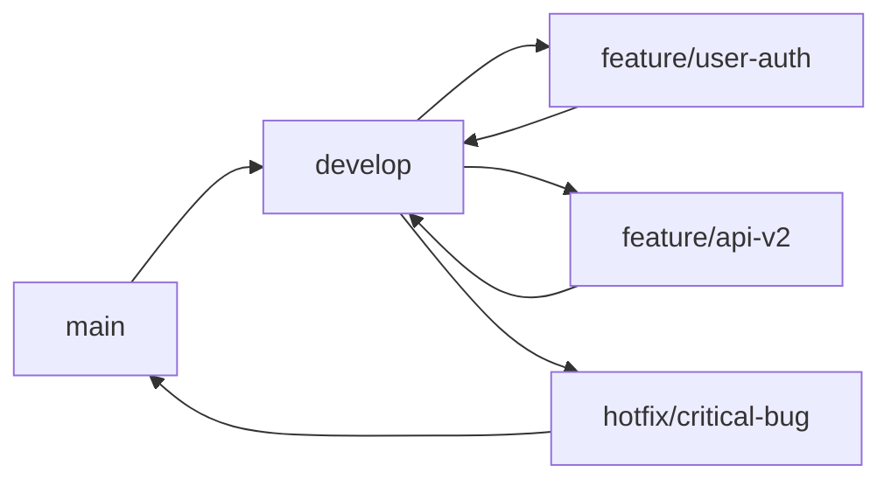
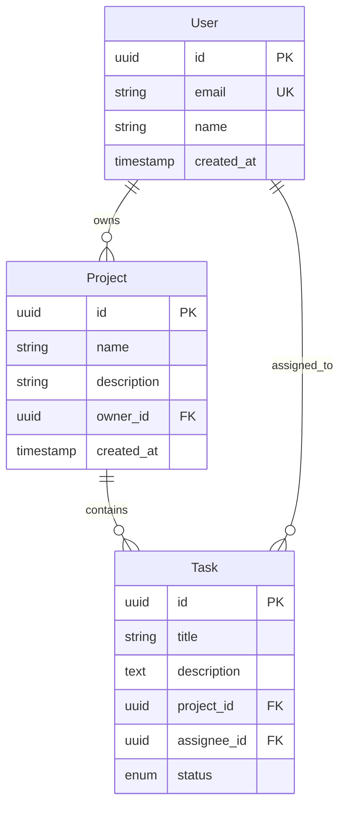

# Software Development Guide

A comprehensive guide to setting up and working with our development environment.

[page=A4]

[toc=3]

:::note[Documentation Status]
This guide is actively maintained. Last updated by @alice[github](Alice Smith) on 2024-01-15.

For questions or corrections, please contact @bob[slack](Bob Johnson) or create an issue in our [@doc](./issues_template.md) system.
:::

## Getting Started

Welcome to our development team! This guide will help you get up and running with our tech stack and development workflow.

### Prerequisites

Before you begin, ensure you have the following installed:

- [ ] Git (version 2.30+)
- [ ] Node.js (LTS version) 
- [ ] Python 3.9+ (alice: required for build scripts)
- [ ] Docker Desktop (bob: needed for local testing)

:::warning[Platform Requirements]
**Windows Users:** Some scripts require WSL2. See our [@doc](./windows_setup.md) guide.

**macOS Users:** Ensure you have Xcode command line tools installed: run@bash(xcode-select --install)
:::

### Initial Setup

Follow these steps to set up your development environment:

:::tab Environment Setup
@tab Linux/macOS
```run@bash
# Clone the repository
git clone https://github.com/company/project.git
cd project

# Install dependencies
npm install
pip install -r requirements.txt

# Start development servers
npm run dev
```

@tab Windows (PowerShell)
```run@powershell
# Clone the repository  
git clone https://github.com/company/project.git
cd project

# Install dependencies
npm install
pip install -r requirements.txt

# Start development servers
npm run dev
```

@tab Docker (All Platforms)
```run@bash
# Using Docker for consistent environment
docker-compose up --build
```
:::

Verify your setup by running: run@bash(npm test)

## Project Structure

Our project follows a **modular architecture** with clear separation of concerns:

```
project/
├── frontend/          # React.js application
│   ├── src/
│   │   ├── components/    # Reusable UI components
│   │   ├── pages/         # Route-level components  
│   │   └── hooks/         # Custom React hooks
│   └── package.json
├── backend/           # Python Flask API
│   ├── api/
│   │   ├── routes/        # API route handlers
│   │   └── models/        # Database models
│   └── requirements.txt
├── shared/            # Shared utilities and types
├── docs/              # Documentation
└── docker-compose.yml
```

### Key Directories

| Directory | Purpose | Owner |
|-----------|---------|--------|
| `frontend/src/components` | Reusable UI components | @frontend_team[slack] |
| `backend/api/routes` | API endpoint definitions | @backend_team[slack] |
| `shared/types` | TypeScript type definitions | @alice[github] |
| `docs/` | Project documentation | @technical_writer[teams] |

For detailed architecture decisions, see [bookmark: Architecture](./architecture.md=15).

## Development Workflow

### Branch Management

We use **Git Flow** with the following branch structure:



#### Branch Naming Convention

- `feature/description` - New features
- `bugfix/issue-number` - Bug fixes  
- `hotfix/critical-issue` - Production hotfixes
- `docs/topic` - Documentation updates

### Code Review Process

:::tip[Best Practices]
1. **Small PRs:** Keep pull requests focused and under 400 lines
2. **Tests Required:** All code changes must include tests
3. **Documentation:** Update relevant docs with your changes
4. **Review Checklist:** Use our [PR template](./pr_template.md)
:::

#### Review Workflow

- [ ] Developer creates PR (dev: implement feature)
- [ ] Automated tests pass (ci/cd: run test suite)  
- [ ] Code review by 2 team members (reviewers: approve changes)
- [ ] QA testing in staging (qa_team: verify functionality)
- [ ] Deployment to production (devops: deploy release)

### Testing Strategy

We maintain **95% test coverage** across all components:

:::tab Testing Frameworks
@tab Frontend Testing
```javascript
// Jest + React Testing Library
import { render, screen } from '@testing-library/react';
import { UserProfile } from './UserProfile';

test('renders user information', () => {
  const user = { name: 'Alice', email: 'alice@example.com' };
  render(<UserProfile user={user} />);
  
  expect(screen.getByText('Alice')).toBeInTheDocument();
  expect(screen.getByText('alice@example.com')).toBeInTheDocument();
});
```

@tab Backend Testing  
```python
# pytest + FastAPI TestClient
import pytest
from fastapi.testclient import TestClient
from main import app

client = TestClient(app)

def test_user_creation():
    response = client.post(
        "/users/", 
        json={"name": "Alice", "email": "alice@example.com"}
    )
    assert response.status_code == 201
    assert response.json()["name"] == "Alice"
```

@tab Integration Testing
```bash
#!/bin/bash
# End-to-end testing with Cypress
npx cypress run --spec "cypress/integration/user-flow.spec.js"
```
:::

Run all tests: run@bash(npm run test:all)

## API Documentation

Our REST API follows **OpenAPI 3.0** specifications:

### Authentication

All API requests require authentication via JWT tokens:

```javascript
// Example API request
const response = await fetch('/api/users', {
  headers: {
    'Authorization': `Bearer ${token}`,
    'Content-Type': 'application/json'
  }
});
```

### Core Endpoints

| Method | Endpoint | Description | Example |
|--------|----------|-------------|---------|
| GET | `/api/users` | List users | [Users API](https://api.example.com/users) |
| POST | `/api/users` | Create user | See [User Schema](./schemas.md#user) |
| GET | `/api/projects` | List projects | [Projects API](https://api.example.com/projects) |
| PUT | `/api/projects/{id}` | Update project | [bookmark: Project Updates](./api.md=42) |

### Error Handling

Our API returns consistent error responses:

```json
{
  "error": {
    "code": "VALIDATION_ERROR",
    "message": "Invalid email format",
    "details": {
      "field": "email",
      "value": "invalid-email"
    }
  }
}
```

:::danger[Rate Limiting]
API endpoints are rate-limited:
- **Authenticated users:** 1000 requests/hour
- **Anonymous users:** 100 requests/hour

Exceeding limits returns `HTTP 429 Too Many Requests`.
:::

## Database Schema

We use **PostgreSQL** with the following key entities:



### Database Migrations

We use **Alembic** for database migrations:

```run@python
# Generate new migration
alembic revision --autogenerate -m "add user preferences table"

# Apply migrations
alembic upgrade head

# Rollback migration  
alembic downgrade -1
```

Migration files are stored in `backend/migrations/` and should be committed to version control.

## Deployment Pipeline

Our CI/CD pipeline uses **GitHub Actions** with automated testing and deployment:

```yaml
# .github/workflows/deploy.yml
name: Deploy to Production

on:
  push:
    branches: [main]

jobs:
  test:
    runs-on: ubuntu-latest
    steps:
      - uses: actions/checkout@v3
      - name: Run tests
        run: |
          npm ci
          npm run test
          
  deploy:
    needs: test
    runs-on: ubuntu-latest
    steps:
      - name: Deploy to AWS
        run: |
          aws s3 sync ./dist s3://production-bucket
          aws cloudfront create-invalidation --distribution-id $CLOUDFRONT_ID
```

### Environment Configuration

| Environment | URL | Database | Purpose |
|-------------|-----|----------|---------|
| Development | http://localhost:3000 | Local PostgreSQL | Local development |
| Staging | https://staging.example.com | AWS RDS | QA testing |
| Production | https://example.com | AWS RDS | Live application |

Access credentials are managed through **AWS Secrets Manager**. Contact @devops[teams](DevOps Team) for access.

## Monitoring and Debugging

### Application Monitoring

We use **DataDog** for comprehensive monitoring:

- **Performance metrics:** Response times, error rates
- **Infrastructure:** CPU, memory, disk usage  
- **Custom metrics:** Business KPIs and user analytics

Dashboard: [Production Monitoring](https://datadog.com/dashboard/prod)

### Debugging Tools

:::tab Development Debugging
@tab Frontend (React DevTools)
1. Install React Developer Tools browser extension
2. Open browser DevTools → React tab
3. Inspect component props and state
4. Profile performance with Profiler tab

@tab Backend (Python Debugging)
```python
# Using pdb for debugging
import pdb; pdb.set_trace()

# Using logging for production debugging
import logging
logging.basicConfig(level=logging.DEBUG)
logger = logging.getLogger(__name__)
logger.debug(f"User data: {user_data}")
```

@tab Database (PostgreSQL)
```sql
-- Enable query logging
ALTER SYSTEM SET log_statement = 'all';
SELECT pg_reload_conf();

-- Analyze slow queries
SELECT query, mean_time, calls 
FROM pg_stat_statements 
ORDER BY mean_time DESC 
LIMIT 10;
```
:::

### Error Tracking

Production errors are automatically tracked with **Sentry**:

```javascript
// Frontend error tracking
import * as Sentry from "@sentry/react";

try {
  riskyOperation();
} catch (error) {
  Sentry.captureException(error);
}
```

## Security Guidelines

:::warning[Security Requirements]
All team members must follow these security practices:

- [ ] Enable 2FA on all accounts (security_team: mandatory)
- [ ] Use strong, unique passwords (minimum 16 characters)
- [ ] Never commit secrets to version control
- [ ] Regularly update dependencies (automated via Dependabot)
:::

### Secure Development Practices

1. **Input Validation:** Validate and sanitize all user inputs
2. **SQL Injection Prevention:** Use parameterized queries only
3. **XSS Protection:** Escape output and use Content Security Policy
4. **Authentication:** Implement proper session management
5. **Authorization:** Follow principle of least privilege

### Security Scanning

We run automated security scans:

```run@bash
# NPM audit for frontend vulnerabilities  
npm audit --audit-level moderate

# Safety check for Python dependencies
safety check -r requirements.txt

# SAST scanning with Semgrep
semgrep --config=auto .
```

Report security issues to @security[teams](Security Team) immediately.

## Performance Optimization

### Frontend Performance

- **Bundle Size:** Keep bundles under 250KB gzipped
- **Code Splitting:** Lazy load routes and components
- **Image Optimization:** Use WebP format with fallbacks
- **Caching:** Implement service workers for offline support

Performance budget: [bookmark: Metrics](./performance.md=23)

### Backend Performance

- **Database:** Use connection pooling and query optimization
- **Caching:** Implement Redis for frequently accessed data  
- **API:** Use pagination for large datasets
- **CDN:** Serve static assets via CloudFront

Current performance metrics:

| Metric | Target | Current | Status |
|--------|---------|---------|---------|
| Page Load Time | < 2s | 1.8s | ✅ |
| API Response | < 100ms | 85ms | ✅ |
| Database Query | < 50ms | 45ms | ✅ |

## Troubleshooting

### Common Issues

#### Build Failures

**Issue:** `npm install` fails with permission errors  
**Solution:** run@bash(sudo chown -R $USER ~/.npm)

**Issue:** Python dependencies conflict  
**Solution:** Use virtual environment: run@bash(python -m venv venv && source venv/bin/activate)

#### Database Connection Issues

**Issue:** `ECONNREFUSED` database connection  
**Solution:** Verify PostgreSQL is running: run@bash(brew services start postgresql)

**Issue:** Migration fails with schema conflicts  
**Solution:** Check for concurrent migrations and resolve conflicts

#### Performance Issues

**Issue:** Slow API responses  
**Solution:** Check database query performance and add indexes

**Issue:** High memory usage  
**Solution:** Profile application and identify memory leaks

### Getting Help

If you encounter issues not covered here:

1. **Check documentation:** [@doc](./troubleshooting.md)
2. **Search existing issues:** [GitHub Issues](https://github.com/company/project/issues)
3. **Ask the team:** @development_team[slack](Development Team)
4. **Escalate to lead:** @technical_lead[teams](Tech Lead)

## Code Style Guidelines

We enforce consistent coding standards across all projects:

### Frontend (JavaScript/TypeScript)

```javascript
// Use ESLint + Prettier configuration
// .eslintrc.js
module.exports = {
  extends: [
    '@company/eslint-config',
    'plugin:react/recommended',
    'plugin:@typescript-eslint/recommended'
  ],
  rules: {
    'no-console': 'warn',
    'react/prop-types': 'off' // TypeScript handles this
  }
};
```

### Backend (Python)

```python
# Follow PEP 8 with Black formatting
# pyproject.toml
[tool.black]
line-length = 88
target-version = ['py39']
include = '\.pyi?$'

[tool.isort]
profile = "black"
multi_line_output = 3
```

### Git Commit Messages

Follow **Conventional Commits** format:

```
feat(auth): add OAuth2 integration

- Implement Google OAuth2 provider
- Add user profile synchronization  
- Update login UI components

Closes #123
```

## Team Contacts

| Role | Team Member | Platform | Responsibilities |
|------|-------------|----------|-----------------|
| Tech Lead | @alice[github](Alice Johnson) | Primary contact for architecture decisions |
| Frontend Lead | @bob[slack](Bob Smith) | React.js, UI/UX implementation |
| Backend Lead | @charlie[teams](Charlie Brown) | API design, database management |
| DevOps | @diana[github](Diana Prince) | CI/CD, infrastructure, monitoring |
| QA Lead | @eve[slack](Eve Wilson) | Testing strategy, quality assurance |
| Security | @frank[teams](Frank Castle) | Security reviews, compliance |

**Team Slack:** #development-team  
**Emergency Contact:** @alice[phone](+1-555-0123)

:::info[Office Hours]
**Daily Standup:** 9:00 AM EST via [@teams](standup-meeting)  
**Office Hours:** Monday-Friday, 9 AM - 5 PM EST  
**On-call Rotation:** See [PagerDuty Schedule](https://company.pagerduty.com/schedules)
:::

---

## Appendix

### Useful Commands

Quick reference for common development tasks:

```bash
# Development
npm run dev          # Start development server
npm run build        # Build for production
npm run test         # Run test suite
npm run lint         # Check code quality

# Database  
npm run db:migrate   # Run database migrations
npm run db:seed      # Seed development data
npm run db:reset     # Reset database to clean state

# Docker
docker-compose up    # Start all services
docker-compose down  # Stop all services
docker system prune  # Clean up unused containers/images
```

### External Resources

- [Company Engineering Blog](https://engineering.company.com)
- [Internal Wiki](https://wiki.company.com)
- [Design System](https://design.company.com)
- [API Documentation](https://api-docs.company.com)

### Changelog

| Version | Date | Changes | Author |
|---------|------|---------|---------|
| 2.1.0 | 2024-01-15 | Added Docker setup, updated security guidelines | @alice[github] |
| 2.0.0 | 2024-01-01 | Major restructure, new testing framework | @bob[slack] |
| 1.5.2 | 2023-12-15 | Fixed deployment pipeline, updated dependencies | @diana[teams] |

*Last updated: 2024-01-15 by @alice[github](Alice Smith)*

---

:::note[Feedback Welcome]
This documentation is constantly evolving. If you find errors, have suggestions for improvement, or need clarification on any topic, please:

- Create an issue: [@doc](./feedback_template.md)
- Submit a PR with corrections  
- Contact @technical_writer[teams](Technical Writing Team)

Your feedback helps keep our documentation accurate and useful for everyone! 📚✨
:::

[toc](@doc)