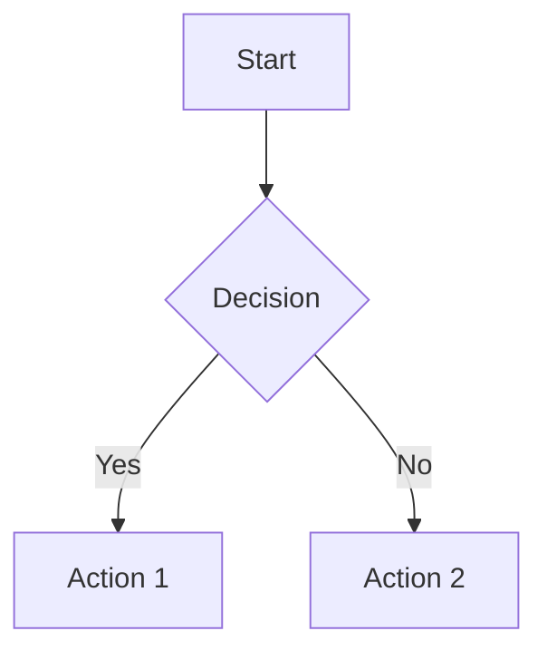
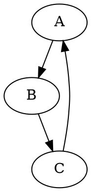

# Marco Syntax Test

This file tests all Marco markdown extensions for syntax highlighting.

## Setext Headers

Header Level 1
==============

Header Level 2
--------------

## Bold-Italic Combinations

***Triple asterisk bold-italic***

___Triple underscore bold-italic___

**_Mixed asterisk-underscore_**

__*Mixed underscore-asterisk*__

***Mixed ending with underscores___

___Mixed ending with asterisks***

## Admonitions

:::note
This is a note admonition.
:::

:::warning[Important Warning]
This is a warning with a custom title.
:::

:::[🔥]
This is a custom emoji admonition.
:::

## Tab Blocks

:::tab Main Example
@tab JavaScript
```javascript
console.log("Hello from JS!");
```

@tab Python
```python
print("Hello from Python!")
```
:::

## User Mentions and References

Check out @john[twitter] for updates, or contact @alice[github](Alice Smith) directly.

## Bookmarks and Navigation

See [bookmark: Important Section](./docs/guide.md=42) for details.

Navigate to [@doc](./other-document.md) for more info.

Set page format [page=A4] for printing.

## Table of Contents

[toc]

[toc=3]

[toc=2](@doc)

## Executable Code

Inline execution: run@bash(ls -la) or run@python(print("hello"))

```run@bash
#!/bin/bash
echo "This is executable bash code"
ls -la
```

```run@python
#!/usr/bin/env python3
print("This is executable Python code")
import os
print(f"Current directory: {os.getcwd()}")
```

## Diagrams





## Enhanced Formatting

This is ==highlighted text== for emphasis.

This is ~~strikethrough~~ and this is --also strikethrough--.

Mathematical expressions: H^2^O and CO˅2˅ or CO~2~.

Super^script^ and sub˅script˅ formatting.

## Mathematical Expressions

Inline math: $E = mc^2$ and $\sum_{i=1}^{n} x_i$.

Block math:
$$
\int_0^1 x^2 dx = \frac{1}{3}
$$

## Emojis

Look at these emojis: :smile: :heart: :rocket: :thumbsup:

## Footnotes

This text has a footnote[^1] and an inline footnote^[This is an inline footnote].

Another reference[^note2] to demonstrate multiple footnotes.

[^1]: This is the first footnote definition.
[^note2]: This is the second footnote with more content.

## Definition Lists

HTML
: A markup language for creating web pages
: Stands for HyperText Markup Language

CSS
: Cascading Style Sheets
: Used for styling web pages

## Tables

| Header 1 | Header 2 | Header 3 |
|----------|----------|----------|
| Cell 1   | **Bold** | `code`   |
| Cell 2   | *italic* | ==hi==   |
| Math: $x^2$ | :smile: | ~~strike~~ |

Table without headers:
|---------|---------|
| Data 1  | Data 2  |
| Data 3  | Data 4  |

## HTML Comments

<!-- This is an HTML comment -->
<!-- Multi-line
     HTML comment -->

## Task Lists with Metadata

- [x] Completed task (alice: 2024-01-15)
- [ ] Todo task (bob: needs review)
- [X] Another completed task (charlie: 2024-01-16)

1. [x] Numbered completed task (team: 2024-01-10)  
2. [ ] Numbered todo task (manager: high priority)

## Inline Tasks

Here's an inline task: [x] This is done (user: completed) or [ ] this needs work (reviewer: pending).

## YouTube Videos

Check out this tutorial: [Learn Marco](https://youtu.be/dQw4w9WgXcQ)

Another video: [Advanced Features](https://www.youtube.com/watch?v=dQw4w9WgXcQ)

## Block Images


## Standard Markdown

Still supports **bold**, *italic*, `code`, [links](https://example.com), and .

> Blockquotes work too
> 
> With multiple lines

1. Ordered lists
2. Also work fine

- Unordered lists
- Work as expected

## Line Breaks
This line has a hard line break at the end  
This continues on a new line.

This is a soft line break
that continues on the same paragraph.

This line ends with a backslash\
And continues here.