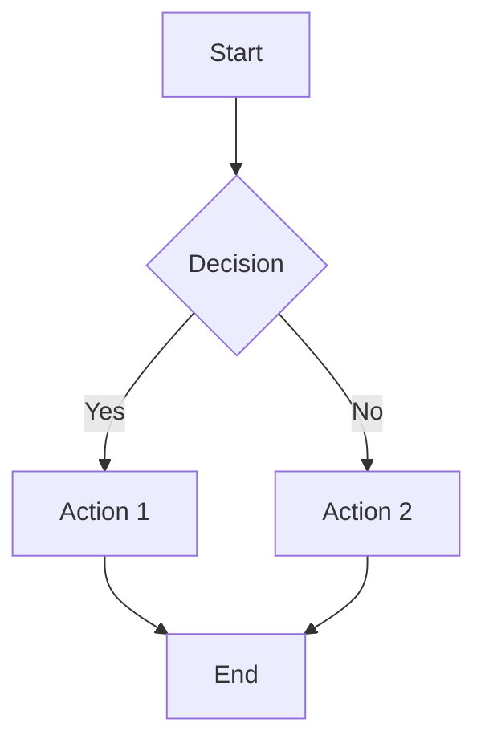
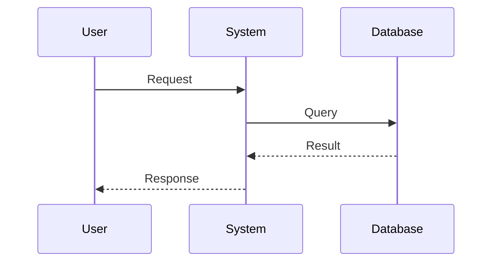
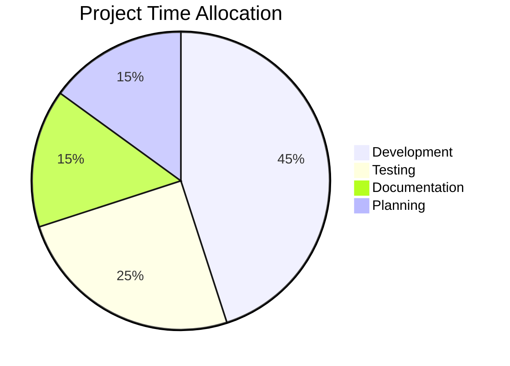
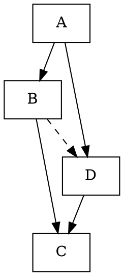
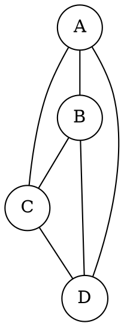

# Marco Extensions Test

This document tests all the custom Marco-specific markdown extensions and features.

## Admonitions

### Basic Admonitions

:::note
This is a basic note admonition.
Multiple lines are supported.
Formatting like **bold** and `code` works inside.
:::

:::tip
This is a tip admonition with helpful information.
:::

:::warning
This is a warning admonition for important notices.
:::

:::danger
This is a danger admonition for critical warnings.
:::

:::info
This is an info admonition for general information.
:::

### Admonitions with Custom Titles

:::note[Custom Note Title]
This note has a custom title instead of the default "Note".
:::

:::tip[Pro Tip]
This tip has a custom title.
:::

:::warning[Important Notice]
This warning has a custom title with **formatting**.
:::

:::danger[Critical Issue]
This danger block has a custom title.
:::

:::info[Additional Information]
This info block has a custom title.
:::

### Emoji Admonitions

:::[🔥] Fire Warning
This is a custom admonition with a fire emoji icon.
:::

:::[✨] Sparkle Note
This is a custom admonition with a sparkle emoji.
:::

:::[🚀] Rocket Tip
This is a custom admonition with a rocket emoji.
You can use any emoji as the icon.
:::

:::[⚠️] Alert
Custom warning with warning emoji.
:::

:::[💡] Idea
Custom tip with lightbulb emoji.
:::

### Nested Admonitions

:::note[Outer Note]
This is the outer admonition.

:::tip[Inner Tip]
This is a nested tip inside the note.
:::

Back to the outer note content.
:::

:::warning
Outer warning with different nesting.

:::danger
Inner danger block.

:::info
Even deeper info block.
:::

Back to danger level.
:::

Back to warning level.
:::

## Executable Code Blocks

### Run Blocks - Bash

```run@bash
echo "Hello from bash!"
ls -la
pwd
date
```

```run@sh
#!/bin/sh
echo "Shell script execution"
whoami
```

```run@zsh
echo "ZSH shell commands"
echo $SHELL
```

### Run Blocks - Python

```run@python
print("Hello from Python!")
import sys
print(f"Python version: {sys.version}")
print("Simple calculation:", 2 + 2)
```

```run@py
# Alternative Python syntax
numbers = [1, 2, 3, 4, 5]
squared = [x**2 for x in numbers]
print("Squared numbers:", squared)
```

### Run Blocks - Windows

```run@bat
echo "Windows batch file"
dir
echo %USERNAME%
```

```run@powershell
Write-Host "PowerShell script"
Get-Date
Get-Location
```

```run@ps
# Alternative PowerShell syntax
$version = $PSVersionTable.PSVersion
Write-Output "PowerShell version: $version"
```

### Inline Executable Code

Execute inline bash: run@bash(echo "Hello inline!")
Execute inline python: run@python(print("Inline Python"))
Execute inline powershell: run@powershell(Write-Host "Inline PS")

Quick directory listing: run@bash(ls -la | head -5)
Quick Python calculation: run@python(print(f"Result: {10 * 5 + 2}"))

## Diagrams

### Mermaid Diagrams







### Graphviz Diagrams





## Tables

### Basic Tables

| Header 1 | Header 2 | Header 3 |
|----------|----------|----------|
| Cell 1   | Cell 2   | Cell 3   |
| Cell 4   | Cell 5   | Cell 6   |

### Tables with Alignment

| Left | Center | Right |
|:-----|:------:|------:|
| L1   | C1     | R1    |
| L2   | C2     | R2    |
| L3   | C3     | R3    |

### Tables without Headers

|--------|--------|--------|
| Data 1 | Data 2 | Data 3 |
| Data 4 | Data 5 | Data 6 |

### Tables with Formatting

| **Bold** | *Italic* | `Code` |
|----------|----------|--------|
| **B1**   | *I1*     | `C1`   |
| **B2**   | *I2*     | `C2`   |

### Tables with Links and Complex Content

| Feature | Link | Math |
|---------|------|------|
| Links | [Example](https://example.com) | $x^2$ |
| Images |  | $\sum_{i=1}^n$ |
| Code | `function()` | $\pi \approx 3.14$ |

## Page Management

### Page Tags

[page=A4]

Content formatted for A4 page size.

[page=US]

Content formatted for US Letter size.

[page=210]

Content formatted for custom width (210mm).

[page]

Default page formatting.

## Document Navigation

### Document References

Navigation to other documents:
[@doc](./01_basic_markdown.md)
[@doc](../README.md)
[@doc](./nested/subdoc.md)

### Bookmarks

Create bookmarks for easy navigation:
[bookmark: Introduction](./intro.md)
[bookmark: Section 1](./doc.md=15)
[bookmark: Important Code](./src/main.rs=42)
[bookmark: Configuration](./config.toml=10)

## Table of Contents

### Basic TOC

[toc]

### TOC with Depth Limit

[toc=1]

[toc=2]

[toc=3]

[toc=4]

### TOC for External Documents

[toc](@doc)

[toc=2](@doc)

## User Mentions

### Basic User Mentions

Mention users on various platforms:
@john[twitter]
@alice[github]
@bob[linkedin]
@charlie[discord]
@diana[slack]

### User Mentions with Display Names

Enhanced mentions with real names:
@john[twitter](John Doe)
@alice[github](Alice Smith)  
@bob[linkedin](Bob Johnson)
@charlie[discord](Charlie Brown)
@diana[slack](Diana Prince)

## Tab Blocks

### Basic Tab Block

:::tab
@tab JavaScript
```javascript
function hello() {
    console.log("Hello from JavaScript!");
}
```

@tab Python
```python
def hello():
    print("Hello from Python!")
```

@tab Rust
```rust
fn hello() {
    println!("Hello from Rust!");
}
```
:::

### Tab Block with Title

:::tab Code Examples
@tab Frontend
```javascript
// React component
function Welcome() {
    return <h1>Hello World!</h1>;
}
```

@tab Backend
```python
# Flask app
from flask import Flask
app = Flask(__name__)

@app.route('/')
def hello():
    return "Hello World!"
```

@tab Database
```sql
-- SQL query
SELECT * FROM users 
WHERE active = true
ORDER BY created_at DESC;
```
:::

### Mixed Content Tab Block

:::tab Documentation
Default content before any tabs.
This appears in the default tab.

@tab Installation
## Installation Steps

1. Download the software
2. Run the installer
3. Configure settings

@tab Configuration
### Config File

```json
{
    "theme": "dark",
    "language": "en",
    "auto_save": true
}
```

@tab Troubleshooting
**Common Issues:**

- Issue 1: Check permissions
- Issue 2: Restart service  
- Issue 3: Clear cache

More default content at the end.
:::

## Task Lists

### Basic Task Lists

- [ ] Incomplete task
- [x] Completed task
- [X] Completed task (capital X)
- [ ] Another incomplete task

### Ordered Task Lists

1. [ ] First task (incomplete)
2. [x] Second task (completed)
3. [ ] Third task (incomplete)
4. [X] Fourth task (completed)

### Task Lists with Metadata

- [ ] Task with user info (alice: 2024-01-15)
- [x] Completed task with user (bob: task completed)
- [ ] Complex task (team_lead: assigned to frontend team)
- [x] Done task (developer: implemented feature X)

### Inline Tasks

Regular paragraph with [x] inline completed task here.
Another paragraph with [ ] incomplete inline task (user: pending).

### Standalone Task Blocks

[x] Standalone completed task
[ ] Standalone incomplete task  
[X] Standalone completed task (caps)
[ ] Standalone task with metadata (project_manager: high priority)

## HTML Content

### Block HTML

<div class="custom-container">
    <h2>HTML Block Content</h2>
    <p>This is HTML content that should be treated as a block.</p>
    <ul>
        <li>HTML list item 1</li>
        <li>HTML list item 2</li>
    </ul>
</div>

<section>
<h3>Another HTML Section</h3>
<p>More HTML content with <strong>inline HTML tags</strong>.</p>
</section>

### HTML with Marco Features

<div class="marco-integration">
**Markdown formatting** still works in HTML blocks.

:::note
Admonitions can be inside HTML blocks.
:::

```javascript
// Code blocks too
function htmlIntegration() {
    return "works";
}
```
</div>

## Comments

### Block Comments

<!-- This is a block comment
that spans multiple lines
and should be hidden from output -->

### Inline Comments

This text has <!-- inline comment --> in the middle.
Another line with <!-- another comment --> here.

## Definition Lists

Term 1
: Definition for term 1
: Alternative definition for term 1

Term 2
: Definition for term 2 with **formatting**
: Another definition with `code`

Complex Term with **Formatting**
: Definition with [link](https://example.com)
: Definition with math $x = y + z$

## YouTube Embeds

### Basic YouTube Links

[Video Title](https://youtu.be/dQw4w9WgXcQ)
[Another Video](https://www.youtube.com/watch?v=dQw4w9WgXcQ)
[HTTP YouTube](http://youtu.be/shortcode123)
[HTTP Full YouTube](http://www.youtube.com/watch?v=fullcode456)

## Footnotes

### Inline Footnotes

This text has an inline footnote^[This is an inline footnote with content].
Another sentence with footnote^[Another inline footnote here].

### Reference Footnotes

This text has a reference footnote[^1].
Another reference footnote[^note2].
Unicode footnote[^参考].
Complex footnote[^complex_ref].

[^1]: This is the first footnote definition.
[^note2]: This is the second footnote with **formatting** and `code`.
[^参考]: Unicode footnote definition.
[^complex_ref]: Multi-line footnote definition
    with additional content
    and more lines.

## Mixed Marco Extensions

### Complex Integration

Here's a complex example combining multiple Marco features:

:::tip[Development Workflow]
1. [ ] Set up development environment (dev_team: 2024-01-15)
2. [x] Write initial code (alice: completed)
3. [ ] Add tests (bob: in progress)

Execute setup commands:
```run@bash
mkdir project
cd project
git init
```

Check the project structure: run@bash(tree -L 2)

For more details, see [@doc](./development_guide.md).
:::

### Tab Block with Executable Code

:::tab Platform Commands
@tab Linux
```run@bash
# Linux commands
sudo apt update
sudo apt install build-essential
```

@tab macOS
```run@bash
# macOS commands  
brew update
brew install gcc
```

@tab Windows
```run@powershell
# Windows PowerShell
winget update
winget install Git.Git
```
:::

## Edge Cases - Marco Extensions

### Unclosed Admonitions

:::note
This admonition is never closed...

### Nested Executable Code

```run@bash
echo "Outer bash command"
# This contains backticks: ```
echo "Backticks in bash: \`\`\`"
```

### Empty Extensions

:::
Empty admonition
:::

```run@bash
```

[toc]

[@doc]()

@user[]

### Malformed Extensions

:::invalid_type
This uses an invalid admonition type.
:::

```run@invalid_lang
echo "Invalid script language"
```

run@invalid(broken command)

[bookmark](./missing.md)

@user[platform](

## End of Marco Extensions Test

This concludes the comprehensive test of Marco-specific extensions. All custom features should be properly parsed and handled, including error cases and edge conditions.