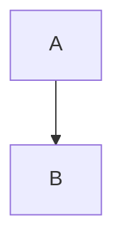

# Mermaid and GitHub diagram fences showcase

This file collects the fenced-code examples referenced in the tracker.

## Mermaid



## GitHub diagram fences (often treated as code blocks unless special rendering is enabled)

```geojson
{ "type": "FeatureCollection", "features": [] }
```

```topojson
{ "type": "Topology", "objects": {}, "arcs": [] }
```

```stl
solid cube
endsolid cube
```

## Edge cases

### Info string casing and spacing

```Mermaid
graph TD
  A --> B
```


### Fences inside blockquotes

> ```mermaid
> graph TD
>   A --> B
> ```
